# RAFlow - 实时语音听写系统详细设计文档

## 文档版本信息

| 版本 | 日期 | 作者 | 变更说明 |
|-----|------|------|---------|
| 1.0 | 2025-12-21 | RAFlow Team | 初始版本 |

## 1. 系统架构概览

### 1.1 整体架构图

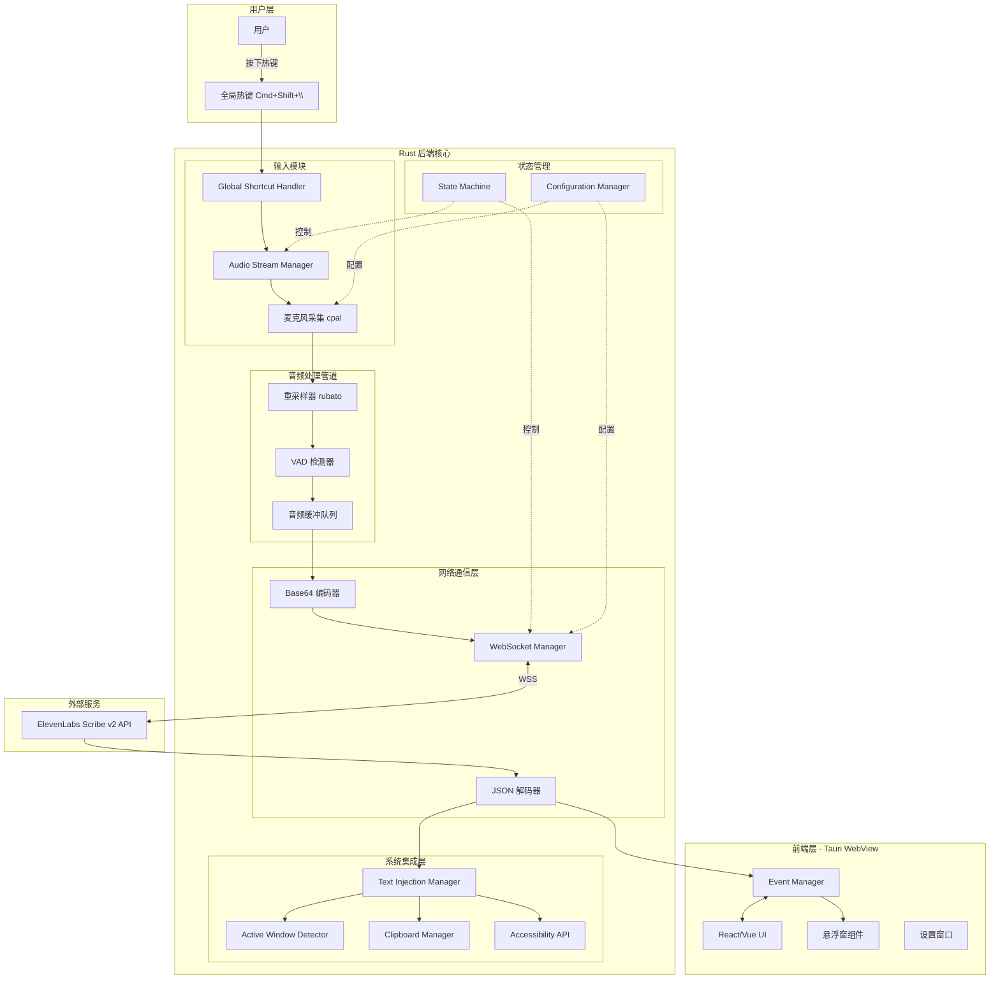

### 1.2 技术栈更新（基于 2025 最新版本）

| 组件分类 | 技术选型 | 版本 | 核心职责 |
|---------|---------|------|---------|
| **应用框架** | Tauri | v2.x (2024 stable) | 跨平台桌面应用框架 |
| **后端语言** | Rust | 2024 | 系统级编程、内存安全 |
| **前端框架** | React/Vue 3 | Latest | 用户界面渲染 |
| **异步运行时** | tokio | 1.x | 异步任务调度 |
| **WebSocket** | tokio-tungstenite | 0.26+ | 实时双向通信 |
| **音频采集** | cpal | 0.17 | 跨平台音频 I/O |
| **音频重采样** | rubato | 0.16+ | 高质量采样率转换 |
| **键盘模拟** | enigo / rdev | latest | 系统输入注入 |
| **窗口检测** | active-win-pos-rs | 0.9+ | 活跃窗口获取 |
| **ASR 服务** | ElevenLabs Scribe v2 | Realtime API | 实时语音识别 |

## 2. 核心模块详细设计

### 2.1 音频采集与处理模块

#### 2.1.1 音频流水线架构

```mermaid
flowchart LR
    subgraph "硬件层"
        MIC[麦克风硬件]
    end

    subgraph "OS 音频驱动"
        CA[CoreAudio/WASAPI/ALSA]
    end

    subgraph "cpal 音频线程 高优先级"
        CB[Audio Callback]
        RB[Ring Buffer]
    end

    subgraph "Tokio 异步线程池"
        RS[Resampler 48k→16k]
        V[VAD Filter]
        AGC[Auto Gain Control]
        CHUNK[Chunker 100ms]
    end

    subgraph "编码器线程"
        F32I16[f32 → i16 转换]
        B64[Base64 Encoder]
    end

    subgraph "网络发送队列"
        WQ[WebSocket Tx Queue]
    end

    MIC --> CA
    CA --> CB
    CB -->|mpsc channel| RB
    RB --> RS
    RS --> V
    V --> AGC
    AGC --> CHUNK
    CHUNK --> F32I16
    F32I16 --> B64
    B64 --> WQ
```

#### 2.1.2 核心数据结构设计

```rust
// 音频流配置
pub struct AudioConfig {
    pub sample_rate: u32,          // 原始采样率（通常 48000Hz）
    pub target_sample_rate: u32,   // 目标采样率（16000Hz for Scribe）
    pub channels: u16,             // 单声道 = 1
    pub chunk_duration_ms: u32,    // 音频块大小（100ms）
    pub buffer_size: usize,        // 环形缓冲区大小
}

// 音频数据包
pub struct AudioPacket {
    pub data: Vec<f32>,            // PCM 浮点数据
    pub timestamp: Instant,        // 采集时间戳
    pub sample_count: usize,       // 采样点数量
}

// 重采样器状态
pub struct ResamplerState {
    resampler: Box<dyn Resampler<f32>>,
    input_buffer: Vec<Vec<f32>>,
    output_buffer: Vec<Vec<f32>>,
}

// VAD 检测器
pub struct VoiceActivityDetector {
    threshold: f32,                // 能量阈值
    window_size: usize,           // 滑动窗口大小
    speech_frames: usize,         // 连续语音帧计数
    silence_frames: usize,        // 连续静音帧计数
}
```

#### 2.1.3 音频采集实现流程

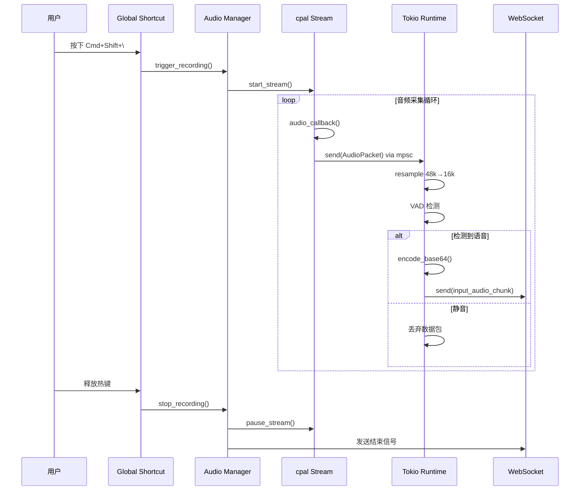

### 2.2 WebSocket 通信模块

#### 2.2.1 连接状态机

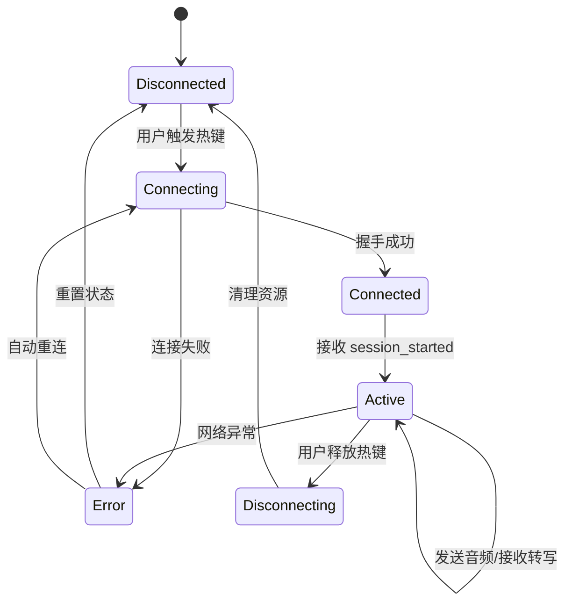

#### 2.2.2 协议消息定义

```rust
// 上行消息（客户端 -> 服务端）
#[derive(Serialize)]
#[serde(tag = "message_type")]
pub enum ClientMessage {
    #[serde(rename = "input_audio_chunk")]
    AudioChunk {
        audio_base_64: String,
    },
    #[serde(rename = "manual_commit")]
    ManualCommit,
}

// 下行消息（服务端 -> 客户端）
#[derive(Deserialize)]
#[serde(tag = "message_type")]
pub enum ServerMessage {
    #[serde(rename = "session_started")]
    SessionStarted {
        session_id: String,
        config: SessionConfig,
    },
    #[serde(rename = "partial_transcript")]
    PartialTranscript {
        text: String,
        created_at_ms: u64,
    },
    #[serde(rename = "committed_transcript")]
    CommittedTranscript {
        text: String,
        confidence: f32,
        created_at_ms: u64,
    },
    #[serde(rename = "input_error")]
    InputError {
        error_message: String,
    },
}

// 会话配置
#[derive(Deserialize)]
pub struct SessionConfig {
    pub model_id: String,
    pub language_code: Option<String>,
    pub encoding: String,
}
```

#### 2.2.3 WebSocket 管理器实现

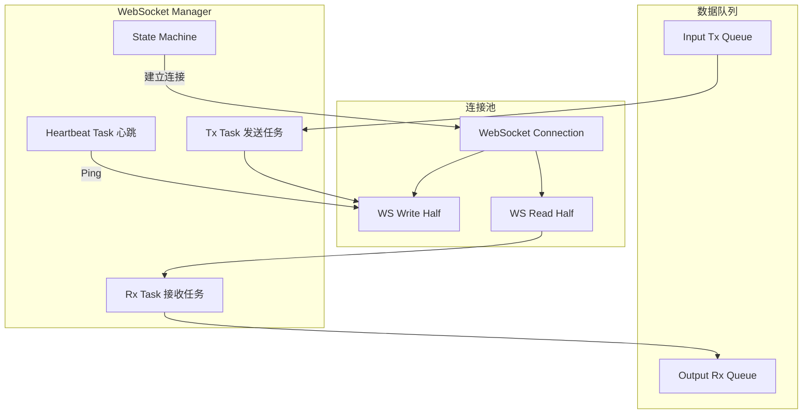

### 2.3 文本注入模块

#### 2.3.1 注入策略决策树

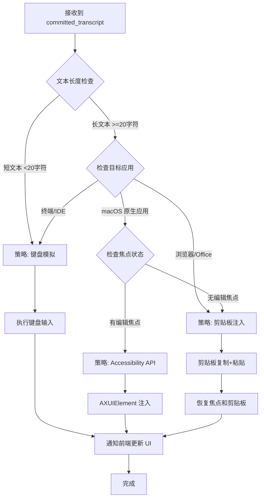

#### 2.3.2 文本注入器实现

```rust
// 文本注入策略
pub enum InjectionStrategy {
    Keyboard,       // 键盘模拟
    Clipboard,      // 剪贴板
    Accessibility,  // Accessibility API
}

// 文本注入管理器
pub struct TextInjectionManager {
    keyboard_simulator: KeyboardSimulator,
    clipboard_manager: ClipboardManager,
    accessibility_client: AccessibilityClient,
    window_detector: WindowDetector,
}

impl TextInjectionManager {
    // 智能选择注入策略
    pub async fn inject_text(&self, text: &str) -> Result<()> {
        let active_window = self.window_detector.get_active_window()?;
        let strategy = self.select_strategy(text, &active_window);

        match strategy {
            InjectionStrategy::Keyboard => {
                self.inject_via_keyboard(text).await
            },
            InjectionStrategy::Clipboard => {
                self.inject_via_clipboard(text).await
            },
            InjectionStrategy::Accessibility => {
                self.inject_via_accessibility(text, &active_window).await
            },
        }
    }

    // 剪贴板注入实现
    async fn inject_via_clipboard(&self, text: &str) -> Result<()> {
        // 1. 备份当前剪贴板
        let old_clipboard = self.clipboard_manager.read_text()?;

        // 2. 写入新文本
        self.clipboard_manager.write_text(text)?;

        // 3. 模拟粘贴快捷键
        #[cfg(target_os = "macos")]
        self.keyboard_simulator.key_sequence(&[Key::Meta, Key::Layout('v')])?;

        #[cfg(target_os = "windows")]
        self.keyboard_simulator.key_sequence(&[Key::Control, Key::Layout('v')])?;

        // 4. 等待粘贴完成
        tokio::time::sleep(Duration::from_millis(100)).await;

        // 5. 恢复剪贴板
        if let Some(old) = old_clipboard {
            self.clipboard_manager.write_text(&old)?;
        }

        Ok(())
    }
}
```

### 2.4 系统集成层

#### 2.4.1 窗口管理与焦点控制

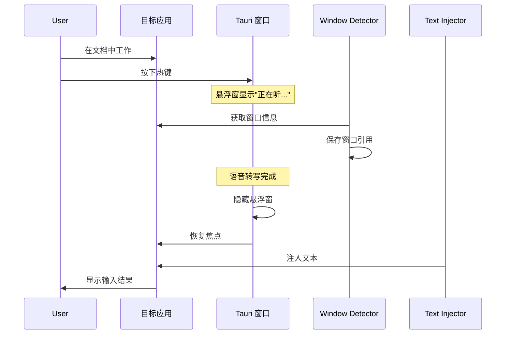

#### 2.4.2 macOS 权限管理

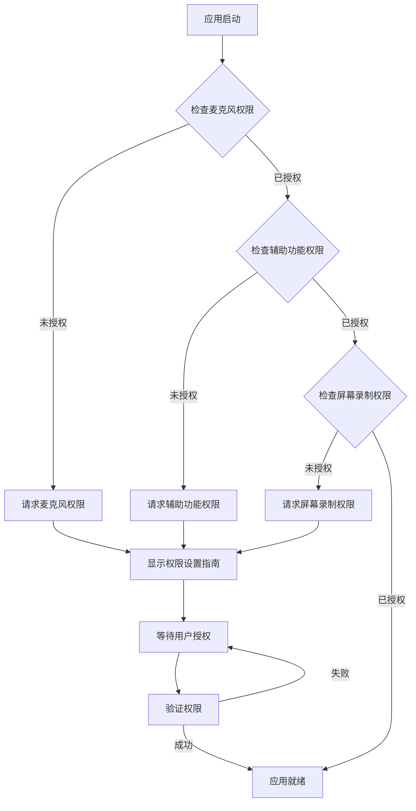

## 3. 前端界面设计

### 3.1 窗口结构

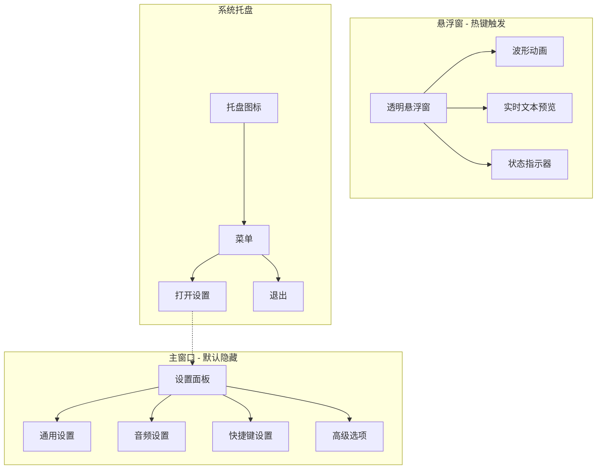

### 3.2 悬浮窗 UI 状态

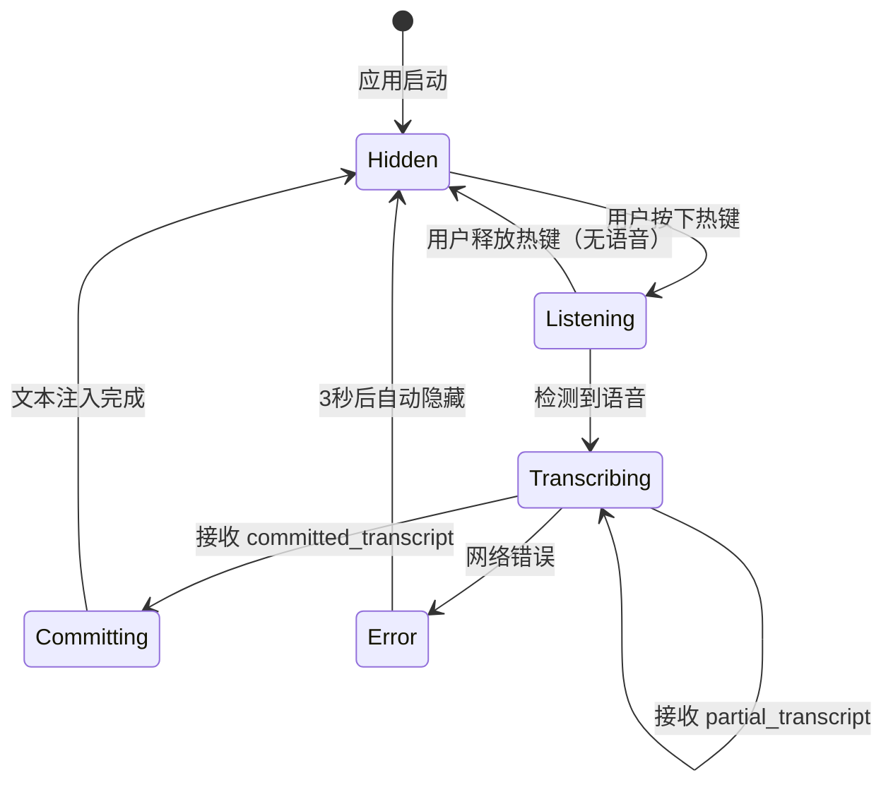

### 3.3 前后端通信协议

```typescript
// Tauri Event 定义
interface TauriEvents {
  // 后端 -> 前端
  'audio-level': { rms: number; peak: number };
  'transcript-partial': { text: string; timestamp: number };
  'transcript-committed': { text: string; confidence: number };
  'session-status': { status: 'connecting' | 'connected' | 'disconnected' | 'error' };
  'injection-status': { success: boolean; method: string };

  // 前端 -> 后端
  'start-recording': void;
  'stop-recording': void;
  'manual-commit': void;
}

// Tauri Command 定义
interface TauriCommands {
  get_config(): Promise<AppConfig>;
  update_config(config: AppConfig): Promise<void>;
  check_permissions(): Promise<PermissionStatus>;
  request_permissions(): Promise<void>;
  get_active_window(): Promise<WindowInfo>;
}
```

## 4. 数据流与时序

### 4.1 完整转写流程

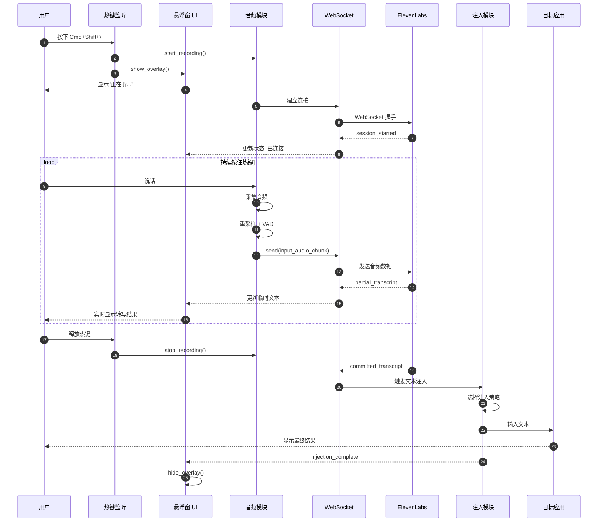

### 4.2 错误处理流程

```mermaid
flowchart TD
    ERROR[错误发生]
    TYPE{错误类型}

    NET_ERR[网络错误]
    AUDIO_ERR[音频错误]
    PERM_ERR[权限错误]
    API_ERR[API 错误]

    RETRY{重试策略}
    FALLBACK{降级策略}
    NOTIFY[通知用户]

    LOG[记录日志]
    RECOVER[恢复状态]

    ERROR --> TYPE

    TYPE --> NET_ERR
    TYPE --> AUDIO_ERR
    TYPE --> PERM_ERR
    TYPE --> API_ERR

    NET_ERR --> RETRY
    RETRY -->|<3次| RECOVER
    RETRY -->|>=3次| NOTIFY

    AUDIO_ERR --> FALLBACK
    FALLBACK -->|重新初始化| RECOVER
    FALLBACK -->|失败| NOTIFY

    PERM_ERR --> NOTIFY
    NOTIFY --> LOG

    API_ERR --> FALLBACK
    FALLBACK -->|切换模型| RECOVER

    RECOVER --> LOG
    LOG --> [*]
```

## 5. 性能优化策略

### 5.1 音频处理优化

#### 零拷贝音频传输
```rust
// 使用环形缓冲区避免内存分配
use ringbuf::HeapRb;

pub struct AudioPipeline {
    // 无锁环形缓冲区
    audio_buffer: HeapRb<f32>,
    // 预分配的重采样缓冲区
    resample_buffer: Vec<f32>,
}

impl AudioPipeline {
    pub fn new(capacity: usize) -> Self {
        Self {
            audio_buffer: HeapRb::new(capacity),
            resample_buffer: Vec::with_capacity(capacity / 3), // 48k->16k
        }
    }

    // 音频回调中使用引用，避免拷贝
    pub fn audio_callback(&mut self, data: &[f32]) {
        self.audio_buffer.push_slice(data);
    }
}
```

#### 批处理与块大小优化
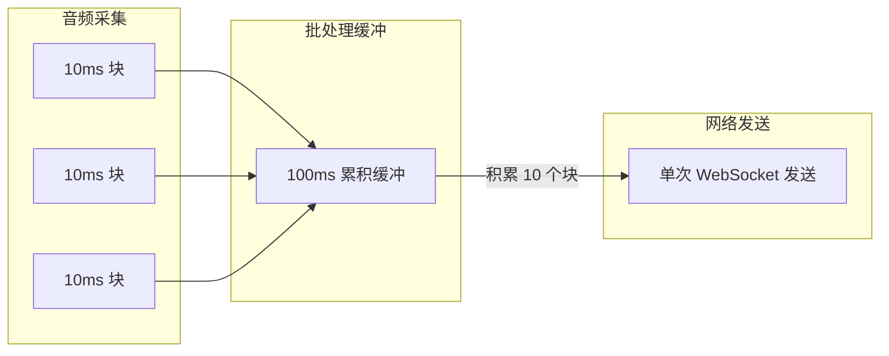

### 5.2 网络传输优化

#### 连接预热策略
```rust
pub struct ConnectionWarmer {
    state: Arc<Mutex<ConnectionState>>,
}

impl ConnectionWarmer {
    // 在热键按下前提前建立连接
    pub async fn warm_connection(&self) {
        // 监听修饰键（Cmd+Shift）
        // 在完整热键（Cmd+Shift+\）触发前 500ms 建立连接
        if self.detect_modifier_keys() {
            tokio::spawn(async {
                self.establish_connection().await
            });
        }
    }
}
```

#### WebSocket 消息压缩
```rust
// 对于长时间会话，考虑使用压缩
let ws_config = WebSocketConfig {
    max_message_size: Some(64 << 20), // 64 MB
    max_frame_size: Some(16 << 20),   // 16 MB
    accept_unmasked_frames: false,
    // 启用 permessage-deflate 扩展
    compression: Some(CompressionConfig::default()),
};
```

### 5.3 内存管理

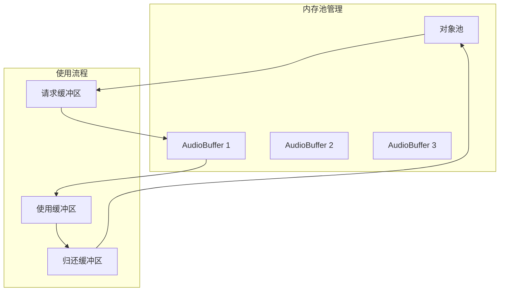

## 6. 安全性设计

### 6.1 API 密钥管理

```rust
use keyring::Entry;

pub struct SecureConfigManager {
    keyring_entry: Entry,
}

impl SecureConfigManager {
    pub fn new(app_name: &str) -> Result<Self> {
        Ok(Self {
            keyring_entry: Entry::new(app_name, "elevenlabs_api_key")?,
        })
    }

    // 将 API 密钥存储在系统钥匙串中
    pub fn store_api_key(&self, api_key: &str) -> Result<()> {
        self.keyring_entry.set_password(api_key)
    }

    pub fn get_api_key(&self) -> Result<String> {
        self.keyring_entry.get_password()
    }
}
```

### 6.2 权限最小化原则

```json
{
  "permissions": [
    "core:default",
    "core:window:allow-show",
    "core:window:allow-hide",
    "global-shortcut:allow-register",
    "global-shortcut:allow-unregister",
    "clipboard-manager:allow-write-text",
    "clipboard-manager:allow-read-text"
  ],
  "deny": [
    "fs:allow-write-file",
    "shell:allow-execute",
    "http:allow-fetch"
  ]
}
```

### 6.3 应用黑名单

```rust
// 在敏感应用中禁用功能
const BLACKLISTED_APPS: &[&str] = &[
    "1Password",
    "Bitwarden",
    "KeePassXC",
    "Terminal", // 终端密码输入
    "iTerm2",
    "Google Chrome Incognito",
];

pub fn is_safe_to_inject(window_info: &WindowInfo) -> bool {
    !BLACKLISTED_APPS.iter().any(|&app| window_info.app_name.contains(app))
}
```

## 7. 测试策略

### 7.1 单元测试

```rust
#[cfg(test)]
mod tests {
    use super::*;

    #[tokio::test]
    async fn test_audio_resampling() {
        let input_48k = generate_test_audio(48000, 1.0);
        let resampler = create_resampler(48000, 16000);
        let output_16k = resampler.process(&input_48k).await.unwrap();

        assert_eq!(output_16k.len(), input_48k.len() / 3);
    }

    #[test]
    fn test_vad_detection() {
        let silence = vec![0.0; 1600]; // 100ms 静音
        let speech = generate_speech_signal();

        let mut vad = VoiceActivityDetector::new(0.01);
        assert!(!vad.is_speech(&silence));
        assert!(vad.is_speech(&speech));
    }

    #[tokio::test]
    async fn test_websocket_message_encoding() {
        let audio_data = vec![0.5f32; 1600];
        let msg = create_audio_chunk_message(&audio_data);
        let json = serde_json::to_string(&msg).unwrap();

        assert!(json.contains("input_audio_chunk"));
        assert!(json.contains("audio_base_64"));
    }
}
```

### 7.2 集成测试

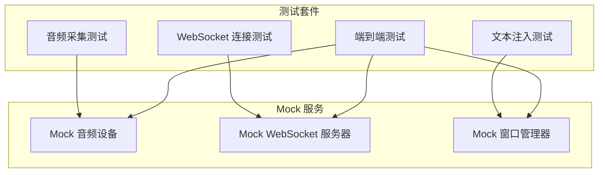

## 8. 部署与打包

### 8.1 Tauri 构建配置

```json
{
  "build": {
    "beforeDevCommand": "npm run dev",
    "beforeBuildCommand": "npm run build",
    "devPath": "http://localhost:1420",
    "distDir": "../dist"
  },
  "bundle": {
    "active": true,
    "targets": ["dmg", "app"],
    "identifier": "com.raflow.app",
    "icon": [
      "icons/32x32.png",
      "icons/128x128.png",
      "icons/icon.icns"
    ],
    "resources": [],
    "copyright": "Copyright (c) 2025 RAFlow Team",
    "category": "Productivity",
    "macOS": {
      "minimumSystemVersion": "10.15",
      "entitlements": "entitlements.plist",
      "frameworks": [],
      "useBootstrapper": false
    }
  }
}
```

### 8.2 macOS 权限配置 (entitlements.plist)

```xml
<?xml version="1.0" encoding="UTF-8"?>
<!DOCTYPE plist PUBLIC "-//Apple//DTD PLIST 1.0//EN" "http://www.apple.com/DTDs/PropertyList-1.0.dtd">
<plist version="1.0">
<dict>
    <key>com.apple.security.microphone</key>
    <true/>
    <key>com.apple.security.automation.apple-events</key>
    <true/>
    <key>com.apple.security.app-sandbox</key>
    <false/>
</dict>
</plist>
```

### 8.3 发布流程

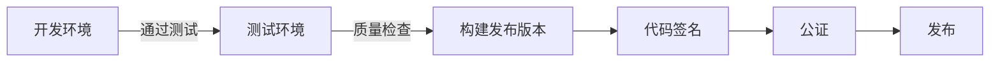

## 9. 监控与日志

### 9.1 日志结构

```rust
use tracing::{info, warn, error, debug};
use tracing_subscriber;

pub fn init_logging() {
    tracing_subscriber::fmt()
        .with_max_level(tracing::Level::INFO)
        .with_target(true)
        .with_thread_ids(true)
        .with_file(true)
        .with_line_number(true)
        .init();
}

// 使用示例
info!("Audio stream started: sample_rate={}, channels={}", 48000, 1);
warn!("VAD threshold too low, may cause false positives: {}", threshold);
error!("WebSocket connection failed: {:?}", error);
debug!("Received partial transcript: {}", text);
```

### 9.2 性能指标

```rust
use std::time::Instant;

pub struct PerformanceMetrics {
    pub audio_latency_ms: f64,       // 音频采集延迟
    pub network_latency_ms: f64,     // 网络往返延迟
    pub transcription_latency_ms: f64, // 转写延迟
    pub injection_latency_ms: f64,   // 注入延迟
    pub total_latency_ms: f64,       // 总延迟
}

impl PerformanceMetrics {
    pub fn measure_audio_capture(&mut self, start: Instant) {
        self.audio_latency_ms = start.elapsed().as_secs_f64() * 1000.0;
    }

    pub fn log_metrics(&self) {
        info!(
            "Performance: audio={}ms, network={}ms, transcription={}ms, injection={}ms, total={}ms",
            self.audio_latency_ms,
            self.network_latency_ms,
            self.transcription_latency_ms,
            self.injection_latency_ms,
            self.total_latency_ms
        );
    }
}
```

## 10. 未来扩展方向

### 10.1 功能路线图

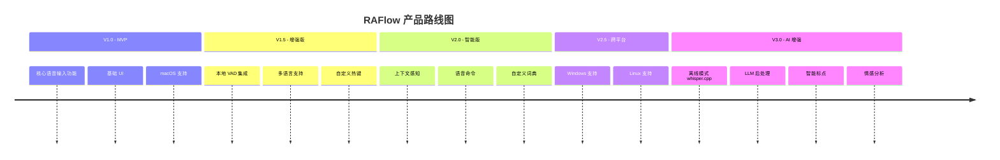

### 10.2 架构演进

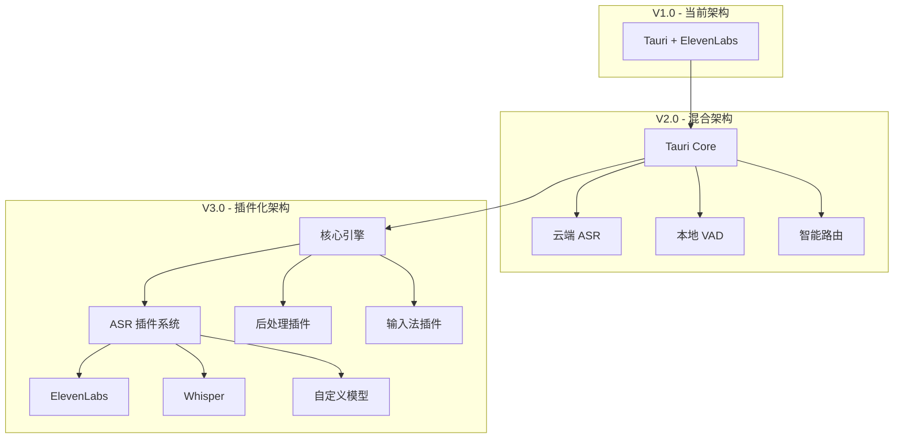

## 11. 参考资源

### 技术文档
- [Tauri v2 官方文档](https://v2.tauri.app/)
- [ElevenLabs Scribe v2 API 文档](https://elevenlabs.io/docs/api-reference/speech-to-text/v-1-speech-to-text-realtime)
- [cpal 音频库文档](https://github.com/RustAudio/cpal)
- [tokio-tungstenite WebSocket 文档](https://github.com/snapview/tokio-tungstenite)
- [rubato 重采样库文档](https://github.com/HEnquist/rubato)
- [enigo 输入模拟文档](https://github.com/enigo-rs/enigo)

### 社区资源
- [Tauri Awesome 项目列表](https://github.com/tauri-apps/awesome-tauri)
- [Rust 音频社区](https://github.com/RustAudio)
- [WebSocket 最佳实践](https://www.videosdk.live/developer-hub/websocket/rust-websocket)

---

**文档状态**: ✅ 已完成
**最后更新**: 2025-12-21
**审核状态**: 待审核
