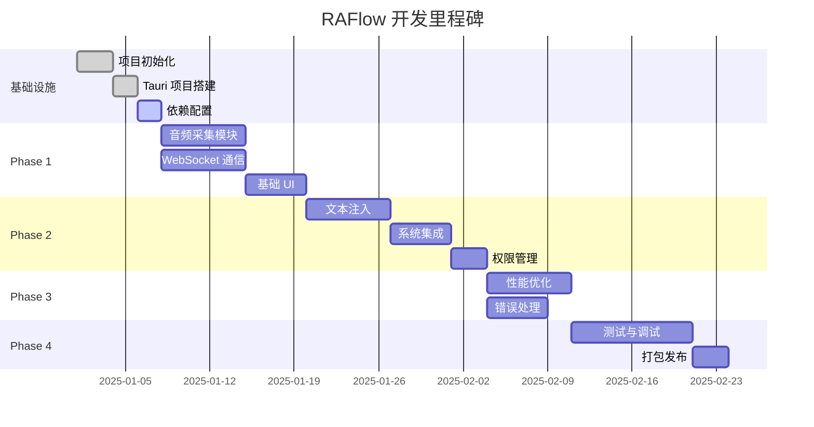
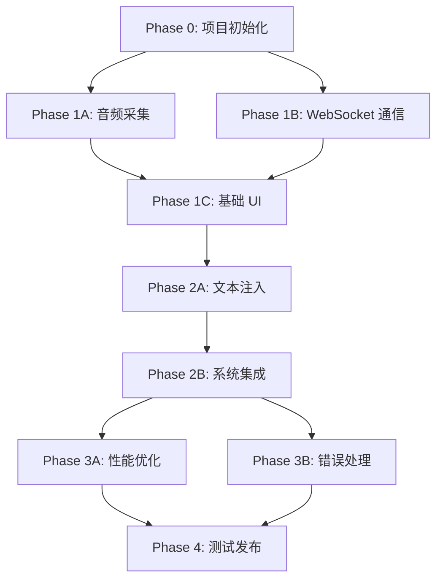
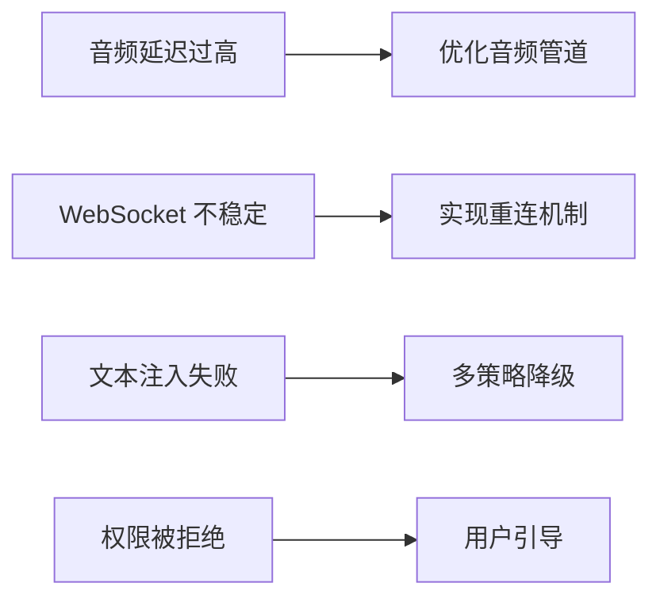

# RAFlow - 实施计划文档

## 文档信息

| 项目 | 内容 |
|-----|------|
| 项目名称 | RAFlow - 实时语音听写系统 |
| 版本 | 1.0 |
| 创建日期 | 2025-12-21 |
| 预计周期 | 8-10 周 |
| 团队规模 | 2-3 人 |

## 目录

- [1. 项目概述](#1-项目概述)
- [2. 开发阶段划分](#2-开发阶段划分)
- [3. 详细实施步骤](#3-详细实施步骤)
- [4. 风险管理](#4-风险管理)
- [5. 质量保证](#5-质量保证)
- [6. 交付物清单](#6-交付物清单)

## 1. 项目概述

### 1.1 项目目标

构建一个基于 Tauri v2 + ElevenLabs Scribe v2 的实时语音听写桌面应用，实现类似 Wispr Flow 的无缝语音输入体验。

### 1.2 核心里程碑



## 2. 开发阶段划分

### 阶段概览

| 阶段 | 名称 | 预计时长 | 核心产出 | 成功标准 |
|-----|------|---------|---------|---------|
| Phase 0 | 项目初始化 | 1 周 | 项目框架、开发环境 | 项目可运行，依赖完整 |
| Phase 1 | 核心功能开发 | 3 周 | 音频采集、WebSocket、基础 UI | 能完成基本语音转写 |
| Phase 2 | 系统集成 | 2 周 | 文本注入、权限管理 | 能将文本输入到目标应用 |
| Phase 3 | 优化与完善 | 2 周 | 性能优化、错误处理 | 延迟 < 500ms，稳定运行 |
| Phase 4 | 测试与发布 | 2 周 | 完整测试、打包发布 | 可发布的 DMG 安装包 |

### 依赖关系图



## 3. 详细实施步骤

### Phase 0: 项目初始化（第 1 周）

#### 3.0.1 开发环境搭建

**任务清单：**
- [ ] 安装 Rust 工具链（rustc 1.70+）
- [ ] 安装 Node.js（v18+）和 pnpm
- [ ] 安装 Tauri CLI：`cargo install tauri-cli`
- [ ] 配置 IDE（VS Code + rust-analyzer）
- [ ] 安装 macOS 开发工具：Xcode Command Line Tools

**验收标准：**
```bash
# 验证工具版本
rustc --version  # >= 1.70
cargo --version
node --version   # >= 18
pnpm --version
cargo tauri --version  # >= 2.0
```

#### 3.0.2 项目初始化

**实施步骤：**

```bash
# 1. 创建 Tauri 项目
cargo create-tauri-app raflow
cd raflow

# 2. 选择配置
# - Package manager: pnpm
# - UI template: React + TypeScript
# - UI flavor: TypeScript

# 3. 项目结构调整
mkdir -p src-tauri/src/{audio,network,input,utils}
mkdir -p src/components/{Overlay,Settings,Tray}
mkdir -p src/hooks
```

**核心文件结构：**
```
raflow/
├── src-tauri/
│   ├── Cargo.toml              # Rust 依赖配置
│   ├── tauri.conf.json         # Tauri 配置
│   ├── src/
│   │   ├── main.rs             # 主入口
│   │   ├── lib.rs              # 核心库
│   │   ├── audio/              # 音频模块
│   │   │   ├── mod.rs
│   │   │   ├── capture.rs      # 音频采集
│   │   │   ├── resample.rs     # 重采样
│   │   │   └── vad.rs          # VAD 检测
│   │   ├── network/            # 网络模块
│   │   │   ├── mod.rs
│   │   │   ├── websocket.rs    # WebSocket 客户端
│   │   │   └── protocol.rs     # 协议定义
│   │   ├── input/              # 输入模块
│   │   │   ├── mod.rs
│   │   │   ├── injector.rs     # 文本注入
│   │   │   └── window.rs       # 窗口检测
│   │   └── utils/              # 工具模块
│   │       ├── mod.rs
│   │       ├── config.rs       # 配置管理
│   │       └── logger.rs       # 日志
│   └── capabilities/
│       └── default.json        # 权限配置
├── src/
│   ├── main.tsx                # 前端入口
│   ├── App.tsx                 # 主应用组件
│   ├── components/             # UI 组件
│   │   ├── Overlay/            # 悬浮窗
│   │   ├── Settings/           # 设置面板
│   │   └── Tray/               # 托盘菜单
│   ├── hooks/                  # React Hooks
│   │   ├── useAudioLevel.ts
│   │   ├── useTranscript.ts
│   │   └── useShortcut.ts
│   └── styles/                 # 样式文件
└── package.json
```

#### 3.0.3 依赖配置

**Cargo.toml 配置：**

```toml
[package]
name = "raflow"
version = "0.1.0"
edition = "2024"

[dependencies]
# Tauri 核心
tauri = { version = "2.0", features = ["tray-icon", "protocol-asset"] }
tauri-plugin-global-shortcut = "2.0"
tauri-plugin-clipboard-manager = "2.0"
tauri-plugin-dialog = "2.0"
tauri-plugin-fs = "2.0"

# 异步运行时
tokio = { version = "1", features = ["full"] }
tokio-tungstenite = { version = "0.26", features = ["rustls-tls-native-roots"] }
futures-util = "0.3"

# 序列化
serde = { version = "1.0", features = ["derive"] }
serde_json = "1.0"
base64 = "0.22"

# 音频处理
cpal = "0.17"
rubato = "0.16"

# 系统交互
enigo = "0.2"
active-win-pos-rs = "0.9"

# 工具库
anyhow = "1.0"
thiserror = "1.0"
tracing = "0.1"
tracing-subscriber = "0.3"
keyring = "2.3"

[target.'cfg(target_os = "macos")'.dependencies]
cocoa = "0.25"
objc = "0.2"
```

**package.json 配置：**

```json
{
  "name": "raflow",
  "version": "0.1.0",
  "scripts": {
    "dev": "vite",
    "build": "tsc && vite build",
    "tauri": "tauri"
  },
  "dependencies": {
    "react": "^18.2.0",
    "react-dom": "^18.2.0",
    "@tauri-apps/api": "^2.0.0",
    "@tauri-apps/plugin-global-shortcut": "^2.0.0",
    "@tauri-apps/plugin-clipboard-manager": "^2.0.0"
  },
  "devDependencies": {
    "@types/react": "^18.2.0",
    "@types/react-dom": "^18.2.0",
    "@vitejs/plugin-react": "^4.2.0",
    "typescript": "^5.3.0",
    "vite": "^5.0.0"
  }
}
```

---

### Phase 1: 核心功能开发（第 2-4 周）

#### 3.1.1 音频采集模块（P1.1）

**任务分解：**

1. **音频设备枚举** (1 天)
   ```rust
   // src-tauri/src/audio/capture.rs

   use cpal::traits::{DeviceTrait, HostTrait};

   pub struct AudioCapture {
       host: cpal::Host,
       device: Option<cpal::Device>,
       config: Option<cpal::StreamConfig>,
   }

   impl AudioCapture {
       pub fn new() -> Result<Self> {
           let host = cpal::default_host();
           Ok(Self {
               host,
               device: None,
               config: None,
           })
       }

       pub fn list_devices(&self) -> Result<Vec<DeviceInfo>> {
           let mut devices = Vec::new();
           for device in self.host.input_devices()? {
               if let Ok(name) = device.name() {
                   devices.push(DeviceInfo { name });
               }
           }
           Ok(devices)
       }

       pub fn set_device(&mut self, device_name: &str) -> Result<()> {
           // 实现设备选择逻辑
           todo!()
       }
   }
   ```

2. **音频流初始化** (2 天)
   ```rust
   use tokio::sync::mpsc;

   pub type AudioPacket = Vec<f32>;

   impl AudioCapture {
       pub fn start_stream(
           &mut self,
           tx: mpsc::Sender<AudioPacket>,
       ) -> Result<cpal::Stream> {
           let device = self.device.as_ref().ok_or(anyhow!("No device"))?;
           let config = self.config.as_ref().ok_or(anyhow!("No config"))?;

           let stream = device.build_input_stream(
               config,
               move |data: &[f32], _: &cpal::InputCallbackInfo| {
                   if let Err(e) = tx.try_send(data.to_vec()) {
                       eprintln!("Audio channel full: {}", e);
                   }
               },
               |err| eprintln!("Stream error: {}", err),
               None,
           )?;

           stream.play()?;
           Ok(stream)
       }
   }
   ```

3. **重采样实现** (2 天)
   ```rust
   // src-tauri/src/audio/resample.rs

   use rubato::{Resampler, SincFixedIn, InterpolationType, InterpolationParameters, WindowFunction};

   pub struct AudioResampler {
       resampler: SincFixedIn<f32>,
       input_buffer: Vec<Vec<f32>>,
       output_buffer: Vec<Vec<f32>>,
   }

   impl AudioResampler {
       pub fn new(from_rate: usize, to_rate: usize, chunk_size: usize) -> Result<Self> {
           let params = InterpolationParameters {
               sinc_len: 256,
               f_cutoff: 0.95,
               interpolation: InterpolationType::Linear,
               oversampling_factor: 256,
               window: WindowFunction::BlackmanHarris2,
           };

           let resampler = SincFixedIn::<f32>::new(
               to_rate as f64 / from_rate as f64,
               2.0,
               params,
               chunk_size,
               1, // mono
           )?;

           Ok(Self {
               resampler,
               input_buffer: vec![vec![0.0; chunk_size]; 1],
               output_buffer: vec![vec![0.0; chunk_size * to_rate / from_rate]; 1],
           })
       }

       pub fn process(&mut self, input: &[f32]) -> Result<Vec<f32>> {
           self.input_buffer[0].copy_from_slice(input);
           let (_, out_len) = self.resampler.process_into_buffer(
               &self.input_buffer,
               &mut self.output_buffer,
               None,
           )?;
           Ok(self.output_buffer[0][..out_len].to_vec())
       }
   }
   ```

4. **VAD 集成** (2 天)
   ```rust
   // src-tauri/src/audio/vad.rs

   pub struct VoiceActivityDetector {
       energy_threshold: f32,
       window_size: usize,
       speech_frames: usize,
       silence_frames: usize,
       min_speech_frames: usize,
       min_silence_frames: usize,
   }

   impl VoiceActivityDetector {
       pub fn new(threshold: f32) -> Self {
           Self {
               energy_threshold: threshold,
               window_size: 160, // 10ms @ 16kHz
               speech_frames: 0,
               silence_frames: 0,
               min_speech_frames: 5,   // 50ms
               min_silence_frames: 30, // 300ms
           }
       }

       pub fn is_speech(&mut self, audio: &[f32]) -> bool {
           let rms = self.calculate_rms(audio);

           if rms > self.energy_threshold {
               self.speech_frames += 1;
               self.silence_frames = 0;
           } else {
               self.silence_frames += 1;
               self.speech_frames = 0;
           }

           self.speech_frames >= self.min_speech_frames
       }

       fn calculate_rms(&self, audio: &[f32]) -> f32 {
           let sum: f32 = audio.iter().map(|x| x * x).sum();
           (sum / audio.len() as f32).sqrt()
       }
   }
   ```

**测试计划：**
- 单元测试：测试重采样精度、VAD 准确率
- 集成测试：验证音频流稳定性（运行 10 分钟无崩溃）
- 性能测试：CPU 占用 < 5%，内存 < 50MB

#### 3.1.2 WebSocket 通信模块（P1.2）

**任务分解：**

1. **协议定义** (1 天)
   ```rust
   // src-tauri/src/network/protocol.rs

   #[derive(Serialize)]
   #[serde(tag = "message_type")]
   pub enum ClientMessage {
       #[serde(rename = "input_audio_chunk")]
       AudioChunk {
           audio_base_64: String,
       },
   }

   #[derive(Deserialize, Debug)]
   #[serde(tag = "message_type")]
   pub enum ServerMessage {
       #[serde(rename = "session_started")]
       SessionStarted {
           session_id: String,
       },
       #[serde(rename = "partial_transcript")]
       PartialTranscript {
           text: String,
           created_at_ms: u64,
       },
       #[serde(rename = "committed_transcript")]
       CommittedTranscript {
           text: String,
           confidence: f32,
       },
       #[serde(rename = "input_error")]
       InputError {
           error_message: String,
       },
   }
   ```

2. **连接管理** (2 天)
   ```rust
   // src-tauri/src/network/websocket.rs

   use tokio_tungstenite::{connect_async, tungstenite::Message};
   use futures_util::{SinkExt, StreamExt};

   pub struct WebSocketClient {
       url: String,
       api_key: String,
       ws_write: Option<SplitSink<WebSocketStream<MaybeTlsStream<TcpStream>>, Message>>,
       ws_read: Option<SplitStream<WebSocketStream<MaybeTlsStream<TcpStream>>>>,
   }

   impl WebSocketClient {
       pub async fn connect(&mut self) -> Result<()> {
           let url = format!(
               "{}?model_id=scribe_v2&encoding=pcm_16000",
               self.url
           );

           let request = url.parse::<Uri>()?;
           let (ws_stream, _) = connect_async_with_config(
               request,
               None,
               false,
           ).await?;

           let (write, read) = ws_stream.split();
           self.ws_write = Some(write);
           self.ws_read = Some(read);

           Ok(())
       }

       pub async fn send_audio(&mut self, audio_data: &[f32]) -> Result<()> {
           let pcm_i16: Vec<i16> = audio_data
               .iter()
               .map(|&x| (x * 32767.0) as i16)
               .collect();

           let bytes: &[u8] = unsafe {
               std::slice::from_raw_parts(
                   pcm_i16.as_ptr() as *const u8,
                   pcm_i16.len() * 2,
               )
           };

           let b64 = base64::engine::general_purpose::STANDARD.encode(bytes);

           let msg = ClientMessage::AudioChunk {
               audio_base_64: b64,
           };

           let json = serde_json::to_string(&msg)?;

           if let Some(write) = &mut self.ws_write {
               write.send(Message::Text(json)).await?;
           }

           Ok(())
       }
   }
   ```

3. **接收循环** (2 天)
   ```rust
   impl WebSocketClient {
       pub async fn receive_loop(
           &mut self,
           tx: mpsc::Sender<ServerMessage>,
       ) -> Result<()> {
           if let Some(read) = &mut self.ws_read {
               while let Some(msg) = read.next().await {
                   match msg? {
                       Message::Text(text) => {
                           match serde_json::from_str::<ServerMessage>(&text) {
                               Ok(server_msg) => {
                                   tx.send(server_msg).await?;
                               }
                               Err(e) => {
                                   eprintln!("Failed to parse message: {}", e);
                               }
                           }
                       }
                       Message::Close(_) => break,
                       _ => {}
                   }
               }
           }
           Ok(())
       }
   }
   ```

4. **状态管理** (2 天)
   - 实现连接状态机（Disconnected → Connecting → Connected → Active）
   - 实现自动重连逻辑（指数退避）
   - 实现心跳机制

**测试计划：**
- 连接稳定性测试
- 消息序列化/反序列化测试
- 断线重连测试
- 高频消息发送测试（1000+ 消息/秒）

#### 3.1.3 基础 UI 开发（P1.3）

**任务分解：**

1. **悬浮窗组件** (2 天)
   ```typescript
   // src/components/Overlay/OverlayWindow.tsx

   import { useEffect, useState } from 'react';
   import { listen } from '@tauri-apps/api/event';

   interface TranscriptEvent {
       text: string;
       is_final: boolean;
   }

   export function OverlayWindow() {
       const [text, setText] = useState('');
       const [audioLevel, setAudioLevel] = useState(0);
       const [isListening, setIsListening] = useState(false);

       useEffect(() => {
           const unlistenTranscript = listen<TranscriptEvent>(
               'transcript-update',
               (event) => {
                   setText(event.payload.text);
               }
           );

           const unlistenAudio = listen<number>(
               'audio-level',
               (event) => {
                   setAudioLevel(event.payload);
               }
           );

           return () => {
               unlistenTranscript.then(f => f());
               unlistenAudio.then(f => f());
           };
       }, []);

       return (
           <div className="overlay-container">
               <div className="waveform">
                   <WaveformVisualizer level={audioLevel} />
               </div>
               <div className="transcript">
                   {text || (isListening ? '正在听...' : '')}
               </div>
           </div>
       );
   }
   ```

2. **设置面板** (2 天)
   - API 密钥配置
   - 音频设备选择
   - 快捷键自定义
   - 高级选项

3. **托盘菜单** (1 天)
   ```rust
   // src-tauri/src/lib.rs

   use tauri::{Manager, menu::{Menu, MenuItem}, tray::TrayIconBuilder};

   pub fn setup_tray(app: &tauri::App) -> Result<()> {
       let quit = MenuItem::with_id(app, "quit", "退出", true, None::<&str>)?;
       let settings = MenuItem::with_id(app, "settings", "设置", true, None::<&str>)?;
       let menu = Menu::with_items(app, &[&settings, &quit])?;

       TrayIconBuilder::new()
           .menu(&menu)
           .on_menu_event(|app, event| {
               match event.id().as_ref() {
                   "quit" => app.exit(0),
                   "settings" => {
                       if let Some(window) = app.get_webview_window("main") {
                           window.show().unwrap();
                           window.set_focus().unwrap();
                       }
                   }
                   _ => {}
               }
           })
           .build(app)?;

       Ok(())
   }
   ```

**交付物：**
- 可显示/隐藏的悬浮窗
- 功能完整的设置面板
- 系统托盘图标和菜单

---

### Phase 2: 系统集成（第 5-6 周）

#### 3.2.1 文本注入模块（P2.1）

**任务分解：**

1. **活跃窗口检测** (1 天)
   ```rust
   // src-tauri/src/input/window.rs

   use active_win_pos_rs::get_active_window;

   #[derive(Debug, Clone)]
   pub struct WindowInfo {
       pub app_name: String,
       pub title: String,
       pub process_id: u32,
   }

   pub fn get_target_window() -> Result<WindowInfo> {
       match get_active_window() {
           Ok(window) => Ok(WindowInfo {
               app_name: window.app_name,
               title: window.title,
               process_id: window.process_id,
           }),
           Err(_) => Err(anyhow!("Failed to get active window")),
       }
   }
   ```

2. **键盘模拟** (2 天)
   ```rust
   // src-tauri/src/input/injector.rs

   use enigo::{Enigo, Key, KeyboardControllable};

   pub struct KeyboardInjector {
       enigo: Enigo,
   }

   impl KeyboardInjector {
       pub fn new() -> Self {
           Self {
               enigo: Enigo::new(),
           }
       }

       pub fn type_text(&mut self, text: &str) -> Result<()> {
           for ch in text.chars() {
               self.enigo.key_click(Key::Layout(ch));
               // 添加微小延迟以避免输入过快
               std::thread::sleep(std::time::Duration::from_millis(10));
           }
           Ok(())
       }
   }
   ```

3. **剪贴板注入** (2 天)
   ```rust
   use tauri_plugin_clipboard_manager::ClipboardExt;

   pub struct ClipboardInjector {
       keyboard: KeyboardInjector,
   }

   impl ClipboardInjector {
       pub async fn inject_text(
           &mut self,
           app: &tauri::AppHandle,
           text: &str,
       ) -> Result<()> {
           // 1. 备份剪贴板
           let old_content = app.clipboard().read_text().ok();

           // 2. 写入新文本
           app.clipboard().write_text(text)?;

           // 3. 模拟粘贴
           #[cfg(target_os = "macos")]
           {
               self.keyboard.enigo.key_down(Key::Meta);
               self.keyboard.enigo.key_click(Key::Layout('v'));
               self.keyboard.enigo.key_up(Key::Meta);
           }

           // 4. 等待粘贴完成
           tokio::time::sleep(tokio::time::Duration::from_millis(100)).await;

           // 5. 恢复剪贴板
           if let Some(old) = old_content {
               app.clipboard().write_text(&old)?;
           }

           Ok(())
       }
   }
   ```

4. **策略选择器** (2 天)
   ```rust
   pub enum InjectionStrategy {
       Keyboard,
       Clipboard,
   }

   pub struct TextInjectionManager {
       keyboard_injector: KeyboardInjector,
       clipboard_injector: ClipboardInjector,
   }

   impl TextInjectionManager {
       fn select_strategy(&self, text: &str, window: &WindowInfo) -> InjectionStrategy {
           // 短文本使用键盘
           if text.len() < 20 {
               return InjectionStrategy::Keyboard;
           }

           // 终端/IDE 使用键盘
           if window.app_name.contains("Terminal")
               || window.app_name.contains("iTerm")
               || window.app_name.contains("Code") {
               return InjectionStrategy::Keyboard;
           }

           // 其他使用剪贴板
           InjectionStrategy::Clipboard
       }

       pub async fn inject(
           &mut self,
           app: &tauri::AppHandle,
           text: &str,
       ) -> Result<()> {
           let window = get_target_window()?;
           let strategy = self.select_strategy(text, &window);

           match strategy {
               InjectionStrategy::Keyboard => {
                   self.keyboard_injector.type_text(text)?;
               }
               InjectionStrategy::Clipboard => {
                   self.clipboard_injector.inject_text(app, text).await?;
               }
           }

           Ok(())
       }
   }
   ```

#### 3.2.2 权限管理（P2.2）

**任务分解：**

1. **权限检测** (1 天)
   ```rust
   // src-tauri/src/utils/permissions.rs

   #[cfg(target_os = "macos")]
   pub fn check_microphone_permission() -> bool {
       use cocoa::base::id;
       use objc::{runtime::Class, msg_send, sel, sel_impl};

       unsafe {
           let avclass = Class::get("AVCaptureDevice").unwrap();
           let status: i32 = msg_send![avclass, authorizationStatusForMediaType: "soun"];
           status == 3 // AVAuthorizationStatusAuthorized
       }
   }

   #[cfg(target_os = "macos")]
   pub fn check_accessibility_permission() -> bool {
       use cocoa::appkit::NSRunningApplication;
       use cocoa::base::nil;

       unsafe {
           let options = cocoa::foundation::NSDictionary::dictionary();
           let trusted: bool = msg_send![
               class!(AXIsProcessTrusted),
               checkAccessibilityPermission
           ];
           trusted
       }
   }
   ```

2. **权限请求流程** (2 天)
   - 实现权限请求 UI
   - 实现跳转到系统设置的逻辑
   - 实现权限状态轮询

**测试计划：**
- 不同应用中的文本注入测试（Chrome、VSCode、TextEdit）
- 长文本注入性能测试
- 权限拒绝场景测试

---

### Phase 3: 优化与完善（第 7-8 周）

#### 3.3.1 性能优化（P3.1）

**优化项清单：**

1. **音频处理优化** (2 天)
   - [ ] 实现零拷贝音频缓冲区（ringbuf）
   - [ ] 优化重采样算法参数
   - [ ] 实现音频批处理（100ms 块）

2. **网络优化** (2 天)
   - [ ] 实现连接池和预热策略
   - [ ] 优化 Base64 编码（使用 SIMD）
   - [ ] 实现消息批量发送

3. **内存优化** (1 天)
   - [ ] 实现对象池管理
   - [ ] 减少不必要的内存分配
   - [ ] 实现内存使用监控

4. **UI 优化** (2 天)
   - [ ] 实现悬浮窗动画优化
   - [ ] 减少 React 重渲染
   - [ ] 实现虚拟滚动（长文本）

**性能指标：**
- 端到端延迟：< 500ms
- CPU 占用：< 10%
- 内存占用：< 100MB
- 音频丢包率：< 0.1%

#### 3.3.2 错误处理（P3.2）

**错误类型定义：**

```rust
// src-tauri/src/utils/error.rs

#[derive(Debug, thiserror::Error)]
pub enum RAFlowError {
    #[error("Audio device error: {0}")]
    AudioDevice(String),

    #[error("Network error: {0}")]
    Network(String),

    #[error("Permission denied: {0}")]
    Permission(String),

    #[error("API error: {0}")]
    API(String),
}
```

**错误处理策略：**

1. **音频错误** - 重新初始化设备
2. **网络错误** - 指数退避重连（最多 3 次）
3. **权限错误** - 提示用户授权
4. **API 错误** - 降级或提示用户

---

### Phase 4: 测试与发布（第 9-10 周）

#### 3.4.1 测试计划（P4.1）

**测试矩阵：**

| 测试类型 | 测试用例 | 预期结果 | 负责人 |
|---------|---------|---------|--------|
| 单元测试 | 音频重采样精度 | 误差 < 1% | Dev |
| 单元测试 | VAD 检测准确率 | > 95% | Dev |
| 集成测试 | 完整转写流程 | 成功率 > 99% | QA |
| 性能测试 | 长时间运行稳定性 | 运行 24h 无崩溃 | QA |
| 兼容性测试 | 多应用文本注入 | 10+ 应用兼容 | QA |
| 压力测试 | 高频热键触发 | 无内存泄漏 | Dev |

**自动化测试：**

```rust
#[cfg(test)]
mod integration_tests {
    #[tokio::test]
    async fn test_full_transcription_flow() {
        // 1. 初始化系统
        let app = setup_test_app().await;

        // 2. 模拟音频输入
        let test_audio = load_test_audio("hello_world.wav");
        app.feed_audio(test_audio).await;

        // 3. 等待转写结果
        let transcript = app.wait_for_transcript(5000).await;

        // 4. 验证结果
        assert!(transcript.contains("hello"));
        assert!(transcript.contains("world"));
    }
}
```

#### 3.4.2 打包发布（P4.2）

**构建流程：**

```bash
# 1. 清理构建
cargo clean
pnpm clean

# 2. 运行测试
cargo test --all
pnpm test

# 3. 构建发布版本
cargo tauri build --target universal-apple-darwin

# 4. 代码签名（需要 Apple Developer 账号）
codesign --deep --force --verify --verbose \
  --sign "Developer ID Application: Your Name (TEAM_ID)" \
  target/release/bundle/macos/RAFlow.app

# 5. 公证（Notarization）
xcrun notarytool submit \
  target/release/bundle/dmg/RAFlow_0.1.0_universal.dmg \
  --apple-id "your-email@example.com" \
  --team-id "TEAM_ID" \
  --password "app-specific-password"
```

**发布检查清单：**

- [ ] 所有测试通过
- [ ] 版本号更新
- [ ] CHANGELOG 更新
- [ ] 用户文档完成
- [ ] 代码签名完成
- [ ] 公证完成
- [ ] DMG 安装包生成
- [ ] GitHub Release 创建
- [ ] 官网更新

---

## 4. 风险管理

### 4.1 技术风险



| 风险 | 概率 | 影响 | 缓解措施 | 应急预案 |
|-----|------|------|---------|---------|
| ElevenLabs API 变更 | 低 | 高 | 版本锁定、监控文档 | 快速适配新版本 |
| macOS 系统更新破坏兼容性 | 中 | 高 | 持续测试、社区反馈 | 发布热修复 |
| 音频驱动不兼容 | 中 | 中 | 支持多种采样率 | 提示用户更换设备 |
| 性能不达标 | 低 | 中 | 早期性能测试 | 降低功能复杂度 |
| 权限被拒绝 | 中 | 高 | 清晰的权限说明 | 提供详细指南 |

### 4.2 进度风险

**缓冲策略：**
- 每个 Phase 预留 10% 缓冲时间
- 关键路径任务优先级最高
- 非核心功能可延后到后续版本

**里程碑检查点：**
- Phase 1 结束：必须能完成基本转写
- Phase 2 结束：必须能注入文本到应用
- Phase 3 结束：性能达标
- Phase 4 结束：可发布

---

## 5. 质量保证

### 5.1 代码质量

**代码规范：**
```bash
# Rust 代码格式化
cargo fmt --all

# Rust 代码检查
cargo clippy --all-targets --all-features -- -D warnings

# TypeScript 代码检查
pnpm eslint src --ext .ts,.tsx

# 类型检查
pnpm tsc --noEmit
```

**代码审查清单：**
- [ ] 是否有潜在的内存泄漏
- [ ] 是否有未处理的错误
- [ ] 是否有性能瓶颈
- [ ] 是否符合代码规范
- [ ] 是否有充足的注释
- [ ] 是否有单元测试

### 5.2 文档要求

**必需文档：**
1. **README.md** - 项目介绍、快速开始
2. **ARCHITECTURE.md** - 架构设计文档
3. **API.md** - 内部 API 文档
4. **USER_GUIDE.md** - 用户使用指南
5. **CONTRIBUTING.md** - 贡献指南
6. **CHANGELOG.md** - 版本变更日志

---

## 6. 交付物清单

### 6.1 代码交付物

- [ ] 完整的 Rust 后端代码
- [ ] 完整的 React 前端代码
- [ ] 单元测试覆盖率 > 70%
- [ ] 集成测试套件
- [ ] CI/CD 配置文件

### 6.2 文档交付物

- [ ] 技术设计文档
- [ ] API 文档
- [ ] 用户手册
- [ ] 部署指南
- [ ] 故障排查指南

### 6.3 发布交付物

- [ ] macOS DMG 安装包（Universal Binary）
- [ ] 已签名和公证的应用
- [ ] GitHub Release 页面
- [ ] 版本更新说明
- [ ] 用户迁移指南（如适用）

---

## 7. 附录

### 7.1 开发工具推荐

| 工具 | 用途 | 链接 |
|-----|------|------|
| VS Code | 代码编辑器 | https://code.visualstudio.com/ |
| rust-analyzer | Rust 语言服务器 | https://rust-analyzer.github.io/ |
| Tauri CLI | Tauri 命令行工具 | https://tauri.app/ |
| Audio Hijack | 音频测试工具 | https://rogueamoeba.com/audiohijack/ |
| Charles Proxy | 网络调试工具 | https://www.charlesproxy.com/ |
| Instruments | macOS 性能分析 | Xcode 自带 |

### 7.2 参考项目

- **Wispr Flow** - 产品参考
- **Tauri Examples** - https://github.com/tauri-apps/tauri/tree/dev/examples
- **cpal Examples** - https://github.com/RustAudio/cpal/tree/master/examples
- **WebSocket Client Examples** - tokio-tungstenite 官方示例

### 7.3 联系方式

- **项目负责人**：[待填写]
- **技术负责人**：[待填写]
- **问题反馈**：GitHub Issues
- **讨论区**：GitHub Discussions

---

**文档状态**: ✅ 已完成
**最后更新**: 2025-12-21
**下次审查**: Phase 0 结束后
