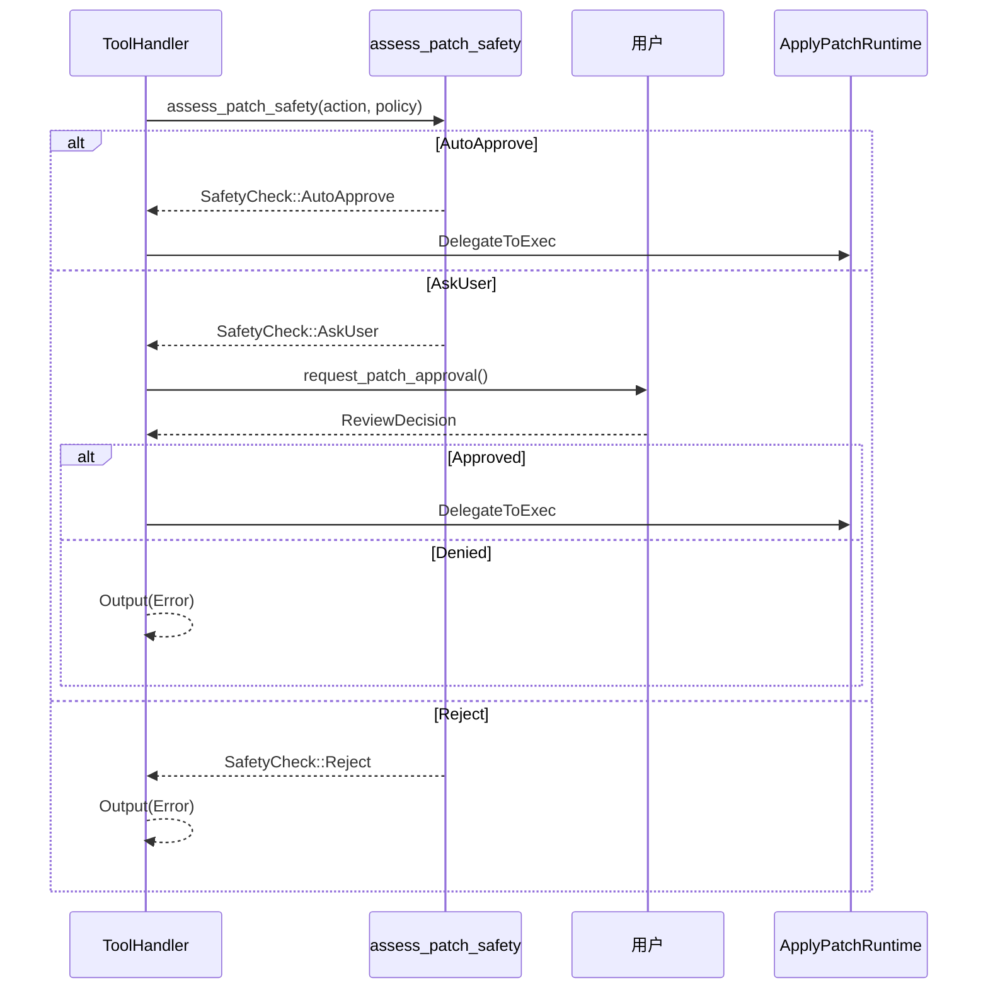

# Codex Apply Patch 工具深度解析

> 本文档基于 vendors/codex/codex-rs/apply-patch 源码深度分析撰写
>
> 分析日期: 2025-12-27
>
> 代码版本: rust-v0.78.0-alpha.8
>
> 作者: Claude (Opus 4.5)

---

## 目录

- [1. 概述](#1-概述)
- [2. 补丁格式语法](#2-补丁格式语法)
- [3. 核心实现原理](#3-核心实现原理)
- [4. 代码架构](#4-代码架构)
- [5. 与 Codex 集成](#5-与-codex-集成)
- [6. 测试体系](#6-测试体系)
- [7. apply_patch_tool_instructions.md 详解](#7-apply_patch_tool_instructionsmd-详解)
- [8. 使用指南](#8-使用指南)

---

## 1. 概述

### 1.1 什么是 apply_patch

`apply_patch` 是 Codex 专门为 AI 模型设计的**文件编辑工具**。它使用一种简化的、面向文件的 diff 格式，旨在：

- **易于解析**: 比标准 unified diff 更简单，AI 模型更容易生成正确格式
- **安全应用**: 内置验证机制，防止意外的文件破坏
- **灵活操作**: 支持添加、删除、更新、移动文件等多种操作

### 1.2 为什么不使用标准 diff


**核心优势**:

| 特性 | 标准 Unified Diff | apply_patch |
|------|------------------|-------------|
| 行号依赖 | 必须精确 | 使用上下文匹配 |
| 格式容错 | 严格 | 宽松 (支持 heredoc 等) |
| 文件操作 | 仅修改 | 增/删/改/移 |
| AI 友好度 | 低 | 高 |
| 错误定位 | 困难 | 清晰的错误信息 |

### 1.3 项目结构

```
codex-rs/apply-patch/
├── Cargo.toml                          # 包配置
├── apply_patch_tool_instructions.md    # AI 模型使用说明 (嵌入到库中)
├── src/
│   ├── lib.rs                          # 库入口 + 核心 apply 逻辑
│   ├── main.rs                         # CLI 入口
│   ├── parser.rs                       # 补丁解析器
│   ├── invocation.rs                   # 命令行解析 (支持 heredoc)
│   ├── seek_sequence.rs                # 模糊匹配算法
│   └── standalone_executable.rs        # 独立可执行文件逻辑
└── tests/
    ├── all.rs                          # 测试入口
    ├── suite/
    │   ├── mod.rs
    │   ├── scenarios.rs                # 场景测试
    │   ├── cli.rs                      # CLI 测试
    │   └── tool.rs                     # 工具测试
    └── fixtures/scenarios/             # 测试用例 (19 个场景)
```

---

## 2. 补丁格式语法

### 2.1 Lark 语法定义

apply_patch 使用 **Lark 语法** 定义补丁格式，源自 `tool_apply_patch.lark`:

```lark
start: begin_patch hunk+ end_patch
begin_patch: "*** Begin Patch" LF
end_patch: "*** End Patch" LF?

hunk: add_hunk | delete_hunk | update_hunk
add_hunk: "*** Add File: " filename LF add_line+
delete_hunk: "*** Delete File: " filename LF
update_hunk: "*** Update File: " filename LF change_move? change?

filename: /(.+)/
add_line: "+" /(.*)/ LF -> line

change_move: "*** Move to: " filename LF
change: (change_context | change_line)+ eof_line?
change_context: ("@@" | "@@ " /(.+)/) LF
change_line: ("+" | "-" | " ") /(.*)/ LF
eof_line: "*** End of File" LF
```

### 2.2 补丁结构图


### 2.3 完整示例

```
*** Begin Patch
*** Add File: hello.txt
+Hello world
+This is a new file
*** Update File: src/app.py
*** Move to: src/main.py
@@ def greet():
 def greet():
-    print("Hi")
+    print("Hello, world!")
*** Delete File: obsolete.txt
*** End Patch
```

### 2.4 行标记说明

| 标记 | 含义 | 说明 |
|------|------|------|
| `+` | 添加行 | 新内容，将被添加到文件 |
| `-` | 删除行 | 旧内容，将被从文件中删除 |
| ` ` (空格) | 上下文行 | 用于定位，不会被修改 |
| `@@` | 上下文定位 | 可选的函数/类名，帮助定位 |

---

## 3. 核心实现原理

### 3.1 解析流程


### 3.2 核心数据结构

**Hunk 枚举** (`parser.rs:60-76`):

```rust
pub enum Hunk {
    AddFile {
        path: PathBuf,
        contents: String,
    },
    DeleteFile {
        path: PathBuf,
    },
    UpdateFile {
        path: PathBuf,
        move_path: Option<PathBuf>,
        chunks: Vec<UpdateFileChunk>,
    },
}
```

**UpdateFileChunk** (`parser.rs:90-104`):

```rust
pub struct UpdateFileChunk {
    /// 用于缩小定位范围的上下文行 (如类名、函数名)
    pub change_context: Option<String>,

    /// 需要被替换的旧行
    pub old_lines: Vec<String>,

    /// 替换后的新行
    pub new_lines: Vec<String>,

    /// 是否是文件末尾
    pub is_end_of_file: bool,
}
```

### 3.3 模糊匹配算法 (seek_sequence)

`seek_sequence.rs` 实现了一个**渐进式模糊匹配算法**，用于在文件中定位需要修改的位置：


**匹配层次**:

1. **精确匹配**: 字节级完全相同
2. **去尾空白**: `trim_end()` 后匹配
3. **去首尾空白**: `trim()` 后匹配
4. **Unicode 规范化**: 将特殊字符转换为 ASCII 等价物

**Unicode 规范化示例** (`seek_sequence.rs:76-94`):

```rust
fn normalise(s: &str) -> String {
    s.trim()
        .chars()
        .map(|c| match c {
            // 各种破折号 → ASCII '-'
            '\u{2010}' | '\u{2011}' | '\u{2013}' | '\u{2014}' => '-',
            // 花式单引号 → '\''
            '\u{2018}' | '\u{2019}' => '\'',
            // 花式双引号 → '"'
            '\u{201C}' | '\u{201D}' => '"',
            // 非断行空格 → 普通空格
            '\u{00A0}' | '\u{2002}' | '\u{2003}' => ' ',
            other => other,
        })
        .collect()
}
```

### 3.4 替换算法

**核心逻辑** (`lib.rs:377-465`):


---

## 4. 代码架构

### 4.1 模块依赖图


### 4.2 核心模块职责

| 模块 | 文件 | 职责 |
|------|------|------|
| **lib** | lib.rs (1066行) | 主入口，apply_patch 核心逻辑，替换算法 |
| **parser** | parser.rs (742行) | 补丁语法解析，Hunk 构造 |
| **invocation** | invocation.rs (814行) | 命令行解析，heredoc 提取 |
| **seek_sequence** | seek_sequence.rs (152行) | 模糊行匹配算法 |
| **standalone** | standalone_executable.rs (60行) | CLI 可执行文件逻辑 |

### 4.3 公开 API

```rust
// 核心函数
pub fn apply_patch(patch: &str, stdout: &mut W, stderr: &mut W) -> Result<(), ApplyPatchError>;
pub fn apply_hunks(hunks: &[Hunk], stdout: &mut W, stderr: &mut W) -> Result<(), ApplyPatchError>;
pub fn parse_patch(patch: &str) -> Result<ApplyPatchArgs, ParseError>;

// 验证解析 (用于 Codex 集成)
pub fn maybe_parse_apply_patch_verified(argv: &[String], cwd: &Path) -> MaybeApplyPatchVerified;

// 导出的常量 (AI 模型指令)
pub const APPLY_PATCH_TOOL_INSTRUCTIONS: &str = include_str!("../apply_patch_tool_instructions.md");

// 导出的类型
pub use parser::Hunk;
pub use parser::ParseError;
```

---

## 5. 与 Codex 集成

### 5.1 集成架构


### 5.2 工具注册

Codex 支持两种 apply_patch 工具规格：

**1. Freeform Tool (GPT-5 使用)**

```rust
// core/src/tools/handlers/apply_patch.rs
pub(crate) fn create_apply_patch_freeform_tool() -> ToolSpec {
    ToolSpec::Freeform(FreeformTool {
        name: "apply_patch".to_string(),
        description: "Use the `apply_patch` tool to edit files...".to_string(),
        format: FreeformToolFormat {
            r#type: "grammar".to_string(),
            syntax: "lark".to_string(),
            definition: APPLY_PATCH_LARK_GRAMMAR.to_string(),  // Lark 语法嵌入
        },
    })
}
```

**2. JSON Function Tool (兼容模式)**

```rust
pub(crate) fn create_apply_patch_json_tool() -> ToolSpec {
    ToolSpec::Function(ResponsesApiTool {
        name: "apply_patch".to_string(),
        description: r#"Use the `apply_patch` tool to edit files..."#.to_string(),
        parameters: JsonSchema::Object {
            properties: [("input", JsonSchema::String { ... })],
            required: Some(vec!["input".to_string()]),
        },
    })
}
```

### 5.3 安全评估流程



**安全检查类型** (`core/src/apply_patch.rs:15-28`):

```rust
pub(crate) enum InternalApplyPatchInvocation {
    /// 用户明确批准，程序化处理
    Output(Result<String, FunctionCallError>),

    /// 委托给 exec 执行 (可能自动批准或用户批准)
    DelegateToExec(ApplyPatchExec),
}
```

### 5.4 命令拦截机制

当 AI 模型通过 `shell` 或 `exec_command` 调用 apply_patch 时，Codex 会拦截并转发到专门的处理器：

```rust
// core/src/tools/handlers/apply_patch.rs:163-240
pub(crate) async fn intercept_apply_patch(
    command: &[String],
    cwd: &Path,
    timeout_ms: Option<u64>,
    session: &Session,
    turn: &TurnContext,
    tracker: Option<&SharedTurnDiffTracker>,
    call_id: &str,
    tool_name: &str,
) -> Result<Option<ToolOutput>, FunctionCallError> {
    match codex_apply_patch::maybe_parse_apply_patch_verified(command, cwd) {
        MaybeApplyPatchVerified::Body(changes) => {
            // 记录警告：应该使用 apply_patch 工具
            session.record_model_warning(
                "apply_patch was requested via {tool_name}. Use the apply_patch tool instead."
            ).await;
            // 处理补丁...
        }
        MaybeApplyPatchVerified::NotApplyPatch => Ok(None),  // 不是 apply_patch，不拦截
        // ...
    }
}
```

### 5.5 执行运行时

`ApplyPatchRuntime` 负责在沙箱中执行补丁：

```rust
// core/src/tools/runtimes/apply_patch.rs
impl ToolRuntime<ApplyPatchRequest, ExecToolCallOutput> for ApplyPatchRuntime {
    async fn run(
        &mut self,
        req: &ApplyPatchRequest,
        attempt: &SandboxAttempt<'_>,
        ctx: &ToolCtx<'_>,
    ) -> Result<ExecToolCallOutput, ToolError> {
        // 构建命令: codex --codex-run-as-apply-patch <patch>
        let spec = Self::build_command_spec(req)?;

        // 在沙箱环境中执行
        let env = attempt.env_for(spec)?;
        let out = execute_env(env, attempt.policy, Self::stdout_stream(ctx)).await?;
        Ok(out)
    }
}
```

**关键参数**: `--codex-run-as-apply-patch`

当 Codex 以这个参数启动时，它会直接执行 apply_patch 而不是启动完整的 CLI。

---

## 6. 测试体系

### 6.1 测试架构


### 6.2 场景测试用例

| 场景 | 名称 | 测试内容 |
|------|------|---------|
| 001 | add_file | 添加新文件 |
| 002 | multiple_operations | 多文件操作 |
| 003 | multiple_chunks | 单文件多 chunk |
| 004 | move_to_new_directory | 移动文件到新目录 |
| 005 | rejects_empty_patch | 拒绝空补丁 |
| 006 | rejects_missing_context | 拒绝缺失上下文 |
| 007 | rejects_missing_file_delete | 拒绝删除不存在的文件 |
| 008 | rejects_empty_update_hunk | 拒绝空更新 hunk |
| 009 | requires_existing_file_for_update | 更新需要文件存在 |
| 010 | move_overwrites_existing | 移动覆盖已存在文件 |
| 011 | add_overwrites_existing | 添加覆盖已存在文件 |
| 012 | delete_directory_fails | 无法删除目录 |
| 013 | rejects_invalid_hunk_header | 拒绝无效 hunk 头 |
| 014 | update_appends_trailing_newline | 更新自动添加尾换行 |
| 015 | failure_after_partial_success | 部分成功后失败 |
| 016 | pure_addition_update_chunk | 纯添加 chunk |
| 017 | whitespace_padded_hunk_header | 空白填充的 hunk 头 |
| 018 | whitespace_padded_patch_markers | 空白填充的补丁标记 |
| 019 | unicode_simple | Unicode 支持 |

### 6.3 场景测试实现

```rust
// tests/suite/scenarios.rs
fn run_apply_patch_scenario(dir: &Path) -> anyhow::Result<()> {
    let tmp = tempdir()?;

    // 1. 复制输入文件到临时目录
    let input_dir = dir.join("input");
    if input_dir.is_dir() {
        copy_dir_recursive(&input_dir, tmp.path())?;
    }

    // 2. 读取补丁
    let patch = fs::read_to_string(dir.join("patch.txt"))?;

    // 3. 执行 apply_patch
    Command::new(cargo_bin("apply_patch")?)
        .arg(patch)
        .current_dir(tmp.path())
        .output()?;

    // 4. 比较结果与期望
    let expected_snapshot = snapshot_dir(&dir.join("expected"))?;
    let actual_snapshot = snapshot_dir(tmp.path())?;
    assert_eq!(actual_snapshot, expected_snapshot);

    Ok(())
}
```

### 6.4 运行测试

```bash
cd vendors/codex/codex-rs/apply-patch

# 运行所有测试
cargo test

# 运行特定测试
cargo test test_add_file_hunk_creates_file_with_contents

# 运行场景测试
cargo test test_apply_patch_scenarios
```

---

## 7. apply_patch_tool_instructions.md 详解

### 7.1 文件作用

`apply_patch_tool_instructions.md` 是**提供给 AI 模型的使用说明**。它通过 `include_str!()` 宏嵌入到库中：

```rust
// lib.rs:26
pub const APPLY_PATCH_TOOL_INSTRUCTIONS: &str =
    include_str!("../apply_patch_tool_instructions.md");
```

### 7.2 与 apply_patch crate 的交互


### 7.3 内容结构

```markdown
## `apply_patch`

Use the `apply_patch` shell command to edit files.
Your patch language is a stripped‑down, file‑oriented diff format...

[补丁格式说明]
[文件操作类型]
[上下文规则]
[完整语法定义]
[示例]
[重要提醒]
```

### 7.4 关键规则

1. **操作头部必须**: 每个文件操作必须以 `*** Add/Delete/Update File:` 开头
2. **新行前缀**: 即使是新建文件，每行也必须以 `+` 开头
3. **相对路径**: 文件引用只能使用相对路径，**绝对路径禁止**
4. **上下文规则**:
   - 默认 3 行上下文
   - 可使用 `@@` 指定类/函数定位
   - 支持多层 `@@` 定位

### 7.5 使用位置

该指令文本被用于：

1. **JSON 工具描述**: `create_apply_patch_json_tool()` 中的 `description` 字段
2. **系统提示**: 作为工具使用说明注入到模型的系统提示中
3. **Freeform 工具**: 配合 Lark 语法定义一起使用

---

## 8. 使用指南

### 8.1 CLI 使用

```bash
# 直接传递补丁内容
apply_patch '*** Begin Patch
*** Add File: hello.txt
+Hello, world!
*** End Patch'

# 从标准输入读取
echo '*** Begin Patch
*** Add File: hello.txt
+Hello, world!
*** End Patch' | apply_patch
```

### 8.2 作为库使用

```rust
use codex_apply_patch::{apply_patch, parse_patch};

fn main() {
    let patch = r#"*** Begin Patch
*** Add File: hello.txt
+Hello, world!
*** End Patch"#;

    let mut stdout = Vec::new();
    let mut stderr = Vec::new();

    match apply_patch(patch, &mut stdout, &mut stderr) {
        Ok(()) => println!("Success: {}", String::from_utf8_lossy(&stdout)),
        Err(e) => eprintln!("Error: {}", e),
    }
}
```

### 8.3 在 Codex 中使用

AI 模型可以通过以下方式调用：

```json
{
  "tool": "apply_patch",
  "input": "*** Begin Patch\n*** Add File: hello.txt\n+Hello, world!\n*** End Patch"
}
```

或通过 shell：

```json
{
  "tool": "shell",
  "command": ["apply_patch", "*** Begin Patch\n*** Add File: hello.txt\n+Hello, world!\n*** End Patch"]
}
```

### 8.4 常见错误及解决

| 错误 | 原因 | 解决方案 |
|------|------|---------|
| `The first line must be '*** Begin Patch'` | 缺少开始标记 | 确保补丁以 `*** Begin Patch` 开始 |
| `The last line must be '*** End Patch'` | 缺少结束标记 | 确保补丁以 `*** End Patch` 结束 |
| `Update file hunk is empty` | 更新操作没有内容 | 添加至少一个变更行 |
| `Failed to find expected lines` | 上下文不匹配 | 检查文件内容是否与补丁中的 `-` 行一致 |
| `patch rejected by user` | 用户拒绝了补丁 | 修改补丁或获取用户批准 |

---

## 附录

### A. 关键文件索引

| 文件 | 行数 | 功能 |
|------|------|------|
| `apply-patch/src/lib.rs` | 1066 | 核心 apply 逻辑 |
| `apply-patch/src/parser.rs` | 742 | 补丁解析器 |
| `apply-patch/src/invocation.rs` | 814 | 命令解析 |
| `apply-patch/src/seek_sequence.rs` | 152 | 模糊匹配 |
| `core/src/apply_patch.rs` | 145 | Codex 集成入口 |
| `core/src/tools/handlers/apply_patch.rs` | 345 | 工具处理器 |
| `core/src/tools/runtimes/apply_patch.rs` | 156 | 执行运行时 |

### B. 性能考量

- **模糊匹配**: 四层匹配策略，精确匹配优先
- **Unicode 规范化**: 仅在前三层失败后执行
- **替换顺序**: 倒序应用替换，避免位置偏移
- **最小化 I/O**: 一次性读取文件内容

### C. 安全特性

- **沙箱执行**: 通过 Codex 的沙箱机制执行
- **路径验证**: 仅允许相对路径
- **用户审批**: 可配置的审批策略
- **错误隔离**: 部分失败不影响已完成的操作

---

**文档版本**: 1.0
**最后更新**: 2025-12-27
**作者**: Claude (Opus 4.5)
**分析方法**: 源码阅读 + 架构分析 + 测试用例分析
