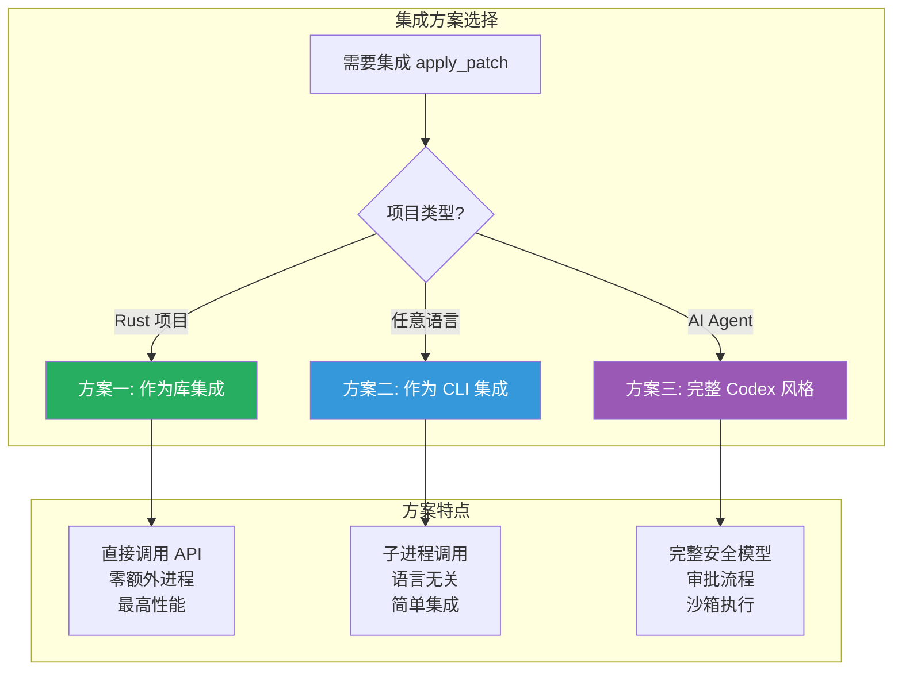
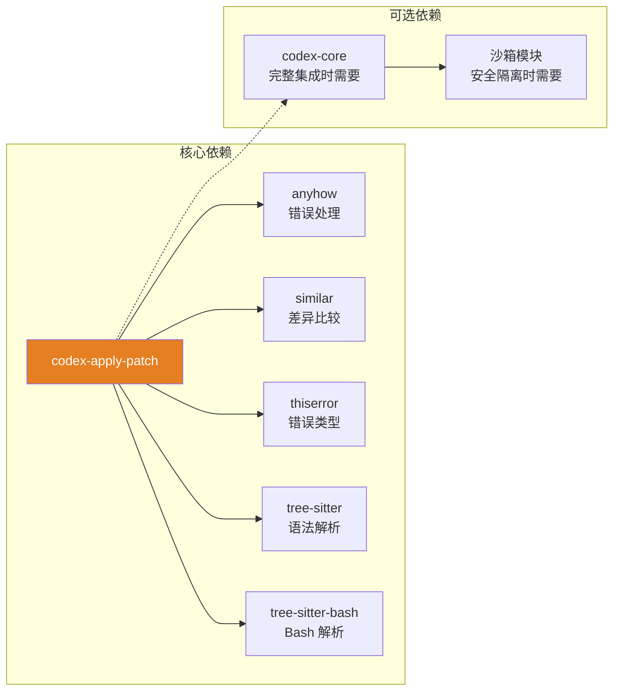
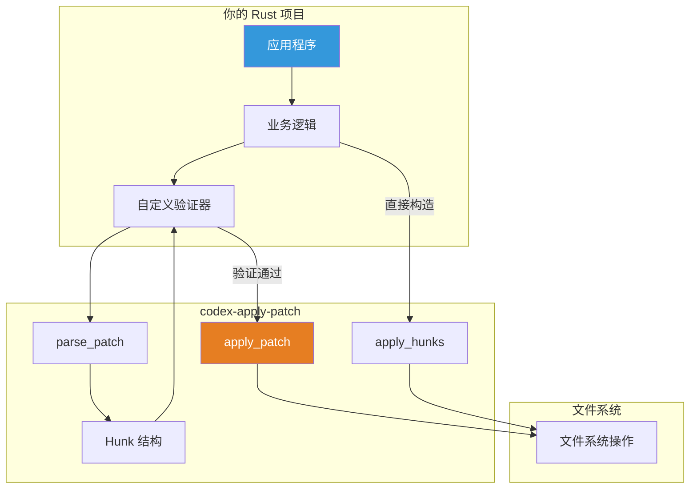
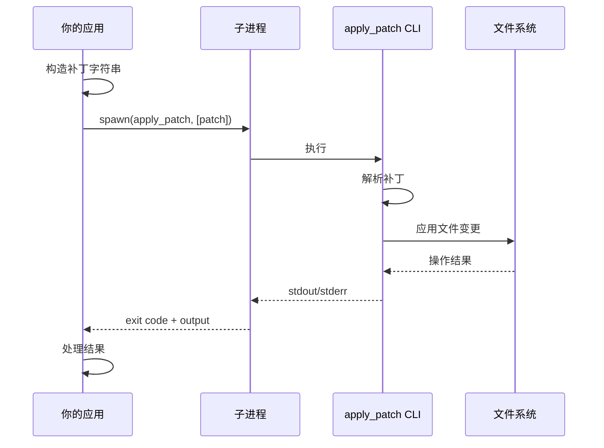
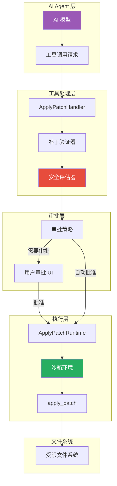
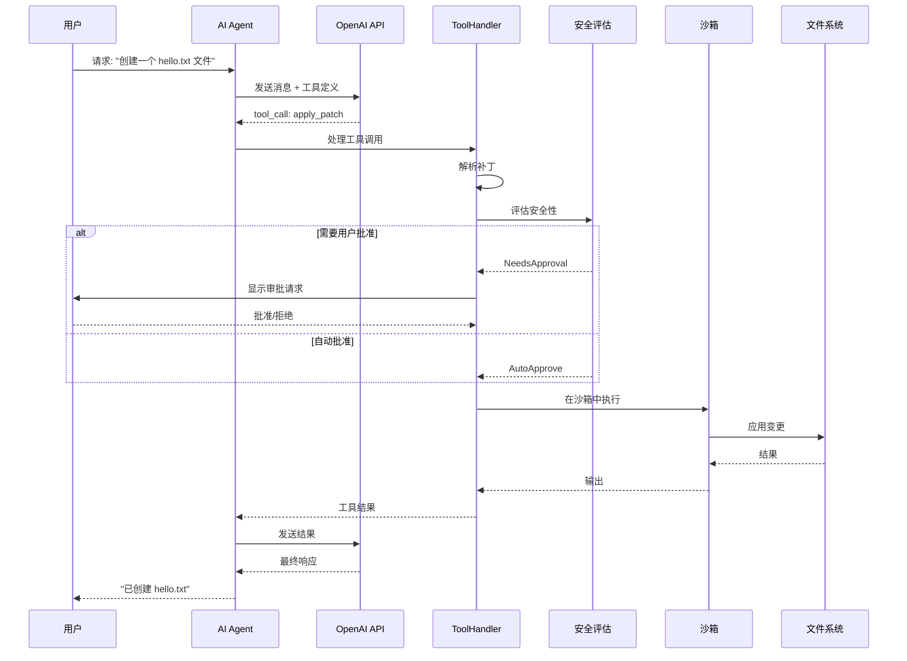

# Codex Apply Patch 集成指南

> 本文档提供将 apply_patch 工具集成到自定义项目的完整指南
>
> 编写日期: 2025-12-27
>
> 基于版本: rust-v0.78.0-alpha.8
>
> 作者: Claude (Opus 4.5)

---

## 目录

- [1. 集成方案概览](#1-集成方案概览)
- [2. 方案一：作为 Rust 库集成](#2-方案一作为-rust-库集成)
- [3. 方案二：作为 CLI 工具集成](#3-方案二作为-cli-工具集成)
- [4. 方案三：完整 Codex 风格集成](#4-方案三完整-codex-风格集成)
- [5. 高级集成：AI 工具系统](#5-高级集成ai-工具系统)
- [6. 测试策略](#6-测试策略)
- [7. 常见问题与解决方案](#7-常见问题与解决方案)

---

## 1. 集成方案概览

### 1.1 三种集成方式

根据项目需求，你可以选择以下三种集成方式：



### 1.2 方案对比

| 特性 | 库集成 | CLI 集成 | Codex 风格 |
|-----|--------|---------|-----------|
| **实现复杂度** | 低 | 低 | 高 |
| **性能** | 最高 | 中等 | 中等 |
| **语言支持** | 仅 Rust | 任意 | 任意 |
| **安全控制** | 需自行实现 | 需自行实现 | 内置 |
| **用户审批** | 无 | 无 | 内置 |
| **沙箱隔离** | 无 | 无 | 内置 |
| **适用场景** | 内部工具 | 简单集成 | AI Agent |

### 1.3 依赖关系



---

## 2. 方案一：作为 Rust 库集成

### 2.1 添加依赖

**步骤 1**: 在你的 `Cargo.toml` 中添加 apply_patch 作为依赖：

```toml
[dependencies]
# 方式 A: 从本地路径引用 (开发时推荐)
codex-apply-patch = { path = "../vendors/codex/codex-rs/apply-patch" }

# 方式 B: 从 Git 仓库引用
# codex-apply-patch = { git = "https://github.com/openai/codex.git", package = "codex-apply-patch" }

# 方式 C: 如果 crate 发布到 crates.io
# codex-apply-patch = "0.78"

# 额外依赖 (用于错误处理)
anyhow = "1.0"
```

### 2.2 基础用法

**最简集成示例**:

```rust
use codex_apply_patch::{apply_patch, parse_patch};
use std::io::{self, Write};

fn main() -> anyhow::Result<()> {
    // 1. 定义补丁内容
    let patch = r#"*** Begin Patch
*** Add File: hello.txt
+Hello, World!
+This is a new file.
*** End Patch"#;

    // 2. 创建输出缓冲区
    let mut stdout = Vec::new();
    let mut stderr = Vec::new();

    // 3. 应用补丁
    match apply_patch(patch, &mut stdout, &mut stderr) {
        Ok(()) => {
            println!("补丁应用成功!");
            println!("输出: {}", String::from_utf8_lossy(&stdout));
        }
        Err(e) => {
            eprintln!("补丁应用失败: {}", e);
            eprintln!("错误详情: {}", String::from_utf8_lossy(&stderr));
        }
    }

    Ok(())
}
```

### 2.3 高级用法

#### 2.3.1 解析并验证补丁

```rust
use codex_apply_patch::{parse_patch, Hunk};

fn validate_and_apply(patch_text: &str) -> anyhow::Result<()> {
    // 1. 先解析补丁，获取操作列表
    let args = parse_patch(patch_text)?;

    // 2. 遍历检查每个操作
    for hunk in &args.hunks {
        match hunk {
            Hunk::AddFile { path, contents } => {
                println!("将创建文件: {:?}", path);
                println!("  内容长度: {} 字节", contents.len());

                // 可以在这里添加自定义验证逻辑
                if path.to_string_lossy().contains("..") {
                    anyhow::bail!("拒绝: 路径包含 '..' (可能的路径遍历攻击)");
                }
            }
            Hunk::DeleteFile { path } => {
                println!("将删除文件: {:?}", path);

                // 可以在这里添加保护逻辑
                if path.to_string_lossy().ends_with(".lock") {
                    anyhow::bail!("拒绝: 不允许删除锁文件");
                }
            }
            Hunk::UpdateFile { path, move_path, chunks } => {
                println!("将更新文件: {:?}", path);
                if let Some(new_path) = move_path {
                    println!("  并移动到: {:?}", new_path);
                }
                println!("  包含 {} 个修改块", chunks.len());
            }
        }
    }

    // 3. 验证通过后应用补丁
    let mut stdout = Vec::new();
    let mut stderr = Vec::new();
    codex_apply_patch::apply_patch(patch_text, &mut stdout, &mut stderr)?;

    Ok(())
}
```

#### 2.3.2 直接操作 Hunk

```rust
use codex_apply_patch::{apply_hunks, Hunk};
use std::path::PathBuf;

fn create_files_programmatically() -> anyhow::Result<()> {
    // 构造 Hunk 列表 (无需解析补丁字符串)
    let hunks = vec![
        Hunk::AddFile {
            path: PathBuf::from("src/config.rs"),
            contents: String::from("pub const VERSION: &str = \"1.0.0\";\n"),
        },
        Hunk::AddFile {
            path: PathBuf::from("src/lib.rs"),
            contents: String::from("mod config;\npub use config::VERSION;\n"),
        },
    ];

    let mut stdout = Vec::new();
    let mut stderr = Vec::new();

    apply_hunks(&hunks, &mut stdout, &mut stderr)?;

    println!("创建了 {} 个文件", hunks.len());
    Ok(())
}
```

### 2.4 集成架构图



---

## 3. 方案二：作为 CLI 工具集成

### 3.1 构建 CLI 二进制

```bash
# 进入 apply-patch 目录
cd vendors/codex/codex-rs/apply-patch

# 构建 release 版本
cargo build --release

# 二进制位于
# target/release/apply_patch (Linux/macOS)
# target/release/apply_patch.exe (Windows)
```

### 3.2 CLI 使用方式

**命令行参数**:

```bash
# 方式 1: 直接传递补丁内容
./apply_patch '*** Begin Patch
*** Add File: hello.txt
+Hello, World!
*** End Patch'

# 方式 2: 从标准输入读取
cat patch.txt | ./apply_patch

# 方式 3: 使用 heredoc
./apply_patch <<'EOF'
*** Begin Patch
*** Add File: hello.txt
+Hello, World!
*** End Patch
EOF
```

### 3.3 Python 集成示例

```python
import subprocess
import json
from pathlib import Path
from typing import Optional, Tuple

class ApplyPatchClient:
    def __init__(self, binary_path: str = "./apply_patch"):
        self.binary_path = binary_path

    def apply(self, patch: str, cwd: Optional[str] = None) -> Tuple[bool, str, str]:
        """
        应用补丁

        Args:
            patch: 补丁内容
            cwd: 工作目录 (可选)

        Returns:
            (success, stdout, stderr)
        """
        try:
            result = subprocess.run(
                [self.binary_path, patch],
                capture_output=True,
                text=True,
                cwd=cwd,
                timeout=30  # 30 秒超时
            )

            return (
                result.returncode == 0,
                result.stdout,
                result.stderr
            )
        except subprocess.TimeoutExpired:
            return (False, "", "操作超时")
        except Exception as e:
            return (False, "", str(e))

    def create_file(self, path: str, content: str, cwd: Optional[str] = None) -> bool:
        """便捷方法: 创建文件"""
        # 确保每行以 + 开头
        lines = [f"+{line}" for line in content.split('\n')]
        patch = f"""*** Begin Patch
*** Add File: {path}
{chr(10).join(lines)}
*** End Patch"""

        success, _, _ = self.apply(patch, cwd)
        return success

    def update_file(self, path: str, old_content: str, new_content: str,
                    cwd: Optional[str] = None) -> bool:
        """便捷方法: 更新文件"""
        old_lines = [f"-{line}" for line in old_content.split('\n')]
        new_lines = [f"+{line}" for line in new_content.split('\n')]

        patch = f"""*** Begin Patch
*** Update File: {path}
{chr(10).join(old_lines)}
{chr(10).join(new_lines)}
*** End Patch"""

        success, _, _ = self.apply(patch, cwd)
        return success


# 使用示例
if __name__ == "__main__":
    client = ApplyPatchClient("./target/release/apply_patch")

    # 创建文件
    success = client.create_file(
        "README.md",
        "# My Project\n\nThis is a test project."
    )
    print(f"创建文件: {'成功' if success else '失败'}")

    # 应用完整补丁
    patch = """*** Begin Patch
*** Add File: src/main.py
+print("Hello, World!")
*** End Patch"""

    success, stdout, stderr = client.apply(patch)
    if success:
        print("补丁应用成功")
    else:
        print(f"补丁应用失败: {stderr}")
```

### 3.4 Node.js 集成示例

```javascript
const { spawn, execSync } = require('child_process');
const path = require('path');

class ApplyPatchClient {
    constructor(binaryPath = './apply_patch') {
        this.binaryPath = binaryPath;
    }

    /**
     * 应用补丁
     * @param {string} patch - 补丁内容
     * @param {string} [cwd] - 工作目录
     * @returns {Promise<{success: boolean, stdout: string, stderr: string}>}
     */
    async apply(patch, cwd = process.cwd()) {
        return new Promise((resolve) => {
            const child = spawn(this.binaryPath, [patch], {
                cwd,
                timeout: 30000
            });

            let stdout = '';
            let stderr = '';

            child.stdout.on('data', (data) => {
                stdout += data.toString();
            });

            child.stderr.on('data', (data) => {
                stderr += data.toString();
            });

            child.on('close', (code) => {
                resolve({
                    success: code === 0,
                    stdout,
                    stderr
                });
            });

            child.on('error', (err) => {
                resolve({
                    success: false,
                    stdout: '',
                    stderr: err.message
                });
            });
        });
    }

    /**
     * 创建文件
     * @param {string} filePath - 文件路径
     * @param {string} content - 文件内容
     * @param {string} [cwd] - 工作目录
     */
    async createFile(filePath, content, cwd) {
        const lines = content.split('\n').map(line => `+${line}`).join('\n');
        const patch = `*** Begin Patch
*** Add File: ${filePath}
${lines}
*** End Patch`;

        return this.apply(patch, cwd);
    }

    /**
     * 删除文件
     * @param {string} filePath - 文件路径
     * @param {string} [cwd] - 工作目录
     */
    async deleteFile(filePath, cwd) {
        const patch = `*** Begin Patch
*** Delete File: ${filePath}
*** End Patch`;

        return this.apply(patch, cwd);
    }
}

// 使用示例
async function main() {
    const client = new ApplyPatchClient('./target/release/apply_patch');

    // 创建文件
    const result = await client.createFile(
        'hello.txt',
        'Hello, World!\nThis is a test.'
    );

    console.log(result.success ? '成功' : '失败');
    if (!result.success) {
        console.error(result.stderr);
    }
}

main().catch(console.error);
```

### 3.5 CLI 集成架构



---

## 4. 方案三：完整 Codex 风格集成

如果你正在构建类似 Codex 的 AI Agent 系统，需要完整的安全模型和用户审批流程。

### 4.1 架构概览



### 4.2 实现工具处理器

```rust
use codex_apply_patch::{parse_patch, apply_patch, Hunk, APPLY_PATCH_TOOL_INSTRUCTIONS};
use std::path::Path;

/// 审批策略
pub enum ApprovalPolicy {
    /// 所有操作都需要用户确认
    AlwaysAsk,
    /// 只读操作自动批准，写操作需要确认
    AskForWrites,
    /// 所有操作自动批准 (仅在沙箱中使用)
    AutoApprove,
}

/// 安全评估结果
pub enum SafetyResult {
    /// 自动批准
    AutoApprove,
    /// 需要用户确认
    NeedsApproval { reason: String, details: Vec<String> },
    /// 直接拒绝
    Reject { reason: String },
}

/// 工具处理器
pub struct ApplyPatchHandler {
    policy: ApprovalPolicy,
    allowed_paths: Vec<String>,
    denied_patterns: Vec<String>,
}

impl ApplyPatchHandler {
    pub fn new(policy: ApprovalPolicy) -> Self {
        Self {
            policy,
            allowed_paths: vec![".".to_string()],  // 默认只允许当前目录
            denied_patterns: vec![
                "..".to_string(),           // 防止路径遍历
                ".git/".to_string(),        // 保护 Git 目录
                ".env".to_string(),         // 保护环境变量
                "node_modules/".to_string(), // 保护依赖目录
            ],
        }
    }

    /// 获取工具说明 (用于 AI 模型的系统提示)
    pub fn get_tool_instructions(&self) -> &'static str {
        APPLY_PATCH_TOOL_INSTRUCTIONS
    }

    /// 评估补丁安全性
    pub fn assess_safety(&self, patch: &str) -> Result<SafetyResult, String> {
        let args = parse_patch(patch).map_err(|e| format!("解析失败: {}", e))?;

        let mut issues = Vec::new();
        let mut affected_files = Vec::new();

        for hunk in &args.hunks {
            let path = match hunk {
                Hunk::AddFile { path, .. } => path,
                Hunk::DeleteFile { path } => path,
                Hunk::UpdateFile { path, .. } => path,
            };

            let path_str = path.to_string_lossy();
            affected_files.push(path_str.to_string());

            // 检查拒绝模式
            for pattern in &self.denied_patterns {
                if path_str.contains(pattern) {
                    return Ok(SafetyResult::Reject {
                        reason: format!("路径 '{}' 匹配拒绝模式 '{}'", path_str, pattern),
                    });
                }
            }

            // 检查是否在允许路径内
            let is_allowed = self.allowed_paths.iter().any(|allowed| {
                path_str.starts_with(allowed) || allowed == "."
            });

            if !is_allowed {
                issues.push(format!("路径 '{}' 不在允许列表中", path_str));
            }

            // 检查危险操作
            if let Hunk::DeleteFile { .. } = hunk {
                issues.push(format!("将删除文件: {}", path_str));
            }
        }

        // 根据策略决定
        match self.policy {
            ApprovalPolicy::AutoApprove => Ok(SafetyResult::AutoApprove),
            ApprovalPolicy::AlwaysAsk => Ok(SafetyResult::NeedsApproval {
                reason: "策略要求用户确认所有操作".to_string(),
                details: affected_files,
            }),
            ApprovalPolicy::AskForWrites => {
                if issues.is_empty() {
                    Ok(SafetyResult::AutoApprove)
                } else {
                    Ok(SafetyResult::NeedsApproval {
                        reason: "检测到需要审核的操作".to_string(),
                        details: issues,
                    })
                }
            }
        }
    }

    /// 执行补丁 (在获得批准后调用)
    pub fn execute(&self, patch: &str) -> Result<String, String> {
        let mut stdout = Vec::new();
        let mut stderr = Vec::new();

        apply_patch(patch, &mut stdout, &mut stderr)
            .map_err(|e| format!("{}\n{}", e, String::from_utf8_lossy(&stderr)))?;

        Ok(String::from_utf8_lossy(&stdout).to_string())
    }
}

// 使用示例
fn handle_ai_tool_call(handler: &ApplyPatchHandler, patch: &str) -> Result<String, String> {
    // 1. 安全评估
    match handler.assess_safety(patch)? {
        SafetyResult::AutoApprove => {
            // 直接执行
            handler.execute(patch)
        }
        SafetyResult::NeedsApproval { reason, details } => {
            // 这里应该调用 UI 获取用户确认
            println!("需要用户确认: {}", reason);
            for detail in &details {
                println!("  - {}", detail);
            }

            // 假设用户批准
            let user_approved = true;  // 实际应该从 UI 获取

            if user_approved {
                handler.execute(patch)
            } else {
                Err("用户拒绝了操作".to_string())
            }
        }
        SafetyResult::Reject { reason } => {
            Err(format!("操作被拒绝: {}", reason))
        }
    }
}
```

### 4.3 实现沙箱执行

```rust
use std::process::{Command, Stdio};
use std::path::Path;

/// 沙箱配置
pub struct SandboxConfig {
    /// 允许读取的路径
    pub read_paths: Vec<String>,
    /// 允许写入的路径
    pub write_paths: Vec<String>,
    /// 是否允许网络访问
    pub allow_network: bool,
}

/// 在沙箱中执行 apply_patch
#[cfg(target_os = "macos")]
pub fn execute_in_sandbox(
    apply_patch_binary: &Path,
    patch: &str,
    cwd: &Path,
    config: &SandboxConfig,
) -> Result<String, String> {
    // 生成 Seatbelt 策略
    let policy = generate_seatbelt_policy(config);

    // 使用 sandbox-exec 执行
    let output = Command::new("/usr/bin/sandbox-exec")
        .args(["-p", &policy])
        .arg(apply_patch_binary)
        .arg(patch)
        .current_dir(cwd)
        .stdout(Stdio::piped())
        .stderr(Stdio::piped())
        .output()
        .map_err(|e| format!("执行失败: {}", e))?;

    if output.status.success() {
        Ok(String::from_utf8_lossy(&output.stdout).to_string())
    } else {
        Err(String::from_utf8_lossy(&output.stderr).to_string())
    }
}

#[cfg(target_os = "macos")]
fn generate_seatbelt_policy(config: &SandboxConfig) -> String {
    let mut policy = String::from("(version 1)\n(deny default)\n");

    // 允许基本操作
    policy.push_str("(allow process-exec)\n");
    policy.push_str("(allow mach-lookup)\n");

    // 允许读取路径
    for path in &config.read_paths {
        policy.push_str(&format!(
            "(allow file-read* (subpath \"{}\"))\n",
            path
        ));
    }

    // 允许写入路径
    for path in &config.write_paths {
        policy.push_str(&format!(
            "(allow file-write* (subpath \"{}\"))\n",
            path
        ));
    }

    // 网络访问
    if config.allow_network {
        policy.push_str("(allow network*)\n");
    }

    policy
}

#[cfg(target_os = "linux")]
pub fn execute_in_sandbox(
    apply_patch_binary: &Path,
    patch: &str,
    cwd: &Path,
    config: &SandboxConfig,
) -> Result<String, String> {
    // Linux 使用 Landlock 或 Docker
    // 这里简化为直接执行，实际应使用 linux-sandbox crate
    let output = Command::new(apply_patch_binary)
        .arg(patch)
        .current_dir(cwd)
        .stdout(Stdio::piped())
        .stderr(Stdio::piped())
        .output()
        .map_err(|e| format!("执行失败: {}", e))?;

    if output.status.success() {
        Ok(String::from_utf8_lossy(&output.stdout).to_string())
    } else {
        Err(String::from_utf8_lossy(&output.stderr).to_string())
    }
}
```

### 4.4 工具注册

为 AI 模型定义工具规格：

```rust
use serde::{Deserialize, Serialize};
use codex_apply_patch::APPLY_PATCH_TOOL_INSTRUCTIONS;

#[derive(Serialize)]
pub struct ToolDefinition {
    pub name: String,
    pub description: String,
    pub parameters: serde_json::Value,
}

/// 创建 apply_patch 工具定义 (用于 OpenAI API)
pub fn create_apply_patch_tool() -> ToolDefinition {
    ToolDefinition {
        name: "apply_patch".to_string(),
        description: APPLY_PATCH_TOOL_INSTRUCTIONS.to_string(),
        parameters: serde_json::json!({
            "type": "object",
            "properties": {
                "patch": {
                    "type": "string",
                    "description": "The patch content in apply_patch format"
                }
            },
            "required": ["patch"]
        }),
    }
}

// 发送给 AI 模型的工具列表
pub fn get_tools() -> Vec<ToolDefinition> {
    vec![
        create_apply_patch_tool(),
        // 其他工具...
    ]
}
```

---

## 5. 高级集成：AI 工具系统

### 5.1 完整 AI Agent 集成流程



### 5.2 将 apply_patch_tool_instructions.md 集成到系统提示

```rust
use codex_apply_patch::APPLY_PATCH_TOOL_INSTRUCTIONS;

fn build_system_prompt() -> String {
    format!(
        r#"You are a helpful AI coding assistant.

You have access to the following tools:

## apply_patch Tool

{}

## Usage Guidelines

1. Always use relative paths from the current working directory
2. When editing files, include enough context to uniquely identify the location
3. Use @@ markers for function/class context when editing large files
4. For new files, prefix each line with +
5. For deletions, ensure the file exists before attempting to delete

## Example

To create a new Python file:

```
*** Begin Patch
*** Add File: hello.py
+def greet(name: str) -> str:
+    return f"Hello, {{name}}!"
+
+if __name__ == "__main__":
+    print(greet("World"))
*** End Patch
```
"#,
        APPLY_PATCH_TOOL_INSTRUCTIONS
    )
}
```

### 5.3 处理 AI 模型的工具调用

```rust
use serde::{Deserialize, Serialize};

#[derive(Deserialize)]
struct ToolCall {
    id: String,
    name: String,
    arguments: String,
}

#[derive(Deserialize)]
struct ApplyPatchArgs {
    patch: String,
}

#[derive(Serialize)]
struct ToolResult {
    tool_call_id: String,
    output: String,
}

async fn handle_tool_calls(
    tool_calls: Vec<ToolCall>,
    handler: &ApplyPatchHandler,
) -> Vec<ToolResult> {
    let mut results = Vec::new();

    for call in tool_calls {
        let output = match call.name.as_str() {
            "apply_patch" => {
                let args: ApplyPatchArgs = serde_json::from_str(&call.arguments)
                    .unwrap_or_else(|e| ApplyPatchArgs {
                        patch: format!("解析参数失败: {}", e)
                    });

                match handler.assess_safety(&args.patch) {
                    Ok(SafetyResult::AutoApprove) => {
                        handler.execute(&args.patch)
                            .unwrap_or_else(|e| format!("执行失败: {}", e))
                    }
                    Ok(SafetyResult::NeedsApproval { reason, .. }) => {
                        // 实际应用中应该暂停并请求用户批准
                        format!("需要用户批准: {}", reason)
                    }
                    Ok(SafetyResult::Reject { reason }) => {
                        format!("操作被拒绝: {}", reason)
                    }
                    Err(e) => format!("安全评估失败: {}", e),
                }
            }
            _ => format!("未知工具: {}", call.name),
        };

        results.push(ToolResult {
            tool_call_id: call.id,
            output,
        });
    }

    results
}
```

---

## 6. 测试策略

### 6.1 单元测试

```rust
#[cfg(test)]
mod tests {
    use super::*;
    use tempfile::tempdir;
    use std::fs;

    #[test]
    fn test_create_file() {
        let dir = tempdir().unwrap();
        std::env::set_current_dir(&dir).unwrap();

        let patch = r#"*** Begin Patch
*** Add File: test.txt
+Hello, World!
*** End Patch"#;

        let mut stdout = Vec::new();
        let mut stderr = Vec::new();

        apply_patch(patch, &mut stdout, &mut stderr).unwrap();

        let content = fs::read_to_string("test.txt").unwrap();
        assert_eq!(content, "Hello, World!\n");
    }

    #[test]
    fn test_update_file() {
        let dir = tempdir().unwrap();
        std::env::set_current_dir(&dir).unwrap();

        // 先创建文件
        fs::write("test.txt", "Hello\nWorld\n").unwrap();

        let patch = r#"*** Begin Patch
*** Update File: test.txt
-Hello
+Hi
*** End Patch"#;

        let mut stdout = Vec::new();
        let mut stderr = Vec::new();

        apply_patch(patch, &mut stdout, &mut stderr).unwrap();

        let content = fs::read_to_string("test.txt").unwrap();
        assert_eq!(content, "Hi\nWorld\n");
    }

    #[test]
    fn test_safety_reject_path_traversal() {
        let handler = ApplyPatchHandler::new(ApprovalPolicy::AutoApprove);

        let patch = r#"*** Begin Patch
*** Add File: ../../../etc/passwd
+malicious content
*** End Patch"#;

        let result = handler.assess_safety(patch);
        assert!(matches!(result, Ok(SafetyResult::Reject { .. })));
    }
}
```

### 6.2 集成测试

```rust
#[cfg(test)]
mod integration_tests {
    use super::*;
    use tempfile::tempdir;
    use std::fs;

    #[test]
    fn test_full_workflow() {
        let dir = tempdir().unwrap();
        let dir_path = dir.path();

        // 设置工作目录
        std::env::set_current_dir(dir_path).unwrap();

        // 创建处理器
        let handler = ApplyPatchHandler::new(ApprovalPolicy::AutoApprove);

        // 模拟 AI 工具调用
        let patch = r#"*** Begin Patch
*** Add File: src/main.rs
+fn main() {
+    println!("Hello!");
+}
*** End Patch"#;

        // 安全评估
        let safety = handler.assess_safety(patch).unwrap();
        assert!(matches!(safety, SafetyResult::AutoApprove));

        // 创建目录
        fs::create_dir_all("src").unwrap();

        // 执行
        let result = handler.execute(patch);
        assert!(result.is_ok());

        // 验证
        let content = fs::read_to_string("src/main.rs").unwrap();
        assert!(content.contains("println!(\"Hello!\")"));
    }
}
```

### 6.3 场景测试

参考 Codex 的测试用例结构：

```
tests/
├── fixtures/
│   └── scenarios/
│       ├── 001_add_file/
│       │   ├── input/           # 初始状态
│       │   ├── patch.txt        # 补丁内容
│       │   └── expected/        # 期望结果
│       ├── 002_update_file/
│       └── ...
└── integration/
    └── scenarios_test.rs
```

```rust
// tests/integration/scenarios_test.rs
use std::fs;
use std::path::Path;
use tempfile::tempdir;

fn run_scenario(scenario_dir: &Path) -> Result<(), String> {
    let temp = tempdir().map_err(|e| e.to_string())?;

    // 复制 input 到临时目录
    let input_dir = scenario_dir.join("input");
    if input_dir.exists() {
        copy_dir_all(&input_dir, temp.path())
            .map_err(|e| e.to_string())?;
    }

    // 读取并应用补丁
    let patch = fs::read_to_string(scenario_dir.join("patch.txt"))
        .map_err(|e| e.to_string())?;

    std::env::set_current_dir(temp.path()).map_err(|e| e.to_string())?;

    let mut stdout = Vec::new();
    let mut stderr = Vec::new();
    codex_apply_patch::apply_patch(&patch, &mut stdout, &mut stderr)
        .map_err(|e| format!("{}: {}", e, String::from_utf8_lossy(&stderr)))?;

    // 比较结果
    let expected_dir = scenario_dir.join("expected");
    compare_dirs(temp.path(), &expected_dir)
}

fn copy_dir_all(src: &Path, dst: &Path) -> std::io::Result<()> {
    fs::create_dir_all(dst)?;
    for entry in fs::read_dir(src)? {
        let entry = entry?;
        let ty = entry.file_type()?;
        if ty.is_dir() {
            copy_dir_all(&entry.path(), &dst.join(entry.file_name()))?;
        } else {
            fs::copy(entry.path(), dst.join(entry.file_name()))?;
        }
    }
    Ok(())
}

fn compare_dirs(actual: &Path, expected: &Path) -> Result<(), String> {
    // 实现目录比较逻辑
    Ok(())
}

#[test]
fn test_all_scenarios() {
    let scenarios_dir = Path::new("tests/fixtures/scenarios");

    for entry in fs::read_dir(scenarios_dir).unwrap() {
        let entry = entry.unwrap();
        if entry.file_type().unwrap().is_dir() {
            let result = run_scenario(&entry.path());
            assert!(result.is_ok(), "场景 {:?} 失败: {:?}",
                entry.file_name(), result.err());
        }
    }
}
```

---

## 7. 常见问题与解决方案

### 7.1 补丁格式问题

| 问题 | 原因 | 解决方案 |
|-----|------|---------|
| "The first line must be '*** Begin Patch'" | 补丁格式不正确 | 确保补丁以 `*** Begin Patch` 开始 |
| "The last line must be '*** End Patch'" | 缺少结束标记 | 确保补丁以 `*** End Patch` 结束 |
| "Update file hunk is empty" | 更新块没有内容 | 添加至少一个 `-` 或 `+` 行 |
| "Failed to find expected lines" | 上下文不匹配 | 检查 `-` 行是否与文件内容一致 |

### 7.2 路径问题

| 问题 | 原因 | 解决方案 |
|-----|------|---------|
| "No such file or directory" | 文件不存在 | 对于 Update，确保文件存在 |
| 路径遍历被拒绝 | 路径包含 `..` | 使用相对路径，不要使用 `..` |
| 父目录不存在 | 中间目录缺失 | apply_patch 会自动创建目录 |

### 7.3 编码问题

```rust
// 处理非 UTF-8 内容
fn handle_binary_content(patch: &str) -> Result<(), String> {
    // apply_patch 默认处理 UTF-8
    // 对于二进制文件，建议使用 base64 编码
    let args = parse_patch(patch)?;

    for hunk in &args.hunks {
        if let Hunk::AddFile { contents, .. } = hunk {
            // 检查是否包含无效 UTF-8
            if contents.contains('\0') {
                return Err("检测到二进制内容，请使用 base64 编码".to_string());
            }
        }
    }

    Ok(())
}
```

### 7.4 并发执行

```rust
use std::sync::Mutex;
use std::path::PathBuf;

/// 带锁的执行器，防止并发写入冲突
pub struct SafeExecutor {
    locks: Mutex<std::collections::HashSet<PathBuf>>,
}

impl SafeExecutor {
    pub fn new() -> Self {
        Self {
            locks: Mutex::new(std::collections::HashSet::new()),
        }
    }

    pub fn execute(&self, patch: &str) -> Result<String, String> {
        let args = parse_patch(patch).map_err(|e| e.to_string())?;

        // 获取所有受影响的路径
        let paths: Vec<PathBuf> = args.hunks.iter().map(|h| match h {
            Hunk::AddFile { path, .. } => path.clone(),
            Hunk::DeleteFile { path } => path.clone(),
            Hunk::UpdateFile { path, .. } => path.clone(),
        }).collect();

        // 尝试获取锁
        {
            let mut locks = self.locks.lock().unwrap();
            for path in &paths {
                if locks.contains(path) {
                    return Err(format!("文件 {:?} 正在被其他操作修改", path));
                }
            }
            // 添加锁
            for path in &paths {
                locks.insert(path.clone());
            }
        }

        // 执行
        let result = {
            let mut stdout = Vec::new();
            let mut stderr = Vec::new();
            apply_patch(patch, &mut stdout, &mut stderr)
                .map(|_| String::from_utf8_lossy(&stdout).to_string())
                .map_err(|e| e.to_string())
        };

        // 释放锁
        {
            let mut locks = self.locks.lock().unwrap();
            for path in &paths {
                locks.remove(path);
            }
        }

        result
    }
}
```

---

## 附录

### A. 完整依赖列表

```toml
[dependencies]
# 核心
codex-apply-patch = { path = "path/to/codex/codex-rs/apply-patch" }

# 错误处理
anyhow = "1.0"
thiserror = "1.0"

# 序列化 (如果需要工具定义)
serde = { version = "1.0", features = ["derive"] }
serde_json = "1.0"

# 异步 (如果需要)
tokio = { version = "1", features = ["full"] }

# 测试
[dev-dependencies]
tempfile = "3"
```

### B. 参考资源

- **apply_patch 源码**: `vendors/codex/codex-rs/apply-patch/`
- **Codex 集成示例**: `vendors/codex/codex-rs/core/src/tools/handlers/apply_patch.rs`
- **补丁格式规范**: `vendors/codex/codex-rs/apply-patch/apply_patch_tool_instructions.md`
- **测试用例**: `vendors/codex/codex-rs/apply-patch/tests/fixtures/scenarios/`

### C. 快速开始清单

- [ ] 选择集成方案 (库/CLI/完整)
- [ ] 添加依赖到 Cargo.toml
- [ ] 实现基本的补丁应用功能
- [ ] 添加安全验证 (路径检查、权限控制)
- [ ] 实现用户审批流程 (如果需要)
- [ ] 添加沙箱隔离 (如果需要)
- [ ] 编写测试用例
- [ ] 集成到 AI 工具系统 (如果适用)

---

**文档版本**: 1.0
**最后更新**: 2025-12-27
**作者**: Claude (Opus 4.5)
