# Codex 架构分析文档

> 本文档由 Claude 基于 vendors/codex 代码库深度分析撰写
>
> 分析日期: 2025-12-27
>
> 代码版本: OpenAI Codex CLI (Rust + TypeScript 混合实现)

---

## 目录

- [1. 项目概述](#1-项目概述)
- [2. 整体架构](#2-整体架构)
- [3. 核心模块详解](#3-核心模块详解)
- [4. 数据流与交互](#4-数据流与交互)
- [5. 安全沙箱机制](#5-安全沙箱机制)
- [6. MCP 协议集成](#6-mcp-协议集成)
- [7. 工具系统](#7-工具系统)
- [8. 关键设计模式](#8-关键设计模式)
- [9. 技术栈](#9-技术栈)
- [10. 架构演进与优化](#10-架构演进与优化)

---

## 1. 项目概述

### 1.1 项目定位

**Codex CLI** 是 OpenAI 推出的轻量级终端 AI 编程助手，定位于为开发者提供终端内的智能代码生成、代码理解、代码审查等能力。项目的核心特征：

- **零依赖安装**: 通过 npm 全局安装即可使用
- **多模态支持**: 支持文本、图片输入（如截图、架构图）
- **安全执行**: 基于沙箱机制的命令执行环境
- **全自动模式**: 支持全自动批准模式，同时保证安全性
- **开源透明**: 完全开源，可审查和贡献

### 1.2 实现架构

Codex 采用 **双实现架构**：

1. **TypeScript 实现** (`codex-cli/`): 传统实现，已标记为 legacy
2. **Rust 实现** (`codex-rs/`): 当前主力实现，性能更优，功能更强

两种实现都通过 npm 分发，但 Rust 版本已成为默认体验。

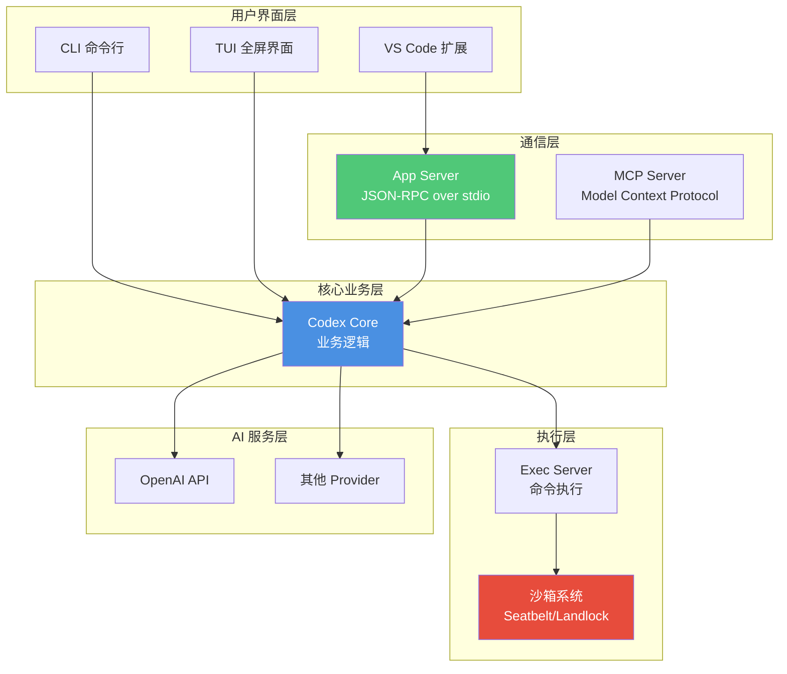

### 1.3 项目目录结构

```
vendors/codex/
├── codex-cli/              # TypeScript 实现（Legacy）
│   ├── bin/                # CLI 可执行文件
│   └── scripts/            # 构建脚本
│
└── codex-rs/               # Rust 实现（主力）
    ├── core/               # ⭐ 核心业务逻辑
    ├── cli/                # CLI 多工具入口
    ├── tui/                # TUI 全屏终端界面
    ├── tui2/               # TUI v2（新版本）
    ├── exec/               # 非交互式执行
    ├── app-server/         # ⭐ 应用服务器（JSON-RPC）
    ├── exec-server/        # ⭐ 命令执行服务器
    ├── mcp-server/         # MCP 服务器实现
    ├── protocol/           # ⭐ 协议定义
    ├── mcp-types/          # MCP 类型定义
    ├── linux-sandbox/      # Linux 沙箱（Landlock）
    ├── file-search/        # 文件搜索工具
    ├── apply-patch/        # 补丁应用工具
    ├── codex-client/       # 客户端库
    ├── codex-api/          # API 封装
    ├── execpolicy/         # 执行策略
    ├── auth/               # 认证模块
    └── utils/              # 工具集
        ├── git/            # Git 操作
        ├── cache/          # 缓存
        ├── image/          # 图片处理
        └── pty/            # PTY 伪终端
```

---

## 2. 整体架构

### 2.1 分层架构

Codex 采用经典的**分层架构**设计，自上而下分为五层：

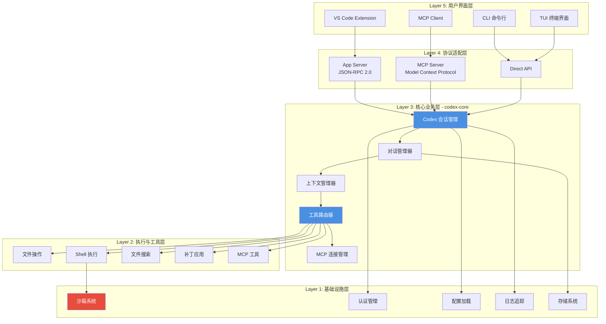

### 2.2 核心设计原则

#### 2.2.1 关注点分离

- **业务逻辑**: 集中在 `codex-core` crate 中
- **协议适配**: `app-server` 和 `mcp-server` 负责协议转换
- **UI 展示**: `tui`/`tui2` 专注于终端渲染
- **安全执行**: 沙箱逻辑独立于业务逻辑

#### 2.2.2 可扩展性

- **模块化 Crate**: Cargo workspace 管理 40+ 子模块
- **插件化工具系统**: 工具通过注册表动态注册
- **多 Provider 支持**: 抽象 AI Provider 接口

#### 2.2.3 安全性优先

- **默认沙箱**: 所有命令默认在沙箱中执行
- **分层批准**: 三级批准模式（Suggest/Auto Edit/Full Auto）
- **网络隔离**: Full Auto 模式下网络默认禁用

---

## 3. 核心模块详解

### 3.1 codex-core: 核心业务模块

`codex-core` 是整个系统的心脏，实现了所有核心业务逻辑。

#### 3.1.1 主要组件

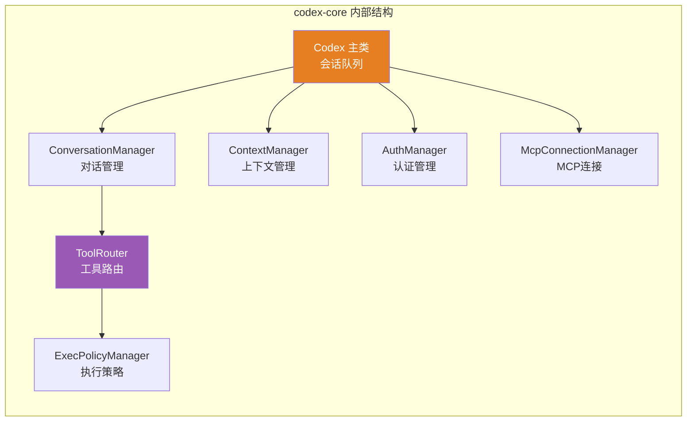

#### 3.1.2 Codex 主类

**核心职责**：

- 作为**队列对** (`Submission` 输入, `Event` 输出)
- 管理会话生命周期
- 协调各子系统

**关键代码** (`codex.rs:163-169`):

```rust
pub struct Codex {
    pub(crate) next_id: AtomicU64,
    pub(crate) tx_sub: Sender<Submission>,    // 提交队列
    pub(crate) rx_event: Receiver<Event>,      // 事件队列
}
```

**交互模式**：

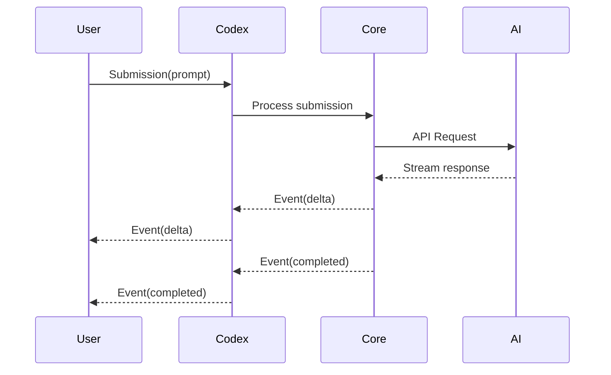

#### 3.1.3 ConversationManager: 对话管理

**核心职责**：

- 管理多轮对话历史
- 维护消息窗口（Token 限制）
- 自动压缩（Compaction）

**技术要点**：

1. **历史管理**: 使用 `RolloutRecorder` 持久化对话
2. **自动压缩**: 当上下文超限时自动触发压缩
3. **增量更新**: 流式返回对话增量

#### 3.1.4 ToolRouter: 工具路由系统

**核心职责**：

- 解析 AI 模型返回的工具调用
- 路由到对应的工具 Handler
- 管理工具执行生命周期

**工具注册机制** (`tools/registry.rs`):

```rust
pub struct ToolRegistry {
    handlers: HashMap<String, Box<dyn ToolHandler>>,
}

impl ToolRegistry {
    pub fn register(&mut self, name: &str, handler: Box<dyn ToolHandler>);
    pub fn handle(&self, name: &str, args: Value) -> Result<Response>;
}
```

**支持的工具类型**：

| 工具类型 | 文件位置 | 功能描述 |
|---------|---------|---------|
| `apply_patch` | `tools/handlers/apply_patch.rs` | 应用代码补丁 |
| `shell` | `tools/handlers/shell.rs` | 执行 Shell 命令 |
| `read_file` | `tools/handlers/read_file.rs` | 读取文件内容 |
| `list_dir` | `tools/handlers/list_dir.rs` | 列出目录内容 |
| `grep_files` | `tools/handlers/grep_files.rs` | 文件内容搜索 |
| `view_image` | `tools/handlers/view_image.rs` | 查看图片 |
| `mcp_resource` | `tools/handlers/mcp_resource.rs` | MCP 资源访问 |
| `unified_exec` | `tools/handlers/unified_exec.rs` | 统一执行接口 |

### 3.2 app-server: 应用服务器

#### 3.2.1 协议设计

App Server 实现了基于 **JSON-RPC 2.0** 的双向通信协议，通过 stdio 传输。

**协议格式**:

```json
// Request
{
  "method": "turn/start",
  "id": 30,
  "params": {
    "threadId": "thr_123",
    "input": [{ "type": "text", "text": "Run tests" }]
  }
}

// Response
{
  "id": 30,
  "result": {
    "turn": {
      "id": "turn_456",
      "status": "inProgress",
      "items": []
    }
  }
}

// Notification (no id)
{
  "method": "item/started",
  "params": {
    "item": {
      "type": "agentMessage",
      "id": "turn_456",
      "text": ""
    }
  }
}
```

#### 3.2.2 核心 API

| API | 功能 | 类型 |
|-----|------|------|
| `initialize` | 初始化握手 | Request |
| `thread/start` | 创建新会话 | Request |
| `thread/resume` | 恢复会话 | Request |
| `thread/list` | 列出会话 | Request |
| `turn/start` | 开始新轮对话 | Request |
| `turn/interrupt` | 中断对话 | Request |
| `review/start` | 启动代码审查 | Request |
| `item/started` | 工作项开始 | Notification |
| `item/completed` | 工作项完成 | Notification |
| `turn/completed` | 对话轮完成 | Notification |

#### 3.2.3 生命周期管理

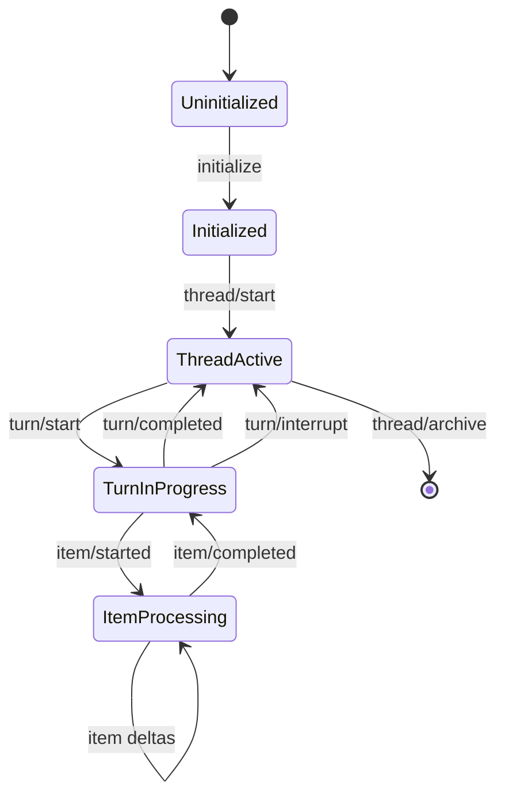

### 3.3 protocol: 协议定义

`codex-protocol` crate 定义了所有内部和外部协议类型。

#### 3.3.1 核心类型

**Thread 相关**:

```rust
pub struct Thread {
    pub id: String,
    pub preview: String,
    pub model_provider: String,
    pub created_at: u64,
}
```

**Turn 相关**:

```rust
pub struct Turn {
    pub id: String,
    pub status: TurnStatus,  // inProgress | completed | interrupted | failed
    pub items: Vec<TurnItem>,
    pub error: Option<ErrorInfo>,
}

pub enum TurnItem {
    UserMessage(UserMessage),
    AgentMessage(AgentMessage),
    Reasoning(Reasoning),
    CommandExecution(CommandExecution),
    FileChange(FileChange),
    McpToolCall(McpToolCall),
    // ... 更多类型
}
```

**事件系统**:

```rust
pub struct Event {
    pub id: String,
    pub msg: EventMsg,
}

pub enum EventMsg {
    SessionConfigured(SessionConfiguredEvent),
    TurnStarted(Turn),
    TurnCompleted(Turn),
    ItemStarted(ItemStartedEvent),
    ItemCompleted(ItemCompletedEvent),
    AgentMessageDelta(AgentMessageContentDeltaEvent),
    // ... 40+ 事件类型
}
```

### 3.4 exec-server: 命令执行服务器

#### 3.4.1 架构设计

`exec-server` 实现了一个 **MCP 服务器**，提供安全的命令执行能力。

**核心组件**：

1. **codex-exec-mcp-server**: MCP 服务器进程
2. **codex-execve-wrapper**: `execve(2)` 拦截器
3. **Patched Bash**: 支持 `BASH_EXEC_WRAPPER` 的 Bash

#### 3.4.2 执行流程

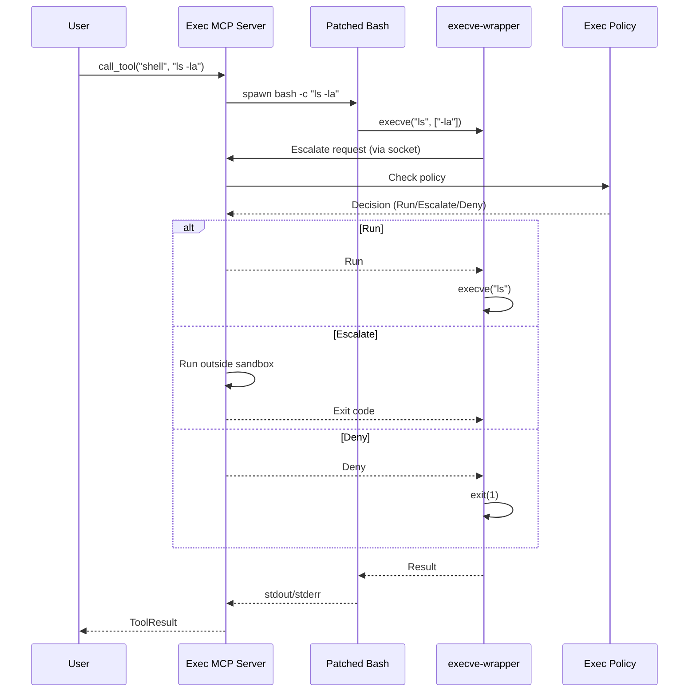

#### 3.4.3 Bash 补丁

关键补丁 (`patches/bash-exec-wrapper.patch`):

```c
// 在 execute_cmd.c 中添加
if ((wrapper = get_string_value("BASH_EXEC_WRAPPER"))) {
    // 重定向 execve 调用到 wrapper
    execve(wrapper, new_argv, environ);
}
```

---

## 4. 数据流与交互

### 4.1 完整对话流程

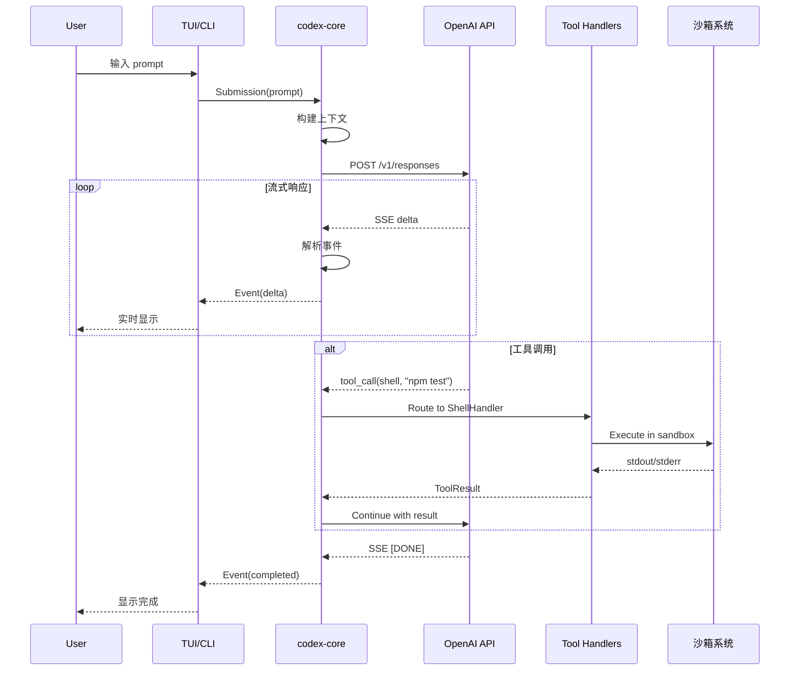

### 4.2 批准流程

Codex 支持三种批准模式：

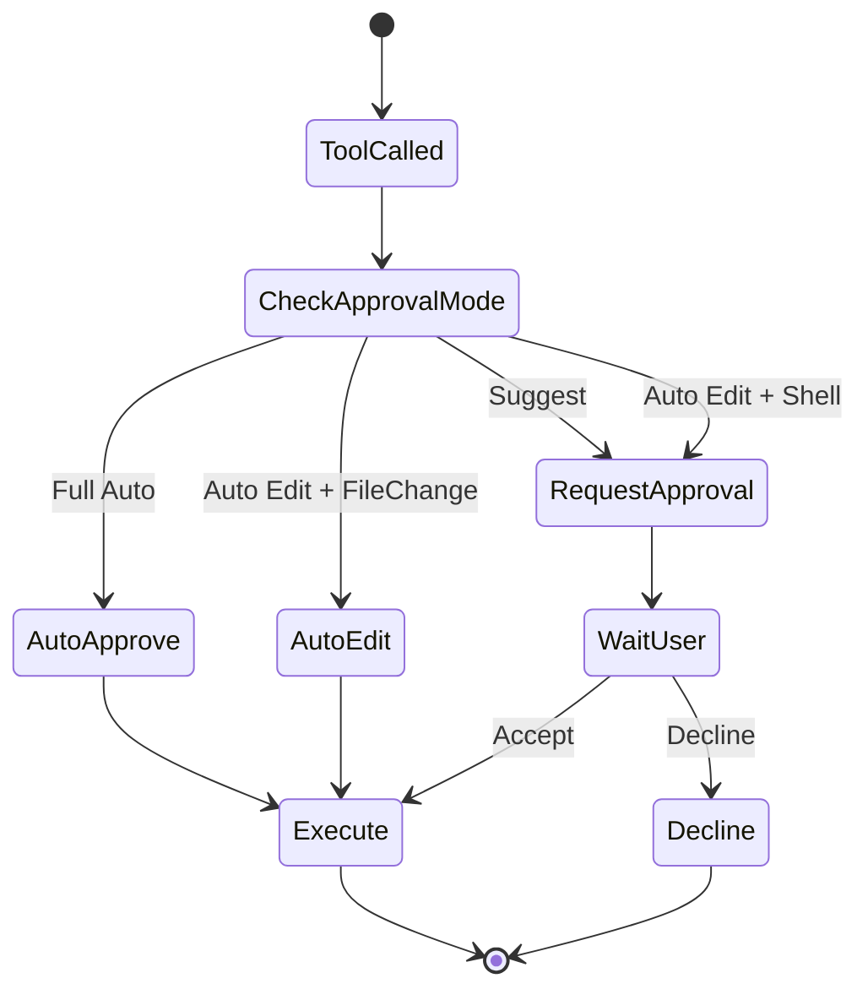

**批准请求示例**:

```json
// 服务器发送批准请求（JSON-RPC Request）
{
  "method": "item/commandExecution/requestApproval",
  "id": "approval_1",
  "params": {
    "threadId": "thr_123",
    "turnId": "turn_456",
    "itemId": "item_789",
    "command": ["rm", "-rf", "/tmp/cache"],
    "cwd": "/workspace",
    "parsedCmd": {
      "program": "rm",
      "args": ["-rf", "/tmp/cache"],
      "flags": ["-r", "-f"]
    },
    "risk": "high"
  }
}

// 客户端响应
{
  "id": "approval_1",
  "result": {
    "decision": "accept",
    "acceptSettings": {
      "forSession": false  // 仅本次批准
    }
  }
}
```

### 4.3 事件流

Codex 使用**事件驱动架构**，所有状态变化通过事件通知：

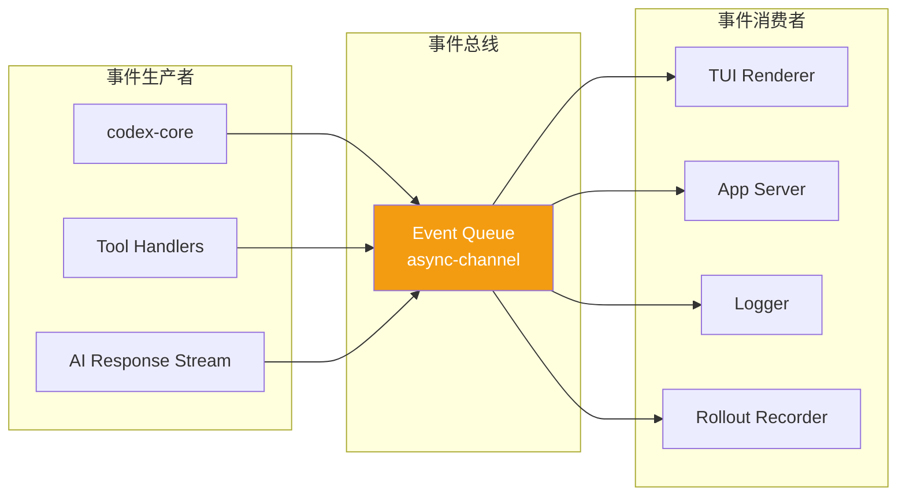

**关键事件类型**：

| 事件 | 触发时机 | 携带数据 |
|------|---------|---------|
| `SessionConfigured` | 会话配置完成 | 配置信息 |
| `TurnStarted` | 对话轮开始 | Turn 对象 |
| `ItemStarted` | 工作项开始 | Item 对象 |
| `AgentMessageDelta` | AI 消息增量 | 文本增量 |
| `CommandExecution` | 命令执行 | 命令、输出 |
| `ItemCompleted` | 工作项完成 | 最终 Item |
| `TurnCompleted` | 对话轮完成 | 最终 Turn |
| `Error` | 错误发生 | 错误信息 |

---

## 5. 安全沙箱机制

### 5.1 沙箱策略

Codex 实现了**多层次沙箱策略**：

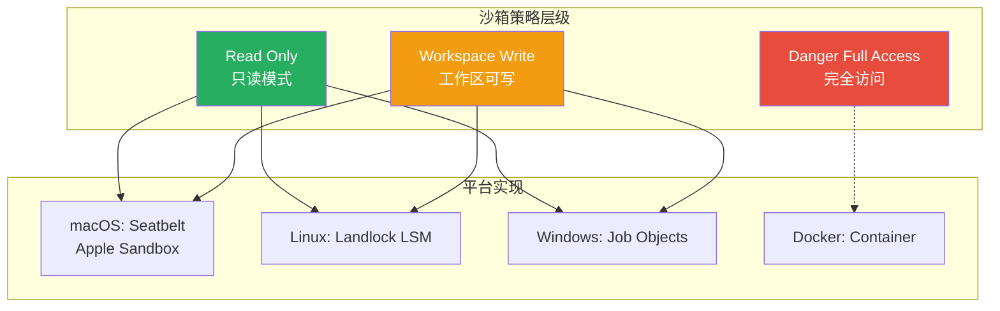

### 5.2 macOS: Seatbelt

**实现文件**: `core/src/seatbelt.rs`, `core/src/seatbelt_base_policy.sbpl`

**核心策略**:

```scheme
;; seatbelt_base_policy.sbpl
(version 1)
(deny default)  ; 默认拒绝所有

;; 允许基础系统调用
(allow process-fork)
(allow process-exec)
(allow file-read*)

;; 允许特定目录写入
(allow file-write*
    (subpath (param "workdir"))     ; 工作目录
    (subpath (param "tmpdir"))      ; 临时目录
    (subpath (param "codex_home"))  ; Codex 主目录
)

;; 网络隔离（Full Auto 模式）
(when (param "block_network")
    (deny network*)
)
```

**使用方式**:

```rust
// core/src/seatbelt.rs
pub fn wrap_command_with_seatbelt(
    cmd: &[String],
    policy: &SandboxPolicy,
) -> Result<Vec<String>> {
    let profile = render_seatbelt_profile(policy)?;
    Ok(vec![
        "/usr/bin/sandbox-exec".to_string(),
        "-p".to_string(),
        profile,
        "--".to_string(),
    ].into_iter().chain(cmd.iter().cloned()).collect())
}
```

### 5.3 Linux: Landlock

**实现文件**: `linux-sandbox/src/lib.rs`

**Landlock** 是 Linux 5.13+ 引入的安全模块，提供细粒度的文件系统访问控制。

**核心代码**:

```rust
use landlock::*;

pub fn apply_landlock_sandbox(policy: &SandboxPolicy) -> Result<()> {
    let ruleset = Ruleset::new()
        .handle_access(AccessFs::Execute)?
        .handle_access(AccessFs::WriteFile)?
        .handle_access(AccessFs::ReadFile)?
        .create()?;

    // 添加只读路径
    for path in &policy.readable_roots {
        ruleset.add_rule(PathBeneath::new(path, AccessFs::ReadFile))?;
    }

    // 添加可写路径
    for path in &policy.writable_roots {
        ruleset.add_rule(PathBeneath::new(path,
            AccessFs::ReadFile | AccessFs::WriteFile | AccessFs::Execute
        ))?;
    }

    ruleset.restrict_self()?;
    Ok(())
}
```

### 5.4 网络隔离

在 **Full Auto** 模式下，默认禁用网络访问：

- **macOS**: 通过 Seatbelt `(deny network*)` 规则
- **Linux**: 通过 Docker + iptables 防火墙
- **Windows**: 通过 Job Objects 限制

**例外白名单**:

```toml
# config.toml
[sandbox]
network_whitelist = [
    "api.openai.com",
    "*.github.com"
]
```

---

## 6. MCP 协议集成

### 6.1 MCP 概述

**Model Context Protocol (MCP)** 是一个标准化协议，用于 AI 应用与外部工具/数据源的集成。

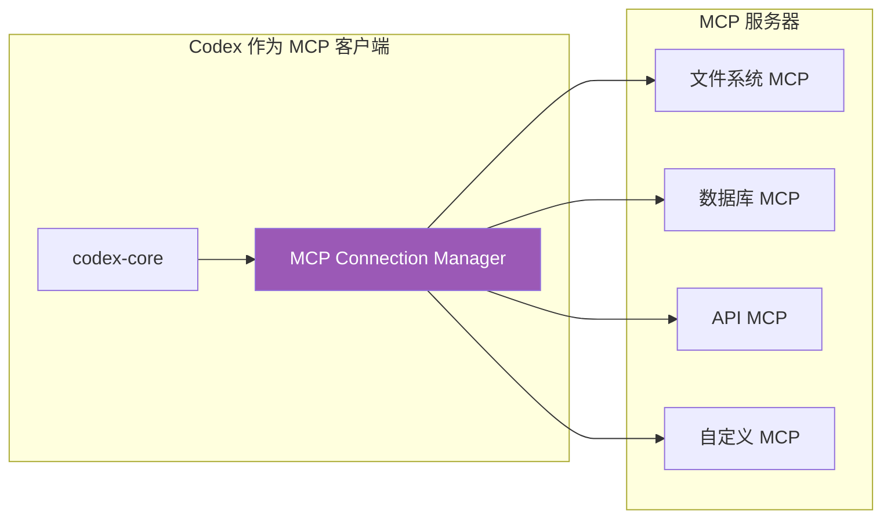

### 6.2 MCP 客户端实现

**实现文件**: `core/src/mcp_connection_manager.rs`

**核心功能**:

1. **连接管理**: 启动和管理多个 MCP 服务器进程
2. **工具发现**: 自动发现 MCP 服务器提供的工具
3. **资源访问**: 访问 MCP 服务器的资源（文件、数据等）
4. **OAuth 集成**: 支持需要认证的 MCP 服务器

**配置示例**:

```toml
# config.toml
[mcp_servers.filesystem]
command = "npx"
args = ["-y", "@modelcontextprotocol/server-filesystem", "/workspace"]

[mcp_servers.database]
command = "mcp-server-postgres"
env = { DATABASE_URL = "postgres://localhost/mydb" }

[mcp_servers.github]
command = "mcp-server-github"
oauth = true  # 需要 OAuth 认证
```

### 6.3 MCP 服务器实现

Codex 本身也可以作为 **MCP 服务器**，让其他 MCP 客户端调用 Codex 的能力。

**启动方式**:

```bash
codex mcp-server
```

**提供的工具**:

| 工具名 | 功能 | 参数 |
|-------|------|------|
| `codex_shell` | 执行 Shell 命令 | `command: string` |
| `codex_apply_patch` | 应用代码补丁 | `patch: string` |
| `codex_read_file` | 读取文件 | `path: string` |
| `codex_search_code` | 搜索代码 | `query: string` |

**使用示例**:

```bash
# 使用 MCP Inspector 测试
npx @modelcontextprotocol/inspector codex mcp-server
```

### 6.4 沙箱状态同步

Codex 实现了 **MCP 扩展**，允许 MCP 服务器获取当前沙箱状态：

```rust
// core/src/mcp_connection_manager.rs
pub const MCP_SANDBOX_STATE_CAPABILITY: &str = "codex/sandboxState";
pub const MCP_SANDBOX_STATE_METHOD: &str = "codex/getSandboxState";

#[derive(Serialize)]
pub struct SandboxState {
    pub writable_roots: Vec<PathBuf>,
    pub network_enabled: bool,
}
```

**工作流程**:

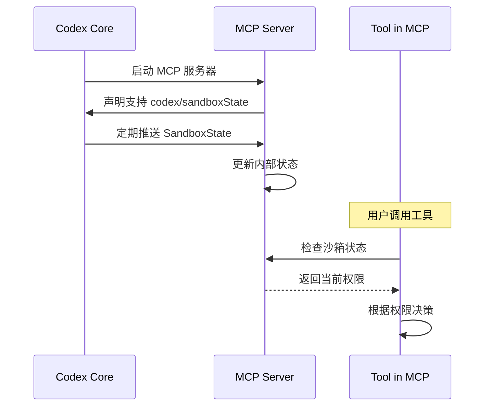

---

## 7. 工具系统

### 7.1 工具架构

Codex 的工具系统采用 **插件化架构**：

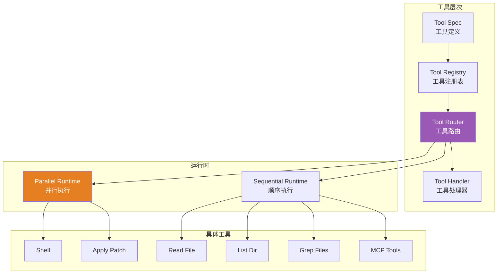

### 7.2 工具定义 (ToolSpec)

**实现文件**: `core/src/tools/spec.rs`

**核心结构**:

```rust
pub struct ToolsConfig {
    pub tools: Vec<ToolSpec>,
    pub parallel_tools: Vec<ParallelToolSpec>,
}

pub struct ToolSpec {
    pub name: String,
    pub description: String,
    pub input_schema: serde_json::Value,  // JSON Schema
    pub handler: Box<dyn ToolHandler>,
}

#[async_trait]
pub trait ToolHandler: Send + Sync {
    async fn handle(&self,
        ctx: &ToolContext,
        args: serde_json::Value
    ) -> Result<ToolResult>;
}
```

### 7.3 核心工具详解

#### 7.3.1 Shell 工具

**实现文件**: `core/src/tools/handlers/shell.rs`

**功能**: 在沙箱中执行 Shell 命令

**输入 Schema**:

```json
{
  "type": "object",
  "properties": {
    "command": {
      "type": "array",
      "items": { "type": "string" },
      "description": "Command and arguments"
    },
    "cwd": {
      "type": "string",
      "description": "Working directory"
    },
    "env": {
      "type": "object",
      "description": "Environment variables"
    }
  },
  "required": ["command"]
}
```

**执行流程**:

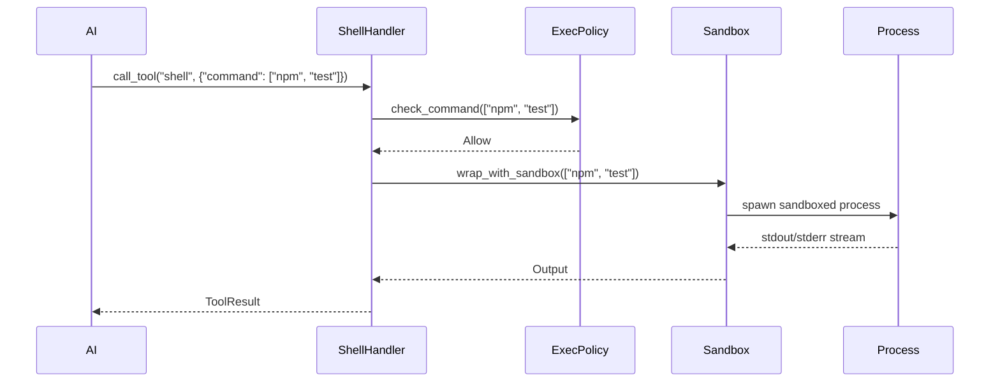

#### 7.3.2 Apply Patch 工具

**实现文件**: `core/src/tools/handlers/apply_patch.rs`, `apply-patch/` crate

**功能**: 应用代码补丁（基于 unified diff 格式）

**工作原理**:

1. **解析补丁**: 使用 Lark 解析器解析 diff 格式
2. **验证文件**: 检查目标文件是否存在
3. **应用变更**: 逐行应用修改
4. **回滚支持**: 失败时自动回滚

**补丁格式**:

```diff
--- a/src/main.rs
+++ b/src/main.rs
@@ -10,7 +10,7 @@ fn main() {
     let config = load_config();
-    println!("Hello, world!");
+    println!("Hello, Codex!");
     run_app(config);
 }
```

#### 7.3.3 File Search 工具

**实现文件**: `file-search/` crate

**功能**: 快速搜索文件和代码

**技术栈**:

- **ripgrep**: 基于 Rust 的高性能 grep 工具
- **ignore** crate: 尊重 `.gitignore` 规则
- **并行搜索**: 多线程并行搜索

**使用示例**:

```rust
use codex_file_search::*;

let searcher = FileSearcher::new("/workspace");
let results = searcher
    .pattern("TODO")
    .file_type("rs")
    .max_results(100)
    .search()?;

for result in results {
    println!("{}:{}: {}", result.path, result.line_num, result.content);
}
```

### 7.4 并行执行

Codex 支持 **并行工具调用**，提升性能：

**实现文件**: `core/src/tools/parallel.rs`

```rust
pub struct ParallelToolCallRuntime {
    max_concurrency: usize,
}

impl ParallelToolCallRuntime {
    pub async fn execute_batch(&self, calls: Vec<ToolCall>) -> Vec<ToolResult> {
        let futures: FuturesOrdered<_> = calls
            .into_iter()
            .map(|call| self.execute_one(call))
            .collect();

        futures.collect().await
    }
}
```

**并发控制**:

```toml
# config.toml
[tools]
max_parallel_calls = 5  # 最多同时执行 5 个工具
```

---

## 8. 关键设计模式

### 8.1 事件驱动架构 (EDA)

Codex 核心使用 **事件驱动** 模式，所有状态变化通过事件传播。

**优势**:

- **解耦**: 生产者和消费者解耦
- **可扩展**: 新消费者无需修改生产者
- **可追溯**: 所有事件可记录和回放

**实现**:

```rust
// 使用 async-channel 实现事件总线
use async_channel::{Sender, Receiver, unbounded};

let (tx, rx) = unbounded::<Event>();

// 生产者
tokio::spawn(async move {
    tx.send(Event::TurnStarted(turn)).await.unwrap();
});

// 消费者
tokio::spawn(async move {
    while let Ok(event) = rx.recv().await {
        handle_event(event);
    }
});
```

### 8.2 策略模式

沙箱系统使用 **策略模式**，根据平台选择不同的实现：

```rust
pub trait SandboxStrategy {
    fn wrap_command(&self, cmd: &[String]) -> Result<Vec<String>>;
}

pub struct SeatbeltStrategy { /* macOS */ }
pub struct LandlockStrategy { /* Linux */ }
pub struct WindowsStrategy { /* Windows */ }

impl SandboxStrategy for SeatbeltStrategy {
    fn wrap_command(&self, cmd: &[String]) -> Result<Vec<String>> {
        // macOS 特定实现
    }
}

// 工厂方法
pub fn get_platform_sandbox() -> Box<dyn SandboxStrategy> {
    #[cfg(target_os = "macos")]
    return Box::new(SeatbeltStrategy::new());

    #[cfg(target_os = "linux")]
    return Box::new(LandlockStrategy::new());

    #[cfg(target_os = "windows")]
    return Box::new(WindowsStrategy::new());
}
```

### 8.3 构建者模式

配置系统使用 **构建者模式**：

```rust
let config = ConfigBuilder::new()
    .model("gpt-5.1-codex")
    .approval_mode(ApprovalMode::FullAuto)
    .sandbox_policy(SandboxPolicy::WorkspaceWrite)
    .cwd("/workspace")
    .build()?;
```

### 8.4 适配器模式

`app-server` 使用 **适配器模式** 将内部协议适配到 JSON-RPC：

```rust
pub struct AppServerAdapter {
    core: Arc<Codex>,
}

impl AppServerAdapter {
    // 适配 JSON-RPC 请求到内部 Submission
    pub async fn handle_request(&self, req: JsonRpcRequest) -> JsonRpcResponse {
        let submission = self.adapt_request(req)?;
        self.core.submit(submission).await?;
        // ...
    }

    // 适配内部 Event 到 JSON-RPC 通知
    pub async fn stream_events(&self) {
        while let Ok(event) = self.core.recv_event().await {
            let notification = self.adapt_event(event);
            self.send_notification(notification).await?;
        }
    }
}
```

### 8.5 观察者模式

Rollout 系统使用 **观察者模式** 记录所有事件：

```rust
pub struct RolloutRecorder {
    file: File,
}

impl EventObserver for RolloutRecorder {
    fn on_event(&mut self, event: &Event) {
        // 将事件序列化为 JSONL 写入文件
        writeln!(self.file, "{}", serde_json::to_string(event).unwrap())?;
    }
}

// 注册观察者
codex.register_observer(Box::new(RolloutRecorder::new("session.jsonl")?));
```

---

## 9. 技术栈

### 9.1 Rust 生态

| Crate | 功能 | 版本要求 |
|-------|------|---------|
| `tokio` | 异步运行时 | 1.x |
| `async-channel` | 异步通道 | 2.x |
| `futures` | Future 组合子 | 0.3 |
| `serde` | 序列化 | 1.x |
| `serde_json` | JSON 支持 | 1.x |
| `anyhow` | 错误处理 | 1.x |
| `tracing` | 日志追踪 | 0.1 |
| `http` | HTTP 类型 | 0.2 |
| `eventsource-stream` | SSE 流解析 | 0.2 |
| `ratatui` | TUI 框架 | 0.26 |
| `keyring` | 密钥存储 | 2.x |
| `dunce` | 路径规范化 | 1.x |

### 9.2 前端技术 (VS Code 扩展)

- **TypeScript**: 扩展语言
- **JSON-RPC 2.0**: 通信协议
- **VS Code API**: 编辑器集成

### 9.3 AI 服务集成

支持的 AI Provider:

| Provider | Base URL | 认证方式 |
|----------|----------|---------|
| OpenAI | `https://api.openai.com/v1` | API Key / ChatGPT |
| Azure OpenAI | `https://<name>.openai.azure.com` | API Key |
| OpenRouter | `https://openrouter.ai/api/v1` | API Key |
| Gemini | `https://generativelanguage.googleapis.com/v1beta/openai` | API Key |
| Ollama | `http://localhost:11434/v1` | 无 |
| LM Studio | `http://localhost:1234/v1` | 无 |
| DeepSeek | `https://api.deepseek.com` | API Key |
| xAI | `https://api.x.ai/v1` | API Key |
| Groq | `https://api.groq.com/openai/v1` | API Key |

### 9.4 构建工具

- **Cargo**: Rust 包管理和构建
- **pnpm**: Node.js 包管理（TypeScript 版本）
- **npm**: 发布工具
- **GitHub Actions**: CI/CD

---

## 10. 架构演进与优化

### 10.1 从 TypeScript 到 Rust

**迁移原因**:

1. **性能**: Rust 提供更好的性能和更低的内存占用
2. **安全性**: Rust 的内存安全保证减少 bug
3. **沙箱**: 更容易与系统级 API 集成（Seatbelt、Landlock）
4. **单二进制**: 无需 Node.js 运行时

**迁移策略**:

- 保留 TypeScript 实现作为 legacy
- 逐步迁移用户到 Rust 版本
- 两个版本并行维护一段时间

### 10.2 TUI v2

新版 TUI (`tui2/`) 正在开发中，改进包括：

- **更好的滚动**: 优化的视口和历史管理
- **流式换行**: 更智能的文本换行
- **性能优化**: 减少重绘次数

**架构改进**:

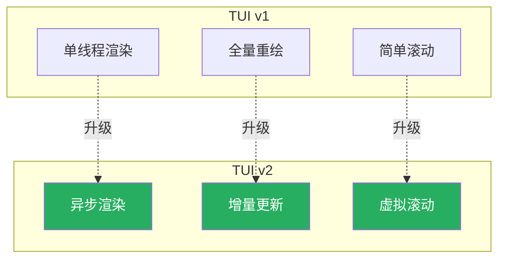

### 10.3 自动压缩优化

**问题**: 长对话会超出 Token 限制

**解决方案**: 自动压缩 (Auto Compaction)

**压缩策略**:

1. **本地压缩**: 使用轻量级模型本地总结
2. **远程压缩**: 使用 OpenAI API 总结（需要额外调用）
3. **选择性保留**: 保留关键消息（用户输入、错误信息）

**实现**:

```rust
// core/src/compact.rs
pub async fn run_inline_auto_compact_task(
    ctx: &CompactionContext,
    history: &MessageHistory,
) -> Result<Vec<Message>> {
    // 1. 识别可压缩的消息段
    let segments = identify_compactable_segments(history)?;

    // 2. 对每个段生成摘要
    let summaries = summarize_segments(ctx, segments).await?;

    // 3. 重建历史
    let compacted = rebuild_history(history, summaries)?;

    Ok(compacted)
}
```

### 10.4 执行策略演进

**ExecPolicy** 系统正在从基于规则演进到基于 AI 的策略：

```rust
// 当前: 基于规则
pub fn is_safe_command(cmd: &[String]) -> bool {
    matches!(cmd[0].as_str(), "ls" | "cat" | "grep" | "find")
}

// 未来: AI 辅助
pub async fn is_safe_command_ai(cmd: &[String], context: &Context) -> SafetyDecision {
    let prompt = format!("Is this command safe to run: {:?}\nContext: {:?}", cmd, context);
    let decision = ai_model.classify(prompt).await?;
    decision
}
```

### 10.5 MCP 生态扩展

**当前**: Codex 作为 MCP 客户端和服务器

**未来**:

- **MCP Marketplace**: 官方 MCP 服务器市场
- **插件生态**: 第三方开发者贡献 MCP 服务器
- **标准化工具**: 常用工具的标准 MCP 接口

---

## 总结

### 核心优势

1. **模块化设计**: 40+ Cargo crates，清晰的模块边界
2. **安全优先**: 多层沙箱 + 批准机制
3. **协议标准**: JSON-RPC 2.0 + MCP
4. **事件驱动**: 可扩展的事件系统
5. **多平台支持**: macOS、Linux、Windows
6. **AI Provider 无关**: 支持多种 AI 服务

### 架构亮点

- **队列对模型**: 简单清晰的 API
- **沙箱策略模式**: 跨平台安全执行
- **工具插件化**: 易于扩展新工具
- **MCP 集成**: 标准化的工具协议
- **流式处理**: 实时反馈用户体验

### 适用场景

- **终端开发者**: 需要 AI 辅助的命令行用户
- **IDE 集成**: VS Code 等编辑器扩展
- **CI/CD**: 自动化代码生成和审查
- **代码审查**: 自动化 PR Review
- **教学**: 代码解释和学习

---

## 附录

### A. 关键文件索引

| 功能模块 | 关键文件路径 |
|---------|------------|
| 核心业务 | `codex-rs/core/src/codex.rs` |
| 工具路由 | `codex-rs/core/src/tools/router.rs` |
| 沙箱实现 | `codex-rs/core/src/seatbelt.rs`<br>`codex-rs/linux-sandbox/` |
| 协议定义 | `codex-rs/protocol/` |
| 应用服务器 | `codex-rs/app-server/` |
| 执行服务器 | `codex-rs/exec-server/` |
| MCP 客户端 | `codex-rs/core/src/mcp_connection_manager.rs` |
| MCP 服务器 | `codex-rs/mcp-server/` |
| 文件搜索 | `codex-rs/file-search/` |
| 补丁应用 | `codex-rs/apply-patch/` |

### B. 配置示例

```toml
# ~/.codex/config.toml

# 模型配置
model = "gpt-5.1-codex"
provider = "openai"

# 批准模式
approval_mode = "suggest"  # suggest | auto-edit | full-auto
full_auto_error_mode = "ask-user"  # ask-user | ignore-and-continue

# 沙箱配置
sandbox_mode = "workspace-write"  # read-only | workspace-write | danger-full-access

# MCP 服务器
[mcp_servers.filesystem]
command = "npx"
args = ["-y", "@modelcontextprotocol/server-filesystem", "/workspace"]

[mcp_servers.github]
command = "mcp-server-github"
oauth = true

# 通知
notify = true
notify_command = "terminal-notifier -message '{{message}}'"

# 历史
[history]
max_size = 1000
save_history = true
```

### C. 参考链接

- [Codex GitHub](https://github.com/openai/codex)
- [MCP 规范](https://modelcontextprotocol.io/)
- [Ratatui 文档](https://ratatui.rs/)
- [Landlock 文档](https://landlock.io/)
- [JSON-RPC 2.0](https://www.jsonrpc.org/specification)

---

**文档版本**: 1.0
**最后更新**: 2025-12-27
**作者**: Claude (Sonnet 4.5)
**审核状态**: 待审核
