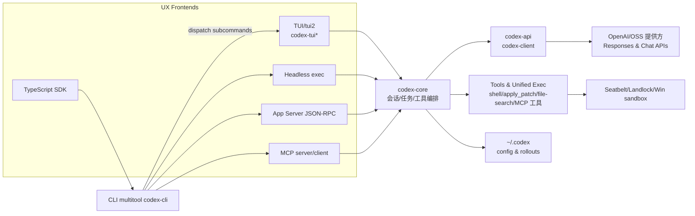
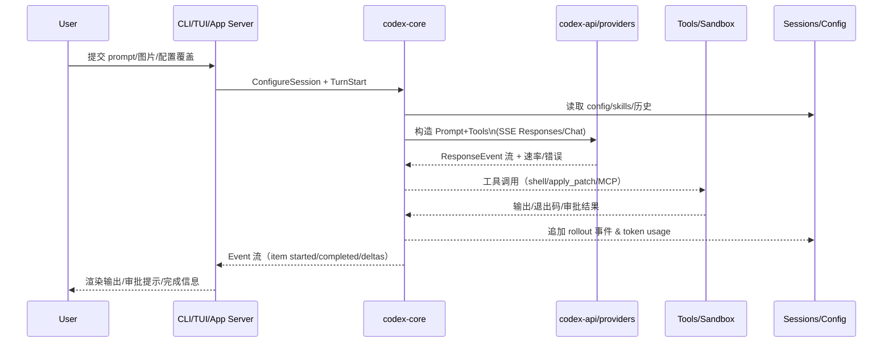

# Codex 架构分析

本文基于 `vendors/codex` 代码与随附文档梳理 Codex CLI 的核心架构、关键数据流与扩展点，便于后续演进或集成。

## 总览
- 形态：Rust 工作区提供核心 agent、交互式 TUI、无头 `exec`、App Server（IDE/远程集成）、MCP client/server 以及安全/登录/沙箱等配套；TypeScript SDK 通过拉起 CLI 复用同一执行管线。
- 核心职责：`codex-core` 负责配置加载、认证、会话/任务状态机、模型提示构建、工具路由（shell、apply_patch、文件搜索、MCP 工具等）、输出事件流和持久化。
- 传输层：`codex-api` 基于通用 `codex-client` 提供 Responses/Chat/Compact 调用与 SSE 解析；App Server 暴露 JSON-RPC over stdio 的线程/turn 接口。
- 安全与执行：统一的工具执行/审批/沙箱（Seatbelt、Landlock、Windows restricted token）封装在 `unified_exec` 与 execpolicy；本地修改通过 `apply-patch` 应用，变更与输出写入 rollout。

## 主要子项目与分工
- `codex-core`：会话/turn 状态机（`Codex::spawn`）、配置 & 特性管理、鉴权、模型选择与上下文压缩、工具路由（含审批/沙箱）、技能/MCP 连接、rollout 记录与通知。
- `cli`：多功能入口，解析子命令，注入配置覆盖并转发到 TUI、`exec`、App Server、MCP server、login、sandbox、cloud-tasks 等。
- `tui` / `tui2`：Ratatui 交互前端，消费 core 事件流渲染输出与审批提示。
- `exec`：无头模式；通过事件处理器将 core 事件流转为人类可读或 JSONL；支持评审模式。
- `app-server`：面向 IDE/远程的 JSON-RPC 服务，定义 Thread/Turn/Item 抽象与初始化、turn 驱动、模型列表、技能/MCP 管理、配置读写等接口。
- `protocol`：跨前后端的类型定义，既用于 core↔TUI，也用于 app-server 序列化。
- `codex-client` / `codex-api`：HTTP 传输层与 OpenAI/Codex API 封装，处理重试、SSE 分帧、速率限制快照与错误映射。
- `apply-patch`、`execpolicy`、`linux-sandbox`/`windows-sandbox-rs` 等：工具与安全组件，支撑补丁应用、命令策略校验和平台沙箱。
- `login`：设备码/API key 登录与令牌刷新；`keyring-store` 管理本地密钥。
- `cloud-tasks`、`backend-client`、`responses-api-proxy`：与云端任务/Responses API 交互的辅助服务。
- TypeScript SDK（`sdk/typescript`）：以 Node 进程拉起 CLI，走 JSONL 事件通道，实现线程/turn API，并传递 images/outputSchema 等高级参数。

## 会话与 turn 生命周期

### 关键步骤
1. **配置与特性解析**：合并 `config.toml`、profile、CLI 覆盖与 feature toggles，解析工作目录/沙箱/审批策略，加载技能与 MCP 连接配置。
2. **鉴权与模型选择**：`AuthManager` 负责 ChatGPT 登录或 API Key；`ModelsManager` 解析默认/OSS 提供方与模型，`codex-api` 组装请求头和 base URL。
3. **上下文与截断**：`ContextManager` 聚合历史、用户提示、技能注入与项目说明；必要时通过 Compact API 做内联/远程压缩以满足 token 上限。
4. **工具路由**：`ToolRouter` 接收模型 Tool Calls，按类型分发到 shell（`unified_exec` PTY 会话）、apply_patch、文件搜索、MCP 工具或自定义技能注入的工具。
5. **审批与沙箱**：`execpolicy`/`ApprovalStore` 依据策略、缓存和用户输入决定是否执行；`SandboxPermissions` 映射到 seatbelt/landlock/Windows sandbox 或 bypass。
6. **事件流与持久化**：模型 SSE 事件 + 工具输出转换为 `Event`/`TurnItem`；`RolloutRecorder` 将 JSONL 记录到 `~/.codex/sessions` 便于 resume/app-server/SDK 复用。

## 传输与接口层
- **模型 API**：`codex-api` 在 prompt 级别抽象 Responses/Chat/Compact，统一解析 SSE/速率限制/错误（基于 `codex-client` 的传输与重试）。
- **App Server**：JSON-RPC over stdio（无 `"jsonrpc": "2.0"` 头），提供 thread/turn/review/exec/config/skills/mcp 登录等方法，事件通过通知流发送，适配 VS Code 等丰富 UI。
- **MCP**：CLI 可作为 MCP client 连接外部 server，也可通过 `codex mcp-server` 作为 server 暴露 Codex 工具；工具/资源列表和 OAuth 状态可通过 app-server/MCP 子命令获取。
- **TypeScript SDK**：通过 spawn 绑定的 `codex` 可执行文件，交换 JSONL 事件，暴露 `startThread/run/runStreamed/resumeThread` 等 API，支持 structured output、图片输入和环境注入。

## 工具执行与安全
- **统一执行栈**：`unified_exec` 对交互式命令执行建模，集中审批→沙箱选择→PTY 启动→输出截断/节流，支持多会话复用与最大输出/令牌控制。
- **Execpolicy 与 legacy**：解析/匹配命令参数，提供策略校验与交互式批准流程，兼容旧策略格式（`execpolicy-legacy`）。
- **Apply-patch**：独立 crate 负责解析/应用补丁，配合工具调用与审批事件。
- **平台沙箱**：macOS seatbelt、Linux landlock+seccomp、Windows restricted token；CLI 也提供 `codex sandbox …` 方便测试。

## 配置、存储与可观察性
- 配置层级：`~/.codex/config.toml` + profile + CLI 覆盖 + feature toggles；支持 `sandbox_mode`/`approval_policy`/模型等全局默认。
- 持久化：会话 rollout、技能缓存、MCP 元数据与登录凭据存放于 `~/.codex`；App Server 线程列表/归档基于同一目录。
- 观测：`codex-otel` 提供 OTEL provider/manager，`tracing` 输出可通过 `RUST_LOG` 控制；App Server/exec 以 JSONL 事件便于日志聚合。

## 扩展点与集成建议
- **技能/工具**：通过技能文件注入说明或定义工具；MCP client/server 扩大外部工具面。
- **前端形态**：可选择 CLI/TUI、无头 exec、App Server（IDE/远程 UI）、TypeScript SDK（Node 工作流）；均复用 core/rollout 以保持一致性。
- **协议演进**：`protocol` 与 `app-server-protocol` 独立生成/共享类型，允许向下兼容的接口扩展；生成 TS/JSON Schema 时与 CLI 版本绑定。

