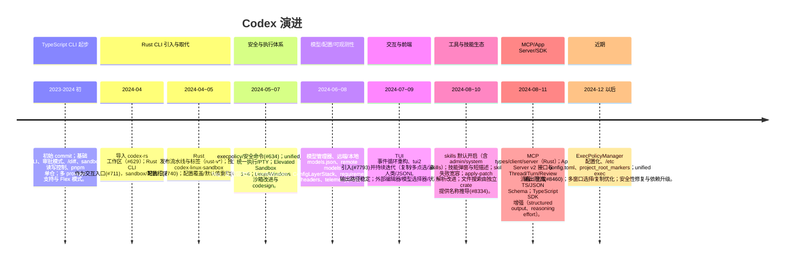

# Codex 代码演进脉络

来源：`git log`（main 分支，最新 `810ebe0d2`）扫描与仓库文档，按阶段梳理主要变更与主题；适当抽取代表性提交/标签，便于建立时间线认知。

## 高层阶段

## 里程碑与代表性变更
- **初期 TypeScript CLI**：基础聊天、审批模式切换、sandbox writable roots、`/diff`、bug report、多 provider/OpenAI 配置、命令历史/自动补全；逐步引入 pnpm、Nix flake、dotenv。
- **安全与可靠性**：自定义安全命令与 execpolicy（#634）；Landlock/Seatbelt 检测与 fallback；输出截断与超时；shell snapshot/风险提示；后续演进为 Elevated Sandbox 1~4、统一执行栈（审批→沙箱→PTY）。
- **Rust 化与发布体系**：Rust 工作区加入并成为默认 CLI，拆分 core/exec/tui/cli/app-server 等 crate，`codex-linux-sandbox` 独立；CI/发布脚本与 rust-v* 标签；配置覆盖与 cwd 强制化，日志目录迁移。
- **配置/模型管理**：ConfigBuilder → ConfigLayerStack，支持 ~/.codex、repo/.codex、/etc、requirements.toml、project_root_markers；model manager/remote models TTL、model list 非阻塞、静态 models.json 更新；ghost snapshot/commit 控制。
- **TUI/TUI2 与 UX**：事件循环重构、鼠标滚动/多选复制、状态头/视口/分页优化；tui2 持续对齐快照与特性（copy selection、drag、scroll coalesce）；外部编辑器、模型选择器、幽灵快照警告等。
- **技能与工具链**：SkillsManager 重写并默认开启；admin/system/public skills 支持；技能发现与错误 UX 改进；apply-patch parser 场景覆盖；文件搜索从核心抽离至 `codex-file-search` 供工具调用。
- **MCP 与 App Server**：MCP types/client/server 完整化，CLI/MCP server 可互为工具；App Server v2 增强 thread/turn/review、config API、模型列表、mcp login 事件；RawResponseItem v2 事件与 deprecation notice。
- **SDK 与自动化**：TypeScript SDK 支持 structured output、图片、OSS provider、xhigh reasoning；cloud-tasks/back-end client/response proxy 提供云端任务与 Responses API 代理路径。
- **近期修复与优化**：输出大小限制、Turn context 持久化、Windows utf-8/ACL 修正、ripgrep 下载诊断、/etc config 支持、execpolicy manager 配置化、tui2 选择/拖拽修复、model/skills 文档与技能短描述整理。

## 主题脉络
- **安全/沙箱**：Seatbelt/Landlock/Windows restricted token → Elevated Sandbox → ExternalSandbox/approval amendment → unified_exec 与 execpolicy 管理；限制网络/读写、ACL 修复与 codesign。
- **配置层级与可运维性**：配置源多层次（用户、仓库、系统、CLI 覆盖），提供 config API 与 ConfigLayerStack 追踪；requirements.toml 对沙箱/审批要求；otel/tracing 集成。
- **模型与上下文**：远端/本地模型列表、compact/ghost snapshot/压缩策略、远程 compact 支持 API key 用户；reasoning effort/summary 控制、速率限制快照。
- **生态扩展**：技能（人类提示/工具注入）、MCP 工具/资源/模板、App Server JSON-RPC 对 IDE/远程 UI、TypeScript SDK 对 Node/Electron。

## 使用建议
- 回溯特定主题可聚焦相关阶段提交：如沙箱演进查看 Elevated Sandbox 系列；配置层关注 ConfigBuilder/ConfigLayerStack/requirements；TUI 迭代查看 tui2 引入后的一系列修复。
- 生成版本或集成时优先以 Rust CLI 路径为准，TypeScript CLI 仅作为历史参考；结合 App Server + SDK 获得 IDE/服务端集成能力。
