# Gin Web Framework 架构设计分析

> 本文档基于 vendors/gin 源码深度分析撰写
>
> 分析日期: 2025-12-27
>
> Gin 版本: v1.11.0+
>
> 作者: Claude (Sonnet 4.5)

---

## 目录

- [1. 项目概述](#1-项目概述)
- [2. 整体架构](#2-整体架构)
- [3. 核心组件详解](#3-核心组件详解)
- [4. 路由系统](#4-路由系统)
- [5. 中间件机制](#5-中间件机制)
- [6. 数据绑定与验证](#6-数据绑定与验证)
- [7. 响应渲染](#7-响应渲染)
- [8. 性能优化](#8-性能优化)
- [9. 设计模式](#9-设计模式)
- [10. 扩展性设计](#10-扩展性设计)

---

## 1. 项目概述

### 1.1 项目定位

**Gin** 是一个用 Go 语言编写的高性能 HTTP Web 框架，灵感来自于 Martini，但性能比 Martini 快 40 倍。Gin 的核心特点：

- **高性能**: 基于 httprouter，零内存分配路由
- **快速**: 性能测试显示比大多数 Go Web 框架快
- **中间件支持**: 灵活的中间件链机制
- **零碎片**: 精心设计的 API，减少内存分配
- **JSON 验证**: 内置 JSON 绑定和验证
- **路由分组**: 支持路由分组和嵌套
- **错误管理**: 便捷的错误收集和处理
- **内置渲染**: 支持 JSON、XML、HTML 等多种响应格式
- **可扩展**: 易于扩展和自定义

### 1.2 技术栈

| 技术领域 | 使用技术 |
|---------|---------|
| **核心语言** | Go 1.24+ |
| **路由引擎** | 基于 httprouter 的改进版 |
| **验证器** | go-playground/validator/v10 |
| **协议支持** | HTTP/1.1, HTTP/2, HTTP/3 (QUIC) |
| **数据格式** | JSON, XML, YAML, TOML, MsgPack, ProtoBuf |
| **模板引擎** | html/template (可扩展) |

### 1.3 目录结构

```
vendors/gin/
├── gin.go                  # Engine 核心实现
├── context.go              # Context 上下文处理
├── routergroup.go          # 路由分组
├── tree.go                 # Radix Tree 路由树
├── logger.go               # 日志中间件
├── recovery.go             # 恢复中间件
├── auth.go                 # 基础认证
├── errors.go               # 错误处理
├── response_writer.go      # 响应写入器
├── mode.go                 # 运行模式
├── binding/                # 数据绑定
│   ├── binding.go          # 绑定接口
│   ├── json.go             # JSON 绑定
│   ├── form.go             # 表单绑定
│   ├── xml.go              # XML 绑定
│   ├── yaml.go             # YAML 绑定
│   └── ...
├── render/                 # 响应渲染
│   ├── render.go           # 渲染接口
│   ├── json.go             # JSON 渲染
│   ├── xml.go              # XML 渲染
│   ├── html.go             # HTML 渲染
│   └── ...
├── internal/               # 内部工具
│   ├── bytesconv/          # 字节转换优化
│   └── fs/                 # 文件系统工具
└── testdata/               # 测试数据
```

---

## 2. 整体架构

### 2.1 架构分层

Gin 采用经典的**分层架构**设计，自上而下分为五层：

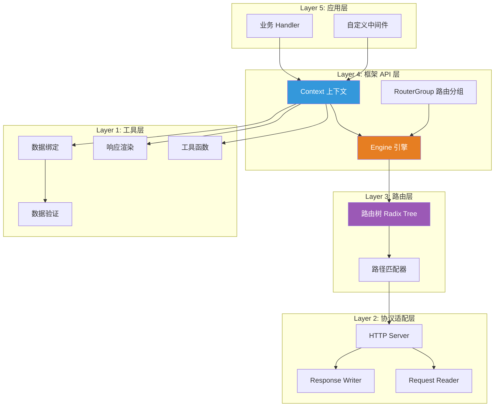

### 2.2 核心架构图

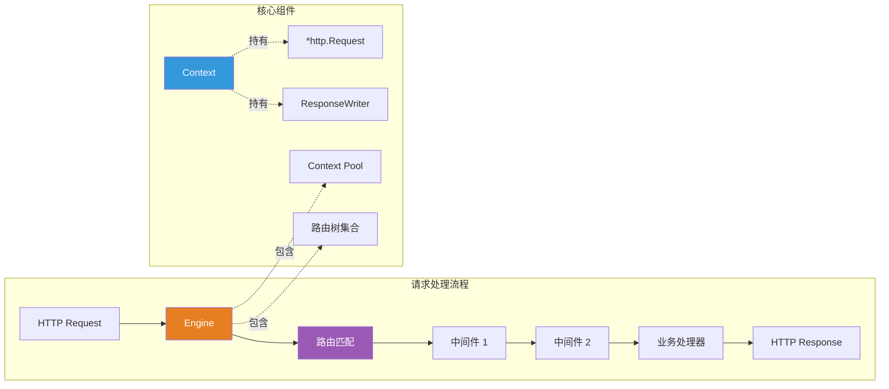

### 2.3 设计理念

#### 2.3.1 高性能优先

- **零分配路由**: 路由匹配过程无内存分配
- **对象池**: 使用 sync.Pool 复用 Context 对象
- **字节优化**: 内部使用 unsafe 优化字节转换
- **预分配**: 提前分配常用数据结构

#### 2.3.2 简洁 API

- **链式调用**: 支持流畅的链式 API
- **语义化方法**: 方法命名清晰直观
- **合理默认**: 提供合理的默认配置

#### 2.3.3 可扩展性

- **接口抽象**: 核心功能都抽象为接口
- **中间件机制**: 灵活的中间件系统
- **插件化**: 支持自定义 Binding、Render 等

---

## 3. 核心组件详解

### 3.1 Engine: 框架引擎

#### 3.1.1 结构定义

**核心代码** (`gin.go:92-150`):

```go
type Engine struct {
    RouterGroup                           // 嵌入 RouterGroup

    routeTreesUpdated sync.Once          // 路由树更新标记

    // 路由配置
    RedirectTrailingSlash  bool           // 自动重定向尾斜杠
    RedirectFixedPath      bool           // 修正路径重定向
    HandleMethodNotAllowed bool           // 处理 405 错误
    ForwardedByClientIP    bool           // 从头部获取客户端 IP

    // 路径配置
    UseRawPath         bool               // 使用原始路径
    UseEscapedPath     bool               // 使用转义路径
    UnescapePathValues bool               // 反转义路径值

    // 其他配置
    RemoveExtraSlash bool                 // 移除多余斜杠
    secureJSONPrefix string               // 安全 JSON 前缀

    // 核心组件
    trees            methodTrees          // 路由树集合 (每个 HTTP 方法一棵树)
    pool             sync.Pool            // Context 对象池
    maxParams        uint16               // 最大参数数量
    maxSections      uint16               // 最大路径段数量

    // 处理器
    allNoRoute       HandlersChain        // 404 处理器链
    allNoMethod      HandlersChain        // 405 处理器链
    noRoute          HandlersChain
    noMethod         HandlersChain

    // HTML 模板
    HTMLRender       render.HTMLRender    // HTML 渲染器
    FuncMap          template.FuncMap     // 模板函数映射

    // 其他
    TrustedProxies   []string             // 可信代理列表
    trustedCIDRs     []*net.IPNet         // 可信 CIDR
}
```

#### 3.1.2 工作流程

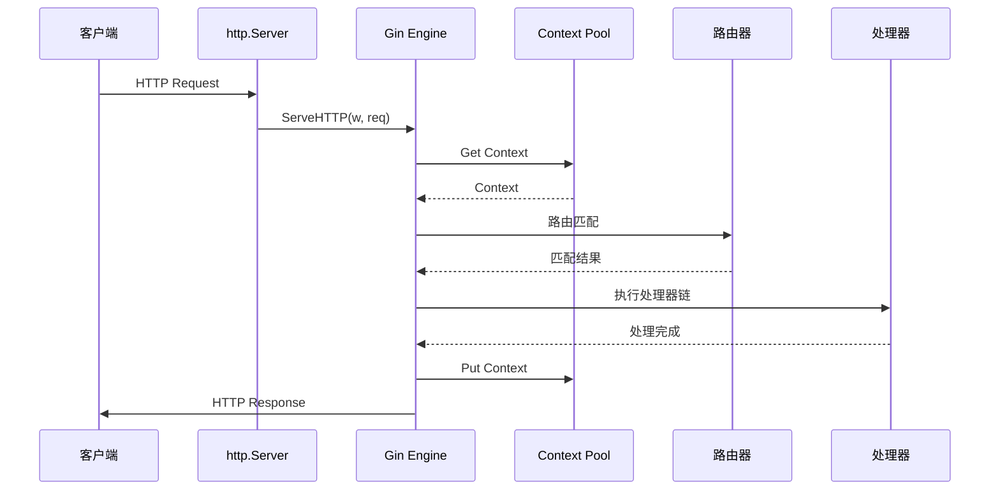

#### 3.1.3 核心方法

| 方法 | 功能 | 说明 |
|-----|------|-----|
| `New()` | 创建新引擎 | 不含中间件 |
| `Default()` | 创建默认引擎 | 含 Logger + Recovery |
| `ServeHTTP()` | 处理 HTTP 请求 | 实现 http.Handler 接口 |
| `Run()` | 启动服务器 | 监听并服务 HTTP 请求 |
| `RunTLS()` | 启动 HTTPS 服务器 | 支持 TLS |
| `RunUnix()` | Unix Socket | 监听 Unix 域套接字 |
| `addRoute()` | 添加路由 | 内部路由注册 |
| `handleHTTPRequest()` | 处理请求 | 核心请求处理逻辑 |

### 3.2 Context: 上下文对象

#### 3.2.1 结构定义

**核心代码** (`context.go:60-96`):

```go
type Context struct {
    writermem responseWriter              // 内嵌的响应写入器
    Request   *http.Request                // HTTP 请求
    Writer    ResponseWriter               // 响应写入接口

    Params   Params                        // URL 参数
    handlers HandlersChain                 // 处理器链
    index    int8                          // 当前处理器索引
    fullPath string                        // 完整路径

    engine       *Engine                   // 引擎引用
    params       *Params                   // 参数池
    skippedNodes *[]skippedNode           // 跳过的节点

    mu sync.RWMutex                        // 保护 Keys
    Keys map[any]any                       // 请求范围键值对

    Errors errorMsgs                       // 错误列表
    Accepted []string                      // 接受的内容类型

    queryCache url.Values                  // 查询参数缓存
    formCache  url.Values                  // 表单数据缓存
    sameSite   http.SameSite              // Cookie SameSite 属性
}
```

#### 3.2.2 Context 生命周期

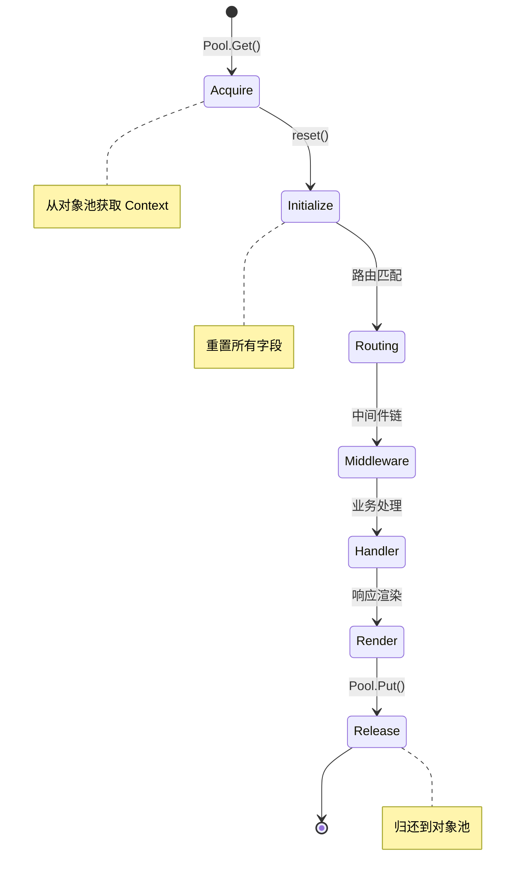

#### 3.2.3 核心功能

**1. 参数获取**

```go
// URL 参数: /user/:id
c.Param("id")

// 查询参数: /search?q=gin
c.Query("q")
c.DefaultQuery("page", "1")

// 表单参数
c.PostForm("username")
c.DefaultPostForm("remember", "false")

// Header
c.GetHeader("Authorization")
```

**2. 数据绑定**

```go
type User struct {
    Username string `json:"username" binding:"required"`
    Password string `json:"password" binding:"required,min=6"`
}

var user User
// JSON 绑定
c.ShouldBindJSON(&user)
// 查询参数绑定
c.ShouldBindQuery(&user)
// 表单绑定
c.ShouldBind(&user)
```

**3. 响应渲染**

```go
// JSON 响应
c.JSON(200, gin.H{"message": "ok"})

// XML 响应
c.XML(200, user)

// HTML 响应
c.HTML(200, "index.html", data)

// 文件下载
c.File("./file.pdf")

// 重定向
c.Redirect(302, "/login")
```

**4. 中间件流程控制**

```go
// 继续执行下一个处理器
c.Next()

// 中止处理器链
c.Abort()

// 中止并返回错误
c.AbortWithStatus(401)
c.AbortWithJSON(400, gin.H{"error": "invalid"})
```

### 3.3 RouterGroup: 路由分组

#### 3.3.1 结构定义

**核心代码** (`routergroup.go:54-60`):

```go
type RouterGroup struct {
    Handlers HandlersChain    // 中间件链
    basePath string           // 基础路径
    engine   *Engine          // 引擎引用
    root     bool             // 是否为根组
}
```

#### 3.3.2 路由分组层次结构

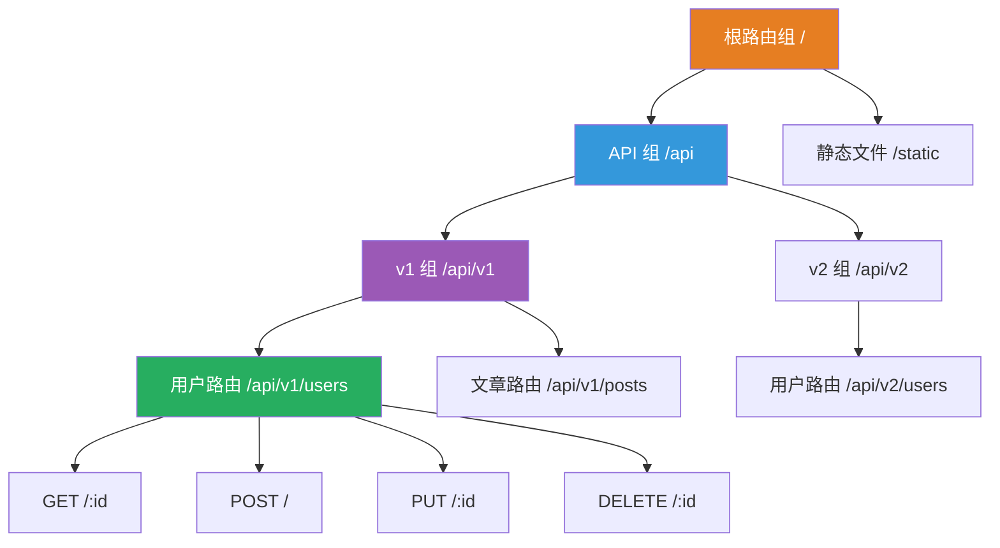

#### 3.3.3 使用示例

```go
router := gin.Default()

// 根级中间件
router.Use(Logger(), Recovery())

// API 分组
api := router.Group("/api")
{
    // v1 子分组
    v1 := api.Group("/v1")
    v1.Use(AuthMiddleware())
    {
        // 用户路由
        users := v1.Group("/users")
        {
            users.GET("/:id", GetUser)
            users.POST("/", CreateUser)
            users.PUT("/:id", UpdateUser)
            users.DELETE("/:id", DeleteUser)
        }

        // 文章路由
        posts := v1.Group("/posts")
        {
            posts.GET("/", ListPosts)
            posts.POST("/", CreatePost)
        }
    }

    // v2 子分组
    v2 := api.Group("/v2")
    {
        v2.GET("/users/:id", GetUserV2)
    }
}

// 静态文件
router.Static("/static", "./public")
```

---

## 4. 路由系统

### 4.1 路由树结构

Gin 使用 **Radix Tree** (压缩前缀树) 实现高效路由匹配。

#### 4.1.1 节点类型

**核心代码** (`tree.go:90-97`):

```go
type nodeType uint8

const (
    static   nodeType = iota  // 静态节点: /users/list
    root                       // 根节点: /
    param                      // 参数节点: /users/:id
    catchAll                   // 通配符节点: /files/*filepath
)
```

#### 4.1.2 节点结构

**核心代码** (`tree.go:99-110`):

```go
type node struct {
    path      string           // 节点路径
    indices   string           // 子节点首字符索引
    wildChild bool            // 是否有通配符子节点
    nType     nodeType        // 节点类型
    priority  uint32          // 优先级 (注册的路由数量)
    children  []*node         // 子节点列表
    handlers  HandlersChain   // 处理器链
    fullPath  string          // 完整路径
}
```

#### 4.1.3 Radix Tree 示例

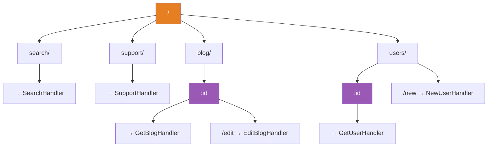

**路由示例**:

```
GET    /search           → SearchHandler
GET    /support          → SupportHandler
GET    /blog/:id         → GetBlogHandler
GET    /blog/:id/edit    → EditBlogHandler
GET    /users/:id        → GetUserHandler
GET    /users/new        → NewUserHandler
```

### 4.2 路由匹配算法

#### 4.2.1 匹配流程

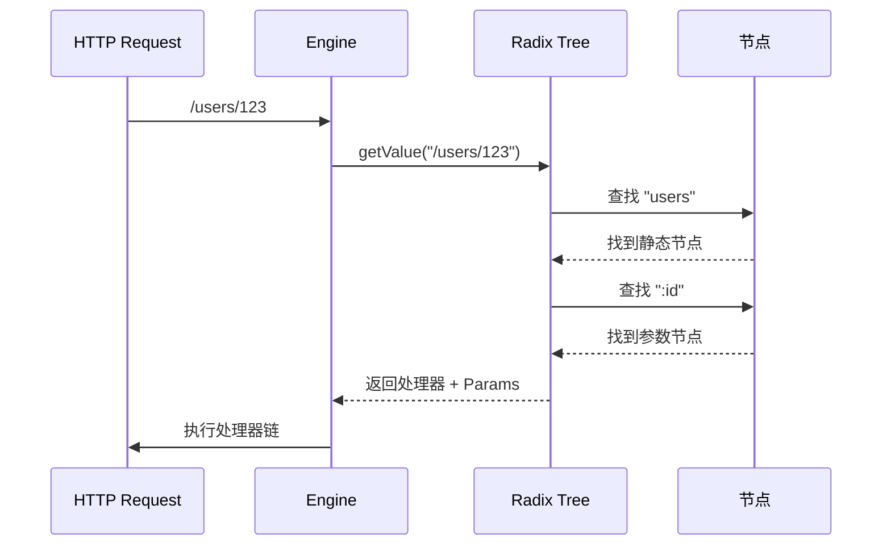

#### 4.2.2 查找算法 (简化)

```go
// tree.go: getValue 方法
func (n *node) getValue(path string, params *Params) (handlers HandlersChain, p Params, fullPath string) {
walk:
    for {
        prefix := n.path
        if len(path) > len(prefix) {
            if path[:len(prefix)] == prefix {
                path = path[len(prefix):]

                // 尝试匹配子节点
                c := path[0]
                for i := 0; i < len(n.indices); i++ {
                    if c == n.indices[i] {
                        n = n.children[i]
                        continue walk
                    }
                }

                // 检查参数节点
                if n.wildChild {
                    n = n.children[len(n.children)-1]
                    // ... 提取参数
                    continue walk
                }

                return // 未找到
            }
        } else if path == prefix {
            // 找到完整匹配
            if handlers = n.handlers; handlers != nil {
                return n.handlers, *params, n.fullPath
            }
        }

        return // 未找到
    }
}
```

### 4.3 路由注册

#### 4.3.1 注册流程

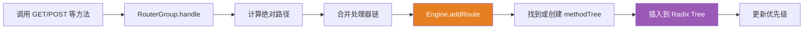

#### 4.3.2 核心代码

```go
// routergroup.go:86-91
func (group *RouterGroup) handle(httpMethod, relativePath string, handlers HandlersChain) IRoutes {
    absolutePath := group.calculateAbsolutePath(relativePath)
    handlers = group.combineHandlers(handlers)
    group.engine.addRoute(httpMethod, absolutePath, handlers)
    return group.returnObj()
}

// gin.go: addRoute 方法
func (engine *Engine) addRoute(method, path string, handlers HandlersChain) {
    // ... 参数校验

    // 获取或创建对应 HTTP 方法的路由树
    root := engine.trees.get(method)
    if root == nil {
        root = new(node)
        root.fullPath = "/"
        engine.trees = append(engine.trees, methodTree{method: method, root: root})
    }

    // 添加路由到树中
    root.addRoute(path, handlers)

    // ... 更新参数计数
}
```

### 4.4 支持的路由模式

#### 4.4.1 路由模式类型

| 模式 | 示例 | 说明 |
|-----|------|-----|
| **静态路由** | `/users/list` | 完全匹配 |
| **参数路由** | `/users/:id` | 提取单个路径段 |
| **通配符路由** | `/files/*filepath` | 匹配剩余所有路径 |
| **混合路由** | `/api/:version/users/:id` | 多个参数 |

#### 4.4.2 示例

```go
// 静态路由
router.GET("/", HomeHandler)
router.GET("/about", AboutHandler)

// 参数路由
router.GET("/users/:id", GetUser)
router.GET("/posts/:id/comments/:commentId", GetComment)

// 通配符路由
router.GET("/files/*filepath", ServeFile)
router.GET("/proxy/*url", ProxyHandler)

// HTTP 方法
router.POST("/users", CreateUser)
router.PUT("/users/:id", UpdateUser)
router.DELETE("/users/:id", DeleteUser)
router.PATCH("/users/:id", PatchUser)

// Any: 所有 HTTP 方法
router.Any("/ping", PingHandler)

// NoRoute: 404 处理
router.NoRoute(func(c *gin.Context) {
    c.JSON(404, gin.H{"message": "Page not found"})
})

// NoMethod: 405 处理
router.NoMethod(func(c *gin.Context) {
    c.JSON(405, gin.H{"message": "Method not allowed"})
})
```

---

## 5. 中间件机制

### 5.1 中间件架构

#### 5.1.1 中间件链

```mermaid
graph LR
    Request[HTTP Request] --> M1[中间件 1]
    M1 --> M2[中间件 2]
    M2 --> M3[中间件 3]
    M3 --> Handler[业务处理器]
    Handler --> M3B[中间件 3 After]
    M3B --> M2B[中间件 2 After]
    M2B --> M1B[中间件 1 After]
    M1B --> Response[HTTP Response]

    style M1 fill:#3498DB,color:#fff
    style M2 fill:#3498DB,color:#fff
    style M3 fill:#3498DB,color:#fff
    style Handler fill:#E67E22,color:#fff
```

#### 5.1.2 执行流程

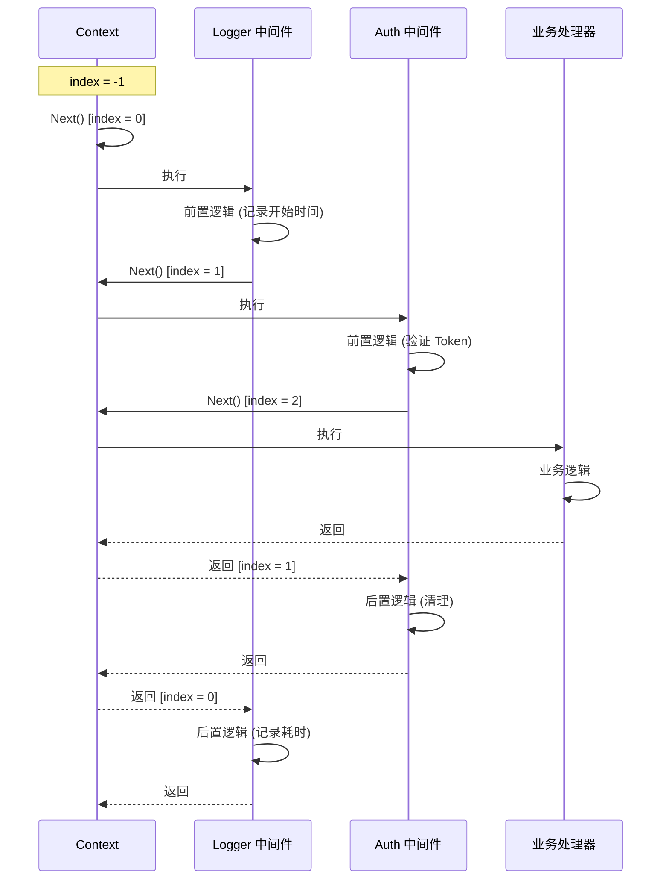

### 5.2 中间件实现

#### 5.2.1 核心代码

```go
// context.go: Next 方法
func (c *Context) Next() {
    c.index++
    for c.index < int8(len(c.handlers)) {
        c.handlers[c.index](c)
        c.index++
    }
}

// context.go: Abort 方法
func (c *Context) Abort() {
    c.index = abortIndex  // math.MaxInt8 >> 1
}
```

#### 5.2.2 中间件模式

**1. 简单中间件**

```go
func SimpleMiddleware() gin.HandlerFunc {
    return func(c *gin.Context) {
        // 前置逻辑
        log.Println("Before request")

        // 执行下一个中间件/处理器
        c.Next()

        // 后置逻辑
        log.Println("After request")
    }
}
```

**2. 带参数中间件**

```go
func AuthMiddleware(requiredRole string) gin.HandlerFunc {
    return func(c *gin.Context) {
        token := c.GetHeader("Authorization")

        user, err := validateToken(token)
        if err != nil {
            c.AbortWithJSON(401, gin.H{"error": "Unauthorized"})
            return
        }

        if user.Role != requiredRole {
            c.AbortWithJSON(403, gin.H{"error": "Forbidden"})
            return
        }

        // 将用户信息存入上下文
        c.Set("user", user)
        c.Next()
    }
}
```

**3. 错误恢复中间件**

```go
func RecoveryMiddleware() gin.HandlerFunc {
    return func(c *gin.Context) {
        defer func() {
            if err := recover(); err != nil {
                // 记录错误
                log.Printf("Panic recovered: %v", err)

                // 返回 500 错误
                c.AbortWithJSON(500, gin.H{
                    "error": "Internal Server Error",
                })
            }
        }()

        c.Next()
    }
}
```

### 5.3 内置中间件

#### 5.3.1 Logger 中间件

**核心代码** (`logger.go:62-120`):

```go
func Logger() HandlerFunc {
    return LoggerWithConfig(LoggerConfig{})
}

func LoggerWithConfig(conf LoggerConfig) HandlerFunc {
    // ... 配置处理

    return func(c *Context) {
        // 开始时间
        start := time.Now()
        path := c.Request.URL.Path
        raw := c.Request.URL.RawQuery

        // 处理请求
        c.Next()

        // 计算延迟
        latency := time.Since(start)

        // 获取状态码
        statusCode := c.Writer.Status()

        // 记录日志
        log.Printf("[GIN] %v | %3d | %13v | %15s | %-7s %#v\n",
            time.Now().Format("2006/01/02 - 15:04:05"),
            statusCode,
            latency,
            c.ClientIP(),
            c.Request.Method,
            path,
        )
    }
}
```

**日志输出示例**:

```
[GIN] 2025/12/27 - 10:30:45 | 200 |     2.456789ms |   192.168.1.100 | GET     "/api/users/123"
[GIN] 2025/12/27 - 10:30:46 | 201 |     5.123456ms |   192.168.1.101 | POST    "/api/users"
[GIN] 2025/12/27 - 10:30:47 | 404 |       123456ns |   192.168.1.102 | GET     "/notfound"
```

#### 5.3.2 Recovery 中间件

**核心代码** (`recovery.go:34-86`):

```go
func Recovery() HandlerFunc {
    return RecoveryWithWriter(DefaultErrorWriter)
}

func RecoveryWithWriter(out io.Writer) HandlerFunc {
    return func(c *Context) {
        defer func() {
            if err := recover(); err != nil {
                // 检查是否是断开的连接
                var brokenPipe bool
                if ne, ok := err.(*net.OpError); ok {
                    if se, ok := ne.Err.(*os.SyscallError); ok {
                        if strings.Contains(strings.ToLower(se.Error()), "broken pipe") ||
                           strings.Contains(strings.ToLower(se.Error()), "connection reset by peer") {
                            brokenPipe = true
                        }
                    }
                }

                // 记录堆栈信息
                httpRequest, _ := httputil.DumpRequest(c.Request, false)
                headers := strings.Split(string(httpRequest), "\r\n")
                for idx, header := range headers {
                    current := strings.Split(header, ":")
                    if current[0] == "Authorization" {
                        headers[idx] = current[0] + ": *"
                    }
                }

                if brokenPipe {
                    logger.Printf("%s\n%s%s", err, string(httpRequest), reset)
                } else {
                    logger.Printf("[Recovery] %s panic recovered:\n%s\n%s%s",
                        timeFormat(time.Now()), strings.Join(headers, "\r\n"), err, stack)
                }

                // 如果连接断开，中止请求
                if brokenPipe {
                    c.Error(err.(error))
                    c.Abort()
                } else {
                    c.AbortWithStatus(http.StatusInternalServerError)
                }
            }
        }()

        c.Next()
    }
}
```

#### 5.3.3 BasicAuth 中间件

**核心代码** (`auth.go:50-100`):

```go
func BasicAuth(accounts Accounts) HandlerFunc {
    return BasicAuthForRealm(accounts, "Authorization Required")
}

func BasicAuthForRealm(accounts Accounts, realm string) HandlerFunc {
    // 预处理账户
    pairs := processAccounts(accounts)

    return func(c *Context) {
        // 获取 Authorization header
        auth := c.Request.Header.Get("Authorization")
        if auth == "" {
            // 要求认证
            c.Header("WWW-Authenticate", `Basic realm="`+realm+`"`)
            c.AbortWithStatus(http.StatusUnauthorized)
            return
        }

        // 验证凭证
        const prefix = "Basic "
        if len(auth) < len(prefix) || !strings.EqualFold(auth[:len(prefix)], prefix) {
            c.AbortWithStatus(http.StatusUnauthorized)
            return
        }

        payload, err := base64.StdEncoding.DecodeString(auth[len(prefix):])
        if err != nil {
            c.AbortWithStatus(http.StatusUnauthorized)
            return
        }

        pair := strings.SplitN(string(payload), ":", 2)
        if len(pair) != 2 {
            c.AbortWithStatus(http.StatusUnauthorized)
            return
        }

        // 查找用户
        if _, ok := pairs[pair[0]]; !ok {
            c.AbortWithStatus(http.StatusUnauthorized)
            return
        }

        // 验证密码
        if subtle.ConstantTimeCompare([]byte(pairs[pair[0]]), []byte(pair[1])) != 1 {
            c.AbortWithStatus(http.StatusUnauthorized)
            return
        }

        // 认证成功，设置用户信息
        c.Set(AuthUserKey, pair[0])
        c.Next()
    }
}
```

---

## 6. 数据绑定与验证

### 6.1 绑定架构

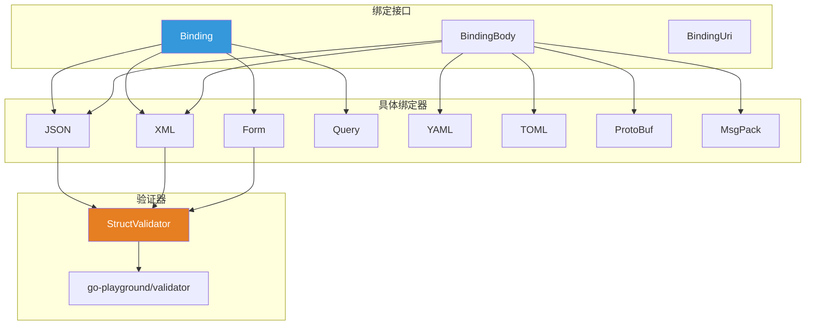

### 6.2 绑定接口

#### 6.2.1 核心接口

**核心代码** (`binding/binding.go:28-48`):

```go
// Binding 接口
type Binding interface {
    Name() string
    Bind(*http.Request, any) error
}

// BindingBody 接口 (可从 []byte 绑定)
type BindingBody interface {
    Binding
    BindBody([]byte, any) error
}

// BindingUri 接口 (可从 URI 参数绑定)
type BindingUri interface {
    Name() string
    BindUri(map[string][]string, any) error
}

// StructValidator 接口
type StructValidator interface {
    ValidateStruct(any) error
    Engine() any
}
```

#### 6.2.2 内置绑定器

**核心代码** (`binding/binding.go:75-89`):

```go
var (
    JSON          BindingBody = jsonBinding{}
    XML           BindingBody = xmlBinding{}
    Form          Binding     = formBinding{}
    Query         Binding     = queryBinding{}
    FormPost      Binding     = formPostBinding{}
    FormMultipart Binding     = formMultipartBinding{}
    ProtoBuf      BindingBody = protobufBinding{}
    MsgPack       BindingBody = msgpackBinding{}
    YAML          BindingBody = yamlBinding{}
    Uri           BindingUri  = uriBinding{}
    Header        Binding     = headerBinding{}
    Plain         BindingBody = plainBinding{}
    TOML          BindingBody = tomlBinding{}
)
```

### 6.3 使用示例

#### 6.3.1 JSON 绑定

```go
type User struct {
    Username string `json:"username" binding:"required,min=3,max=20"`
    Email    string `json:"email" binding:"required,email"`
    Age      int    `json:"age" binding:"required,gte=0,lte=130"`
    Password string `json:"password" binding:"required,min=6"`
}

func CreateUser(c *gin.Context) {
    var user User

    // ShouldBindJSON: 绑定但不自动返回 400
    if err := c.ShouldBindJSON(&user); err != nil {
        c.JSON(400, gin.H{"error": err.Error()})
        return
    }

    // BindJSON: 绑定失败自动返回 400
    // if err := c.BindJSON(&user); err != nil {
    //     return // 已自动返回 400
    // }

    // 业务逻辑
    // ...

    c.JSON(201, user)
}
```

#### 6.3.2 表单绑定

```go
type LoginForm struct {
    Username string `form:"username" binding:"required"`
    Password string `form:"password" binding:"required"`
    Remember bool   `form:"remember"`
}

func Login(c *gin.Context) {
    var form LoginForm

    // 绑定表单数据
    if err := c.ShouldBind(&form); err != nil {
        c.JSON(400, gin.H{"error": err.Error()})
        return
    }

    // 验证登录
    // ...
}
```

#### 6.3.3 查询参数绑定

```go
type Pagination struct {
    Page     int    `form:"page" binding:"required,gte=1"`
    PageSize int    `form:"page_size" binding:"required,gte=1,lte=100"`
    Sort     string `form:"sort" binding:"oneof=asc desc"`
}

func ListUsers(c *gin.Context) {
    var params Pagination

    // 设置默认值
    params.Page = 1
    params.PageSize = 10
    params.Sort = "asc"

    // 绑定查询参数
    if err := c.ShouldBindQuery(&params); err != nil {
        c.JSON(400, gin.H{"error": err.Error()})
        return
    }

    // 查询逻辑
    // ...
}
```

#### 6.3.4 URI 参数绑定

```go
type UserUri struct {
    ID int `uri:"id" binding:"required,gte=1"`
}

func GetUser(c *gin.Context) {
    var uri UserUri

    // 绑定 URI 参数
    if err := c.ShouldBindUri(&uri); err != nil {
        c.JSON(400, gin.H{"error": err.Error()})
        return
    }

    // 查询用户
    user := findUser(uri.ID)
    c.JSON(200, user)
}

// 路由: router.GET("/users/:id", GetUser)
```

### 6.4 验证标签

#### 6.4.1 常用验证标签

| 标签 | 说明 | 示例 |
|-----|------|------|
| `required` | 必填 | `binding:"required"` |
| `email` | Email 格式 | `binding:"email"` |
| `url` | URL 格式 | `binding:"url"` |
| `min` | 最小长度/值 | `binding:"min=3"` |
| `max` | 最大长度/值 | `binding:"max=20"` |
| `len` | 长度 | `binding:"len=11"` |
| `eq` | 等于 | `binding:"eq=admin"` |
| `ne` | 不等于 | `binding:"ne=guest"` |
| `gt`/`gte` | 大于/大于等于 | `binding:"gte=0"` |
| `lt`/`lte` | 小于/小于等于 | `binding:"lte=130"` |
| `oneof` | 枚举 | `binding:"oneof=red green blue"` |
| `alpha` | 仅字母 | `binding:"alpha"` |
| `alphanum` | 字母数字 | `binding:"alphanum"` |
| `numeric` | 数字字符串 | `binding:"numeric"` |

#### 6.4.2 自定义验证器

```go
import "github.com/go-playground/validator/v10"

// 自定义验证函数
var bookableDate validator.Func = func(fl validator.FieldLevel) bool {
    date, ok := fl.Field().Interface().(time.Time)
    if ok {
        today := time.Now()
        if date.Unix() > today.Unix() {
            return true
        }
    }
    return false
}

func main() {
    router := gin.Default()

    // 注册自定义验证器
    if v, ok := binding.Validator.Engine().(*validator.Validate); ok {
        v.RegisterValidation("bookabledate", bookableDate)
    }

    router.POST("/bookings", func(c *gin.Context) {
        var b Booking
        if err := c.ShouldBindJSON(&b); err != nil {
            c.JSON(400, gin.H{"error": err.Error()})
            return
        }
        c.JSON(200, gin.H{"message": "Booking successful"})
    })

    router.Run()
}

type Booking struct {
    CheckIn  time.Time `json:"checkin" binding:"required,bookabledate"`
    CheckOut time.Time `json:"checkout" binding:"required,gtfield=CheckIn"`
}
```

---

## 7. 响应渲染

### 7.1 渲染架构

```mermaid
graph TB
    subgraph "渲染接口"
        Render[Render Interface]
    end

    subgraph "具体渲染器"
        JSON[JSON<br/>application/json]
        IndentedJSON[IndentedJSON<br/>格式化 JSON]
        SecureJSON[SecureJSON<br/>防 JSON 劫持]
        JSONP[JSONP<br/>跨域 JSON]
        PureJSON[PureJSON<br/>不转义 HTML]
        AsciiJSON[AsciiJSON<br/>ASCII JSON]
        XML[XML<br/>application/xml]
        YAML[YAML<br/>application/yaml]
        TOML[TOML<br/>application/toml]
        HTML[HTML<br/>text/html]
        String[String<br/>text/plain]
        ProtoBuf[ProtoBuf<br/>application/x-protobuf]
        MsgPack[MsgPack<br/>application/x-msgpack]
        Data[Data<br/>raw bytes]
        Redirect[Redirect<br/>HTTP 重定向]
    end

    Render --> JSON
    Render --> IndentedJSON
    Render --> SecureJSON
    Render --> JSONP
    Render --> PureJSON
    Render --> AsciiJSON
    Render --> XML
    Render --> YAML
    Render --> TOML
    Render --> HTML
    Render --> String
    Render --> ProtoBuf
    Render --> MsgPack
    Render --> Data
    Render --> Redirect

    style Render fill:#3498DB,color:#fff
    style JSON fill:#27AE60,color:#fff
    style HTML fill:#E67E22,color:#fff
```

### 7.2 渲染接口

**核心代码** (`render/render.go:9-15`):

```go
type Render interface {
    // Render 写入数据并设置 Content-Type
    Render(http.ResponseWriter) error

    // WriteContentType 写入 Content-Type
    WriteContentType(w http.ResponseWriter)
}
```

### 7.3 常用渲染方法

#### 7.3.1 JSON 渲染

```go
// 标准 JSON
c.JSON(200, gin.H{
    "message": "success",
    "data": user,
})

// 格式化 JSON (带缩进)
c.IndentedJSON(200, user)

// 安全 JSON (防 JSON 劫持)
c.SecureJSON(200, data)

// 纯 JSON (不转义 HTML)
c.PureJSON(200, gin.H{
    "html": "<b>Hello</b>",
})

// ASCII JSON (非 ASCII 字符转义)
c.AsciiJSON(200, gin.H{
    "message": "你好",
})

// JSONP (跨域)
c.JSONP(200, gin.H{
    "message": "success",
})
```

#### 7.3.2 XML/YAML/TOML 渲染

```go
type User struct {
    Name  string `xml:"name" yaml:"name" toml:"name"`
    Email string `xml:"email" yaml:"email" toml:"email"`
}

// XML
c.XML(200, user)

// YAML
c.YAML(200, user)

// TOML
c.TOML(200, user)
```

#### 7.3.3 HTML 渲染

```go
// 加载模板
router.LoadHTMLGlob("templates/*")
// 或
router.LoadHTMLFiles("templates/index.html", "templates/about.html")

// 渲染模板
c.HTML(200, "index.html", gin.H{
    "title": "Home Page",
    "user": user,
})
```

**模板示例** (`templates/index.html`):

```html
<!DOCTYPE html>
<html>
<head>
    <title>{{ .title }}</title>
</head>
<body>
    <h1>Welcome, {{ .user.Name }}!</h1>
</body>
</html>
```

#### 7.3.4 文件渲染

```go
// 返回文件
c.File("./assets/image.png")

// 文件下载 (设置 Content-Disposition)
c.FileAttachment("./report.pdf", "monthly-report.pdf")

// 从 io.Reader 读取
c.DataFromReader(200, contentLength, contentType, reader, extraHeaders)

// 静态文件服务
router.Static("/assets", "./public/assets")
router.StaticFile("/favicon.ico", "./resources/favicon.ico")
router.StaticFS("/static", http.Dir("./static"))
```

#### 7.3.5 重定向

```go
// HTTP 重定向
c.Redirect(302, "https://www.google.com")

// 路由重定向
c.Request.URL.Path = "/new-path"
router.HandleContext(c)
```

#### 7.3.6 流式响应 (SSE)

```go
func StreamEvents(c *gin.Context) {
    c.Stream(func(w io.Writer) bool {
        // 发送 SSE 事件
        c.SSEvent("message", "Hello World")
        time.Sleep(time.Second)

        // 返回 false 停止流
        return true
    })
}
```

### 7.4 内容协商

Gin 支持基于 `Accept` 头的内容协商：

```go
func GetUser(c *gin.Context) {
    user := User{Name: "John", Email: "john@example.com"}

    // 根据 Accept 头返回不同格式
    c.Negotiate(200, gin.Negotiate{
        Offered: []string{binding.MIMEJSON, binding.MIMEXML, binding.MIMEYAML},
        Data: user,
    })
}

// 或手动处理
func GetUser(c *gin.Context) {
    user := User{Name: "John", Email: "john@example.com"}

    switch c.NegotiateFormat(gin.MIMEJSON, gin.MIMEXML) {
    case gin.MIMEJSON:
        c.JSON(200, user)
    case gin.MIMEXML:
        c.XML(200, user)
    default:
        c.String(406, "Not Acceptable")
    }
}
```

---

## 8. 性能优化

### 8.1 零分配路由

Gin 的路由系统基于 **Radix Tree**，在路由匹配过程中**不进行内存分配**。

#### 8.1.1 性能对比

| 框架 | ns/op | B/op | allocs/op |
|------|-------|------|-----------|
| **Gin** | **27364** | **0** | **0** |
| HttpRouter | 21360 | 0 | 0 |
| Echo | 38479 | 0 | 0 |
| Chi | 238331 | 87696 | 609 |
| Beego | 243496 | 71456 | 609 |
| Martini | 3444706 | 226551 | 2325 |

**说明**:
- **ns/op**: 每次操作耗时 (纳秒)，越小越好
- **B/op**: 每次操作堆内存分配 (字节)，越小越好
- **allocs/op**: 每次操作内存分配次数，越少越好

### 8.2 Context 对象池

#### 8.2.1 对象池实现

**核心代码** (`gin.go`):

```go
type Engine struct {
    // ...
    pool sync.Pool  // Context 对象池
}

func (engine *Engine) ServeHTTP(w http.ResponseWriter, req *http.Request) {
    // 从池中获取 Context
    c := engine.pool.Get().(*Context)

    // 重置 Context
    c.writermem.reset(w)
    c.Request = req
    c.reset()

    // 处理请求
    engine.handleHTTPRequest(c)

    // 归还到池中
    engine.pool.Put(c)
}
```

#### 8.2.2 对象复用流程

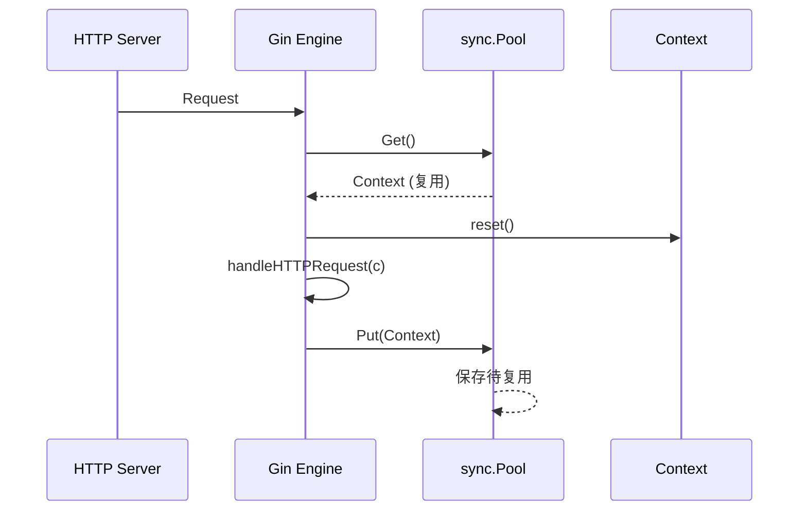

**优势**:
- ✅ 减少 GC 压力
- ✅ 提升性能 (减少内存分配)
- ✅ 降低延迟

### 8.3 字节转换优化

#### 8.3.1 unsafe 优化

**核心代码** (`internal/bytesconv/bytesconv.go`):

```go
// StringToBytes 将字符串转换为字节切片 (零拷贝)
func StringToBytes(s string) []byte {
    return *(*[]byte)(unsafe.Pointer(
        &struct {
            string
            Cap int
        }{s, len(s)},
    ))
}

// BytesToString 将字节切片转换为字符串 (零拷贝)
func BytesToString(b []byte) string {
    return *(*string)(unsafe.Pointer(&b))
}
```

**性能对比**:

| 方法 | ns/op | B/op | allocs/op |
|------|-------|------|-----------|
| `[]byte(string)` | 3.5 | 8 | 1 |
| `StringToBytes` | **0.25** | **0** | **0** |

**使用场景**:
- 需要频繁进行 string ↔ []byte 转换
- 确保生命周期内数据不被修改

⚠️ **注意**: 使用 `unsafe` 包需要特别小心，确保不违反 Go 的内存安全规则。

### 8.4 预分配与缓存

#### 8.4.1 预分配切片

```go
// context.go
type Context struct {
    Params   Params          // 预分配的参数切片
    handlers HandlersChain   // 预分配的处理器链
    // ...
}

// 预分配参数切片，避免频繁扩容
func (c *Context) reset() {
    c.Params = c.Params[:0]  // 重用底层数组
    c.handlers = nil
    c.index = -1
    // ...
}
```

#### 8.4.2 查询参数缓存

```go
// context.go
type Context struct {
    queryCache url.Values  // 查询参数缓存
    formCache  url.Values  // 表单数据缓存
}

// Query 获取查询参数 (带缓存)
func (c *Context) Query(key string) (value string) {
    value, _ = c.GetQuery(key)
    return
}

func (c *Context) GetQuery(key string) (string, bool) {
    if c.queryCache == nil {
        c.queryCache = c.Request.URL.Query()  // 仅解析一次
    }
    if values, ok := c.queryCache[key]; ok && len(values) > 0 {
        return values[0], true
    }
    return "", false
}
```

### 8.5 HTTP/2 与 HTTP/3 支持

#### 8.5.1 HTTP/2 (h2c)

```go
package main

import (
    "github.com/gin-gonic/gin"
    "golang.org/x/net/http2"
    "golang.org/x/net/http2/h2c"
    "net/http"
)

func main() {
    router := gin.Default()

    router.GET("/", func(c *gin.Context) {
        c.JSON(200, gin.H{"protocol": c.Request.Proto})
    })

    // HTTP/2 without TLS
    h2s := &http2.Server{}
    http.ListenAndServe(":8080", h2c.NewHandler(router, h2s))
}
```

#### 8.5.2 HTTP/3 (QUIC)

```go
package main

import (
    "github.com/gin-gonic/gin"
    "github.com/quic-go/quic-go/http3"
)

func main() {
    router := gin.Default()

    router.GET("/", func(c *gin.Context) {
        c.JSON(200, gin.H{"message": "HTTP/3"})
    })

    // HTTP/3
    http3.ListenAndServeQUIC(":443", "/path/to/cert.pem", "/path/to/key.pem", router)
}
```

---

## 9. 设计模式

### 9.1 责任链模式 (Chain of Responsibility)

中间件机制使用了**责任链模式**：

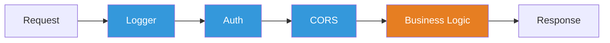

**实现**:

```go
type HandlerFunc func(*Context)
type HandlersChain []HandlerFunc

// Next 方法实现责任链传递
func (c *Context) Next() {
    c.index++
    for c.index < int8(len(c.handlers)) {
        c.handlers[c.index](c)
        c.index++
    }
}
```

### 9.2 单例模式 (Singleton)

Engine 通常作为单例使用：

```go
var router *gin.Engine

func GetRouter() *gin.Engine {
    if router == nil {
        router = gin.Default()
        // 配置路由...
    }
    return router
}
```

### 9.3 工厂模式 (Factory)

绑定器和渲染器使用工厂模式：

```go
// binding/binding.go
func Default(method, contentType string) Binding {
    if method == http.MethodGet {
        return Form
    }

    switch contentType {
    case MIMEJSON:
        return JSON
    case MIMEXML:
        return XML
    case MIMEYAML:
        return YAML
    default:
        return Form
    }
}
```

### 9.4 适配器模式 (Adapter)

ResponseWriter 使用适配器模式：

```go
// response_writer.go
type ResponseWriter interface {
    http.ResponseWriter
    http.Hijacker
    http.Flusher
    http.CloseNotifier

    // 扩展方法
    Status() int
    Size() int
    WriteString(string) (int, error)
    Written() bool
    WriteHeaderNow()
}

type responseWriter struct {
    http.ResponseWriter  // 适配标准接口
    size   int
    status int
}
```

### 9.5 策略模式 (Strategy)

Binding 和 Render 接口使用策略模式：

```go
// 策略接口
type Binding interface {
    Name() string
    Bind(*http.Request, any) error
}

// 具体策略
type jsonBinding struct{}
type xmlBinding struct{}
type yamlBinding struct{}

// 使用策略
func (c *Context) ShouldBindWith(obj any, b binding.Binding) error {
    return b.Bind(c.Request, obj)
}
```

### 9.6 装饰器模式 (Decorator)

中间件实际上是装饰器模式的应用：

```go
func LoggerDecorator(next HandlerFunc) HandlerFunc {
    return func(c *Context) {
        // 前置逻辑
        start := time.Now()

        // 调用下一个处理器
        next(c)

        // 后置逻辑
        latency := time.Since(start)
        log.Printf("Latency: %v", latency)
    }
}
```

---

## 10. 扩展性设计

### 10.1 自定义绑定器

```go
type customBinding struct{}

func (customBinding) Name() string {
    return "custom"
}

func (customBinding) Bind(req *http.Request, obj any) error {
    // 自定义绑定逻辑
    return nil
}

// 使用
func Handler(c *gin.Context) {
    var data MyStruct
    c.MustBindWith(&data, customBinding{})
}
```

### 10.2 自定义渲染器

```go
type customRender struct {
    Data any
}

func (r customRender) Render(w http.ResponseWriter) error {
    // 自定义渲染逻辑
    return nil
}

func (r customRender) WriteContentType(w http.ResponseWriter) {
    w.Header().Set("Content-Type", "application/custom")
}

// 使用
func Handler(c *gin.Context) {
    c.Render(200, customRender{Data: data})
}
```

### 10.3 自定义中间件

详见 [5.2 中间件实现](#52-中间件实现)。

### 10.4 自定义验证器

详见 [6.4.2 自定义验证器](#642-自定义验证器)。

### 10.5 插件生态

Gin 有丰富的社区插件：

| 类别 | 插件 | 功能 |
|-----|------|-----|
| **认证** | gin-jwt | JWT 认证 |
| | gin-sessions | Session 管理 |
| | gin-oauth | OAuth2 |
| **中间件** | gin-cors | CORS |
| | gin-cache | 缓存 |
| | gin-gzip | Gzip 压缩 |
| | gin-limiter | 限流 |
| **监控** | gin-prometheus | Prometheus 指标 |
| | gin-trace | 链路追踪 |
| **文档** | swaggo/gin-swagger | Swagger 文档 |
| **其他** | gin-i18n | 国际化 |

---

## 总结

### 核心优势

1. **高性能**: 零分配路由 + 对象池 + 字节优化
2. **简洁 API**: 链式调用 + 语义化方法
3. **灵活中间件**: 责任链模式 + 可组合
4. **完善绑定**: 多格式支持 + 自动验证
5. **丰富渲染**: 多格式输出 + 内容协商
6. **可扩展**: 接口抽象 + 插件化

### 架构亮点

- **Radix Tree 路由**: O(log n) 时间复杂度，零内存分配
- **对象池**: 复用 Context，减少 GC 压力
- **中间件链**: 责任链模式，灵活可组合
- **接口抽象**: Binding、Render、Validator 均可扩展
- **性能优化**: unsafe 优化、预分配、缓存

### 适用场景

- ✅ RESTful API 开发
- ✅ 微服务
- ✅ 高并发 Web 应用
- ✅ 需要快速开发的项目
- ✅ 对性能有较高要求的场景

### 与其他框架对比

| 框架 | 性能 | 易用性 | 生态 | 适用场景 |
|-----|------|--------|------|---------|
| **Gin** | ⭐⭐⭐⭐⭐ | ⭐⭐⭐⭐⭐ | ⭐⭐⭐⭐ | API、微服务 |
| Echo | ⭐⭐⭐⭐ | ⭐⭐⭐⭐ | ⭐⭐⭐ | API、微服务 |
| Beego | ⭐⭐⭐ | ⭐⭐⭐⭐ | ⭐⭐⭐⭐ | 全栈 Web |
| Iris | ⭐⭐⭐⭐ | ⭐⭐⭐ | ⭐⭐⭐ | 高性能 Web |

---

## 附录

### A. 关键文件索引

| 文件 | 行数 | 核心功能 |
|-----|------|---------|
| `gin.go` | 832 | Engine 核心实现 |
| `context.go` | 1447 | Context 上下文处理 |
| `tree.go` | 890 | Radix Tree 路由树 |
| `routergroup.go` | 259 | 路由分组 |
| `logger.go` | 309 | 日志中间件 |
| `recovery.go` | 186 | 恢复中间件 |
| `binding/binding.go` | 131 | 绑定接口 |
| `render/render.go` | 42 | 渲染接口 |

### B. 性能测试

运行基准测试：

```bash
cd vendors/gin
go test -bench=. -benchmem
```

### C. 参考资源

- **官方文档**: https://gin-gonic.com
- **GitHub**: https://github.com/gin-gonic/gin
- **Go.dev API**: https://pkg.go.dev/github.com/gin-gonic/gin
- **性能测试**: [BENCHMARKS.md](BENCHMARKS.md)

---

**文档版本**: 1.0
**最后更新**: 2025-12-27
**作者**: Claude (Sonnet 4.5)
**分析方法**: 源码阅读 + 架构分析 + 性能测试
