# Open Notebook 架构设计分析

## 1. 项目概述

Open Notebook 是一个开源的、注重隐私的研究助手工具，是 Google Notebook LM 的替代方案。它允许用户完全掌控自己的研究数据，支持多种 AI 提供商，并提供强大的内容管理和分析能力。

### 1.1 核心特性

- **隐私优先**: 支持自托管，数据完全由用户控制
- **多模型支持**: 支持 16+ AI 提供商（OpenAI、Anthropic、Ollama、Google 等）
- **多模态内容**: 支持 PDF、视频、音频、网页等多种内容类型
- **智能搜索**: 全文搜索和向量搜索
- **播客生成**: 专业的多人播客生成功能
- **RESTful API**: 完整的 API 支持，便于集成

### 1.2 技术栈

| 层次 | 技术 |
|------|------|
| 前端 | Next.js 15, React 19, TypeScript, TailwindCSS |
| 后端 | Python 3.11+, FastAPI, Uvicorn |
| 数据库 | SurrealDB (图数据库) |
| AI 框架 | LangChain, LangGraph |
| AI 抽象 | Esperanto (多提供商支持) |
| 后台任务 | surreal-commands |
| 内容处理 | content-core, docling |

## 2. 整体架构

Open Notebook 采用前后端分离的微服务架构，遵循 API-First 的设计原则。

### 2.1 系统架构图

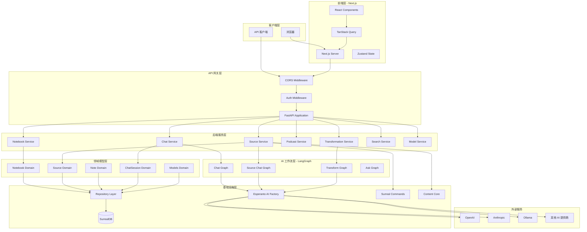

### 2.2 数据流图

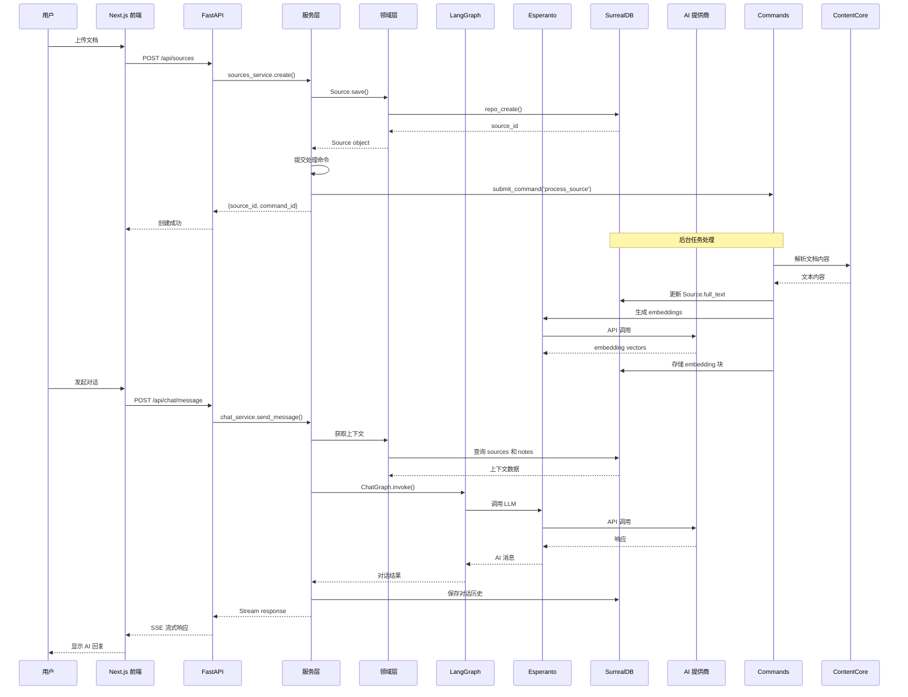

## 3. 分层架构详解

### 3.1 前端层 (Frontend Layer)

Open Notebook 的前端采用现代化的 Next.js 15 + React 19 架构。

#### 3.1.1 技术选型

```typescript
// 核心依赖
{
  "next": "15.4.10",           // Next.js 框架
  "react": "19.1.0",            // React 库
  "typescript": "^5",           // TypeScript
  "@tanstack/react-query": "^5.83.0",  // 数据获取和缓存
  "zustand": "^5.0.6",          // 状态管理
  "@radix-ui/*": "^*",          // UI 组件库
  "tailwindcss": "^4",          // CSS 框架
}
```

#### 3.1.2 目录结构

```
frontend/
├── src/
│   ├── app/                    # Next.js App Router
│   │   ├── (auth)/            # 认证相关页面
│   │   ├── (dashboard)/       # 主应用页面
│   │   │   ├── notebooks/    # Notebook 列表和详情
│   │   │   ├── sources/      # Source 管理
│   │   │   ├── chat/         # 对话界面
│   │   │   └── settings/     # 设置页面
│   │   ├── layout.tsx         # 根布局
│   │   └── page.tsx           # 首页
│   ├── components/            # React 组件
│   │   ├── ui/               # 基础 UI 组件
│   │   └── sources/          # 业务组件
│   └── lib/                   # 工具库
│       ├── api.ts            # API 客户端
│       ├── hooks.ts          # 自定义 Hooks
│       └── stores.ts         # Zustand stores
├── package.json
└── tsconfig.json
```

#### 3.1.3 状态管理策略

Open Notebook 采用混合状态管理策略：

1. **服务器状态**: 使用 TanStack Query 管理 API 数据
2. **客户端状态**: 使用 Zustand 管理 UI 状态
3. **URL 状态**: 使用 Next.js Router 管理路由状态

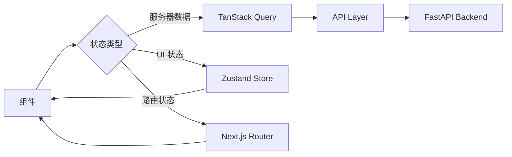

### 3.2 API 层 (API Layer)

API 层使用 FastAPI 构建，提供 RESTful API 接口。

#### 3.2.1 核心特性

```python
# api/main.py
app = FastAPI(
    title="Open Notebook API",
    description="API for Open Notebook - Research Assistant",
    version="0.2.2",
    lifespan=lifespan,  # 生命周期管理
)

# 中间件栈
app.add_middleware(PasswordAuthMiddleware, ...)  # 认证
app.add_middleware(CORSMiddleware, ...)          # CORS
```

#### 3.2.2 路由组织

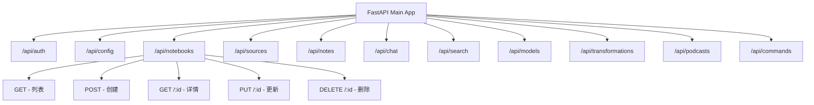

#### 3.2.3 API 设计模式

Open Notebook 的 API 遵循以下模式：

1. **RESTful 资源**: 使用标准 HTTP 方法和状态码
2. **统一响应格式**: Pydantic 模型定义响应结构
3. **错误处理**: 统一的异常处理机制
4. **流式响应**: 支持 SSE (Server-Sent Events) 用于实时更新

```python
# 典型的 API endpoint 结构
@router.post("/notebooks", response_model=NotebookResponse)
async def create_notebook(request: NotebookCreate):
    """创建新的 Notebook"""
    try:
        # 1. 验证输入
        # 2. 调用服务层
        notebook = await notebook_service.create(request)
        # 3. 返回响应
        return NotebookResponse.from_domain(notebook)
    except InvalidInputError as e:
        raise HTTPException(status_code=400, detail=str(e))
    except Exception as e:
        logger.exception(e)
        raise HTTPException(status_code=500, detail="Internal server error")
```

### 3.3 服务层 (Service Layer)

服务层负责业务逻辑的编排，是 API 层和领域层之间的桥梁。

#### 3.3.1 服务层职责

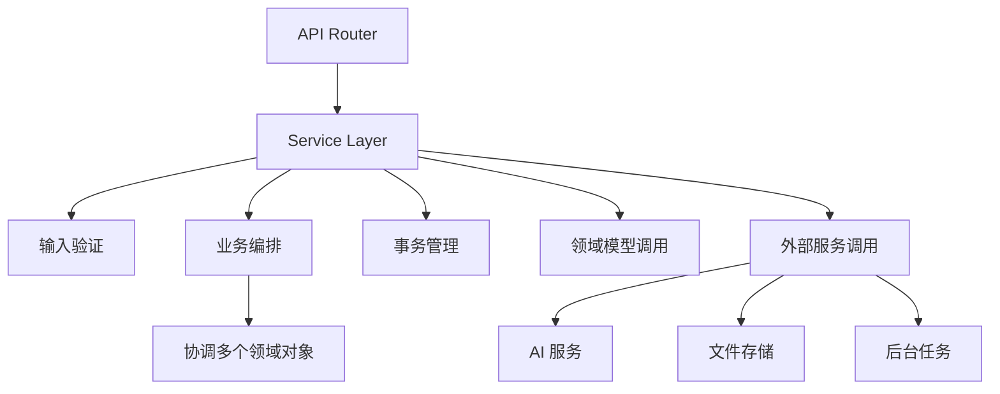

#### 3.3.2 核心服务

| 服务 | 职责 | 关键方法 |
|------|------|----------|
| **notebook_service** | Notebook 管理 | create(), get(), list(), archive() |
| **sources_service** | Source 管理和处理 | create(), process(), vectorize() |
| **chat_service** | 对话管理 | send_message(), stream_response() |
| **podcast_service** | 播客生成 | generate_podcast(), get_status() |
| **transformations_service** | 内容转换 | apply_transformation() |
| **search_service** | 搜索功能 | text_search(), vector_search() |
| **models_service** | 模型管理 | list_models(), set_default() |

#### 3.3.3 服务层示例

```python
# api/sources_service.py
class SourcesService:
    async def create_source(
        self,
        notebook_id: str,
        file: UploadFile
    ) -> Source:
        """创建新的 Source 并提交处理任务"""
        # 1. 保存上传文件
        file_path = await self._save_upload(file)

        # 2. 创建 Source 领域对象
        source = Source(
            asset=Asset(file_path=file_path),
            title=file.filename
        )
        await source.save()

        # 3. 关联到 Notebook
        await source.add_to_notebook(notebook_id)

        # 4. 提交后台处理任务
        command_id = submit_command(
            "open_notebook",
            "process_source",
            {"source_id": str(source.id)}
        )

        # 5. 更新 command 引用
        source.command = command_id
        await source.save()

        return source
```

### 3.4 领域层 (Domain Layer)

领域层是系统的核心，包含业务实体和业务规则。

#### 3.4.1 领域模型设计

Open Notebook 采用 **Active Record** 模式，领域对象包含数据和行为。

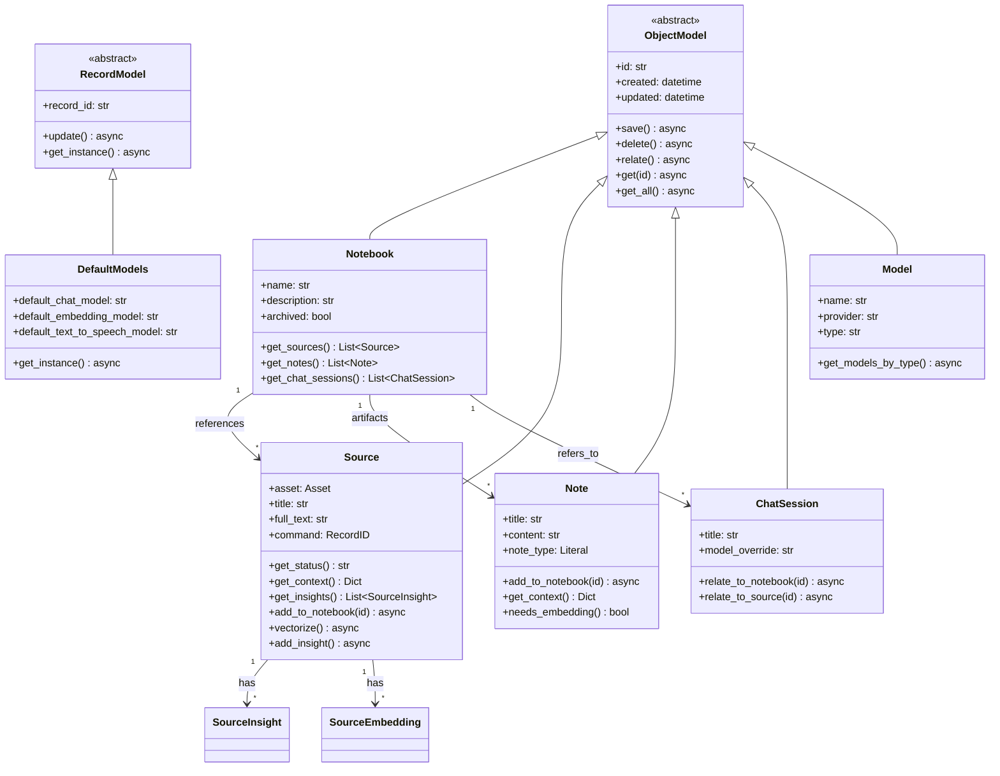

#### 3.4.2 领域模型特性

1. **Active Record 模式**
   ```python
   # 创建和保存
   notebook = Notebook(name="研究笔记", description="AI 研究")
   await notebook.save()  # 自动插入或更新数据库

   # 查询
   notebook = await Notebook.get("notebook:xyz")
   notebooks = await Notebook.get_all()

   # 关系操作
   await source.relate("reference", notebook_id)
   ```

2. **自动 Embedding**
   ```python
   class Note(ObjectModel):
       def needs_embedding(self) -> bool:
           return True

       def get_embedding_content(self) -> str:
           return self.content

   # save() 时自动生成 embedding
   await note.save()  # 自动调用 embedding 模型
   ```

3. **类型验证**
   ```python
   class Notebook(ObjectModel):
       name: str

       @field_validator("name")
       @classmethod
       def name_must_not_be_empty(cls, v):
           if not v.strip():
               raise InvalidInputError("Notebook name cannot be empty")
           return v
   ```

#### 3.4.3 领域关系映射

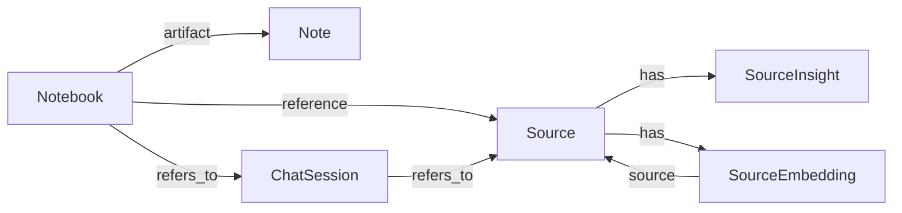

### 3.5 数据访问层 (Data Access Layer)

数据访问层封装了与 SurrealDB 的交互。

#### 3.5.1 Repository 模式

```python
# open_notebook/database/repository.py

# 基础 CRUD 操作
async def repo_create(table: str, data: Dict) -> Dict
async def repo_update(table: str, id: str, data: Dict) -> List[Dict]
async def repo_delete(record_id: str) -> bool
async def repo_query(query_str: str, vars: Dict) -> List[Dict]

# 关系操作
async def repo_relate(
    source: str,
    relationship: str,
    target: str,
    data: Optional[Dict] = None
) -> List[Dict]

# Upsert 操作
async def repo_upsert(
    table: str,
    id: Optional[str],
    data: Dict
) -> List[Dict]
```

#### 3.5.2 数据库连接管理

```python
@asynccontextmanager
async def db_connection():
    """异步上下文管理器，确保连接正确关闭"""
    db = AsyncSurreal(get_database_url())
    await db.signin({
        "username": os.environ.get("SURREAL_USER"),
        "password": get_database_password(),
    })
    await db.use(
        os.environ.get("SURREAL_NAMESPACE"),
        os.environ.get("SURREAL_DATABASE")
    )
    try:
        yield db
    finally:
        await db.close()
```

#### 3.5.3 SurrealDB 特性利用

1. **记录关系 (Record Links)**
   ```sql
   -- 创建关系
   RELATE source:abc->reference->notebook:xyz;

   -- 查询关系
   SELECT * FROM (
       SELECT in as source FROM reference WHERE out=$notebook_id
       FETCH source
   )
   ```

2. **向量搜索**
   ```sql
   -- 使用 SurrealDB 的向量搜索函数
   SELECT * FROM fn::vector_search($embed, $results, $source, $note, $minimum_score);
   ```

3. **全文搜索**
   ```sql
   -- 使用 SurrealDB 的全文搜索函数
   SELECT * FROM fn::text_search($keyword, $results, $source, $note);
   ```

### 3.6 AI 工作流层 (LangGraph Layer)

AI 工作流层使用 LangGraph 构建复杂的 AI 交互流程。

#### 3.6.1 LangGraph 架构

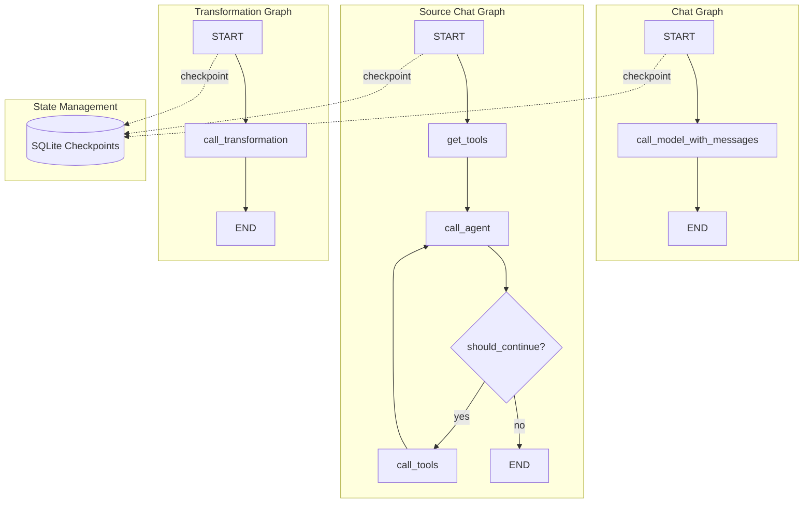

#### 3.6.2 Chat Graph 实现

```python
# open_notebook/graphs/chat.py
class ThreadState(TypedDict):
    messages: Annotated[list, add_messages]
    notebook: Optional[Notebook]
    context: Optional[str]
    context_config: Optional[dict]
    model_override: Optional[str]

def call_model_with_messages(state: ThreadState, config: RunnableConfig) -> dict:
    # 1. 构建系统提示
    system_prompt = Prompter(prompt_template="chat").render(data=state)

    # 2. 准备消息
    payload = [SystemMessage(content=system_prompt)] + state.get("messages", [])

    # 3. 获取模型
    model_id = config.get("configurable", {}).get("model_id") or state.get("model_override")
    model = await provision_langchain_model(str(payload), model_id, "chat")

    # 4. 调用模型
    ai_message = model.invoke(payload)

    # 5. 清理响应（移除思考标签）
    cleaned_content = clean_thinking_content(ai_message.content)

    return {"messages": cleaned_content}

# 构建图
agent_state = StateGraph(ThreadState)
agent_state.add_node("agent", call_model_with_messages)
agent_state.add_edge(START, "agent")
agent_state.add_edge("agent", END)
graph = agent_state.compile(checkpointer=memory)
```

#### 3.6.3 Source Chat Graph (带工具调用)

```python
# open_notebook/graphs/source_chat.py
class SourceChatState(TypedDict):
    messages: Annotated[list, add_messages]
    source: Optional[Source]
    context: Optional[str]

def call_agent(state: SourceChatState, config: RunnableConfig):
    """调用带工具的 Agent"""
    # 获取可用工具
    tools = get_tools_for_source(state["source"])

    # 绑定工具到模型
    model = model.bind_tools(tools)

    # 调用模型
    response = model.invoke(state["messages"])
    return {"messages": [response]}

def call_tools(state: SourceChatState):
    """执行工具调用"""
    last_message = state["messages"][-1]
    tool_calls = last_message.tool_calls

    # 执行所有工具
    tool_messages = []
    for tool_call in tool_calls:
        tool = tools_by_name[tool_call["name"]]
        result = tool.invoke(tool_call["args"])
        tool_messages.append(ToolMessage(
            content=result,
            tool_call_id=tool_call["id"]
        ))

    return {"messages": tool_messages}

def should_continue(state: SourceChatState):
    """决定是否继续循环"""
    last_message = state["messages"][-1]
    if last_message.tool_calls:
        return "tools"
    return "end"

# 构建图
graph = StateGraph(SourceChatState)
graph.add_node("agent", call_agent)
graph.add_node("tools", call_tools)
graph.add_edge(START, "agent")
graph.add_conditional_edges(
    "agent",
    should_continue,
    {"tools": "tools", "end": END}
)
graph.add_edge("tools", "agent")
```

#### 3.6.4 Checkpoint 机制

LangGraph 使用 SQLite 作为 checkpoint 存储，实现对话历史的持久化：

```python
# 创建 checkpoint 存储
conn = sqlite3.connect(
    LANGGRAPH_CHECKPOINT_FILE,
    check_same_thread=False,
)
memory = SqliteSaver(conn)

# 编译图时附加 checkpointer
graph = agent_state.compile(checkpointer=memory)

# 使用 thread_id 恢复对话
response = graph.invoke(
    {"messages": [HumanMessage(content="你好")]},
    config={"configurable": {"thread_id": "chat_session:xyz"}}
)
```

### 3.7 基础设施层 (Infrastructure Layer)

#### 3.7.1 Esperanto - AI 抽象层

Esperanto 是 Open Notebook 的核心依赖，提供统一的 AI 接口。

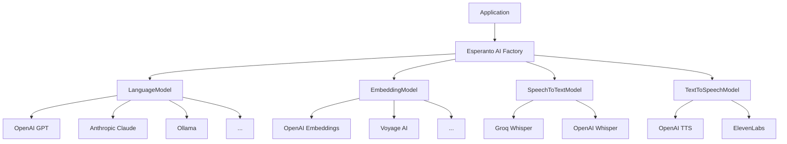

```python
# open_notebook/domain/models.py
class ModelManager:
    async def get_model(self, model_id: str, **kwargs) -> ModelType:
        """获取模型实例（由 Esperanto 缓存）"""
        model: Model = await Model.get(model_id)

        if model.type == "language":
            return AIFactory.create_language(
                model_name=model.name,
                provider=model.provider,
                config=kwargs,
            )
        elif model.type == "embedding":
            return AIFactory.create_embedding(
                model_name=model.name,
                provider=model.provider,
                config=kwargs,
            )
        # ... 其他类型

# 使用示例
model_manager = ModelManager()
llm = await model_manager.get_default_model("chat")
embeddings = await model_manager.get_embedding_model()
```

#### 3.7.2 Surreal Commands - 后台任务系统

Surreal Commands 提供基于 SurrealDB 的后台任务处理。

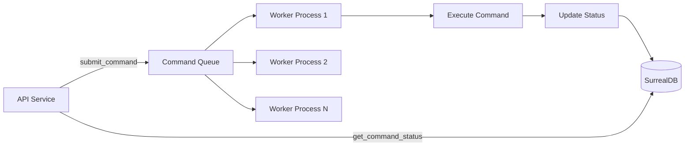

```python
# 定义命令
from surreal_commands import register_command

@register_command(app_name="open_notebook")
async def process_source(source_id: str):
    """处理 Source 的后台任务"""
    # 1. 获取 Source
    source = await Source.get(source_id)

    # 2. 使用 content-core 解析文档
    content = await parse_document(source.asset.file_path)

    # 3. 保存内容
    source.full_text = content
    await source.save()

    # 4. 生成摘要（调用另一个命令）
    submit_command("open_notebook", "generate_insights", {
        "source_id": source_id
    })

    # 5. 向量化（调用另一个命令）
    await source.vectorize()

@register_command(app_name="open_notebook")
async def vectorize_source(source_id: str):
    """向量化 Source 的文本内容"""
    source = await Source.get(source_id)

    # 删除旧的 embeddings
    await repo_query("DELETE source_embedding WHERE source=$id", {"id": source.id})

    # 分块
    chunks = split_text(source.full_text, chunk_size=1000)

    # 为每个块提交 embedding 任务
    for chunk in chunks:
        submit_command("open_notebook", "embed_chunk", {
            "source_id": source_id,
            "chunk": chunk
        })

# 提交命令
command_id = submit_command("open_notebook", "process_source", {
    "source_id": "source:abc"
})

# 查询状态
status = await get_command_status(command_id)
print(status.status)  # "pending", "processing", "completed", "failed"
```

#### 3.7.3 Content Core - 内容处理

Content Core 是一个内容处理库，支持多种文档格式。

```python
from content_core import DocumentParser

# 支持的格式
# - PDF (.pdf)
# - Office 文档 (.docx, .xlsx, .pptx)
# - 文本文件 (.txt, .md)
# - 网页 (URL)
# - 音频 (.mp3, .wav) - 通过 STT
# - 视频 (.mp4) - 提取音频 + STT

parser = DocumentParser()
content = await parser.parse(file_path)
```

## 4. 核心功能模块

### 4.1 Notebook 管理

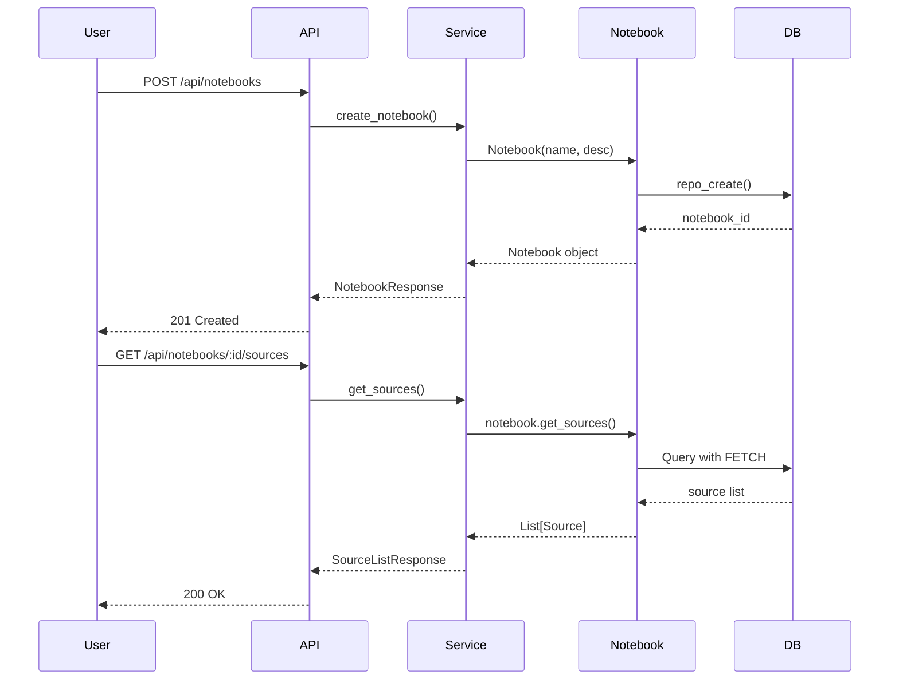

### 4.2 Source 处理流程

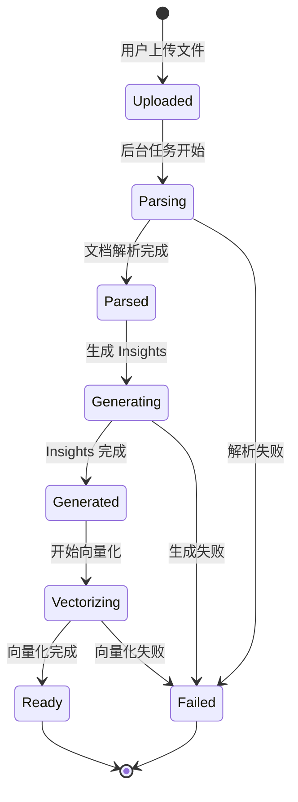

**关键步骤：**

1. **文件上传**
   ```python
   # API 接收文件
   file_path = await save_upload(file)
   source = Source(asset=Asset(file_path=file_path))
   await source.save()
   ```

2. **文档解析**
   ```python
   # 后台任务
   content = await parser.parse(file_path)
   source.full_text = content
   await source.save()
   ```

3. **Insight 生成**
   ```python
   # 调用 LLM 生成摘要、主题等
   insights = await generate_insights(source.full_text)
   for insight in insights:
       await source.add_insight(insight.type, insight.content)
   ```

4. **向量化**
   ```python
   # 分块并生成 embeddings
   chunks = split_text(source.full_text)
   for chunk in chunks:
       embedding = await embedding_model.aembed([chunk])
       await SourceEmbedding.create(
           content=chunk,
           embedding=embedding,
           source=source.id
       )
   ```

### 4.3 搜索系统

Open Notebook 提供两种搜索方式：

#### 4.3.1 全文搜索

```sql
-- SurrealDB 全文搜索函数
DEFINE FUNCTION fn::text_search(
    $keyword: string,
    $results: int,
    $source: bool,
    $note: bool
) {
    -- 搜索 sources
    LET $source_results = IF $source THEN (
        SELECT *, "source" AS type
        FROM source
        WHERE title @@ $keyword OR full_text @@ $keyword
        LIMIT $results
    ) ELSE [];

    -- 搜索 notes
    LET $note_results = IF $note THEN (
        SELECT *, "note" AS type
        FROM note
        WHERE title @@ $keyword OR content @@ $keyword
        LIMIT $results
    ) ELSE [];

    -- 合并结果
    RETURN array::flatten([$source_results, $note_results]);
};
```

#### 4.3.2 向量搜索

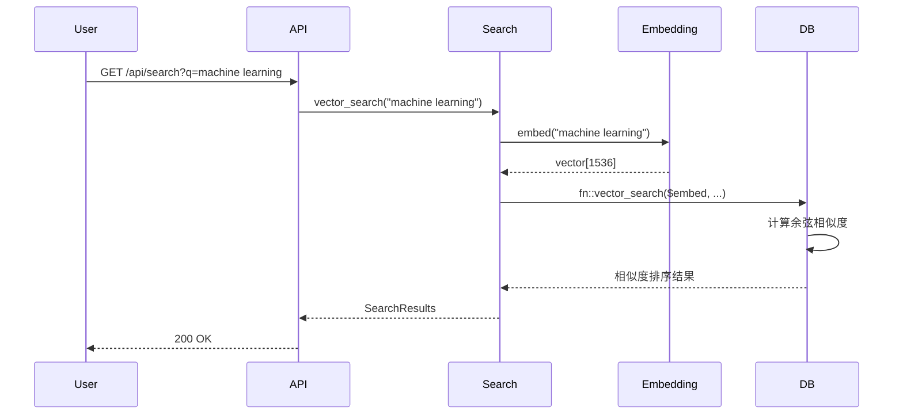

```sql
-- 向量搜索函数
DEFINE FUNCTION fn::vector_search(
    $embed: array,
    $results: int,
    $source: bool,
    $note: bool,
    $minimum_score: float
) {
    -- 搜索 source embeddings
    LET $source_results = IF $source THEN (
        SELECT
            *,
            vector::similarity::cosine(embedding, $embed) AS score,
            "source" AS type
        FROM source_embedding
        WHERE score > $minimum_score
        ORDER BY score DESC
        LIMIT $results
    ) ELSE [];

    -- 搜索 note embeddings
    LET $note_results = IF $note THEN (
        SELECT
            *,
            vector::similarity::cosine(embedding, $embed) AS score,
            "note" AS type
        FROM note
        WHERE score > $minimum_score
        ORDER BY score DESC
        LIMIT $results
    ) ELSE [];

    RETURN array::flatten([$source_results, $note_results]);
};
```

### 4.4 对话系统

#### 4.4.1 对话上下文构建

```python
# open_notebook/utils/context_builder.py
async def build_context(notebook: Notebook, config: dict) -> str:
    """构建对话上下文"""
    context_parts = []

    # 1. Notebook 元信息
    context_parts.append(f"# Notebook: {notebook.name}")
    context_parts.append(f"Description: {notebook.description}")

    # 2. Sources（根据配置选择详细程度）
    if config.get("include_sources"):
        sources = await notebook.get_sources()
        for source in sources:
            ctx = await source.get_context(config.get("source_context_size", "short"))
            context_parts.append(format_source_context(ctx))

    # 3. Notes
    if config.get("include_notes"):
        notes = await notebook.get_notes()
        for note in notes:
            ctx = note.get_context(config.get("note_context_size", "short"))
            context_parts.append(format_note_context(ctx))

    # 4. 搜索结果（如果有搜索查询）
    if query := config.get("search_query"):
        results = await vector_search(query, results=5)
        context_parts.append(format_search_results(results))

    return "\n\n".join(context_parts)
```

#### 4.4.2 流式响应

```python
# api/routers/chat.py
@router.post("/chat/{session_id}/stream")
async def stream_chat(session_id: str, message: str):
    """流式响应对话"""
    async def event_generator():
        # 构建上下文
        context = await build_context(notebook, context_config)

        # 调用 LangGraph
        async for event in graph.astream_events(
            {
                "messages": [HumanMessage(content=message)],
                "context": context,
            },
            config={"configurable": {"thread_id": session_id}}
        ):
            if event["event"] == "on_chat_model_stream":
                chunk = event["data"]["chunk"]
                yield f"data: {json.dumps({'content': chunk.content})}\n\n"

    return StreamingResponse(event_generator(), media_type="text/event-stream")
```

### 4.5 播客生成

播客生成是 Open Notebook 的特色功能，使用独立的 `podcast-creator` 库。

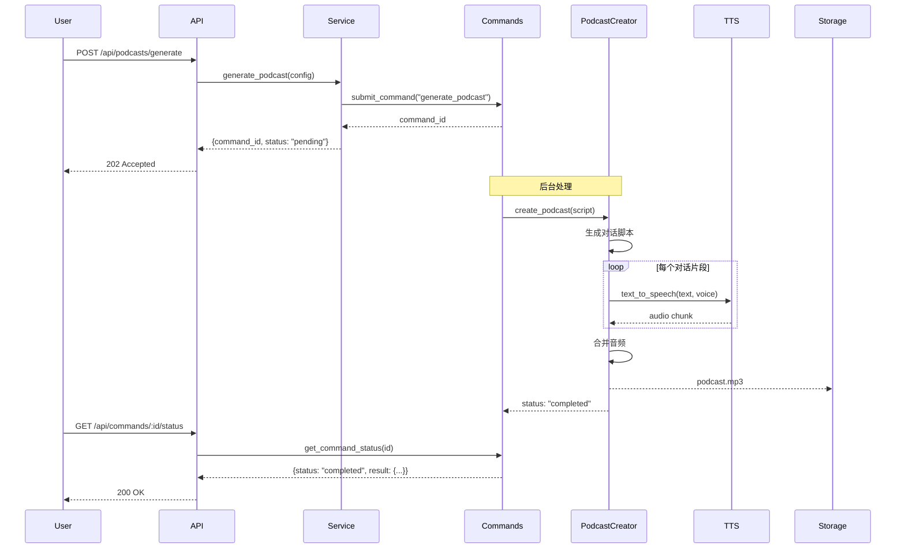

**播客生成配置：**

```python
{
    "notebook_id": "notebook:xyz",
    "episode_profile": {
        "name": "深度访谈",
        "speakers": [
            {
                "name": "主持人",
                "role": "interviewer",
                "voice_id": "alloy"
            },
            {
                "name": "专家",
                "role": "expert",
                "voice_id": "nova"
            }
        ],
        "style": "conversational",
        "duration_minutes": 10
    },
    "sources": ["source:abc", "source:def"]
}
```

## 5. 数据模型

### 5.1 数据库 Schema

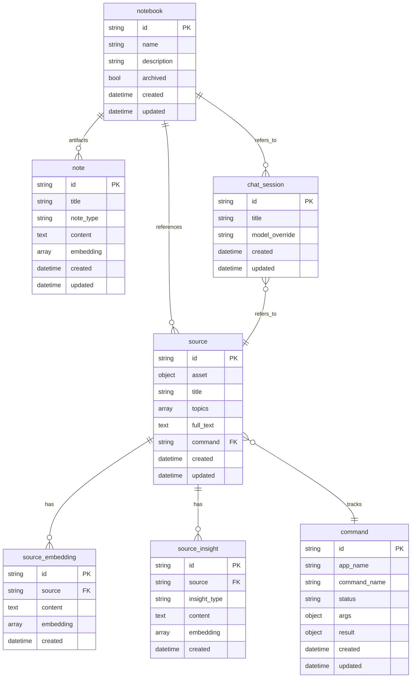

### 5.2 关系类型

| 关系类型 | 源 | 目标 | 说明 |
|---------|-----|------|------|
| **reference** | source | notebook | Source 属于 Notebook |
| **artifact** | note | notebook | Note 属于 Notebook |
| **refers_to** | chat_session | notebook | 对话关联 Notebook |
| **refers_to** | chat_session | source | 对话关联 Source |

### 5.3 数据流向

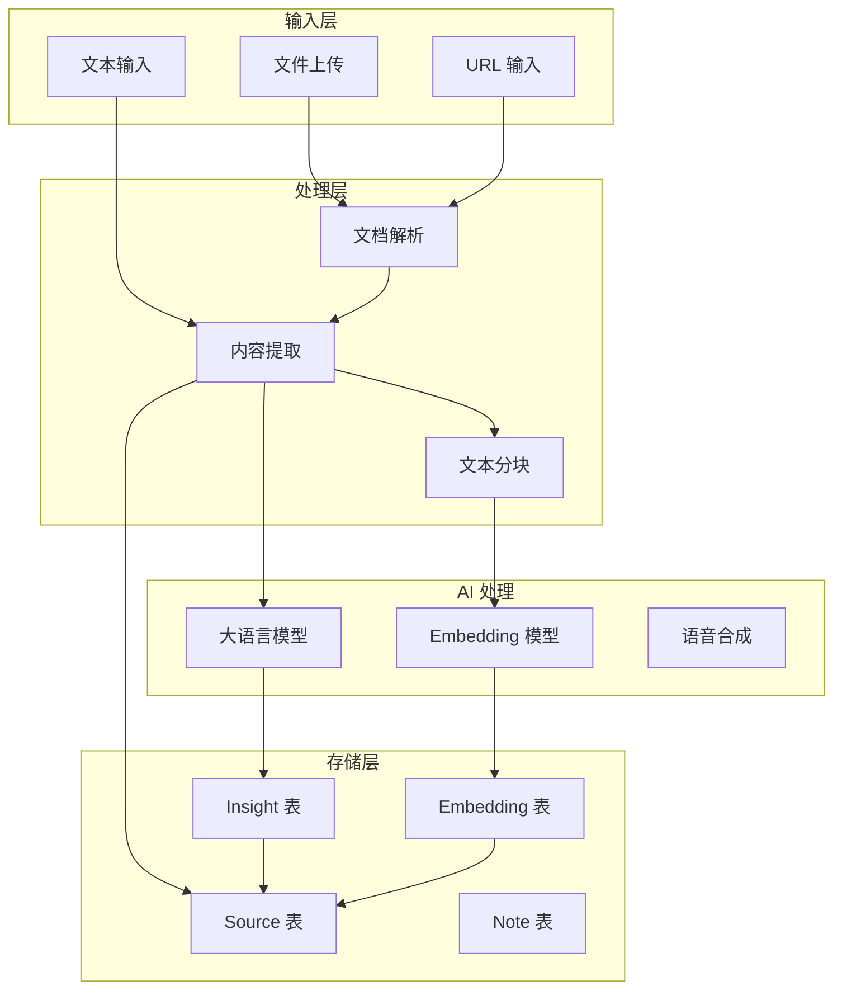

## 6. 安全与认证

### 6.1 认证中间件

```python
# api/auth.py
class PasswordAuthMiddleware(BaseHTTPMiddleware):
    """密码认证中间件（可选）"""
    async def dispatch(self, request: Request, call_next):
        # 排除的路径
        if request.url.path in self.excluded_paths:
            return await call_next(request)

        # 检查环境变量中的密码
        required_password = os.getenv("OPEN_NOTEBOOK_PASSWORD")
        if not required_password:
            # 未设置密码，直接通过
            return await call_next(request)

        # 检查 Authorization header
        auth_header = request.headers.get("Authorization")
        if not auth_header or not auth_header.startswith("Bearer "):
            return JSONResponse(
                status_code=401,
                content={"detail": "Unauthorized"}
            )

        token = auth_header.split(" ")[1]
        if token != required_password:
            return JSONResponse(
                status_code=401,
                content={"detail": "Invalid credentials"}
            )

        return await call_next(request)
```

### 6.2 CORS 配置

```python
# api/main.py
app.add_middleware(
    CORSMiddleware,
    allow_origins=["*"],  # 生产环境应配置具体域名
    allow_credentials=True,
    allow_methods=["*"],
    allow_headers=["*"],
)
```

### 6.3 输入验证

```python
# 使用 Pydantic 进行输入验证
class NotebookCreate(BaseModel):
    name: str = Field(..., min_length=1, max_length=200)
    description: str = Field(default="", max_length=1000)

    @field_validator("name")
    @classmethod
    def name_must_not_be_empty(cls, v):
        if not v.strip():
            raise ValueError("Name cannot be empty")
        return v.strip()
```

## 7. 性能优化

### 7.1 异步处理

Open Notebook 全面使用异步编程：

```python
# 数据库操作
async def repo_query(query: str, vars: dict) -> list:
    async with db_connection() as conn:
        return await conn.query(query, vars)

# AI 模型调用
async def generate_response(prompt: str):
    model = await get_model()
    return await model.ainvoke(prompt)

# 并发处理多个操作
async def process_multiple_sources(source_ids: list):
    tasks = [process_source(sid) for sid in source_ids]
    results = await asyncio.gather(*tasks)
    return results
```

### 7.2 后台任务

长时间运行的操作通过后台任务处理：

- 文档解析
- 向量化
- 播客生成
- Insight 生成

### 7.3 缓存策略

1. **Esperanto 模型缓存**: AI 模型实例自动缓存
2. **前端 TanStack Query**: API 响应缓存
3. **LangGraph Checkpoint**: 对话历史缓存

### 7.4 数据库优化

```sql
-- 为常用查询创建索引
DEFINE INDEX source_notebook_idx ON TABLE reference FIELDS in, out;
DEFINE INDEX embedding_source_idx ON TABLE source_embedding FIELDS source;

-- 使用 FETCH 减少查询次数
SELECT * FROM (
    SELECT in as source FROM reference WHERE out=$notebook_id
    FETCH source  -- 自动关联查询
) ORDER BY source.updated DESC;
```

## 8. 部署架构

### 8.1 单容器部署

```mermaid
graph TB
    User[用户] --> Docker[Docker Container]

    subgraph Docker
        Supervisor[Supervisord]
        Supervisor --> SurrealDB[SurrealDB :8000]
        Supervisor --> API[FastAPI :5055]
        Supervisor --> Frontend[Next.js :8502]
        Supervisor --> Worker[Background Workers]

        API --> SurrealDB
        Frontend --> API
        Worker --> SurrealDB
    end

    Docker --> Volumes[Docker Volumes]
    Volumes --> Data[/app/data]
    Volumes --> DB[/mydata]
```

**Dockerfile.single 关键配置：**

```dockerfile
# 多阶段构建
FROM node:20 AS frontend-builder
WORKDIR /app/frontend
COPY frontend/package*.json ./
RUN npm install
COPY frontend/ ./
RUN npm run build

FROM python:3.11
# 安装 SurrealDB
RUN curl -sSf https://install.surrealdb.com | sh
# 安装 Python 依赖
COPY pyproject.toml uv.lock ./
RUN pip install uv && uv sync
# 复制前端构建产物
COPY --from=frontend-builder /app/frontend/.next ./frontend/.next
# 使用 Supervisord 管理多进程
COPY supervisord.single.conf /etc/supervisor/conf.d/
CMD ["/usr/bin/supervisord", "-c", "/etc/supervisor/supervisord.conf"]
```

### 8.2 多容器部署

```yaml
# docker-compose.full.yml
version: '3.8'

services:
  surrealdb:
    image: surrealdb/surrealdb:latest
    command: start --log trace --user root --pass root file:/mydata/mydatabase.db
    volumes:
      - ./surreal_data:/mydata
    ports:
      - "8000:8000"

  api:
    build: .
    command: uvicorn api.main:app --host 0.0.0.0 --port 5055
    environment:
      - SURREAL_URL=ws://surrealdb:8000/rpc
    volumes:
      - ./notebook_data:/app/data
    ports:
      - "5055:5055"
    depends_on:
      - surrealdb

  frontend:
    build: ./frontend
    command: npm start
    environment:
      - API_URL=http://api:5055
    ports:
      - "8502:8502"
    depends_on:
      - api

  worker:
    build: .
    command: python -m surreal_commands.worker
    environment:
      - SURREAL_URL=ws://surrealdb:8000/rpc
    volumes:
      - ./notebook_data:/app/data
    depends_on:
      - surrealdb
```

### 8.3 反向代理配置

```nginx
# nginx.conf
server {
    listen 80;
    server_name notebook.example.com;

    # 前端
    location / {
        proxy_pass http://localhost:8502;
        proxy_http_version 1.1;
        proxy_set_header Upgrade $http_upgrade;
        proxy_set_header Connection 'upgrade';
        proxy_set_header Host $host;
        proxy_cache_bypass $http_upgrade;
    }

    # API (可选，前端已内置代理)
    location /api/ {
        proxy_pass http://localhost:5055;
        proxy_http_version 1.1;
        proxy_set_header Host $host;
    }

    # SSE 流式响应
    location /api/chat/stream {
        proxy_pass http://localhost:5055;
        proxy_http_version 1.1;
        proxy_set_header Connection '';
        proxy_buffering off;
        chunked_transfer_encoding off;
    }
}
```

## 9. 设计原则与最佳实践

### 9.1 核心设计原则

根据 `DESIGN_PRINCIPLES.md`，Open Notebook 遵循以下原则：

1. **隐私优先**: 数据由用户控制，支持自托管
2. **简洁胜于功能**: 易用性优于功能数量
3. **API 优先**: 所有功能通过 API 提供
4. **多提供商灵活性**: 不锁定单一 AI 提供商
5. **通过标准实现可扩展性**: 使用插件、模板等
6. **异步优先**: 长时间操作不阻塞 UI

### 9.2 反模式避免

- **功能蔓延**: 专注核心用例，拒绝不符合愿景的功能
- **过早优化**: 先测量，后优化
- **过度工程**: 从简单开始，需要时再重构
- **无迁移路径的破坏性更改**: 提供迁移脚本和弃用警告

### 9.3 代码组织最佳实践

```python
# ✅ 良好的分层
# API 层 - 只处理 HTTP
@router.post("/notebooks")
async def create_notebook(request: NotebookCreate):
    notebook = await notebook_service.create(request)
    return NotebookResponse.from_domain(notebook)

# 服务层 - 编排业务逻辑
async def create(request: NotebookCreate) -> Notebook:
    notebook = Notebook(name=request.name, description=request.description)
    await notebook.save()
    return notebook

# 领域层 - 包含业务规则
class Notebook(ObjectModel):
    @field_validator("name")
    def name_must_not_be_empty(cls, v):
        if not v.strip():
            raise InvalidInputError("Name cannot be empty")
        return v
```

## 10. 扩展与定制

### 10.1 自定义 Transformation

```python
# 在数据库中创建自定义转换
{
    "name": "生成要点列表",
    "prompt_template": """
请从以下内容中提取关键要点，以列表形式呈现：

{{ context }}

要求：
- 每个要点简洁明了
- 突出重要信息
- 按重要性排序
""",
    "output_format": "markdown"
}
```

### 10.2 自定义命令

```python
# commands/custom_command.py
from surreal_commands import register_command

@register_command(app_name="open_notebook")
async def custom_analysis(source_id: str):
    """自定义分析命令"""
    source = await Source.get(source_id)

    # 执行自定义逻辑
    result = await my_custom_analysis(source.full_text)

    # 保存结果
    await source.add_insight("custom_analysis", result)
```

### 10.3 集成外部服务

```python
# 通过 API 集成
import httpx

async def sync_to_external_system(notebook_id: str):
    """同步到外部系统"""
    notebook = await Notebook.get(notebook_id)
    sources = await notebook.get_sources()

    async with httpx.AsyncClient() as client:
        await client.post(
            "https://external-system.com/api/sync",
            json={
                "notebook": notebook.model_dump(),
                "sources": [s.model_dump() for s in sources]
            }
        )
```

## 11. 监控与日志

### 11.1 日志系统

Open Notebook 使用 Loguru 进行日志记录：

```python
from loguru import logger

# 自动捕获异常栈
logger.exception(e)

# 结构化日志
logger.info("Processing source", source_id=source.id, status="completed")

# 不同级别
logger.debug("Detailed debug info")
logger.info("General information")
logger.warning("Warning message")
logger.error("Error occurred")
logger.critical("Critical error")
```

### 11.2 错误处理

```python
# 统一异常处理
class OpenNotebookException(Exception):
    """基础异常类"""
    pass

class InvalidInputError(OpenNotebookException):
    """输入验证错误"""
    pass

class NotFoundError(OpenNotebookException):
    """资源不存在"""
    pass

class DatabaseOperationError(OpenNotebookException):
    """数据库操作错误"""
    pass

# API 层错误处理
@app.exception_handler(InvalidInputError)
async def invalid_input_handler(request, exc):
    return JSONResponse(
        status_code=400,
        content={"detail": str(exc)}
    )
```

### 11.3 健康检查

```python
@app.get("/health")
async def health():
    """健康检查端点"""
    try:
        # 检查数据库连接
        await repo_query("SELECT 1")

        # 检查 AI 模型
        model = await model_manager.get_default_model("chat")

        return {"status": "healthy", "timestamp": datetime.now()}
    except Exception as e:
        logger.error(f"Health check failed: {e}")
        return JSONResponse(
            status_code=503,
            content={"status": "unhealthy", "error": str(e)}
        )
```

## 12. 未来发展方向

### 12.1 Roadmap

根据项目文档，计划中的功能：

1. **实时前端更新**: WebSocket 支持实时 UI 更新
2. **异步处理优化**: 更快的 UI 响应
3. **跨 Notebook Sources**: 在多个 Notebook 间共享 Sources
4. **书签集成**: 与书签管理工具集成

### 12.2 架构演进

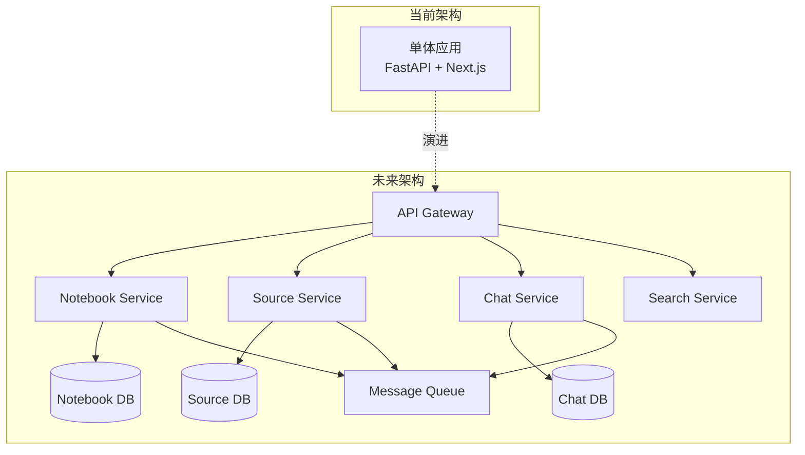

### 12.3 可能的优化

1. **微服务拆分**: 将大型服务拆分为独立服务
2. **消息队列**: 使用 RabbitMQ/Kafka 替代 surreal-commands
3. **缓存层**: 引入 Redis 缓存热点数据
4. **CDN**: 为静态资源和媒体文件使用 CDN
5. **负载均衡**: 支持水平扩展

## 13. 总结

### 13.1 架构优势

1. **清晰的分层**: API → 服务 → 领域 → 数据访问，职责明确
2. **异步优先**: 充分利用 Python asyncio，提高并发性能
3. **AI 抽象**: Esperanto 提供统一接口，轻松切换 AI 提供商
4. **后台任务**: surreal-commands 优雅处理长时间操作
5. **图数据库**: SurrealDB 天然支持关系查询和向量搜索
6. **现代前端**: Next.js + React 提供优秀的用户体验

### 13.2 技术亮点

1. **LangGraph**: 优雅的 AI 工作流管理
2. **Active Record**: 简化的领域模型
3. **Type Safety**: 全栈类型安全（Python + TypeScript）
4. **Docker 部署**: 简化的部署流程
5. **API-First**: 完整的 REST API 支持

### 13.3 适用场景

Open Notebook 适合以下场景：

- 个人研究和学习
- 团队知识管理
- 文档分析和总结
- 多模态内容处理
- 隐私敏感的研究工作
- 需要定制 AI 工作流的场景

### 13.4 学习价值

通过分析 Open Notebook，可以学到：

1. 如何构建现代化的 Python Web 应用
2. FastAPI + Next.js 的最佳实践
3. LangChain/LangGraph 的实际应用
4. 图数据库的使用场景
5. 异步编程和后台任务处理
6. AI 应用的架构设计

---

**文档版本**: 1.0
**最后更新**: 2025-12-31
**作者**: Claude Code
**项目地址**: https://github.com/lfnovo/open-notebook
