# Open Notebook 架构分析文档

## 1. 项目概述

Open Notebook 是一个隐私优先的 AI 研究助手平台，类似于 Google NotebookLM 的开源替代方案。它允许用户上传文档、生成笔记、进行 AI 对话，并支持播客生成等高级功能。

### 1.1 核心特性

- **多来源内容管理**: 支持 PDF、DOCX、视频、音频、网页等多种格式
- **AI 驱动的内容处理**: 自动摘要、洞察提取、内容转换
- **智能对话**: 基于上下文的 AI 聊天，支持多轮对话
- **向量搜索**: 基于嵌入向量的语义搜索
- **播客生成**: 将研究内容转换为播客节目
- **多 AI 供应商支持**: 支持 16+ 个 LLM 提供商

### 1.2 技术栈总览

| 层级 | 技术选型 |
|------|----------|
| 前端 | Next.js 15, React 19, TypeScript, Tailwind CSS |
| 状态管理 | Zustand, TanStack React Query |
| 后端 | Python 3.11+, FastAPI, Uvicorn |
| AI/ML | LangChain, LangGraph, Esperanto |
| 数据库 | SurrealDB (多模型数据库) |
| 部署 | Docker, Supervisor |

---

## 2. 系统架构总览

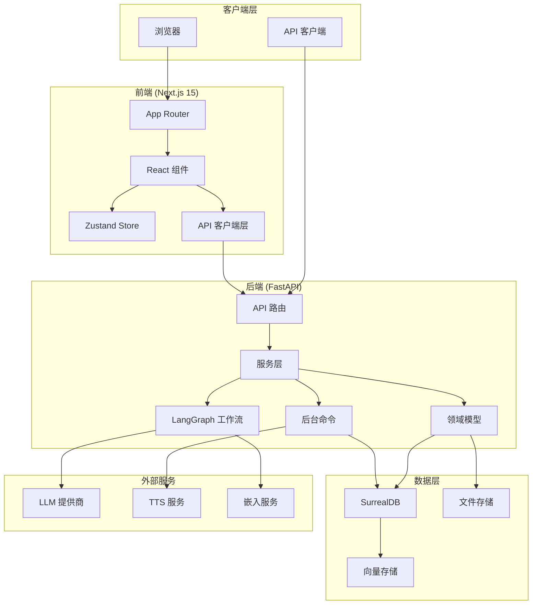

---

## 3. 目录结构

```
open-notebook/
├── api/                          # FastAPI 后端路由和服务
│   ├── main.py                   # 应用入口
│   └── routers/                  # API 路由定义
├── open_notebook/                # 核心领域逻辑
│   ├── domain/                   # 业务领域模型
│   ├── database/                 # 数据库层和 ORM
│   ├── graphs/                   # LangGraph 工作流定义
│   ├── plugins/                  # 插件系统
│   └── utils/                    # 工具函数
├── frontend/                     # Next.js React 前端
│   └── src/
│       ├── app/                  # App Router 页面
│       ├── components/           # React 组件
│       ├── lib/                  # 共享工具和 hooks
│       └── types/                # TypeScript 类型定义
├── commands/                     # 后台命令处理器
├── migrations/                   # 数据库迁移 (SurrealQL)
├── prompts/                      # Jinja2 提示词模板
├── tests/                        # 测试套件
└── scripts/                      # 部署和工具脚本
```

---

## 4. 前端架构

### 4.1 整体架构

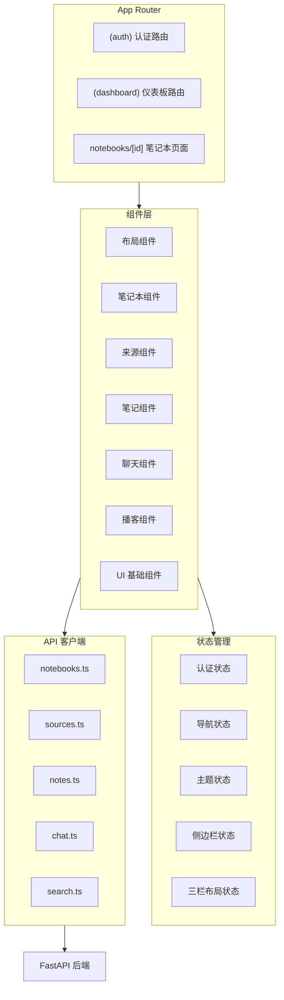

### 4.2 组件结构

```
frontend/src/components/
├── auth/                  # 登录/注册表单
├── common/                # 共享工具组件
├── errors/                # 错误显示
├── layout/                # Header, Sidebar, MainLayout
├── notebooks/             # 笔记本管理 UI
├── podcasts/              # 播客生成 UI
├── search/                # 搜索界面
├── source/                # 单个来源视图
├── sources/               # 来源列表管理
├── ui/                    # Radix UI 封装组件
└── providers/             # Context Providers
```

### 4.3 三栏布局设计

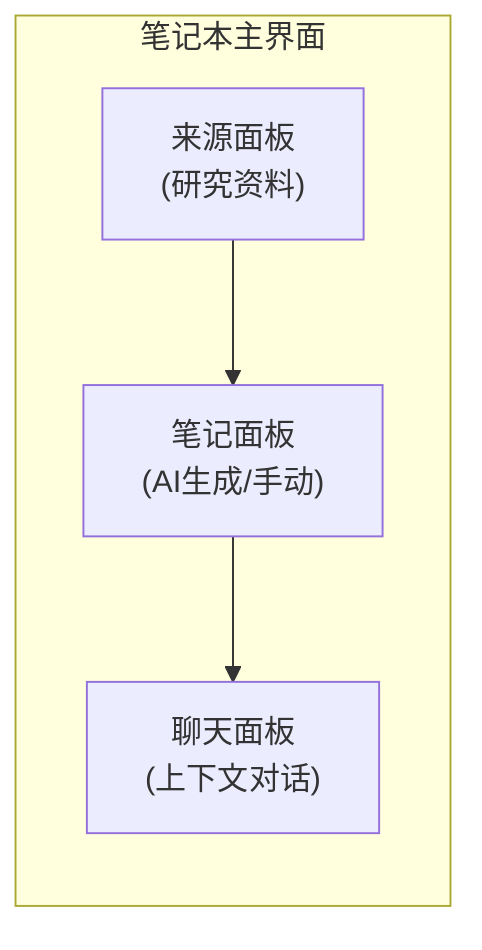

### 4.4 状态管理 (Zustand)

| Store | 用途 |
|-------|------|
| `authStore` | 认证令牌和用户状态 |
| `navigationStore` | 当前视图和导航状态 |
| `themeStore` | 暗/亮主题偏好 |
| `sidebarStore` | 侧边栏展开/折叠状态 |
| `notebookColumnsStore` | 三栏布局状态管理 |

### 4.5 前端技术依赖

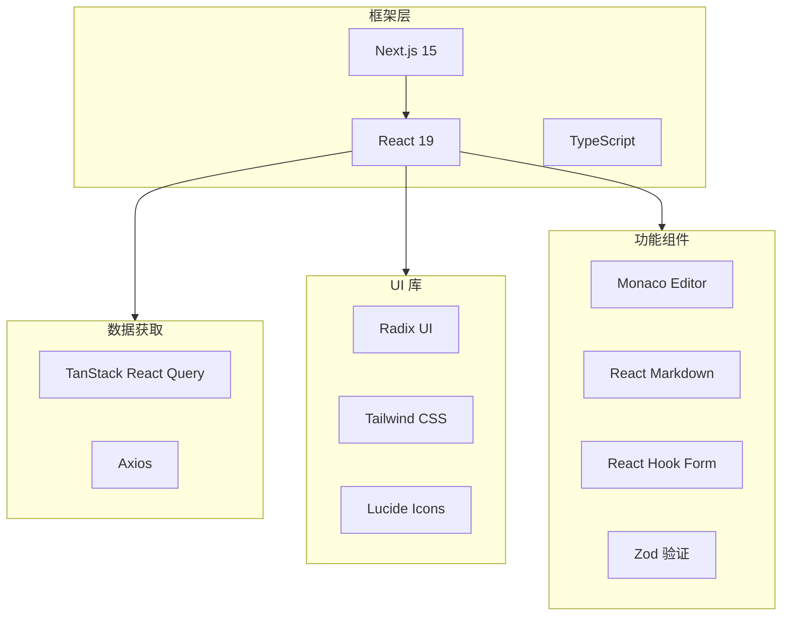

---

## 5. 后端架构

### 5.1 分层架构

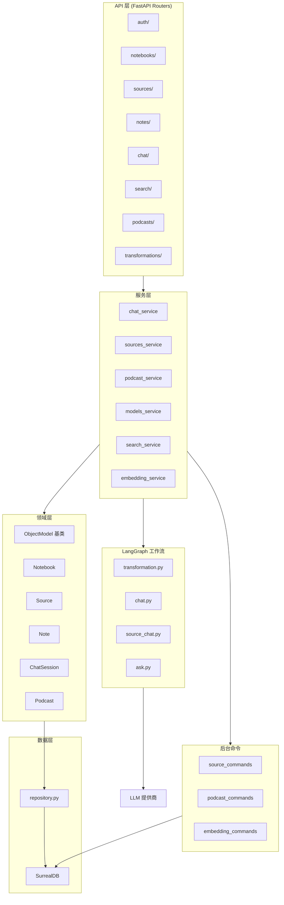

### 5.2 API 路由列表

| 路由前缀 | 功能描述 |
|----------|----------|
| `/api/auth/` | 密码认证、状态检查 |
| `/api/config/` | 运行时配置 |
| `/api/notebooks/` | 笔记本 CRUD 操作 |
| `/api/sources/` | 来源上传、检索、删除 |
| `/api/notes/` | 笔记管理 |
| `/api/chat/` | 聊天会话和消息 |
| `/api/source-chat/` | 来源特定聊天 |
| `/api/search/` | 全文和向量搜索 |
| `/api/embeddings/` | 向量嵌入和重建 |
| `/api/transformations/` | 内容转换 |
| `/api/insights/` | AI 生成洞察 |
| `/api/podcasts/` | 播客生成和状态 |
| `/api/episode-profiles/` | 播客剧集配置 |
| `/api/speaker-profiles/` | 说话人声音配置 |
| `/api/settings/` | 应用设置 |
| `/api/models/` | 可用 AI 模型和默认值 |
| `/api/context/` | 聊天上下文配置 |
| `/api/commands/` | 后台任务状态 |

### 5.3 领域模型

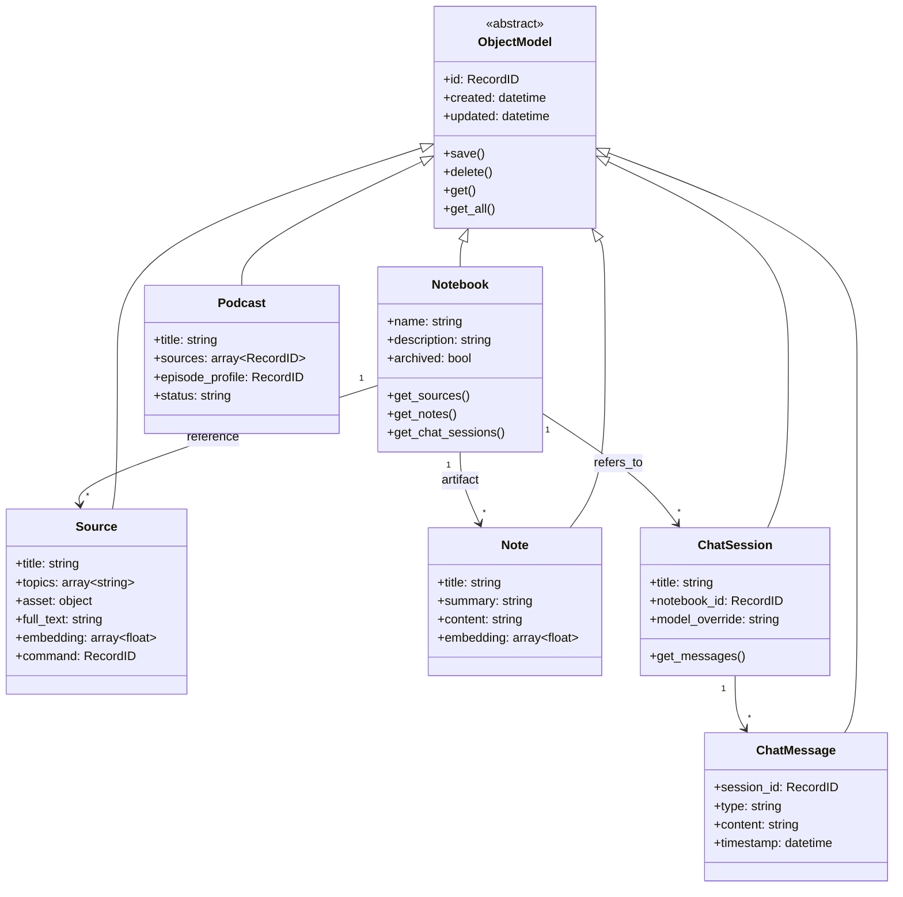

### 5.4 LangGraph 工作流

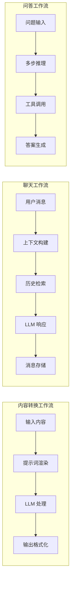

### 5.5 后台命令系统

使用 `surreal-commands` 库实现异步任务处理：

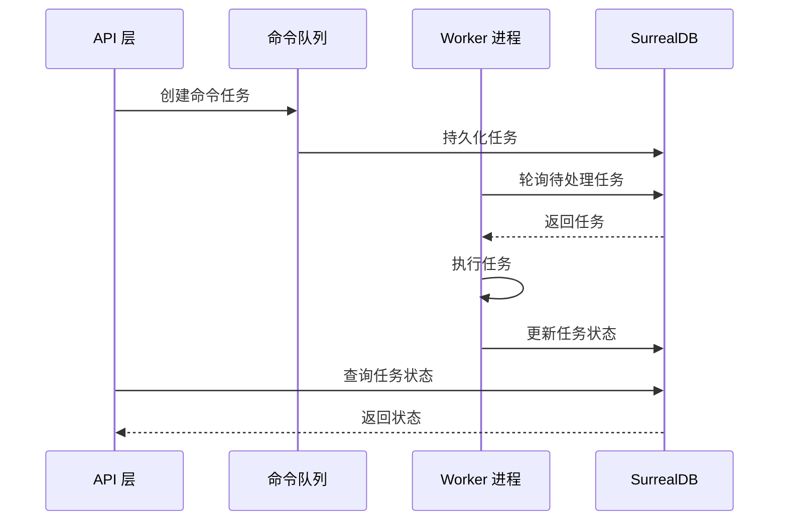

**命令类型**:
- `source_commands`: 来源处理（上传、解析、嵌入）
- `podcast_commands`: 长时间运行的播客生成
- `embedding_commands`: 内容向量化

---

## 6. 数据库架构

### 6.1 SurrealDB 选型理由

- **多模型支持**: 文档、图、向量存储统一
- **向量搜索**: 内置嵌入向量存储和相似度搜索
- **全文搜索**: BM25 算法 + 自定义分析器
- **记录链接**: 原生支持关系引用
- **事件触发器**: 支持级联删除等操作

### 6.2 核心表结构

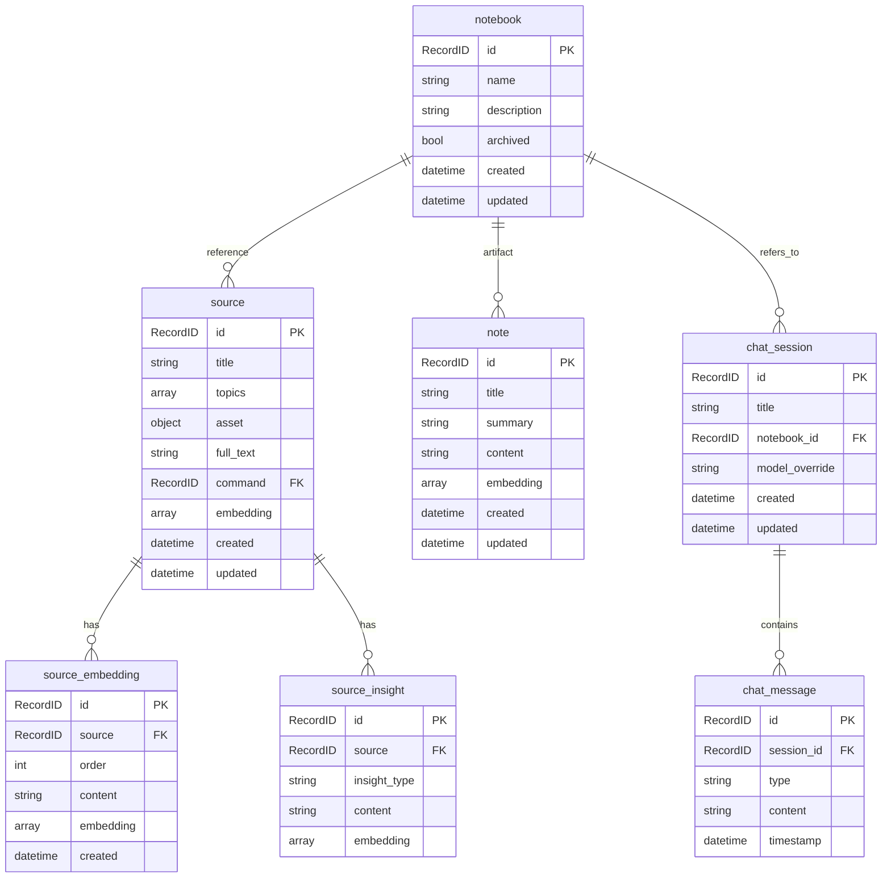

### 6.3 索引和搜索

```sql
-- 全文搜索索引
DEFINE INDEX source_title_idx ON source FIELDS title
    SEARCH ANALYZER custom_analyzer BM25;

DEFINE INDEX source_full_text_idx ON source FIELDS full_text
    SEARCH ANALYZER custom_analyzer BM25;

DEFINE INDEX source_embedding_content_idx ON source_embedding FIELDS content
    SEARCH ANALYZER custom_analyzer BM25;

DEFINE INDEX note_content_idx ON note FIELDS content
    SEARCH ANALYZER custom_analyzer BM25;

-- 自定义分析器 (Snowball English)
DEFINE ANALYZER custom_analyzer TOKENIZERS class
    FILTERS lowercase, snowball(english);
```

### 6.4 自定义函数

```sql
-- 多来源文本搜索函数
DEFINE FUNCTION fn::text_search($query: string) {
    -- 跨 sources, notes, source_embeddings 搜索
    -- 返回匹配结果和相关性分数
};
```

---

## 7. AI/ML 架构

### 7.1 多提供商支持

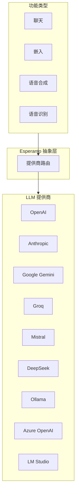

### 7.2 模型选择逻辑

| 功能 | 默认提供商 | 备选 |
|------|-----------|------|
| 聊天/生成 | OpenAI GPT-4 | Anthropic, Gemini, 本地 |
| 嵌入 | OpenAI | Ollama |
| TTS | ElevenLabs | OpenAI TTS |
| STT | OpenAI Whisper | - |

### 7.3 LangGraph 状态机

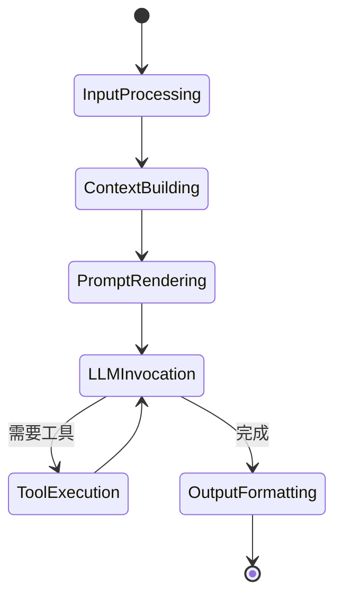

---

## 8. 部署架构

### 8.1 Docker 部署

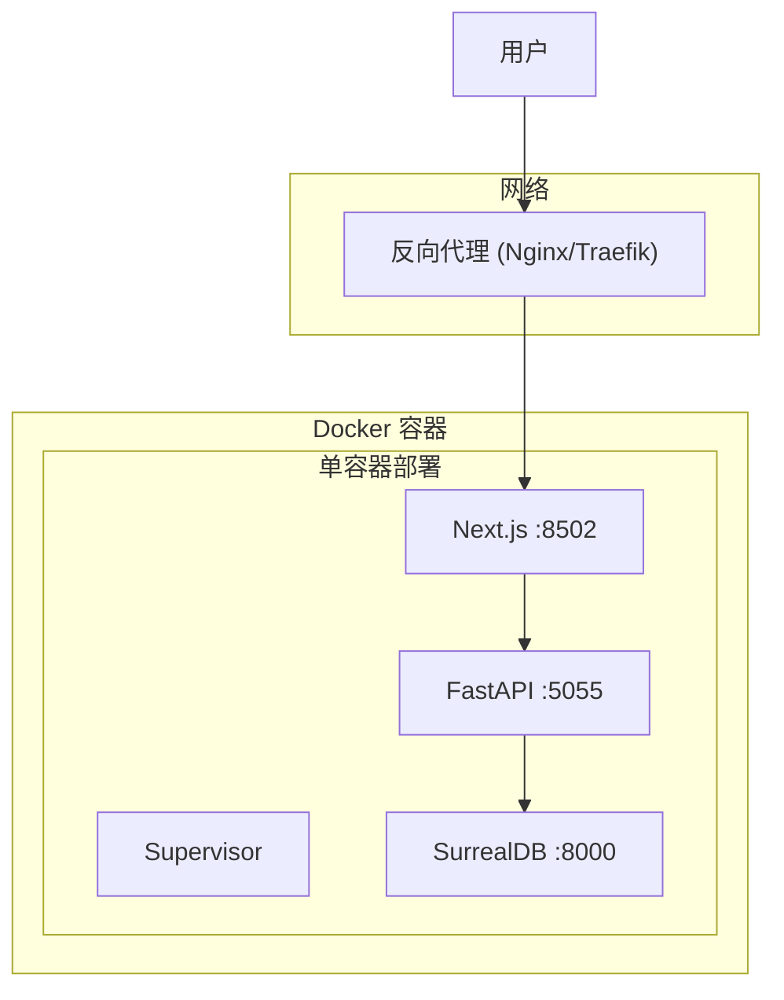

### 8.2 端口映射

| 端口 | 服务 | 说明 |
|------|------|------|
| 8502 | Next.js 前端 | 用户界面 |
| 5055 | FastAPI 后端 | REST API |
| 8000 | SurrealDB | 数据库 (内部) |

### 8.3 Dockerfile 多阶段构建

```dockerfile
# 阶段 1: 构建器
FROM python:3.12-slim-bookworm AS builder
# 安装依赖、构建前端

# 阶段 2: 运行时
FROM python:3.12-slim-bookworm
# 复制构建产物、配置 Supervisor
```

### 8.4 进程管理 (Supervisor)

```ini
[program:frontend]
command=node frontend/.next/standalone/server.js
directory=/app/frontend
environment=PORT="8502"

[program:api]
command=uvicorn api.main:app --host 0.0.0.0 --port 5055
directory=/app
```

---

## 9. 内容处理流水线

### 9.1 来源处理流程

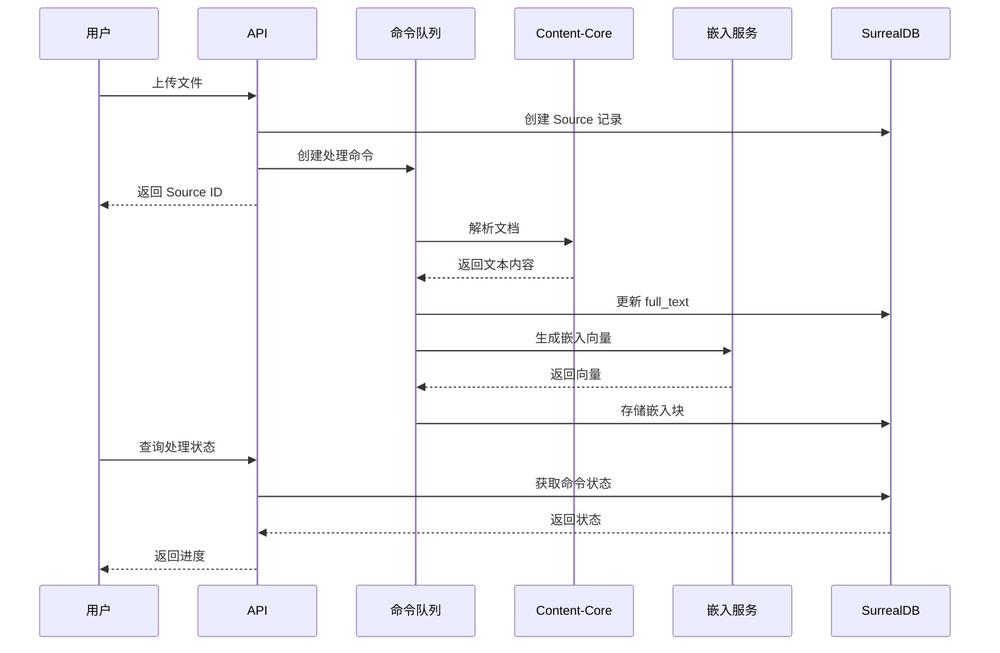

### 9.2 支持的内容格式

| 格式 | 处理方式 |
|------|----------|
| PDF | Content-Core 解析 |
| DOCX | Content-Core 解析 |
| 视频 | 音频提取 + STT |
| 音频 | STT 转录 |
| 网页 | Firecrawl/Jina 抓取 |
| 纯文本 | 直接处理 |

### 9.3 嵌入分块策略

```python
# 文本分块配置
chunk_size = 1000  # 每块字符数
chunk_overlap = 200  # 块间重叠

# 分块存储
for i, chunk in enumerate(chunks):
    SourceEmbedding(
        source=source_id,
        order=i,
        content=chunk,
        embedding=embed(chunk)
    ).save()
```

---

## 10. 搜索系统

### 10.1 搜索架构

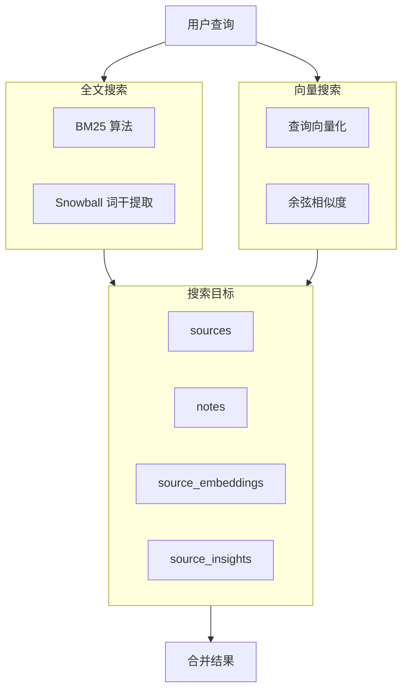

### 10.2 搜索 API

```typescript
// 全文搜索
GET /api/search?query=关键词&notebook_id=xxx

// 向量搜索
POST /api/search/semantic
{
    "query": "语义查询",
    "notebook_id": "xxx",
    "top_k": 10
}
```

---

## 11. 播客生成系统

### 11.1 播客生成流程

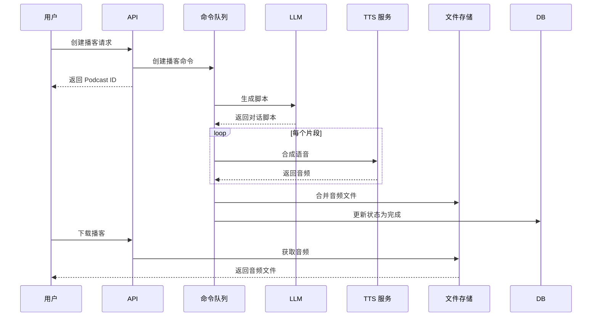

### 11.2 播客配置模型

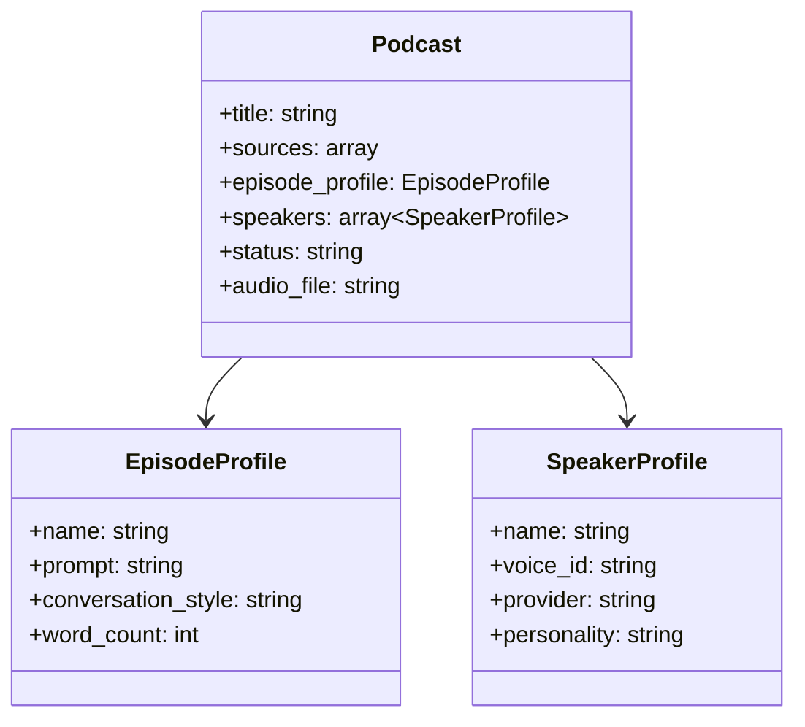

---

## 12. 设计模式与架构决策

### 12.1 核心设计原则

| 原则 | 实现方式 |
|------|----------|
| **隐私优先** | 自托管部署、本地模型支持 |
| **API 优先** | 所有功能通过 REST API 暴露 |
| **异步优先** | AsyncIO、后台任务、流式响应 |
| **无供应商锁定** | 多提供商抽象层 |

### 12.2 对象关系映射模式

```python
class ObjectModel:
    """基类提供通用数据库操作"""

    async def save(self):
        """保存时自动更新嵌入向量"""
        if hasattr(self, 'embedding'):
            self.embedding = await generate_embedding(self.content)
        await db.upsert(self)

    @classmethod
    async def get(cls, id: str):
        return await db.select(cls, id)

    @classmethod
    async def get_all(cls):
        return await db.select_all(cls)
```

### 12.3 重试与恢复机制

```python
# 指数抖动退避策略
retry_config = {
    "max_attempts": 5,
    "wait_strategy": "exponential_jitter",
    "base_wait": 1.0,
    "max_wait": 60.0
}

# 事务冲突处理
async def with_retry(operation):
    for attempt in range(max_attempts):
        try:
            return await operation()
        except TransactionConflict:
            await asyncio.sleep(calculate_backoff(attempt))
    raise MaxRetriesExceeded
```

### 12.4 关键文件路径

| 组件 | 路径 |
|------|------|
| 后端入口 | `api/main.py` |
| 数据库仓库 | `open_notebook/database/repository.py` |
| 领域模型 | `open_notebook/domain/` |
| 前端配置 | `frontend/src/lib/config.ts` |
| API 路由 | `api/routers/` |
| 工作流图 | `open_notebook/graphs/` |
| 后台命令 | `commands/` |
| 数据库迁移 | `migrations/` |

---

## 13. 配置管理

### 13.1 环境变量配置

```bash
# API 配置
API_URL=http://localhost:5055
INTERNAL_API_URL=http://localhost:5055

# AI 提供商
OPENAI_API_KEY=sk-xxx
ANTHROPIC_API_KEY=xxx
GOOGLE_API_KEY=xxx
GROQ_API_KEY=xxx
ELEVENLABS_API_KEY=xxx

# 数据库
SURREAL_ADDRESS=ws://localhost:8000
SURREAL_USER=root
SURREAL_PASSWORD=root
SURREAL_NAMESPACE=open_notebook
SURREAL_DATABASE=open_notebook

# 安全
PASSWORD=your_password
SSL_VERIFY=true

# 后台任务
COMMAND_CONCURRENCY=5
MAX_RETRIES=5
```

### 13.2 前端运行时配置

```typescript
// frontend/src/lib/config.ts
export const getApiUrl = (): string => {
    // 1. 检查环境变量
    if (process.env.NEXT_PUBLIC_API_URL) {
        return process.env.NEXT_PUBLIC_API_URL;
    }

    // 2. 基于当前主机名自动检测
    if (typeof window !== 'undefined') {
        const hostname = window.location.hostname;
        return `http://${hostname}:5055`;
    }

    // 3. 默认值
    return 'http://localhost:5055';
};
```

---

## 14. 安全考虑

### 14.1 认证机制

- **密码保护**: 环境变量配置的简单密码认证
- **Token 存储**: 前端使用 Zustand 持久化存储
- **请求拦截**: Axios 拦截器自动附加认证头

### 14.2 安全最佳实践

- SSL 证书验证可配置
- API 超时设置 (10分钟用于长时间 LLM 操作)
- 无敏感信息硬编码
- 环境变量隔离

---

## 15. 扩展性设计

### 15.1 插件系统

```
open_notebook/plugins/
├── __init__.py
├── base.py          # 插件基类
└── implementations/ # 具体实现
```

### 15.2 提示词模板系统

使用 Jinja2 模板引擎:

```
prompts/
├── summarize.j2
├── insights.j2
├── chat_system.j2
└── podcast_script.j2
```

### 15.3 内容转换扩展

```python
class Transformation:
    """可扩展的内容转换"""
    name: str
    prompt_template: str
    output_format: str

    async def execute(self, content: str) -> str:
        prompt = render_template(self.prompt_template, content=content)
        return await llm.generate(prompt)
```

---

## 16. 总结

Open Notebook 是一个设计精良的现代 AI 研究助手平台，具有以下特点:

1. **清晰的分层架构**: 前端 → API → 服务 → 领域 → 数据
2. **异步优先设计**: 长时间任务通过后台命令处理
3. **多供应商支持**: 通过 Esperanto 抽象层避免锁定
4. **隐私优先**: 支持完全自托管和本地模型
5. **可扩展性**: 插件系统、模板系统、模块化设计

该项目是 Google NotebookLM 的优秀开源替代方案，适合对数据隐私有要求的用户和组织使用。
