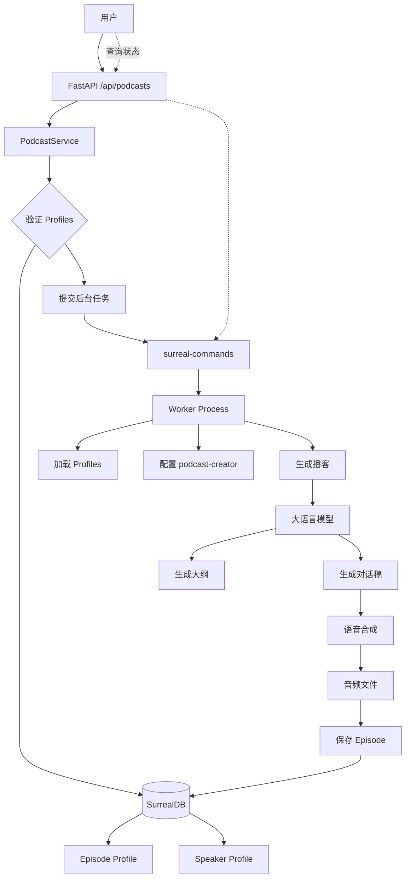
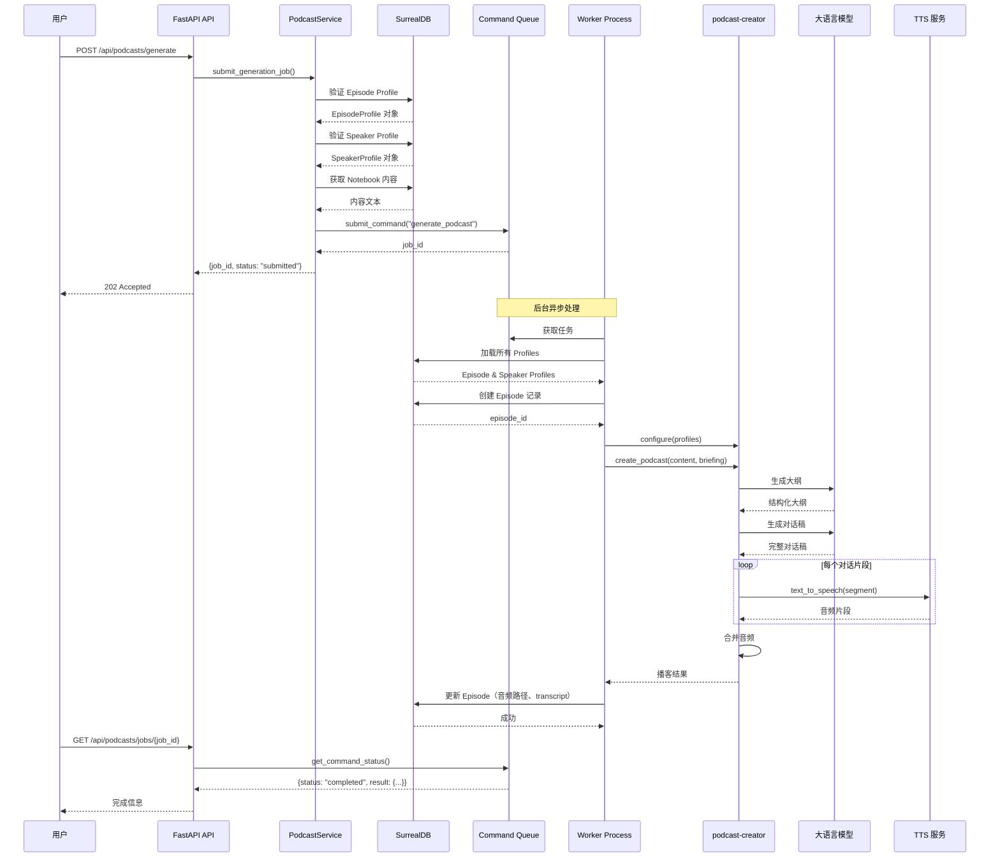
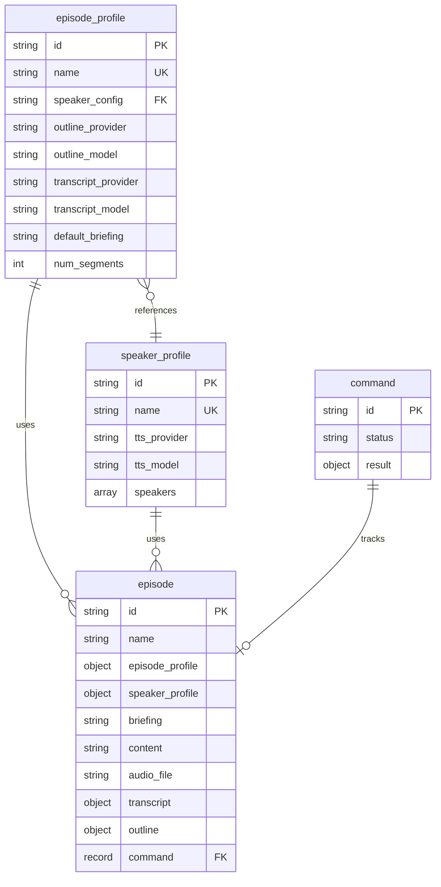
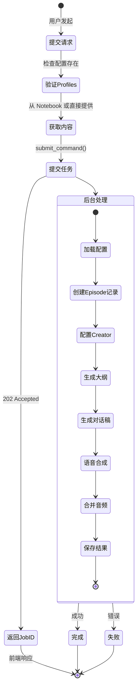
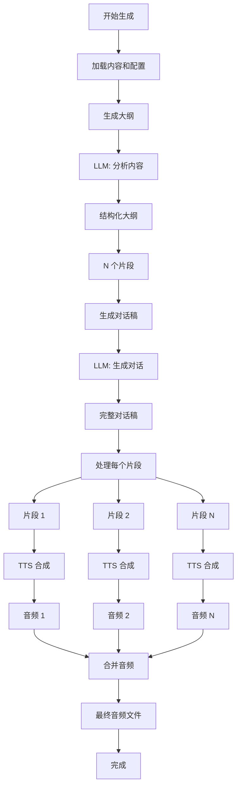
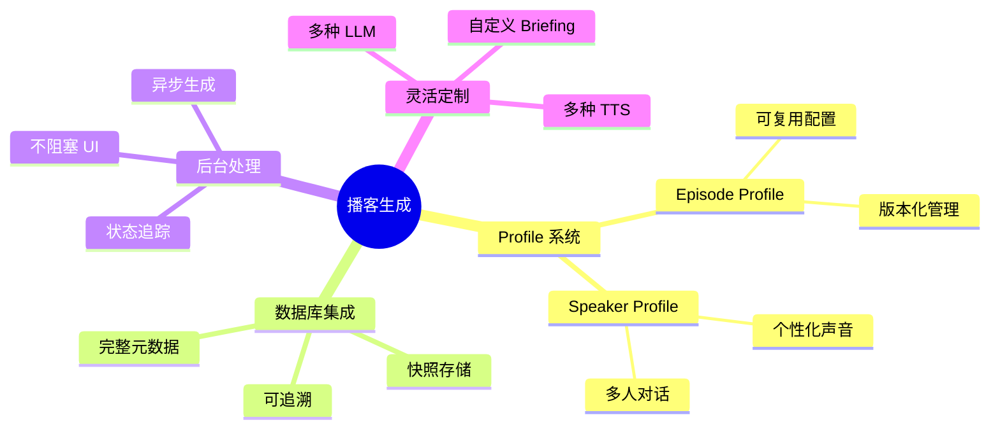

# Open Notebook 播客生成详解

## 1. 概述

Open Notebook 的播客生成功能是其核心特色之一，通过集成 `podcast-creator` 库，可以将文本内容转换为专业的多人对话播客。该功能支持高度定制化，用户可以配置对话风格、角色设定、语音模型等。

### 1.1 核心特性

| 特性 | 说明 | 优势 |
|------|------|------|
| **Profile 系统** | Episode Profile + Speaker Profile | 简化配置，可复用 |
| **多人对话** | 支持 1-4 个说话人 | 灵活的播客格式 |
| **AI 驱动** | LLM 生成大纲和对话稿 | 内容质量高 |
| **TTS 合成** | 多种语音合成服务 | 真实的语音效果 |
| **后台处理** | 异步任务系统 | 不阻塞用户操作 |
| **数据库存储** | 完整的元数据管理 | 可追溯、可重用 |

### 1.2 技术栈

```python
# 核心依赖
podcast-creator>=0.7.0      # 播客生成引擎
surreal-commands>=1.2.0     # 后台任务系统
esperanto>=2.8.3            # AI 模型抽象

# 支持的 TTS 提供商
- OpenAI (gpt-4o-mini-tts, gpt-4o-tts)
- ElevenLabs
- Google (Gemini TTS)
```

## 2. 架构设计

### 2.1 整体架构



### 2.2 数据流



## 3. 数据模型

### 3.1 Episode Profile（播客配置）

Episode Profile 定义播客的生成配置，包括使用的 AI 模型、生成策略等。

```python
# open_notebook/domain/podcast.py
class EpisodeProfile(ObjectModel):
    """播客配置文件"""
    table_name: ClassVar[str] = "episode_profile"

    # 基本信息
    name: str                      # 配置名称（唯一）
    description: Optional[str]     # 配置描述

    # 说话人配置
    speaker_config: str            # 引用的 Speaker Profile 名称

    # AI 模型配置
    outline_provider: str          # 大纲生成的 AI 提供商
    outline_model: str             # 大纲生成的模型
    transcript_provider: str       # 对话稿生成的 AI 提供商
    transcript_model: str          # 对话稿生成的模型

    # 生成配置
    default_briefing: str          # 默认的生成指令
    num_segments: int = 5          # 播客分段数量（3-20）
```

**SurrealDB Schema:**

```sql
DEFINE TABLE IF NOT EXISTS episode_profile SCHEMAFULL;

DEFINE FIELD IF NOT EXISTS name ON TABLE episode_profile TYPE string;
DEFINE FIELD IF NOT EXISTS description ON TABLE episode_profile TYPE option<string>;
DEFINE FIELD IF NOT EXISTS speaker_config ON TABLE episode_profile TYPE string;
DEFINE FIELD IF NOT EXISTS outline_provider ON TABLE episode_profile TYPE string;
DEFINE FIELD IF NOT EXISTS outline_model ON TABLE episode_profile TYPE string;
DEFINE FIELD IF NOT EXISTS transcript_provider ON TABLE episode_profile TYPE string;
DEFINE FIELD IF NOT EXISTS transcript_model ON TABLE episode_profile TYPE string;
DEFINE FIELD IF NOT EXISTS default_briefing ON TABLE episode_profile TYPE string;
DEFINE FIELD IF NOT EXISTS num_segments ON TABLE episode_profile TYPE int DEFAULT 5;

-- 唯一索引
DEFINE INDEX IF NOT EXISTS idx_episode_profile_name
    ON TABLE episode_profile
    COLUMNS name
    UNIQUE
    CONCURRENTLY;
```

**预设 Profile 示例：**

```sql
INSERT INTO episode_profile {
    name: "tech_discussion",
    description: "Technical discussion between 2 experts",
    speaker_config: "tech_experts",
    outline_provider: "openai",
    outline_model: "gpt-4o-mini",
    transcript_provider: "openai",
    transcript_model: "gpt-4o-mini",
    default_briefing: "Create an engaging technical discussion about the provided content. Focus on practical insights, real-world applications, and detailed explanations that would interest developers and technical professionals.",
    num_segments: 5
};
```

### 3.2 Speaker Profile（说话人配置）

Speaker Profile 定义播客中的说话人角色、声音和个性。

```python
class SpeakerProfile(ObjectModel):
    """说话人配置文件"""
    table_name: ClassVar[str] = "speaker_profile"

    # 基本信息
    name: str                      # 配置名称（唯一）
    description: Optional[str]     # 配置描述

    # TTS 配置
    tts_provider: str              # TTS 提供商（openai, elevenlabs 等）
    tts_model: str                 # TTS 模型名称

    # 说话人数组（1-4 人）
    speakers: List[Dict[str, Any]]
    # 每个 speaker 包含：
    # - name: 说话人名字
    # - voice_id: 声音 ID
    # - backstory: 背景故事
    # - personality: 个性描述
```

**SurrealDB Schema:**

```sql
DEFINE TABLE IF NOT EXISTS speaker_profile SCHEMAFULL;

DEFINE FIELD IF NOT EXISTS name ON TABLE speaker_profile TYPE string;
DEFINE FIELD IF NOT EXISTS description ON TABLE speaker_profile TYPE option<string>;
DEFINE FIELD IF NOT EXISTS tts_provider ON TABLE speaker_profile TYPE string;
DEFINE FIELD IF NOT EXISTS tts_model ON TABLE speaker_profile TYPE string;

-- speakers 是对象数组
DEFINE FIELD IF NOT EXISTS speakers ON TABLE speaker_profile TYPE array<object>;
DEFINE FIELD IF NOT EXISTS speakers.*.name ON TABLE speaker_profile TYPE string;
DEFINE FIELD IF NOT EXISTS speakers.*.voice_id ON TABLE speaker_profile TYPE option<string>;
DEFINE FIELD IF NOT EXISTS speakers.*.backstory ON TABLE speaker_profile TYPE option<string>;
DEFINE FIELD IF NOT EXISTS speakers.*.personality ON TABLE speaker_profile TYPE option<string>;

-- 唯一索引
DEFINE INDEX IF NOT EXISTS idx_speaker_profile_name
    ON TABLE speaker_profile
    COLUMNS name
    UNIQUE
    CONCURRENTLY;
```

**预设 Profile 示例：**

```sql
INSERT INTO speaker_profile {
    name: "tech_experts",
    description: "Two technical experts for tech discussions",
    tts_provider: "openai",
    tts_model: "gpt-4o-mini-tts",
    speakers: [
        {
            name: "Dr. Alex Chen",
            voice_id: "nova",
            backstory: "Senior AI researcher and former tech lead at major companies. Specializes in making complex technical concepts accessible.",
            personality: "Analytical, clear communicator, asks probing questions to dig deeper into technical details"
        },
        {
            name: "Jamie Rodriguez",
            voice_id: "alloy",
            backstory: "Full-stack engineer and tech entrepreneur. Loves practical applications and real-world implementations.",
            personality: "Enthusiastic, practical-minded, great at explaining implementation details and trade-offs"
        }
    ]
};
```

### 3.3 Podcast Episode（播客实例）

PodcastEpisode 记录每次生成的播客实例及其元数据。

```python
class PodcastEpisode(ObjectModel):
    """播客实例"""
    table_name: ClassVar[str] = "episode"

    # 基本信息
    name: str                          # 播客名称

    # 配置（快照存储）
    episode_profile: Dict[str, Any]    # 使用的 Episode Profile（完整对象）
    speaker_profile: Dict[str, Any]    # 使用的 Speaker Profile（完整对象）

    # 生成内容
    briefing: str                      # 完整的生成指令
    content: str                       # 源内容

    # 生成结果
    audio_file: Optional[str]          # 音频文件路径
    transcript: Optional[Dict]         # 对话稿
    outline: Optional[Dict]            # 大纲

    # 任务追踪
    command: Optional[RecordID]        # 关联的后台任务 ID
```

**SurrealDB Schema:**

```sql
DEFINE TABLE IF NOT EXISTS episode SCHEMAFULL;

DEFINE FIELD IF NOT EXISTS name ON TABLE episode TYPE string;
DEFINE FIELD IF NOT EXISTS briefing ON TABLE episode TYPE option<string>;
DEFINE FIELD IF NOT EXISTS episode_profile ON TABLE episode FLEXIBLE TYPE object;
DEFINE FIELD IF NOT EXISTS speaker_profile ON TABLE episode FLEXIBLE TYPE object;
DEFINE FIELD IF NOT EXISTS transcript ON TABLE episode FLEXIBLE TYPE option<object>;
DEFINE FIELD IF NOT EXISTS outline ON TABLE episode FLEXIBLE TYPE option<object>;
DEFINE FIELD IF NOT EXISTS command ON TABLE episode TYPE option<record<command>>;
DEFINE FIELD IF NOT EXISTS content ON TABLE episode TYPE option<string>;
DEFINE FIELD IF NOT EXISTS audio_file ON TABLE episode TYPE option<string>;

-- 时间戳
DEFINE FIELD IF NOT EXISTS created ON episode DEFAULT time::now();
DEFINE FIELD IF NOT EXISTS updated ON episode DEFAULT time::now();

-- 索引
DEFINE INDEX IF NOT EXISTS idx_episode_command
    ON TABLE episode
    COLUMNS command
    CONCURRENTLY;
```

**为什么存储 Profile 的完整快照？**

- **不可变性**: 确保播客生成时使用的配置不会因 Profile 修改而改变
- **可追溯性**: 可以精确重现生成条件
- **解耦**: 删除 Profile 不影响已生成的播客

### 3.4 数据关系图



## 4. 播客生成工作流

### 4.1 完整流程



### 4.2 API 调用流程

#### Step 1: 发起播客生成

```http
POST /api/podcasts/generate
Content-Type: application/json

{
    "episode_profile": "tech_discussion",
    "speaker_profile": "tech_experts",
    "episode_name": "Introduction to Vector Databases",
    "notebook_id": "notebook:abc123",
    "briefing_suffix": "Focus on practical use cases"
}
```

**请求参数：**

| 参数 | 类型 | 必填 | 说明 |
|------|------|------|------|
| episode_profile | string | 是 | Episode Profile 名称 |
| speaker_profile | string | 是 | Speaker Profile 名称（可选，由 episode_profile 引用） |
| episode_name | string | 是 | 播客名称 |
| notebook_id | string | 否 | Notebook ID（提供内容源） |
| content | string | 否 | 直接提供内容文本 |
| briefing_suffix | string | 否 | 附加指令 |

**响应：**

```json
{
    "job_id": "command:xyz789",
    "status": "submitted",
    "message": "Podcast generation started for episode 'Introduction to Vector Databases'",
    "episode_profile": "tech_discussion",
    "episode_name": "Introduction to Vector Databases"
}
```

#### Step 2: 查询生成状态

```http
GET /api/podcasts/jobs/command:xyz789
```

**响应（处理中）：**

```json
{
    "job_id": "command:xyz789",
    "status": "processing",
    "progress": null,
    "created": "2025-12-31T10:00:00Z",
    "updated": "2025-12-31T10:01:30Z"
}
```

**响应（完成）：**

```json
{
    "job_id": "command:xyz789",
    "status": "completed",
    "result": {
        "success": true,
        "episode_id": "episode:abc456",
        "audio_file_path": "/app/data/podcasts/episodes/intro-vector-db/final_output.mp3",
        "processing_time": 245.6
    },
    "created": "2025-12-31T10:00:00Z",
    "updated": "2025-12-31T10:04:05Z"
}
```

#### Step 3: 获取播客详情

```http
GET /api/podcasts/episodes/episode:abc456
```

**响应：**

```json
{
    "id": "episode:abc456",
    "name": "Introduction to Vector Databases",
    "episode_profile": {
        "name": "tech_discussion",
        "outline_model": "gpt-4o-mini",
        "transcript_model": "gpt-4o-mini",
        "num_segments": 5
    },
    "speaker_profile": {
        "name": "tech_experts",
        "tts_provider": "openai",
        "speakers": [
            {"name": "Dr. Alex Chen", "voice_id": "nova"},
            {"name": "Jamie Rodriguez", "voice_id": "alloy"}
        ]
    },
    "briefing": "Create an engaging technical discussion...",
    "audio_file": "/app/data/podcasts/episodes/intro-vector-db/final_output.mp3",
    "audio_url": "/api/podcasts/episodes/episode:abc456/audio",
    "transcript": {...},
    "outline": {...},
    "created": "2025-12-31T10:00:00Z",
    "job_status": "completed"
}
```

#### Step 4: 播放音频

```http
GET /api/podcasts/episodes/episode:abc456/audio
```

**响应：**
- Content-Type: `audio/mpeg`
- 流式传输音频文件

### 4.3 后台任务实现

```python
# commands/podcast_commands.py
@command("generate_podcast", app="open_notebook")
async def generate_podcast_command(
    input_data: PodcastGenerationInput,
) -> PodcastGenerationOutput:
    """播客生成后台任务"""
    start_time = time.time()

    try:
        # 1. 加载 Profiles
        episode_profile = await EpisodeProfile.get_by_name(
            input_data.episode_profile
        )
        speaker_profile = await SpeakerProfile.get_by_name(
            episode_profile.speaker_config
        )

        # 2. 加载所有 Profiles 用于配置 podcast-creator
        episode_profiles = await repo_query("SELECT * FROM episode_profile")
        speaker_profiles = await repo_query("SELECT * FROM speaker_profile")

        # 转换为字典格式
        episode_profiles_dict = {p["name"]: p for p in episode_profiles}
        speaker_profiles_dict = {p["name"]: p for p in speaker_profiles}

        # 3. 生成 briefing
        briefing = episode_profile.default_briefing
        if input_data.briefing_suffix:
            briefing += f"\n\nAdditional instructions: {input_data.briefing_suffix}"

        # 4. 创建 Episode 记录
        episode = PodcastEpisode(
            name=input_data.episode_name,
            episode_profile=episode_profile.model_dump(),
            speaker_profile=speaker_profile.model_dump(),
            command=input_data.execution_context.command_id,
            briefing=briefing,
            content=input_data.content,
        )
        await episode.save()

        # 5. 配置 podcast-creator
        configure("speakers_config", {"profiles": speaker_profiles_dict})
        configure("episode_config", {"profiles": episode_profiles_dict})

        # 6. 生成播客
        output_dir = Path(f"{DATA_FOLDER}/podcasts/episodes/{input_data.episode_name}")
        output_dir.mkdir(parents=True, exist_ok=True)

        result = await create_podcast(
            content=input_data.content,
            briefing=briefing,
            episode_name=input_data.episode_name,
            output_dir=str(output_dir),
            speaker_config=speaker_profile.name,
            episode_profile=episode_profile.name,
        )

        # 7. 保存结果
        episode.audio_file = str(result.get("final_output_file_path"))
        episode.transcript = {"transcript": result["transcript"]}
        episode.outline = result["outline"]
        await episode.save()

        processing_time = time.time() - start_time

        return PodcastGenerationOutput(
            success=True,
            episode_id=str(episode.id),
            audio_file_path=str(result.get("final_output_file_path")),
            transcript={"transcript": result["transcript"]},
            outline=result["outline"],
            processing_time=processing_time,
        )

    except Exception as e:
        logger.error(f"Podcast generation failed: {e}")
        return PodcastGenerationOutput(
            success=False,
            processing_time=time.time() - start_time,
            error_message=str(e)
        )
```

## 5. 内容获取策略

### 5.1 从 Notebook 获取内容

```python
# api/podcast_service.py
if not content and notebook_id:
    try:
        notebook = await Notebook.get(notebook_id)

        # 方式 1: 使用 Notebook 的 get_context() 方法
        if hasattr(notebook, "get_context"):
            content = await notebook.get_context()
        else:
            # 方式 2: 拼接所有 Sources 的内容
            sources = await notebook.get_sources()
            content_parts = []
            for source in sources:
                if source.full_text:
                    content_parts.append(f"## {source.title}\n\n{source.full_text}")
            content = "\n\n---\n\n".join(content_parts)

    except Exception as e:
        logger.warning(f"Failed to get notebook content: {e}")
        content = f"Notebook ID: {notebook_id}"
```

**获取的内容结构：**

```markdown
## Source 1: Understanding Vector Databases

Vector databases are specialized database systems designed to store...

---

## Source 2: Vector Search Algorithms

The core of vector search relies on similarity metrics...

---

## Source 3: Practical Applications

In real-world scenarios, vector databases are used for...
```

### 5.2 直接提供内容

```json
{
    "content": "Your content text here...",
    "episode_name": "My Podcast"
}
```

## 6. podcast-creator 集成

### 6.1 配置系统

podcast-creator 使用配置系统管理 Profiles：

```python
from podcast_creator import configure

# 配置 Speaker Profiles
configure("speakers_config", {
    "profiles": {
        "tech_experts": {
            "name": "tech_experts",
            "tts_provider": "openai",
            "tts_model": "gpt-4o-mini-tts",
            "speakers": [
                {
                    "name": "Dr. Alex Chen",
                    "voice_id": "nova",
                    "backstory": "...",
                    "personality": "..."
                },
                {
                    "name": "Jamie Rodriguez",
                    "voice_id": "alloy",
                    "backstory": "...",
                    "personality": "..."
                }
            ]
        }
    }
})

# 配置 Episode Profiles
configure("episode_config", {
    "profiles": {
        "tech_discussion": {
            "name": "tech_discussion",
            "outline_provider": "openai",
            "outline_model": "gpt-4o-mini",
            "transcript_provider": "openai",
            "transcript_model": "gpt-4o-mini",
            "num_segments": 5
        }
    }
})
```

### 6.2 生成调用

```python
from podcast_creator import create_podcast

result = await create_podcast(
    content=content_text,               # 源内容
    briefing=briefing_text,             # 生成指令
    episode_name="my-episode",          # 播客名称
    output_dir="/path/to/output",       # 输出目录
    speaker_config="tech_experts",      # Speaker Profile 名称
    episode_profile="tech_discussion",  # Episode Profile 名称
)

# 返回结果
{
    "final_output_file_path": "/path/to/output/final_output.mp3",
    "outline": {
        "segments": [
            {
                "title": "Introduction to Vector Databases",
                "key_points": ["...", "..."]
            },
            ...
        ]
    },
    "transcript": {
        "segments": [
            {
                "speaker": "Dr. Alex Chen",
                "text": "Hello everyone, today we're discussing..."
            },
            {
                "speaker": "Jamie Rodriguez",
                "text": "That's right, and I'm excited to..."
            },
            ...
        ]
    }
}
```

### 6.3 生成流程详解



**关键步骤说明：**

1. **大纲生成**
   ```
   输入: 内容 + briefing + num_segments
   LLM Prompt: "Analyze this content and create a {num_segments}-segment podcast outline..."
   输出: 结构化大纲（JSON）
   ```

2. **对话稿生成**
   ```
   输入: 大纲 + 说话人配置 + 个性描述
   LLM Prompt: "Generate a natural conversation between {speakers} based on this outline..."
   输出: 完整对话稿（JSON）
   ```

3. **语音合成**
   ```
   对于每个对话片段:
     - 识别说话人
     - 选择对应的 voice_id
     - 调用 TTS API
     - 保存音频片段
   ```

4. **音频合并**
   ```
   - 按顺序合并所有音频片段
   - 添加片段间的停顿
   - 标准化音量
   - 输出最终 MP3 文件
   ```

## 7. Briefing 系统

Briefing 是控制播客生成的核心指令。

### 7.1 Briefing 结构

```
{default_briefing}

Additional instructions: {briefing_suffix}
```

**default_briefing 示例：**

```text
Create an engaging technical discussion about the provided content.

Focus on:
- Practical insights and real-world applications
- Detailed explanations that would interest developers
- Code examples and implementation details
- Trade-offs and best practices

Style:
- Conversational yet informative
- Ask probing questions to explore topics deeply
- Use analogies to explain complex concepts
- Keep the tone professional but approachable
```

**briefing_suffix 示例：**

```text
Focus on practical use cases in production environments.
Include discussion of performance considerations.
Mention popular tools and libraries.
```

### 7.2 预设 Briefings

Open Notebook 提供三种预设 briefing：

#### tech_discussion

```text
Create an engaging technical discussion about the provided content.
Focus on practical insights, real-world applications, and detailed
explanations that would interest developers and technical professionals.
```

**适用场景：**
- 技术文章解读
- 代码分析
- 架构讨论

#### solo_expert

```text
Create an educational explanation of the provided content. Break down
complex concepts into digestible segments, use analogies and examples,
and maintain an engaging teaching style.
```

**适用场景：**
- 教程讲解
- 概念介绍
- 知识科普

#### business_analysis

```text
Analyze the provided content from a business perspective. Discuss
market implications, strategic insights, competitive advantages, and
actionable business intelligence.
```

**适用场景：**
- 商业分析
- 市场趋势
- 战略讨论

## 8. Profile 管理

### 8.1 Episode Profile CRUD

#### 列出所有 Episode Profiles

```http
GET /api/episode-profiles
```

```json
[
    {
        "id": "episode_profile:xyz",
        "name": "tech_discussion",
        "description": "Technical discussion between 2 experts",
        "speaker_config": "tech_experts",
        "outline_provider": "openai",
        "outline_model": "gpt-4o-mini",
        "transcript_provider": "openai",
        "transcript_model": "gpt-4o-mini",
        "default_briefing": "...",
        "num_segments": 5
    },
    ...
]
```

#### 创建 Episode Profile

```http
POST /api/episode-profiles
Content-Type: application/json

{
    "name": "my_custom_profile",
    "description": "My custom podcast format",
    "speaker_config": "tech_experts",
    "outline_provider": "openai",
    "outline_model": "gpt-4o",
    "transcript_provider": "anthropic",
    "transcript_model": "claude-3-5-sonnet-20241022",
    "default_briefing": "Create a deep-dive technical analysis...",
    "num_segments": 8
}
```

#### 更新 Episode Profile

```http
PUT /api/episode-profiles/{profile_id}
```

#### 复制 Episode Profile

```http
POST /api/episode-profiles/{profile_id}/duplicate
```

### 8.2 Speaker Profile CRUD

#### 列出所有 Speaker Profiles

```http
GET /api/speaker-profiles
```

```json
[
    {
        "id": "speaker_profile:abc",
        "name": "tech_experts",
        "description": "Two technical experts",
        "tts_provider": "openai",
        "tts_model": "gpt-4o-mini-tts",
        "speakers": [
            {
                "name": "Dr. Alex Chen",
                "voice_id": "nova",
                "backstory": "...",
                "personality": "..."
            },
            {
                "name": "Jamie Rodriguez",
                "voice_id": "alloy",
                "backstory": "...",
                "personality": "..."
            }
        ]
    },
    ...
]
```

#### 创建 Speaker Profile

```http
POST /api/speaker-profiles
Content-Type: application/json

{
    "name": "my_speakers",
    "description": "My custom speakers",
    "tts_provider": "elevenlabs",
    "tts_model": "eleven_multilingual_v2",
    "speakers": [
        {
            "name": "Sarah",
            "voice_id": "21m00Tcm4TlvDq8ikWAM",
            "backstory": "Data scientist with 10 years experience",
            "personality": "Analytical, data-driven, loves statistics"
        }
    ]
}
```

## 9. 音频文件管理

### 9.1 文件存储结构

```
/app/data/podcasts/
├── episodes/
│   ├── intro-vector-db/
│   │   ├── final_output.mp3       # 最终音频
│   │   ├── segment_001.mp3        # 片段 1
│   │   ├── segment_002.mp3        # 片段 2
│   │   └── ...
│   ├── another-episode/
│   │   └── ...
├── transcripts/                    # 对话稿（可选）
└── audio/                          # 临时文件
    └── tmp/
```

### 9.2 音频文件路径

Episode 中存储的 `audio_file` 路径：

```python
# 绝对路径
"/app/data/podcasts/episodes/intro-vector-db/final_output.mp3"

# 或 file:// URL
"file:///app/data/podcasts/episodes/intro-vector-db/final_output.mp3"
```

### 9.3 音频流式传输

```python
# api/routers/podcasts.py
@router.get("/podcasts/episodes/{episode_id}/audio")
async def stream_podcast_episode_audio(episode_id: str):
    """流式传输音频文件"""
    episode = await PodcastService.get_episode(episode_id)

    if not episode.audio_file:
        raise HTTPException(status_code=404, detail="No audio file")

    audio_path = _resolve_audio_path(episode.audio_file)

    if not audio_path.exists():
        raise HTTPException(status_code=404, detail="Audio file not found")

    return FileResponse(
        audio_path,
        media_type="audio/mpeg",
        filename=audio_path.name,
    )
```

## 10. 错误处理

### 10.1 常见错误

#### Profile 不存在

```json
{
    "detail": "Episode profile 'non_existent' not found"
}
```

**解决方案：**
- 检查 Profile 名称是否正确
- 使用 `GET /api/episode-profiles` 列出可用的 Profiles

#### 内容为空

```json
{
    "detail": "Content is required - provide either content or notebook_id"
}
```

**解决方案：**
- 提供 `content` 或 `notebook_id` 参数
- 确保 Notebook 包含内容

#### TTS 配额超限

```json
{
    "success": false,
    "error_message": "TTS API rate limit exceeded"
}
```

**解决方案：**
- 等待配额重置
- 切换到其他 TTS 提供商
- 减少 `num_segments`

#### GPT-5 模型错误

```json
{
    "success": false,
    "error_message": "Invalid json output. Expecting value...\n\nNOTE: This error commonly occurs with GPT-5 models that use extended thinking..."
}
```

**原因：** GPT-5 模型使用 `<think>` 标签，可能导致 JSON 解析失败。

**解决方案：**
- 切换到 `gpt-4o` 或 `gpt-4o-mini`
- 避免使用 `gpt-5-mini` 用于 transcript 生成

### 10.2 任务状态

| 状态 | 说明 |
|------|------|
| `pending` | 等待执行 |
| `processing` | 正在生成 |
| `completed` | 成功完成 |
| `failed` | 生成失败 |
| `unknown` | 状态未知 |

## 11. 性能优化

### 11.1 生成时间

典型播客生成时间（5 个片段）：

```
大纲生成:     10-20 秒
对话稿生成:   30-60 秒
TTS 合成:     60-120 秒（取决于片段数和长度）
音频合并:     5-10 秒
总计:        105-210 秒（约 2-4 分钟）
```

**影响因素：**
- `num_segments`: 更多片段 = 更长时间
- 内容长度: 更长内容 = 更长对话稿
- LLM 速度: 不同模型响应速度不同
- TTS 速度: 不同提供商速度不同

### 11.2 优化建议

1. **减少片段数**
   ```json
   {
       "episode_profile": "tech_discussion",
       "num_segments": 3  // 而不是 5
   }
   ```

2. **使用更快的模型**
   ```json
   {
       "outline_model": "gpt-4o-mini",      // 而不是 gpt-4o
       "transcript_model": "gpt-4o-mini"
   }
   ```

3. **精简内容**
   - 提取关键内容而非全文
   - 使用摘要而非原文

4. **预热缓存**
   - 常用 Profiles 保持活跃
   - 预先加载模型配置

## 12. 最佳实践

### 12.1 Profile 设计

#### 命名规范

```
{purpose}_{format}

例如：
- tech_discussion
- solo_expert
- business_panel
- deep_dive_interview
```

#### Speaker 配置

```python
{
    "speakers": [
        {
            "name": "短小精悍的名字",
            "voice_id": "合适的声音",
            "backstory": "简洁的背景（1-2 句）",
            "personality": "明确的个性特征（1-2 句）"
        }
    ]
}
```

**好的 backstory:**
```
"Senior AI researcher with 10 years experience in NLP and machine learning"
```

**不好的 backstory:**
```
"Has worked in many companies and knows a lot about technology and also likes to code and..."
```

#### Briefing 编写

**结构化：**
```
主题: [明确主题]

重点:
- 要点 1
- 要点 2
- 要点 3

风格:
- 风格特征 1
- 风格特征 2
```

**具体而非抽象：**
```
✅ "Include code examples and explain the implementation details"
❌ "Make it interesting and informative"
```

### 12.2 内容准备

#### 理想的内容结构

```markdown
# 主标题

## 核心概念
[清晰的概念解释]

## 关键要点
- 要点 1
- 要点 2
- 要点 3

## 实例
[具体例子]

## 结论
[总结]
```

#### 内容长度

| 片段数 | 推荐内容长度 | 播客时长 |
|--------|-------------|----------|
| 3 | 1000-2000 字 | 5-8 分钟 |
| 5 | 2000-3000 字 | 8-12 分钟 |
| 8 | 3000-5000 字 | 12-20 分钟 |

### 12.3 测试流程

1. **小规模测试**
   ```json
   {
       "num_segments": 3,
       "content": "简短测试内容"
   }
   ```

2. **验证输出**
   - 检查大纲是否合理
   - 验证对话是否自然
   - 确认音频质量

3. **迭代改进**
   - 调整 briefing
   - 优化 speaker personality
   - 修改片段数

4. **生产部署**
   - 使用完整内容
   - 启用完整片段数

## 13. 扩展开发

### 13.1 自定义 TTS 提供商

```python
# 在 podcast-creator 中添加新的 TTS 提供商
class CustomTTSProvider:
    async def synthesize(self, text: str, voice_id: str) -> bytes:
        # 实现 TTS 合成逻辑
        pass

# 注册提供商
register_tts_provider("custom", CustomTTSProvider())
```

### 13.2 自定义对话生成策略

```python
# 实现自定义的对话生成器
class CustomTranscriptGenerator:
    async def generate(
        self,
        outline: dict,
        speakers: list,
        style: str
    ) -> dict:
        # 实现对话生成逻辑
        pass
```

### 13.3 添加后处理

```python
# commands/podcast_commands.py
@command("generate_podcast", app="open_notebook")
async def generate_podcast_command(input_data):
    # ... 现有逻辑 ...

    # 后处理
    audio_path = result.get("final_output_file_path")

    # 1. 音频标准化
    normalized_audio = normalize_audio(audio_path)

    # 2. 添加背景音乐
    with_music = add_background_music(normalized_audio, volume=0.1)

    # 3. 生成字幕
    subtitles = generate_subtitles(result["transcript"])

    # 保存增强版本
    episode.audio_file = with_music
    episode.subtitles = subtitles
    await episode.save()
```

## 14. 监控与日志

### 14.1 生成指标

```python
{
    "episode_id": "episode:abc",
    "metrics": {
        "total_time": 245.6,        # 总时间（秒）
        "outline_time": 15.2,       # 大纲生成时间
        "transcript_time": 45.8,    # 对话稿生成时间
        "tts_time": 178.4,          # TTS 合成时间
        "merge_time": 6.2,          # 音频合并时间
        "num_segments": 5,          # 片段数
        "audio_duration": 680,      # 音频时长（秒）
        "content_length": 2845,     # 内容字符数
        "transcript_length": 4125   # 对话稿字符数
    }
}
```

### 14.2 日志记录

```python
# 关键节点日志
logger.info(f"Starting podcast generation for episode: {episode_name}")
logger.info(f"Loaded episode profile: {episode_profile.name}")
logger.info(f"Generated briefing (length: {len(briefing)} chars)")
logger.info(f"Starting podcast generation with podcast-creator...")
logger.info(f"Successfully generated podcast episode: {episode.id} in {time:.2f}s")
```

## 15. 总结

### 15.1 Open Notebook 播客生成的优势



### 15.2 关键技术点

1. **Profile 分离**: Episode 和 Speaker 分离，提高复用性
2. **快照存储**: 存储完整配置快照，确保可重现
3. **异步处理**: 使用 surreal-commands 后台任务系统
4. **状态追踪**: 通过 command 关联追踪任务状态
5. **多模型支持**: 通过 Esperanto 支持多种 AI 提供商

### 15.3 应用场景

- **内容创作**: 将文章转换为播客
- **学习辅助**: 将课程资料转换为音频
- **知识传播**: 将技术文档转换为对话
- **报告摘要**: 将长篇报告转换为播客摘要

---

**文档版本**: 1.0
**最后更新**: 2025-12-31
**作者**: Claude Code
**项目**: Open Notebook
