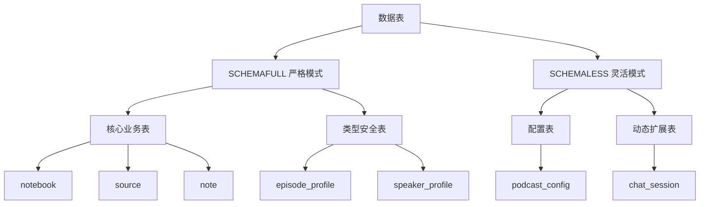
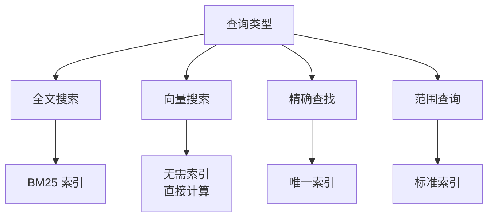
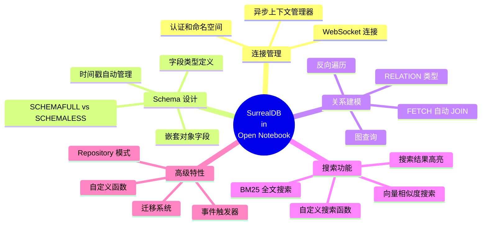

# Open Notebook 的 SurrealDB 使用详解

## 1. 概述

Open Notebook 使用 **SurrealDB** 作为其核心数据库，充分利用了 SurrealDB 作为多模型数据库的特性。SurrealDB 是一个现代化的数据库，支持文档、图、全文搜索和向量搜索，完美契合 Open Notebook 的需求。

### 1.1 为什么选择 SurrealDB？

| 特性 | SurrealDB 优势 | 在 Open Notebook 中的应用 |
|------|---------------|------------------------|
| **图数据库** | 原生支持关系和图查询 | Notebook、Source、Note 之间的复杂关系 |
| **向量搜索** | 内置余弦相似度计算 | embedding 向量相似度搜索 |
| **全文搜索** | 内置 BM25 算法和分词 | 文档内容全文检索 |
| **Schema 灵活** | SCHEMAFULL 和 SCHEMALESS 混用 | 严格类型和灵活数据共存 |
| **多租户** | 原生 Namespace 和 Database 隔离 | 部署灵活性 |
| **SurrealQL** | 类 SQL 的查询语言 | 易于理解和维护 |

### 1.2 技术栈

```python
# Python 客户端
surrealdb>=1.0.4  # 官方 Python SDK

# 连接方式
WebSocket: ws://host:port/rpc
```

## 2. 连接与配置

### 2.1 环境变量配置

```bash
# 基本连接配置
SURREAL_URL=ws://localhost:8000/rpc        # WebSocket URL
SURREAL_USER=root                          # 用户名
SURREAL_PASSWORD=root                      # 密码
SURREAL_NAMESPACE=open_notebook            # 命名空间
SURREAL_DATABASE=production                # 数据库名

# 向后兼容的配置（已弃用）
SURREAL_ADDRESS=localhost
SURREAL_PORT=8000
SURREAL_PASS=root  # 别名
```

### 2.2 连接管理

Open Notebook 使用**异步上下文管理器**模式管理数据库连接：

```python
# open_notebook/database/repository.py
from contextlib import asynccontextmanager
from surrealdb import AsyncSurreal

@asynccontextmanager
async def db_connection():
    """
    异步数据库连接上下文管理器
    - 自动签入认证
    - 自动选择 namespace 和 database
    - 确保连接正确关闭
    """
    # 创建连接
    db = AsyncSurreal(get_database_url())

    # 认证
    await db.signin({
        "username": os.environ.get("SURREAL_USER"),
        "password": get_database_password(),
    })

    # 选择命名空间和数据库
    await db.use(
        os.environ.get("SURREAL_NAMESPACE"),
        os.environ.get("SURREAL_DATABASE")
    )

    try:
        yield db  # 提供连接给调用者
    finally:
        await db.close()  # 确保关闭

# 使用示例
async def query_example():
    async with db_connection() as conn:
        result = await conn.query("SELECT * FROM notebook")
        return result
```

### 2.3 URL 格式处理

```python
def get_database_url():
    """
    获取数据库 URL，支持新旧格式

    新格式: SURREAL_URL=ws://localhost:8000/rpc
    旧格式: SURREAL_ADDRESS=localhost, SURREAL_PORT=8000
    """
    surreal_url = os.getenv("SURREAL_URL")
    if surreal_url:
        return surreal_url

    # 向后兼容
    address = os.getenv("SURREAL_ADDRESS", "localhost")
    port = os.getenv("SURREAL_PORT", "8000")
    return f"ws://{address}/rpc:{port}"
```

## 3. Schema 设计

### 3.1 表类型策略

Open Notebook 使用**混合 Schema 策略**：



### 3.2 核心表定义

#### 3.2.1 Source 表（文档源）

```sql
-- 定义表为 SCHEMAFULL（严格模式）
DEFINE TABLE IF NOT EXISTS source SCHEMAFULL;

-- 字段定义
DEFINE FIELD IF NOT EXISTS asset
    ON TABLE source
    FLEXIBLE TYPE option<object>;  -- 可选对象类型，灵活结构

DEFINE FIELD IF NOT EXISTS title
    ON TABLE source
    TYPE option<string>;  -- 可选字符串

DEFINE FIELD IF NOT EXISTS topics
    ON TABLE source
    TYPE option<array<string>>;  -- 可选字符串数组

DEFINE FIELD IF NOT EXISTS full_text
    ON TABLE source
    TYPE option<string>;  -- 可选字符串

-- 自动时间戳字段
DEFINE FIELD IF NOT EXISTS created
    ON source
    DEFAULT time::now()
    VALUE $before OR time::now();  -- 插入时设置，更新时保留

DEFINE FIELD IF NOT EXISTS updated
    ON source
    DEFAULT time::now()
    VALUE time::now();  -- 每次更新时刷新
```

#### 3.2.2 Source Embedding 表（向量嵌入）

```sql
DEFINE TABLE IF NOT EXISTS source_embedding SCHEMAFULL;

-- 外键关系
DEFINE FIELD IF NOT EXISTS source
    ON TABLE source_embedding
    TYPE record<source>;  -- 记录链接到 source 表

DEFINE FIELD IF NOT EXISTS order
    ON TABLE source_embedding
    TYPE int;  -- 排序

DEFINE FIELD IF NOT EXISTS content
    ON TABLE source_embedding
    TYPE string;  -- 文本块内容

-- 向量存储
DEFINE FIELD IF NOT EXISTS embedding
    ON TABLE source_embedding
    TYPE array<float>;  -- 浮点数组存储向量
```

#### 3.2.3 Note 表（笔记）

```sql
DEFINE TABLE IF NOT EXISTS note SCHEMAFULL;

DEFINE FIELD IF NOT EXISTS title ON TABLE note TYPE option<string>;
DEFINE FIELD IF NOT EXISTS summary ON TABLE note TYPE option<string>;
DEFINE FIELD IF NOT EXISTS content ON TABLE note TYPE option<string>;

-- 向量嵌入直接存储在 note 表中
DEFINE FIELD IF NOT EXISTS embedding ON TABLE note TYPE array<float>;

-- 时间戳
DEFINE FIELD IF NOT EXISTS created ON note
    DEFAULT time::now()
    VALUE $before OR time::now();

DEFINE FIELD IF NOT EXISTS updated ON note
    DEFAULT time::now()
    VALUE time::now();
```

#### 3.2.4 Notebook 表（笔记本）

```sql
DEFINE TABLE IF NOT EXISTS notebook SCHEMAFULL;

DEFINE FIELD IF NOT EXISTS name
    ON TABLE notebook
    TYPE option<string>;

DEFINE FIELD IF NOT EXISTS description
    ON TABLE notebook
    TYPE option<string>;

DEFINE FIELD IF NOT EXISTS archived
    ON TABLE notebook
    TYPE option<bool>
    DEFAULT False;  -- 默认值

DEFINE FIELD IF NOT EXISTS created ON notebook
    DEFAULT time::now()
    VALUE $before OR time::now();

DEFINE FIELD IF NOT EXISTS updated ON notebook
    DEFAULT time::now()
    VALUE time::now();
```

### 3.3 关系表（RELATION TYPE）

SurrealDB 的**关系表**是其核心特性，用于表达图数据结构。

#### 3.3.1 reference 关系（Source → Notebook）

```sql
-- 定义关系表
DEFINE TABLE IF NOT EXISTS reference
TYPE RELATION          -- 关系类型
FROM source            -- 起点表
TO notebook;           -- 终点表

-- 使用示例
-- 创建关系
RELATE source:abc->reference->notebook:xyz;

-- 查询关系
SELECT * FROM reference WHERE out = notebook:xyz;

-- 反向查询（通过 Notebook 查找 Sources）
SELECT * FROM (
    SELECT in as source FROM reference WHERE out = $notebook_id
    FETCH source  -- 自动 JOIN
) ORDER BY source.updated DESC;
```

#### 3.3.2 artifact 关系（Note → Notebook）

```sql
DEFINE TABLE IF NOT EXISTS artifact
TYPE RELATION
FROM note
TO notebook;

-- 使用示例
RELATE note:def->artifact->notebook:xyz;

-- 查询 Notebook 的所有 Notes
SELECT * FROM (
    SELECT in as note FROM artifact WHERE out = $notebook_id
    FETCH note
) ORDER BY note.updated DESC;
```

#### 3.3.3 refers_to 关系（ChatSession → Notebook/Source）

```sql
-- 多目标关系（可以指向 notebook 或 source）
DEFINE TABLE IF NOT EXISTS refers_to
TYPE RELATION
FROM chat_session
TO notebook;

-- ChatSession 可以关联 Notebook
RELATE chat_session:abc->refers_to->notebook:xyz;

-- ChatSession 也可以关联 Source
RELATE chat_session:abc->refers_to->source:def;
```

### 3.4 SCHEMALESS 表

某些表使用 SCHEMALESS 以获得灵活性：

```sql
-- 聊天会话表（灵活结构）
DEFINE TABLE IF NOT EXISTS chat_session SCHEMALESS;

-- 播客配置表（灵活结构）
DEFINE TABLE IF NOT EXISTS podcast_config SCHEMALESS;
```

**何时使用 SCHEMALESS：**
- 配置数据结构不固定
- 需要存储任意 JSON 数据
- 快速迭代，Schema 未稳定

**何时使用 SCHEMAFULL：**
- 核心业务数据
- 需要类型保证
- 需要索引和查询优化

### 3.5 嵌套对象字段

SurrealDB 支持定义嵌套对象的字段：

```sql
-- Speaker Profile 表
DEFINE TABLE IF NOT EXISTS speaker_profile SCHEMAFULL;

-- speakers 是对象数组
DEFINE FIELD IF NOT EXISTS speakers
    ON TABLE speaker_profile
    TYPE array<object>;

-- 定义数组中对象的字段
DEFINE FIELD IF NOT EXISTS speakers.*.name
    ON TABLE speaker_profile
    TYPE string;

DEFINE FIELD IF NOT EXISTS speakers.*.voice_id
    ON TABLE speaker_profile
    TYPE option<string>;

DEFINE FIELD IF NOT EXISTS speakers.*.backstory
    ON TABLE speaker_profile
    TYPE option<string>;

DEFINE FIELD IF NOT EXISTS speakers.*.personality
    ON TABLE speaker_profile
    TYPE option<string>;
```

## 4. 索引策略

### 4.1 全文搜索索引

Open Notebook 使用 SurrealDB 的 **BM25 全文搜索**功能。

#### 4.1.1 定义 Analyzer

```sql
-- 定义文本分析器
DEFINE ANALYZER IF NOT EXISTS my_analyzer
    TOKENIZERS blank,class,camel,punct  -- 分词器
    FILTERS snowball(english), lowercase;  -- 过滤器（词干提取和小写）
```

**Tokenizers 说明：**
- `blank`: 按空白字符分词
- `class`: 按字符类别分词（字母、数字等）
- `camel`: 按驼峰命名分词（camelCase）
- `punct`: 按标点符号分词

**Filters 说明：**
- `snowball(english)`: 英文词干提取（running → run）
- `lowercase`: 转小写

#### 4.1.2 创建全文索引

```sql
-- Source 标题索引
DEFINE INDEX IF NOT EXISTS idx_source_title
    ON TABLE source
    COLUMNS title
    SEARCH ANALYZER my_analyzer
    BM25         -- 使用 BM25 算法
    HIGHLIGHTS;  -- 支持高亮显示

-- Source 全文索引
DEFINE INDEX IF NOT EXISTS idx_source_full_text
    ON TABLE source
    COLUMNS full_text
    SEARCH ANALYZER my_analyzer
    BM25
    HIGHLIGHTS;

-- Source Embedding 内容索引
DEFINE INDEX IF NOT EXISTS idx_source_embed_chunk
    ON TABLE source_embedding
    COLUMNS content
    SEARCH ANALYZER my_analyzer
    BM25
    HIGHLIGHTS;

-- Note 内容索引
DEFINE INDEX IF NOT EXISTS idx_note
    ON TABLE note
    COLUMNS content
    SEARCH ANALYZER my_analyzer
    BM25
    HIGHLIGHTS;

-- Note 标题索引
DEFINE INDEX IF NOT EXISTS idx_note_title
    ON TABLE note
    COLUMNS title
    SEARCH ANALYZER my_analyzer
    BM25
    HIGHLIGHTS;
```

#### 4.1.3 使用全文搜索

```sql
-- 搜索操作符：@N@
-- N 是索引编号，从 1 开始

-- 在 title 字段搜索
SELECT * FROM source WHERE title @1@ "machine learning";

-- 获取搜索分数
SELECT *, search::score(1) AS relevance
FROM source
WHERE title @1@ "machine learning"
ORDER BY relevance DESC;

-- 获取高亮片段
SELECT *, search::highlight('`', '`', 1) AS highlight
FROM source
WHERE full_text @1@ "neural networks"
LIMIT 10;
```

### 4.2 唯一索引

```sql
-- Episode Profile 名称唯一索引
DEFINE INDEX IF NOT EXISTS idx_episode_profile_name
    ON TABLE episode_profile
    COLUMNS name
    UNIQUE           -- 唯一约束
    CONCURRENTLY;    -- 并发创建

-- Speaker Profile 名称唯一索引
DEFINE INDEX IF NOT EXISTS idx_speaker_profile_name
    ON TABLE speaker_profile
    COLUMNS name
    UNIQUE
    CONCURRENTLY;
```

### 4.3 普通索引

```sql
-- Episode 的 command 字段索引
DEFINE INDEX IF NOT EXISTS idx_episode_command
    ON TABLE episode
    COLUMNS command
    CONCURRENTLY;
```

## 5. 自定义函数

SurrealDB 支持用户自定义函数，Open Notebook 定义了两个核心搜索函数。

### 5.1 全文搜索函数

```sql
DEFINE FUNCTION IF NOT EXISTS fn::text_search(
    $query_text: string,   -- 搜索关键词
    $match_count: int,     -- 返回结果数
    $sources: bool,        -- 是否搜索 sources
    $show_notes: bool      -- 是否搜索 notes
) {
    -- 搜索 source 标题
    let $source_title_search =
        IF $sources {(
            SELECT
                id,
                title,
                search::highlight('`', '`', 1) as content,  -- 高亮
                id as parent_id,
                math::max(search::score(1)) AS relevance  -- 相关性分数
            FROM source
            WHERE title @1@ $query_text
            GROUP BY id
        )}
        ELSE { [] };

    -- 搜索 source_embedding 内容
    let $source_embedding_search =
        IF $sources {(
            SELECT
                id,
                source.title as title,
                search::highlight('`', '`', 1) as content,
                source.id as parent_id,
                math::max(search::score(1)) AS relevance
            FROM source_embedding
            WHERE content @1@ $query_text
            GROUP BY id
        )}
        ELSE { [] };

    -- 搜索 source full_text
    let $source_full_search =
        IF $sources {(
            SELECT
                source.id as id,
                source.title as title,
                search::highlight('`', '`', 1) as content,
                source.id as parent_id,
                math::max(search::score(1)) AS relevance
            FROM source
            WHERE full_text @1@ $query_text
            GROUP BY id
        )}
        ELSE { [] };

    -- 搜索 source_insight
    let $source_insight_search =
        IF $sources {(
            SELECT
                id,
                insight_type + " - " + source.title as title,
                search::highlight('`', '`', 1) as content,
                source.id as parent_id,
                math::max(search::score(1)) AS relevance
            FROM source_insight
            WHERE content @1@ $query_text
            GROUP BY id
        )}
        ELSE { [] };

    -- 搜索 note 标题
    let $note_title_search =
        IF $show_notes {(
            SELECT
                id,
                title,
                search::highlight('`', '`', 1) as content,
                id as parent_id,
                math::max(search::score(1)) AS relevance
            FROM note
            WHERE title @1@ $query_text
            GROUP BY id
        )}
        ELSE { [] };

    -- 搜索 note 内容
    let $note_content_search =
        IF $show_notes {(
            SELECT
                id,
                title,
                search::highlight('`', '`', 1) as content,
                id as parent_id,
                math::max(search::score(1)) AS relevance
            FROM note
            WHERE content @1@ $query_text
            GROUP BY id
        )}
        ELSE { [] };

    -- 合并结果
    let $source_chunk_results = array::union(
        $source_embedding_search,
        $source_full_search
    );

    let $source_asset_results = array::union(
        $source_title_search,
        $source_insight_search
    );

    let $source_results = array::union(
        $source_chunk_results,
        $source_asset_results
    );

    let $note_results = array::union(
        $note_title_search,
        $note_content_search
    );

    let $final_results = array::union(
        $source_results,
        $note_results
    );

    -- 返回去重和排序的结果
    RETURN (
        SELECT
            id,
            title,
            content,
            parent_id,
            math::max(relevance) as relevance
        FROM $final_results
        WHERE id is not None
        GROUP BY id, title, content, parent_id
        ORDER BY relevance DESC
        LIMIT $match_count
    );
};
```

**使用示例：**

```python
# Python 调用
search_results = await repo_query(
    """
    SELECT * FROM fn::text_search($keyword, $results, $source, $note)
    """,
    {
        "keyword": "machine learning",
        "results": 10,
        "source": True,
        "note": True
    }
)
```

### 5.2 向量搜索函数

```sql
DEFINE FUNCTION IF NOT EXISTS fn::vector_search(
    $query: array<float>,    -- 查询向量
    $match_count: int,       -- 返回结果数
    $sources: bool,          -- 是否搜索 sources
    $show_notes: bool,       -- 是否搜索 notes
    $min_similarity: float   -- 最小相似度阈值
) {
    -- 搜索 source_embedding
    let $source_embedding_search =
        IF $sources {(
            SELECT
                id,
                source.title as title,
                content,
                source.id as parent_id,
                vector::similarity::cosine(embedding, $query) as similarity
            FROM source_embedding
            WHERE vector::similarity::cosine(embedding, $query) >= $min_similarity
            ORDER BY similarity DESC
            LIMIT $match_count
        )}
        ELSE { [] };

    -- 搜索 source_insight
    let $source_insight_search =
        IF $sources {(
            SELECT
                id,
                insight_type + ' - ' + source.title as title,
                content,
                source.id as parent_id,
                vector::similarity::cosine(embedding, $query) as similarity
            FROM source_insight
            WHERE vector::similarity::cosine(embedding, $query) >= $min_similarity
            ORDER BY similarity DESC
            LIMIT $match_count
        )}
        ELSE { [] };

    -- 搜索 note
    let $note_content_search =
        IF $show_notes {(
            SELECT
                id,
                title,
                content,
                id as parent_id,
                vector::similarity::cosine(embedding, $query) as similarity
            FROM note
            WHERE vector::similarity::cosine(embedding, $query) >= $min_similarity
            ORDER BY similarity DESC
            LIMIT $match_count
        )}
        ELSE { [] };

    -- 合并结果
    let $all_results = array::union(
        array::union($source_embedding_search, $source_insight_search),
        $note_content_search
    );

    -- 返回去重和排序的结果
    RETURN (
        SELECT
            id,
            title,
            content,
            parent_id,
            math::max(similarity) as similarity
        FROM $all_results
        GROUP BY id
        ORDER BY similarity DESC
        LIMIT $match_count
    );
};
```

**向量相似度计算：**

SurrealDB 内置向量相似度函数：
- `vector::similarity::cosine(vec1, vec2)`: 余弦相似度
- 返回值范围：[-1, 1]，越接近 1 越相似

**使用示例：**

```python
# 1. 将查询文本转为向量
embedding_model = await model_manager.get_embedding_model()
query_vector = (await embedding_model.aembed(["machine learning"]))[0]

# 2. 执行向量搜索
search_results = await repo_query(
    """
    SELECT * FROM fn::vector_search(
        $embed,
        $results,
        $source,
        $note,
        $minimum_score
    );
    """,
    {
        "embed": query_vector,
        "results": 10,
        "source": True,
        "note": True,
        "minimum_score": 0.7  # 相似度阈值
    }
)
```

## 6. 事件（Events）

SurrealDB 的事件系统类似数据库触发器。

### 6.1 级联删除事件

```sql
-- 当 source 被删除时，自动删除相关的 embedding 和 insight
DEFINE EVENT IF NOT EXISTS source_delete
    ON TABLE source
    WHEN ($after == NONE)  -- 当记录被删除时
THEN {
    -- 删除所有相关的 embeddings
    DELETE source_embedding WHERE source == $before.id;

    -- 删除所有相关的 insights
    DELETE source_insight WHERE source == $before.id;
};
```

**变量说明：**
- `$before`: 操作前的记录状态
- `$after`: 操作后的记录状态
- `$after == NONE`: 表示删除操作

**事件触发时机：**
```python
# 当执行删除操作时，事件自动触发
await source.delete()
# 等价于：
# DELETE source:abc;
# DELETE source_embedding WHERE source = source:abc;  -- 自动执行
# DELETE source_insight WHERE source = source:abc;    -- 自动执行
```

## 7. Repository 模式

Open Notebook 使用 Repository 模式封装所有数据库操作。

### 7.1 基础 CRUD 操作

```python
# open_notebook/database/repository.py

async def repo_create(table: str, data: Dict[str, Any]) -> Dict[str, Any]:
    """创建新记录"""
    data.pop("id", None)  # 移除 id，由数据库生成
    data["created"] = datetime.now(timezone.utc)
    data["updated"] = datetime.now(timezone.utc)

    async with db_connection() as connection:
        return parse_record_ids(await connection.insert(table, data))

async def repo_update(
    table: str,
    id: str,
    data: Dict[str, Any]
) -> List[Dict[str, Any]]:
    """更新现有记录"""
    # 构造 record_id
    if isinstance(id, RecordID) or (":" in id and id.startswith(f"{table}:")):
        record_id = id
    else:
        record_id = f"{table}:{id}"

    data.pop("id", None)
    data["updated"] = datetime.now(timezone.utc)

    # 使用 MERGE 语法（部分更新）
    query = f"UPDATE {record_id} MERGE $data;"
    result = await repo_query(query, {"data": data})
    return parse_record_ids(result)

async def repo_delete(record_id: Union[str, RecordID]):
    """删除记录"""
    async with db_connection() as connection:
        return await connection.delete(ensure_record_id(record_id))

async def repo_query(
    query_str: str,
    vars: Optional[Dict[str, Any]] = None
) -> List[Dict[str, Any]]:
    """执行 SurrealQL 查询"""
    async with db_connection() as connection:
        result = parse_record_ids(await connection.query(query_str, vars))
        if isinstance(result, str):
            raise RuntimeError(result)
        return result
```

### 7.2 关系操作

```python
async def repo_relate(
    source: str,
    relationship: str,
    target: str,
    data: Optional[Dict[str, Any]] = None
) -> List[Dict[str, Any]]:
    """创建关系"""
    if data is None:
        data = {}

    # RELATE 语法
    query = f"RELATE {source}->{relationship}->{target} CONTENT $data;"

    return await repo_query(query, {"data": data})

# 使用示例
# 将 source 关联到 notebook
await repo_relate(
    source="source:abc",
    relationship="reference",
    target="notebook:xyz"
)
```

### 7.3 Upsert 操作

```python
async def repo_upsert(
    table: str,
    id: Optional[str],
    data: Dict[str, Any],
    add_timestamp: bool = False
) -> List[Dict[str, Any]]:
    """创建或更新记录（幂等操作）"""
    data.pop("id", None)

    if add_timestamp:
        data["updated"] = datetime.now(timezone.utc)

    # UPSERT 语法
    query = f"UPSERT {id if id else table} MERGE $data;"
    return await repo_query(query, {"data": data})

# 使用示例：单例模式（固定 ID）
await repo_upsert(
    table="record",
    id="open_notebook:default_models",
    data={"default_chat_model": "model:gpt4"}
)
```

### 7.4 RecordID 处理

```python
from surrealdb import RecordID

def ensure_record_id(value: Union[str, RecordID]) -> RecordID:
    """确保值是 RecordID 类型"""
    if isinstance(value, RecordID):
        return value
    return RecordID.parse(value)

def parse_record_ids(obj: Any) -> Any:
    """递归解析 RecordID 为字符串"""
    if isinstance(obj, dict):
        return {k: parse_record_ids(v) for k, v in obj.items()}
    elif isinstance(obj, list):
        return [parse_record_ids(item) for item in obj]
    elif isinstance(obj, RecordID):
        return str(obj)  # 转为 "table:id" 格式
    return obj
```

## 8. 复杂查询示例

### 8.1 获取 Notebook 的所有 Sources

```python
async def get_sources(self, notebook_id: str) -> List[Source]:
    """获取 Notebook 的所有 Sources"""
    srcs = await repo_query(
        """
        SELECT * OMIT source.full_text FROM (
            SELECT in as source FROM reference WHERE out = $id
            FETCH source
        ) ORDER BY source.updated DESC
        """,
        {"id": ensure_record_id(notebook_id)}
    )
    return [Source(**src["source"]) for src in srcs] if srcs else []
```

**查询解析：**
1. `SELECT in as source FROM reference WHERE out = $id`
   - 从 `reference` 关系表查询，找到所有指向该 notebook 的关系
   - `in` 是关系的起点（source）
   - `out` 是关系的终点（notebook）

2. `FETCH source`
   - 自动关联查询，获取完整的 source 对象

3. `OMIT source.full_text`
   - 排除 `full_text` 字段（节省带宽）

4. `ORDER BY source.updated DESC`
   - 按更新时间倒序排序

### 8.2 获取 Notebook 的所有 Notes

```python
async def get_notes(self, notebook_id: str) -> List[Note]:
    """获取 Notebook 的所有 Notes"""
    srcs = await repo_query(
        """
        SELECT * OMIT note.content, note.embedding FROM (
            SELECT in as note FROM artifact WHERE out = $id
            FETCH note
        ) ORDER BY note.updated DESC
        """,
        {"id": ensure_record_id(notebook_id)}
    )
    return [Note(**src["note"]) for src in srcs] if srcs else []
```

### 8.3 获取 Source 的 Embedding 数量

```python
async def get_embedded_chunks(self, source_id: str) -> int:
    """获取 Source 的 embedding 块数"""
    result = await repo_query(
        """
        SELECT count() as chunks
        FROM source_embedding
        WHERE source = $id
        GROUP ALL
        """,
        {"id": ensure_record_id(source_id)}
    )
    if len(result) == 0:
        return 0
    return result[0]["chunks"]
```

**GROUP ALL 说明：**
- `GROUP ALL` 对所有结果进行聚合
- 类似 SQL 的全局聚合

### 8.4 获取 ChatSession 列表

```python
async def get_chat_sessions(self, notebook_id: str) -> List[ChatSession]:
    """获取 Notebook 的所有 ChatSessions"""
    srcs = await repo_query(
        """
        SELECT * FROM (
            SELECT <- chat_session as chat_session
            FROM refers_to
            WHERE out = $id
            FETCH chat_session
        )
        ORDER BY chat_session.updated DESC
        """,
        {"id": ensure_record_id(notebook_id)}
    )
    return (
        [ChatSession(**src["chat_session"][0]) for src in srcs]
        if srcs else []
    )
```

**反向图遍历：**
- `<- chat_session`: 反向遍历关系，获取起点
- `->`: 正向遍历
- `<-`: 反向遍历
- `<->`: 双向遍历

### 8.5 插入多条记录

```python
# 批量插入 transformations
await repo_query("""
insert into transformation [
    {
        name: "Analyze Paper",
        title: "Paper Analysis",
        description: "Analyses a technical/scientific paper",
        prompt: "...",
        apply_default: False
    },
    {
        name: "Key Insights",
        title: "Key Insights",
        description: "Extracts important insights",
        prompt: "...",
        apply_default: False
    }
];
""")
```

## 9. 迁移系统

Open Notebook 实现了完整的数据库迁移系统。

### 9.1 迁移文件结构

```
migrations/
├── 1.surrealql          # 迁移 1（up）
├── 1_down.surrealql     # 回滚 1（down）
├── 2.surrealql
├── 2_down.surrealql
├── 3.surrealql
├── 3_down.surrealql
...
└── 9.surrealql
```

### 9.2 版本管理

```python
# open_notebook/database/async_migrate.py

# 版本存储表
# _sbl_migrations 表存储迁移版本
# 结构：{id: "_sbl_migrations:1", version: 1, applied_at: datetime}

async def get_latest_version() -> int:
    """获取当前数据库版本"""
    try:
        versions = await get_all_versions()
        if not versions:
            return 0
        return max(version["version"] for version in versions)
    except Exception:
        return 0  # 表不存在，版本 0

async def get_all_versions() -> List[dict]:
    """获取所有迁移记录"""
    result = await repo_query(
        "SELECT * FROM _sbl_migrations ORDER BY version;"
    )
    return result

async def bump_version() -> None:
    """升级版本号"""
    current_version = await get_latest_version()
    new_version = current_version + 1

    await repo_query(
        f"CREATE _sbl_migrations:{new_version} "
        f"SET version = {new_version}, applied_at = time::now();"
    )

async def lower_version() -> None:
    """降级版本号"""
    current_version = await get_latest_version()
    if current_version > 0:
        await repo_query(f"DELETE _sbl_migrations:{current_version};")
```

### 9.3 迁移类

```python
class AsyncMigration:
    """单个迁移操作"""

    def __init__(self, sql: str):
        self.sql = sql

    @classmethod
    def from_file(cls, file_path: str) -> "AsyncMigration":
        """从文件加载迁移"""
        with open(file_path, "r", encoding="utf-8") as file:
            raw_content = file.read()

            # 清理 SQL（移除注释和空行）
            lines = []
            for line in raw_content.split("\n"):
                line = line.strip()
                if line and not line.startswith("--"):
                    lines.append(line)
            sql = " ".join(lines)

            return cls(sql)

    async def run(self, bump: bool = True) -> None:
        """执行迁移"""
        async with db_connection() as connection:
            await connection.query(self.sql)

        if bump:
            await bump_version()  # 升级版本
        else:
            await lower_version()  # 降级版本
```

### 9.4 迁移管理器

```python
class AsyncMigrationManager:
    """迁移管理器"""

    def __init__(self):
        # 加载所有迁移文件
        self.up_migrations = [
            AsyncMigration.from_file("migrations/1.surrealql"),
            AsyncMigration.from_file("migrations/2.surrealql"),
            # ... 所有 up 迁移
        ]
        self.down_migrations = [
            AsyncMigration.from_file("migrations/1_down.surrealql"),
            AsyncMigration.from_file("migrations/2_down.surrealql"),
            # ... 所有 down 迁移
        ]

    async def get_current_version(self) -> int:
        """获取当前版本"""
        return await get_latest_version()

    async def needs_migration(self) -> bool:
        """检查是否需要迁移"""
        current_version = await self.get_current_version()
        return current_version < len(self.up_migrations)

    async def run_migration_up(self):
        """运行所有待执行的迁移"""
        current_version = await self.get_current_version()

        if await self.needs_migration():
            # 从当前版本开始，执行所有后续迁移
            for i in range(current_version, len(self.up_migrations)):
                logger.info(f"Running migration {i + 1}")
                await self.up_migrations[i].run(bump=True)

            new_version = await self.get_current_version()
            logger.info(f"Migration successful. New version: {new_version}")
        else:
            logger.info("Database is already at the latest version")
```

### 9.5 自动迁移

应用启动时自动运行迁移：

```python
# api/main.py
@asynccontextmanager
async def lifespan(app: FastAPI):
    """应用生命周期管理"""
    # 启动时运行迁移
    logger.info("Starting API initialization...")

    try:
        migration_manager = AsyncMigrationManager()
        current_version = await migration_manager.get_current_version()
        logger.info(f"Current database version: {current_version}")

        if await migration_manager.needs_migration():
            logger.warning("Database migrations are pending. Running migrations...")
            await migration_manager.run_migration_up()
            new_version = await migration_manager.get_current_version()
            logger.success(f"Migrations completed. Database is now at version {new_version}")
        else:
            logger.info("Database is already at the latest version.")
    except Exception as e:
        logger.error(f"CRITICAL: Database migration failed: {str(e)}")
        raise RuntimeError(f"Failed to run database migrations: {str(e)}") from e

    logger.success("API initialization completed successfully")

    yield  # 运行应用

    logger.info("API shutdown complete")
```

### 9.6 迁移文件示例

**Migration 1 (1.surrealql):**
```sql
-- 创建核心表
DEFINE TABLE IF NOT EXISTS source SCHEMAFULL;
DEFINE FIELD IF NOT EXISTS title ON TABLE source TYPE option<string>;
-- ... 其他字段和索引
```

**Rollback 1 (1_down.surrealql):**
```sql
-- 回滚迁移 1
REMOVE TABLE IF EXISTS source;
```

## 10. 最佳实践

### 10.1 查询优化

#### 使用 OMIT 减少数据传输

```sql
-- 排除大字段
SELECT * OMIT source.full_text, source.embedding FROM source;

-- 只选择需要的字段
SELECT id, title, created FROM source;
```

#### 使用 FETCH 代替多次查询

```sql
-- 不好：需要多次查询
let sources = SELECT in FROM reference WHERE out = $notebook_id;
for source in sources {
    let detail = SELECT * FROM source WHERE id = $source;
}

-- 好：一次查询完成
SELECT * FROM (
    SELECT in as source FROM reference WHERE out = $notebook_id
    FETCH source  -- 自动 JOIN
);
```

#### 使用 GROUP BY 去重

```sql
-- 多表搜索结果去重
SELECT id, math::max(relevance) as relevance
FROM $search_results
GROUP BY id
ORDER BY relevance DESC;
```

### 10.2 Schema 设计

#### 何时使用 SCHEMAFULL vs SCHEMALESS

```sql
-- 核心业务数据 → SCHEMAFULL
DEFINE TABLE notebook SCHEMAFULL;
DEFINE FIELD name ON TABLE notebook TYPE string;  -- 类型强制

-- 配置数据 → SCHEMALESS
DEFINE TABLE settings SCHEMALESS;  -- 灵活存储任意 JSON
```

#### 合理使用 option 类型

```sql
-- 可选字段使用 option<T>
DEFINE FIELD description ON TABLE notebook TYPE option<string>;

-- 必填字段不用 option
DEFINE FIELD name ON TABLE notebook TYPE string;  -- NOT NULL
```

### 10.3 关系设计

#### 明确关系方向

```sql
-- Source → Notebook（多对一）
DEFINE TABLE reference TYPE RELATION FROM source TO notebook;

-- Note → Notebook（多对一）
DEFINE TABLE artifact TYPE RELATION FROM note TO notebook;

-- ChatSession → Notebook/Source（多对多）
DEFINE TABLE refers_to TYPE RELATION FROM chat_session TO notebook;
```

#### 在关系中存储元数据

```sql
-- 关系可以携带数据
RELATE source:abc->reference->notebook:xyz CONTENT {
    added_at: time::now(),
    added_by: "user:123"
};
```

### 10.4 向量搜索优化

#### 使用相似度阈值

```sql
-- 过滤低相似度结果
WHERE vector::similarity::cosine(embedding, $query) >= 0.7
```

#### 分批处理大规模向量化

```python
# 不好：一次性处理所有块
chunks = split_text(full_text, chunk_size=1000)
for chunk in chunks:
    embedding = await embedding_model.aembed([chunk])
    await create_embedding(chunk, embedding)

# 好：使用后台任务
for chunk in chunks:
    submit_command("open_notebook", "embed_chunk", {
        "source_id": source_id,
        "chunk": chunk
    })
```

### 10.5 事务和并发

#### 使用 RuntimeError 处理冲突

```python
try:
    await repo_query("UPDATE source:abc SET status = 'processing'")
except RuntimeError as e:
    # 事务冲突，可重试
    if "transaction" in str(e).lower():
        logger.warning("Transaction conflict, retrying...")
        raise
    else:
        logger.error(f"Database error: {e}")
```

#### 避免长事务

```python
# 不好：长事务锁定资源
async with db_connection() as conn:
    result = await conn.query("SELECT * FROM source")
    for item in result:
        await process_item(item)  # 长时间处理
        await conn.query(f"UPDATE {item.id} SET processed = true")

# 好：分离读写
async with db_connection() as conn:
    result = await conn.query("SELECT * FROM source")

for item in result:
    await process_item(item)
    async with db_connection() as conn:
        await conn.query(f"UPDATE {item.id} SET processed = true")
```

## 11. 性能考虑

### 11.1 索引策略



**索引选择：**
- **全文搜索**: 使用 BM25 索引
- **向量搜索**: 直接计算（SurrealDB 未提供向量索引）
- **唯一查找**: 使用 UNIQUE 索引
- **范围查询**: 使用标准索引

### 11.2 查询性能

**优化技巧：**

1. **减少数据传输**
   ```sql
   -- 使用 OMIT 排除大字段
   SELECT * OMIT full_text, embedding FROM source;
   ```

2. **使用 LIMIT**
   ```sql
   -- 总是限制结果数量
   SELECT * FROM source ORDER BY created DESC LIMIT 100;
   ```

3. **避免 SELECT ***
   ```sql
   -- 只选择需要的字段
   SELECT id, title, created FROM source;
   ```

4. **使用 GROUP BY 去重**
   ```sql
   SELECT id, math::max(score) as score FROM results GROUP BY id;
   ```

### 11.3 连接池

SurrealDB Python 客户端不提供内置连接池，Open Notebook 使用上下文管理器模式：

```python
# 每个请求创建新连接
async with db_connection() as conn:
    result = await conn.query("SELECT * FROM notebook")

# 连接在 finally 块中自动关闭
```

**考虑：**
- 对于高并发场景，可以考虑实现连接池
- 或使用 HTTP REST API 而非 WebSocket

## 12. 调试技巧

### 12.1 查询日志

```python
from loguru import logger

async def repo_query(query_str: str, vars: Optional[Dict[str, Any]] = None):
    """带日志的查询"""
    logger.debug(f"Query: {query_str}")
    logger.debug(f"Vars: {vars}")

    result = await connection.query(query_str, vars)

    logger.debug(f"Result: {result}")
    return result
```

### 12.2 使用 SurrealDB CLI

```bash
# 连接到数据库
surreal sql --endpoint ws://localhost:8000 \
    --username root \
    --password root \
    --namespace open_notebook \
    --database production

# 交互式执行查询
> SELECT * FROM notebook;
> INFO FOR TABLE source;
> INFO FOR INDEX idx_source_title;
```

### 12.3 查看表结构

```sql
-- 查看表信息
INFO FOR TABLE source;

-- 查看所有表
INFO FOR DB;

-- 查看索引
INFO FOR INDEX idx_source_title;

-- 查看函数
INFO FOR FUNCTION fn::text_search;
```

## 13. 常见问题

### 13.1 RecordID vs String

**问题：** 什么时候使用 RecordID，什么时候使用 String？

**答案：**
```python
# SurrealDB 返回 RecordID 对象
result = await conn.query("SELECT * FROM source:abc")
# result[0]["id"] 是 RecordID 类型

# Python 代码中通常使用 String
source_id = "source:abc"

# 传递给 SurrealDB 时需要转换
from surrealdb import RecordID
record_id = RecordID.parse(source_id)  # 或使用 ensure_record_id()

# Open Notebook 使用 parse_record_ids() 统一转为 String
result = parse_record_ids(await conn.query(...))
# 所有 RecordID 自动转为 "table:id" 格式字符串
```

### 13.2 MERGE vs SET

**问题：** UPDATE 时应该用 MERGE 还是 SET？

**答案：**
```sql
-- SET：完全替换记录内容
UPDATE source:abc SET {
    title: "New Title",
    full_text: "..."
};
-- 其他字段会被删除！

-- MERGE：部分更新（推荐）
UPDATE source:abc MERGE {
    title: "New Title"
};
-- 其他字段保持不变
```

### 13.3 时间戳处理

**问题：** 如何正确处理 created 和 updated 时间戳？

**答案：**
```sql
-- 定义字段时设置默认值
DEFINE FIELD created ON source
    DEFAULT time::now()
    VALUE $before OR time::now();  -- 插入时设置，更新时保留

DEFINE FIELD updated ON source
    DEFAULT time::now()
    VALUE time::now();  -- 每次更新都刷新

-- Python 代码中也设置
data["created"] = datetime.now(timezone.utc)
data["updated"] = datetime.now(timezone.utc)
```

### 13.4 事务冲突

**问题：** 如何处理事务冲突？

**答案：**
```python
import asyncio

async def update_with_retry(record_id, data, max_retries=3):
    """带重试的更新操作"""
    for attempt in range(max_retries):
        try:
            return await repo_update("source", record_id, data)
        except RuntimeError as e:
            if "transaction" in str(e).lower() and attempt < max_retries - 1:
                # 指数退避
                await asyncio.sleep(0.1 * (2 ** attempt))
                continue
            raise
```

## 14. 总结

### 14.1 Open Notebook 的 SurrealDB 使用特点

1. **多模型数据**: 文档、图、向量、全文搜索
2. **Schema 混合**: SCHEMAFULL 保证类型安全，SCHEMALESS 提供灵活性
3. **关系为先**: 使用 RELATION 类型表达复杂关系
4. **自定义函数**: 封装复杂查询逻辑
5. **事件驱动**: 级联操作自动化
6. **完整迁移**: 版本化 Schema 演进

### 14.2 关键技术点



### 14.3 最佳实践总结

1. **连接管理**: 使用异步上下文管理器
2. **Schema 设计**: 核心数据 SCHEMAFULL，配置数据 SCHEMALESS
3. **查询优化**: 使用 OMIT、FETCH、LIMIT
4. **关系设计**: 明确方向，善用 FETCH
5. **索引策略**: 全文用 BM25，精确查找用 UNIQUE
6. **向量搜索**: 设置相似度阈值，批量处理
7. **迁移管理**: 版本化，可回滚
8. **错误处理**: 区分事务冲突和其他错误

### 14.4 学习资源

- **SurrealDB 官方文档**: https://surrealdb.com/docs
- **SurrealQL 语法**: https://surrealdb.com/docs/surrealql
- **Python SDK**: https://github.com/surrealdb/surrealdb.py
- **Open Notebook 源码**: https://github.com/lfnovo/open-notebook

---

**文档版本**: 1.0
**最后更新**: 2025-12-31
**作者**: Claude Code
**项目**: Open Notebook
