# 数据沙箱安全审计流程

本文档描述数据沙箱系统中数据资源的完整生命周期，包括添加、申请、导入、转存和出域等各个环节的审计流程。

## 图例说明

- 🔴 **红色节点**：加密/解密操作
- 🔵 **蓝色节点**：日志记录操作
- 🟡 **黄色节点**：审核操作

## 流程概览

数据沙箱安全审计流程涵盖以下主要场景：
1. 数据资源添加
2. 数据资源申请
3. 沙箱工具安装
4. 数据资源导入
5. 资源转存
6. 数据出域
7. 数据产品添加
8. 产品部署
9. Jupyter 开发工具流程（包括开发和运行阶段）

## 1. 数据资源添加流程

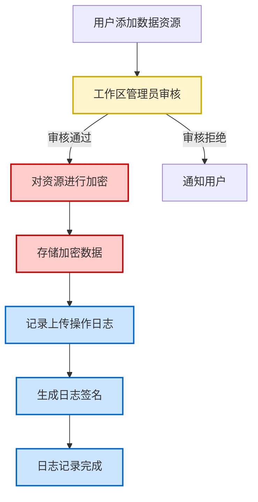

## 2. 数据资源申请流程

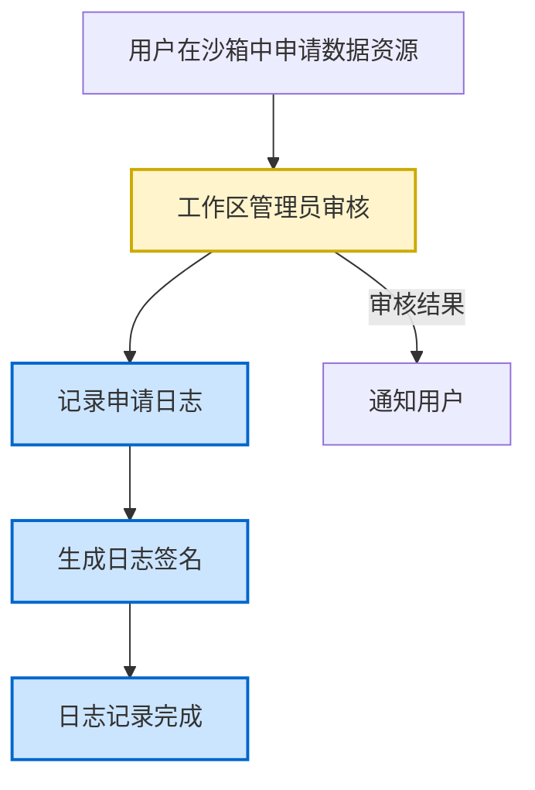

## 3. 沙箱工具安装流程

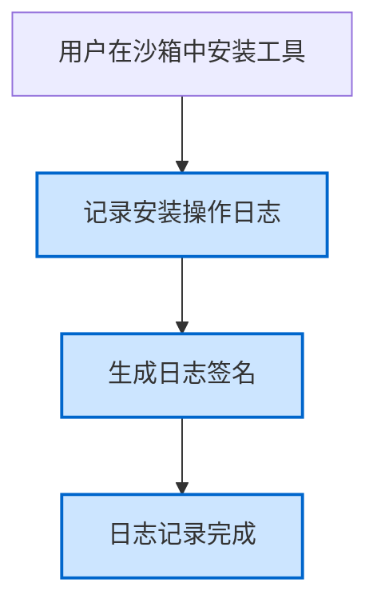

## 4. 数据资源导入流程

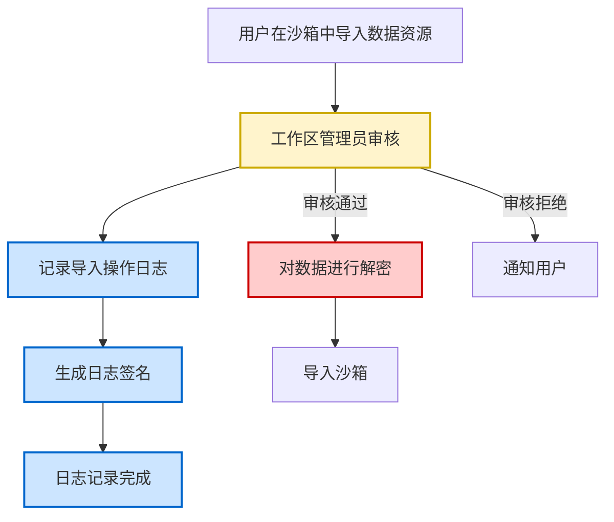

## 5. 资源转存流程

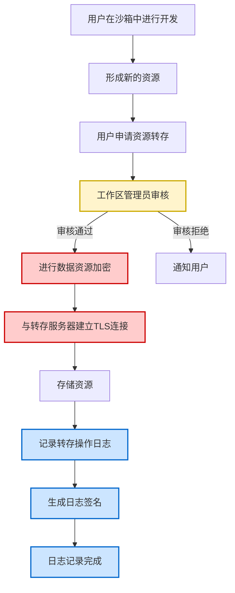

## 6. 数据出域流程

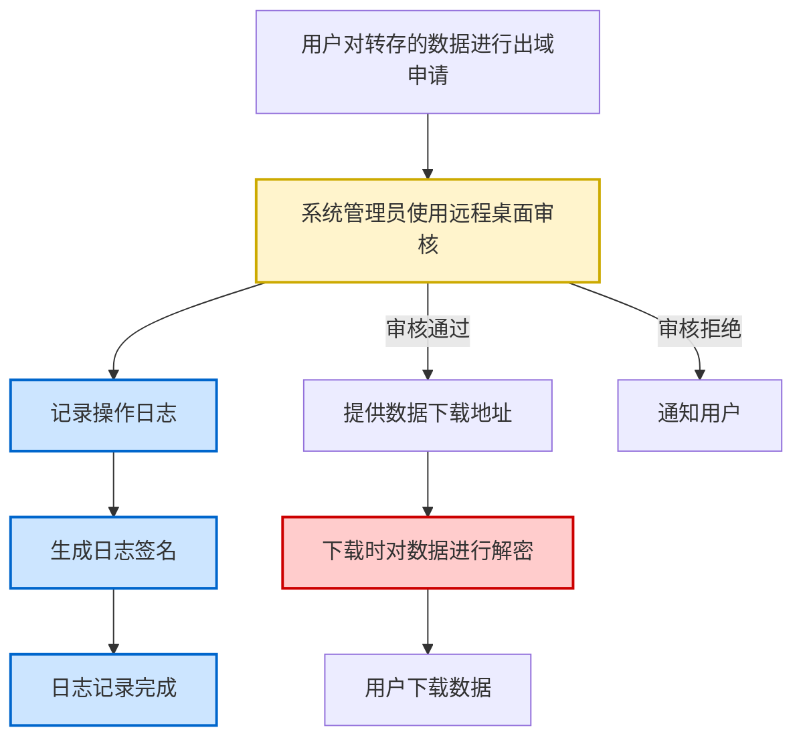

## 7. 数据产品添加流程

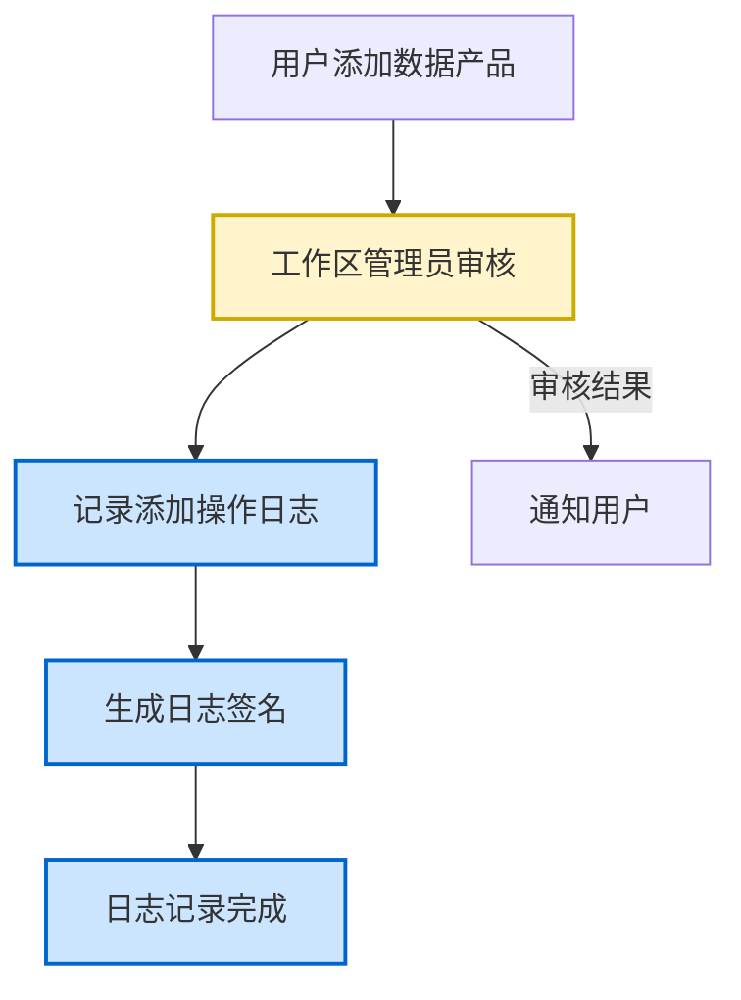

## 8. 产品部署流程

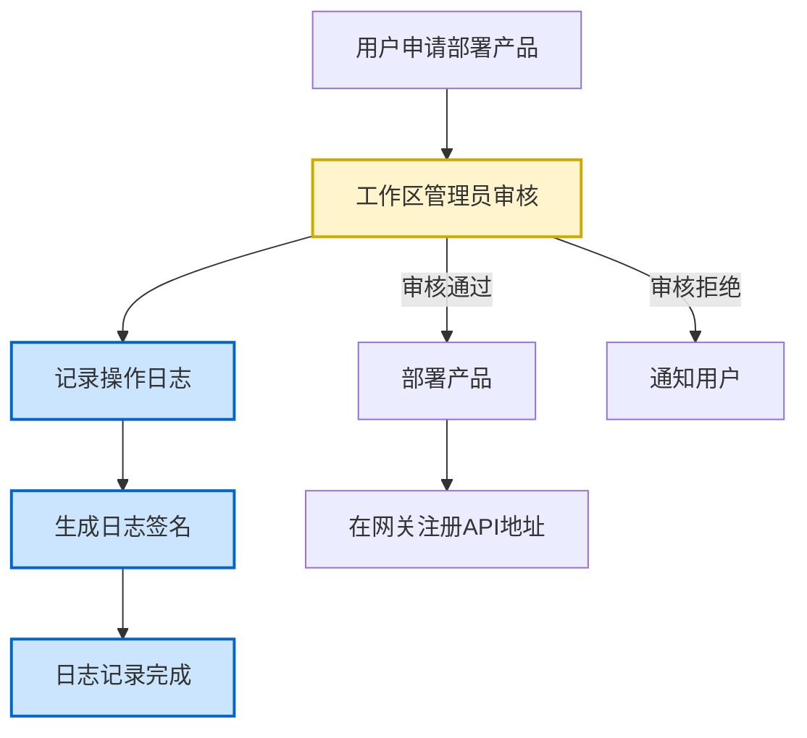

## 完整生命周期流程图

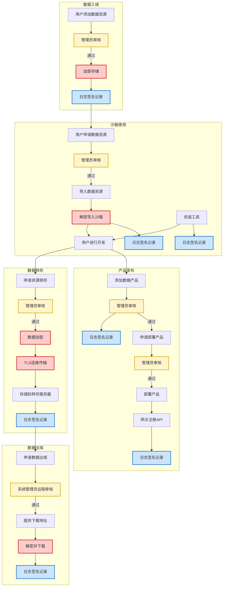

## 9. Jupyter 开发工具流程

作为沙箱中的典型开发工具，Jupyter 的完整工作流程包括开发阶段和运行阶段。

### 9.1 Jupyter 开发与部署流程

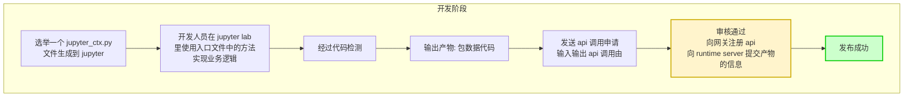

### 9.2 Jupyter 产物运行流程

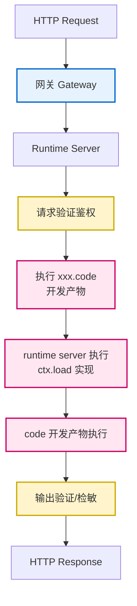

### 9.3 Jupyter 完整流程图

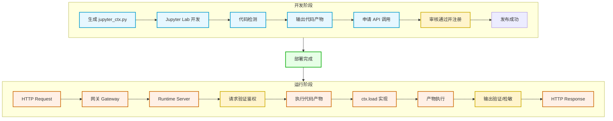

### 流程说明

#### 开发阶段
1. **初始化环境**：系统为 Jupyter 环境生成 `jupyter_ctx.py` 文件，提供上下文支持
2. **业务开发**：开发人员在 Jupyter Lab 中使用入口文件提供的方法实现业务逻辑
3. **代码检测**：对开发的代码进行安全性和合规性检测
4. **产物输出**：生成包含数据和代码的产物包
5. **API 申请**：提交 API 调用申请，定义输入输出接口
6. **审核注册**：
   - 工作区管理员审核通过后
   - 向网关注册 API 路由
   - 向 Runtime Server 提交产物信息
7. **发布成功**：产物可供外部调用

#### 运行阶段
1. **请求入口**：外部 HTTP 请求到达系统
2. **网关路由**：网关根据注册信息路由到对应的 Runtime Server
3. **服务定位**：Runtime Server 接收请求
4. **验证鉴权**：对请求进行身份验证和权限鉴权
5. **加载产物**：执行开发产物代码（xxx.code）
6. **上下文实现**：Runtime Server 执行 `ctx.load()` 加载运行时上下文
7. **代码执行**：产物代码在沙箱环境中执行
8. **输出检测**：对执行结果进行验证和敏感信息检测
9. **响应返回**：返回 HTTP Response

### 安全特性

#### 代码检测
- 在开发阶段进行代码安全扫描
- 检测潜在的安全漏洞和不合规代码

#### 请求验证
- 在运行阶段对每个请求进行身份验证
- 确保只有授权用户可以调用 API

#### 输出检敏
- 对代码执行结果进行敏感信息检测
- 防止敏感数据泄露

#### 沙箱隔离
- 代码在隔离的 Runtime Server 环境中执行
- 通过 `ctx.load()` 提供受控的上下文访问
- 限制代码对系统资源的访问权限

## 安全机制说明

### 数据加密
- 所有静态存储的数据资源均进行加密
- 数据传输使用TLS加密连接
- 数据出域时解密供用户下载

### 审核机制
- **工作区管理员审核**：负责数据资源添加、申请、导入、转存、产品添加和部署
- **系统管理员审核**：负责数据出域申请，使用远程桌面方式进行安全审核

### 审计日志
所有操作均记录审计日志，包括：
- 上传操作
- 申请操作
- 安装操作
- 导入操作
- 转存操作
- 出域操作
- 产品添加操作
- 部署操作

每条日志生成数字签名，确保日志的完整性和不可篡改性。

## 关键流程节点

| 流程 | 审核角色 | 加密操作 | 日志记录 | 特殊安全机制 |
|------|---------|---------|---------|-------------|
| 数据资源添加 | 工作区管理员 | 加密存储 | ✓ | - |
| 数据资源申请 | 工作区管理员 | - | ✓ | - |
| 工具安装 | - | - | ✓ | - |
| 数据资源导入 | 工作区管理员 | 解密导入 | ✓ | - |
| 资源转存 | 工作区管理员 | 加密传输 | ✓ | TLS连接 |
| 数据出域 | 系统管理员 | 解密下载 | ✓ | 远程桌面审核 |
| 数据产品添加 | 工作区管理员 | - | ✓ | - |
| 产品部署 | 工作区管理员 | - | ✓ | 网关注册 |
| Jupyter 开发 | 工作区管理员 | - | - | 代码检测 |
| Jupyter 运行 | - | - | - | 请求验证、输出检敏、沙箱隔离 |
