# 数据安全沙箱与数据产品部署架构设计文档

## 文档信息

| 项目 | 内容 |
|-----|------|
| 文档版本 | v1.0 |
| 创建日期 | 2026-01-12 |
| 关联文档 | [00001-sandbox-product-deploy-design.md](./00001-sandbox-product-deploy-design.md) |

---

## 1. 架构概述

### 1.1 设计目标

本架构旨在构建一个基于网关的数据安全沙箱系统，实现：

- **数据可用不可见**：数据仅在沙箱内参与计算，原始数据不出域
- **零信任安全**：全链路加密、动态鉴权、最小权限原则
- **多方协作**：支持跨机构的联邦学习和隐私计算
- **全链路审计**：可追溯、不可抵赖的操作记录

### 1.2 架构分层

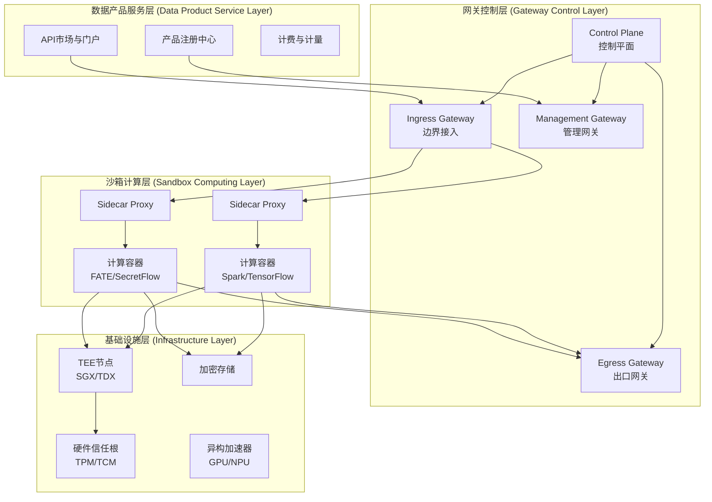

---

## 2. 核心组件架构

### 2.1 网关架构详解

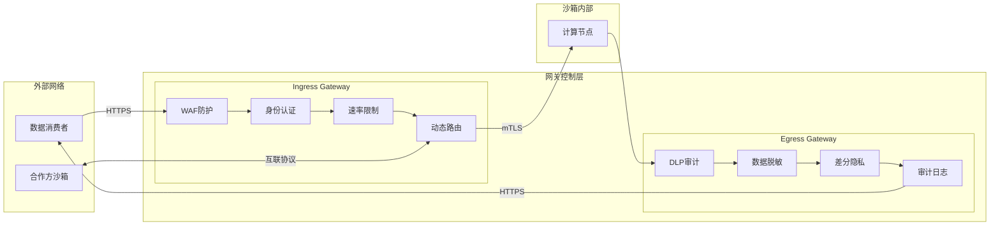

### 2.2 Sidecar 代理模式

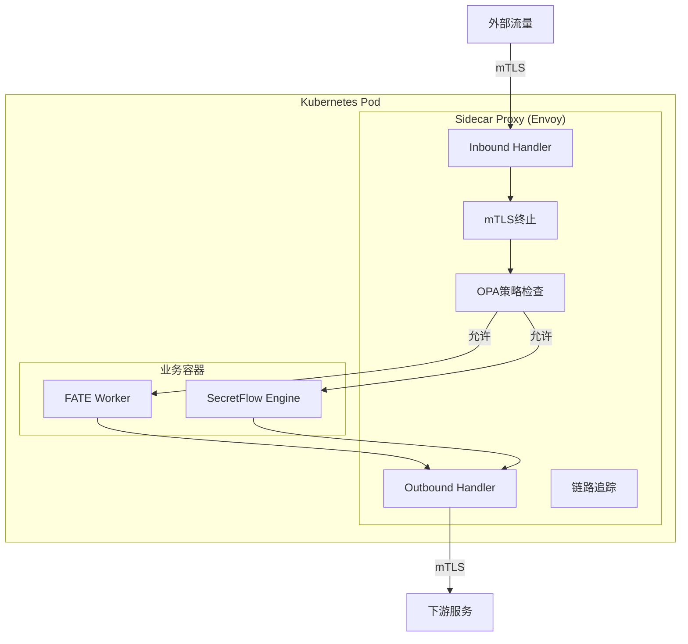

---

## 3. 数据流架构

### 3.1 数据产品调用全流程

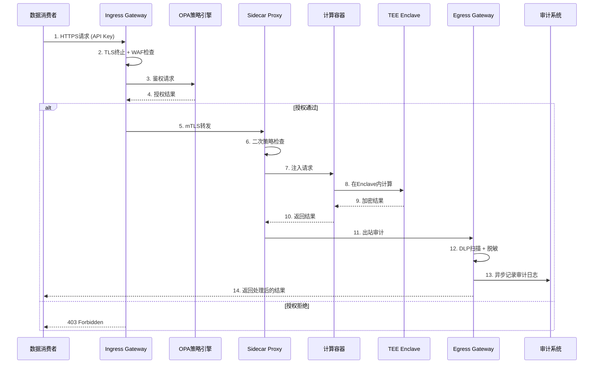

### 3.2 跨机构联邦学习流程

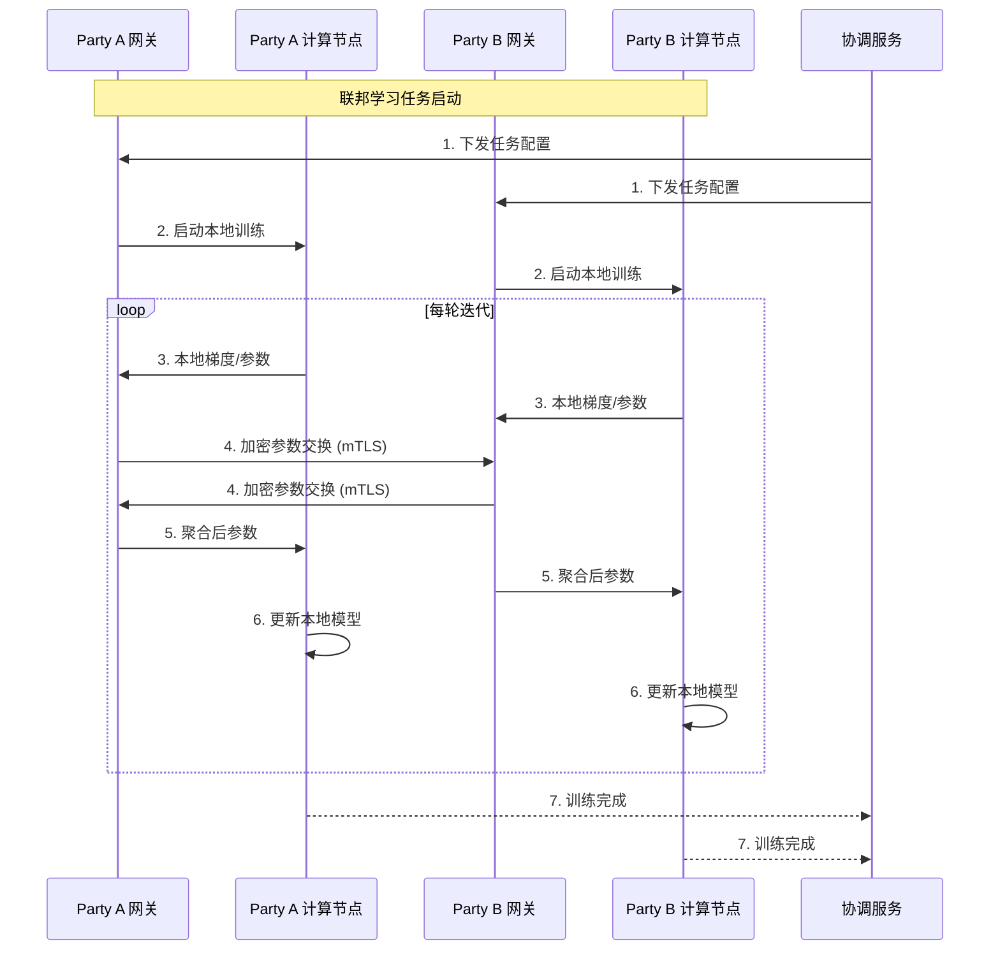

---

## 4. 安全架构

### 4.1 安全防护层次

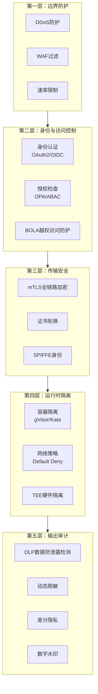

### 4.2 威胁模型与防护映射

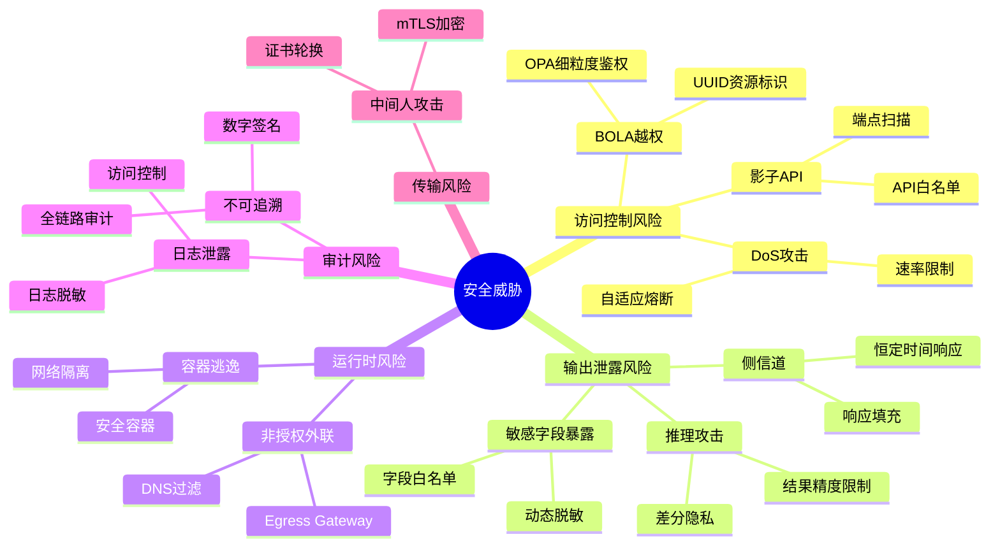

---

## 5. 部署架构

### 5.1 混合模式部署架构

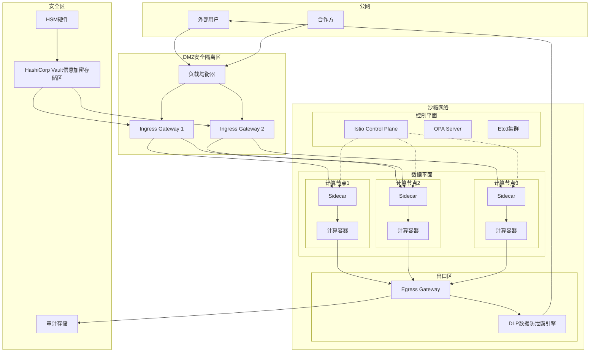

### 5.2 Kubernetes 部署拓扑

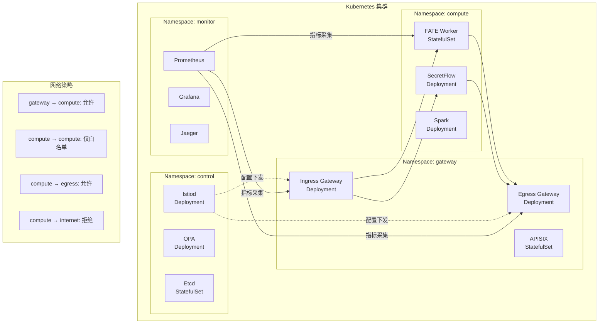

---

## 6. 组件交互架构

### 6.1 OPA 策略执行流程

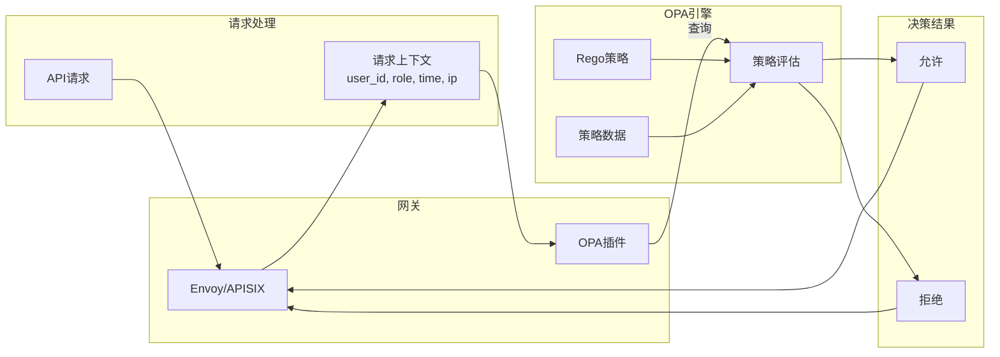

### 6.2 差分隐私处理流程

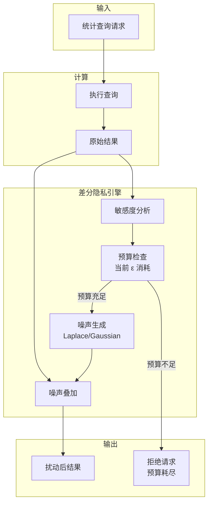

---

## 7. 高可用架构

### 7.1 网关高可用设计

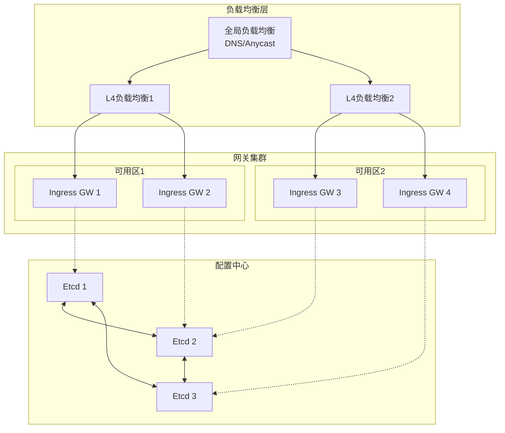

### 7.2 故障转移流程

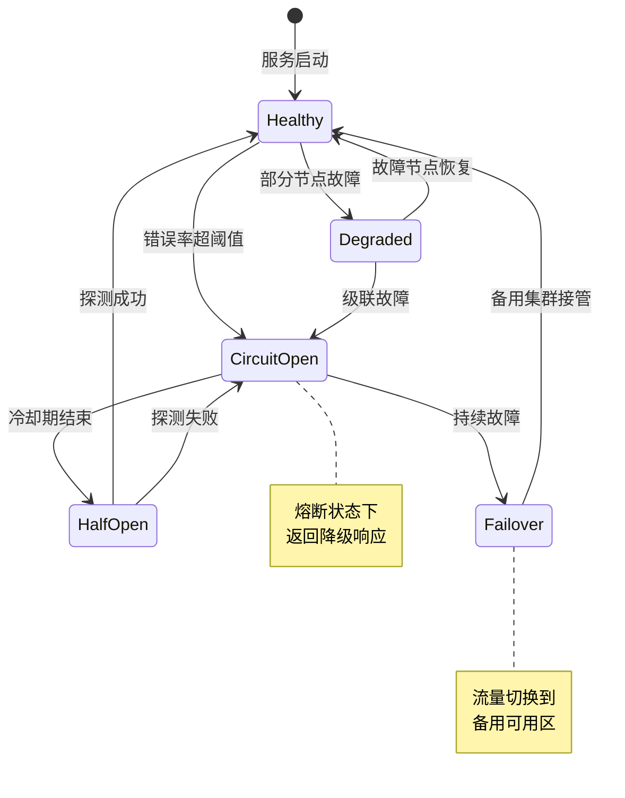

---

## 8. 监控与可观测性

### 8.1 可观测性架构

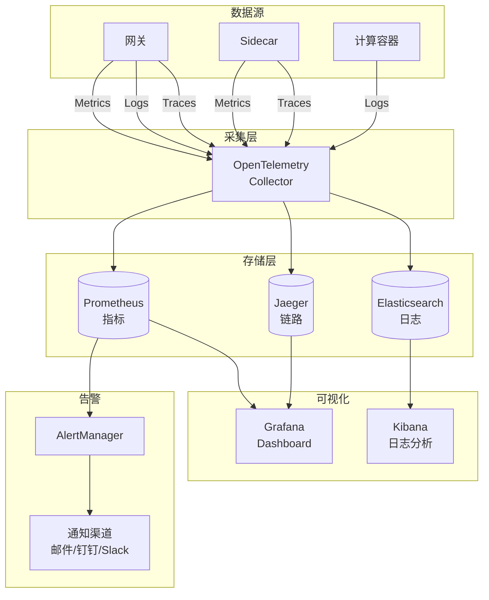

### 8.2 关键监控指标

| 监控维度 | 指标名称 | 告警阈值 | 说明 |
|---------|---------|---------|------|
| **网关健康** | gateway_request_total | N/A | 请求总量 |
| | gateway_error_rate | > 1% | 错误率 |
| | gateway_latency_p99 | > 500ms | P99延迟 |
| **安全事件** | auth_failure_total | > 100/min | 认证失败 |
| | rate_limit_exceeded | > 50/min | 限流触发 |
| | dlp_alert_total | > 0 | DLP告警 |
| **资源使用** | cpu_usage_percent | > 80% | CPU使用率 |
| | memory_usage_percent | > 85% | 内存使用率 |
| | connection_pool_usage | > 90% | 连接池使用率 |
| **隐私预算** | privacy_budget_remaining | < 10% | 剩余隐私预算 |

---

## 9. 技术选型汇总

### 9.1 组件技术栈

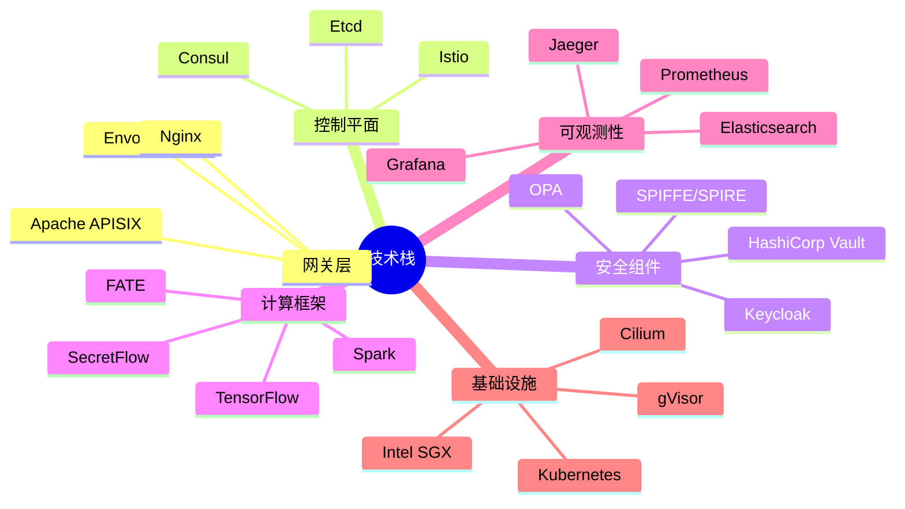

### 9.2 技术选型决策表

| 组件类型 | 推荐技术 | 备选方案 | 选型理由 |
|---------|---------|---------|---------|
| 数据平面网关 | **Envoy Proxy** | Nginx, HAProxy | Wasm扩展、gRPC原生支持、活跃社区 |
| API网关 | **Apache APISIX** | Kong, Traefik | 高性能、插件丰富、国内社区活跃 |
| 控制平面 | **Istio** | Linkerd, Consul Connect | 功能完整、OPA集成、mTLS支持 |
| 策略引擎 | **OPA** | Casbin, Custom | 声明式策略、Rego语言、生态丰富 |
| 身份认证 | **Keycloak** | Auth0, Okta | 开源、OIDC完整支持、多协议 |
| 秘密管理 | **HashiCorp Vault** | AWS KMS, Azure Key Vault | 功能全面、动态秘密、审计日志 |
| 服务身份 | **SPIFFE/SPIRE** | Istio CA | 零信任标准、跨平台、自动轮换 |
| CNI插件 | **Cilium** | Calico, Weave | eBPF性能、L7策略、可观测性 |
| 隐私计算 | **SecretFlow** | FATE, PaddleFL | 国产化、功能完整、活跃维护 |

---

## 10. 附录

### 10.1 缩略语表

| 缩写 | 全称 | 说明 |
|-----|------|------|
| TEE | Trusted Execution Environment | 可信执行环境 |
| SGX | Software Guard Extensions | Intel安全扩展 |
| mTLS | mutual TLS | 双向TLS认证 |
| OPA | Open Policy Agent | 开放策略代理 |
| DLP | Data Loss Prevention | 数据防泄漏 |
| BOLA | Broken Object Level Authorization | 对象级授权缺陷 |
| PSI | Private Set Intersection | 隐私求交 |
| MPC | Multi-Party Computation | 多方安全计算 |
| FL | Federated Learning | 联邦学习 |
| ABAC | Attribute-Based Access Control | 基于属性的访问控制 |

### 10.2 相关文档

- [设计文档](./00001-sandbox-product-deploy-design.md) - 详细技术设计
- Envoy官方文档: https://www.envoyproxy.io/docs
- OPA官方文档: https://www.openpolicyagent.org/docs
- SecretFlow文档: https://www.secretflow.org.cn/docs
