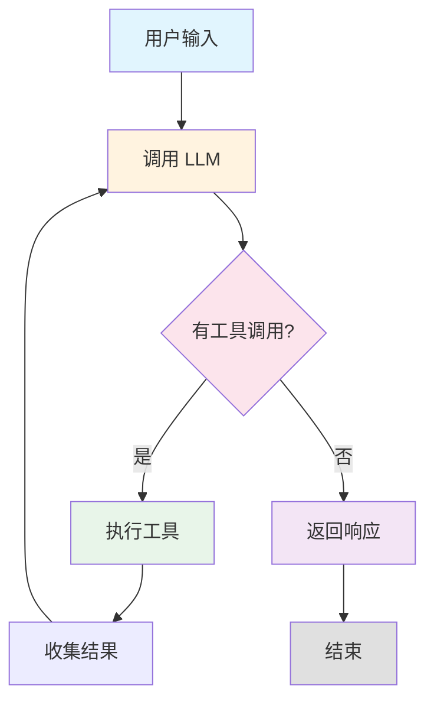
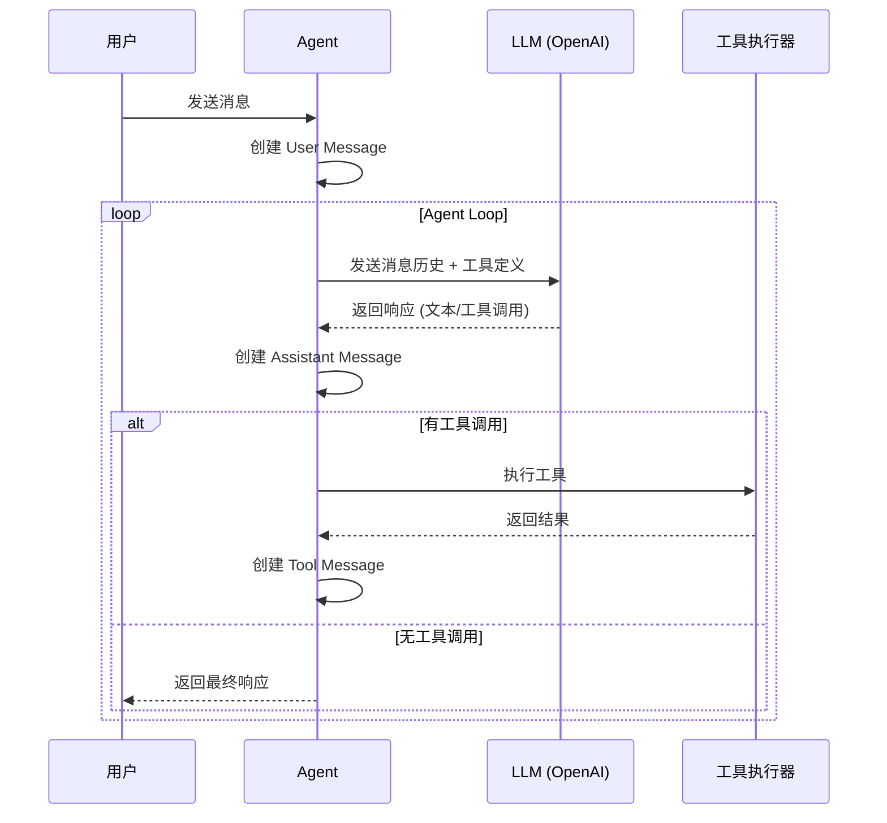
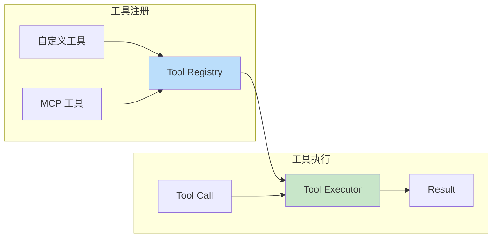
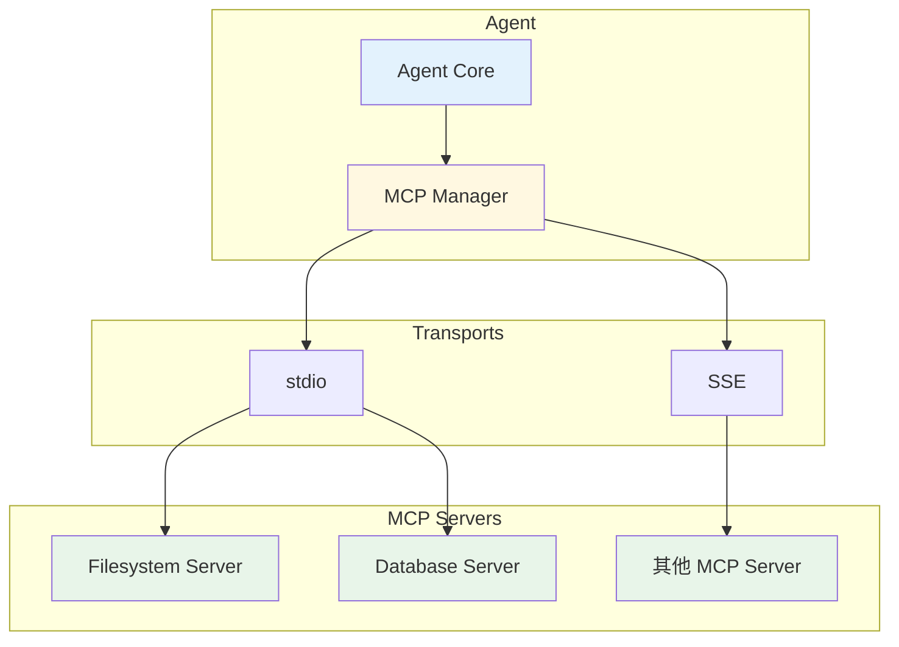
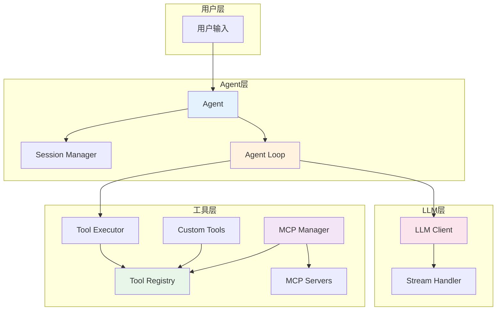
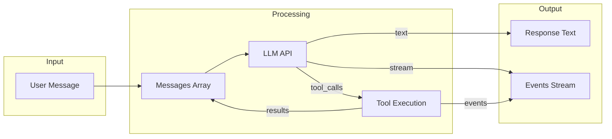

# Simple Agent SDK - 核心原理与架构

## 1. 核心概念

Simple Agent 是一个基于 OpenAI API 的多轮对话 Agent SDK，它能够：
- 接收用户消息
- 调用 LLM 生成响应
- 识别并执行工具调用
- 将工具结果返回给 LLM
- 循环直到任务完成

## 2. Agent Loop (代理循环)

Agent 的核心是一个持续运行的循环机制：



### 循环流程说明

1. **接收输入**: 用户发送消息
2. **LLM 处理**: 将消息历史发送给 LLM
3. **决策判断**: LLM 决定是否需要调用工具
4. **工具执行**: 如果需要，执行工具并收集结果
5. **结果反馈**: 将工具结果添加到消息历史
6. **循环继续**: 重复步骤 2-5 直到 LLM 不再请求工具
7. **返回响应**: 输出最终文本响应

## 3. 消息流转机制



### 消息类型

| 角色 | 类型 | 内容 |
|------|------|------|
| `user` | 用户消息 | 文本输入 |
| `assistant` | 助手消息 | 文本 + 工具调用 |
| `tool` | 工具消息 | 工具执行结果 |

## 4. 工具系统架构



### 工具定义结构

```typescript
interface Tool {
  name: string           // 工具名称
  description: string    // 工具描述 (供 LLM 理解)
  parameters: JSONSchema // 参数定义 (JSON Schema)
  execute: Function      // 执行函数
}
```

## 5. MCP 集成架构



### MCP 工作流程

1. **连接**: Agent 通过 stdio 或 SSE 连接到 MCP Server
2. **发现**: 获取 Server 提供的工具列表
3. **适配**: 将 MCP 工具转换为统一的 Tool 接口
4. **注册**: 将适配后的工具注册到 Tool Registry
5. **调用**: Agent Loop 中统一调用所有工具

## 6. 整体架构图



## 7. 关键设计原则

### 7.1 流式优先
所有 LLM 调用都使用流式接口，支持实时反馈：
```typescript
for await (const event of agent.stream(message)) {
  if (event.type === "text") {
    process.stdout.write(event.text)
  }
}
```

### 7.2 工具即一等公民
统一的工具接口，支持内置工具、自定义工具和 MCP 工具：
```typescript
agent.addTool(customTool)           // 自定义工具
await agent.connectMCP(mcpConfig)   // MCP 工具
```

### 7.3 循环直到完成
Agent 持续循环直到 LLM 不再请求工具调用：
```typescript
while (step < maxSteps) {
  const response = await llm.chat(...)
  if (noToolCalls(response)) break
  await executeTools(response.toolCalls)
}
```

### 7.4 事件驱动
通过事件系统暴露 Agent 内部状态：
```typescript
agent.run(message, (event) => {
  switch (event.type) {
    case "tool_call": // 工具被调用
    case "tool_result": // 工具返回结果
    case "text": // LLM 输出文本
  }
})
```

## 8. 数据流总结



## 9. 文件结构

```
src/
├── agent/
│   ├── agent.ts      # Agent 主类，提供用户 API
│   └── loop.ts       # Agent 循环核心逻辑
├── llm/
│   └── client.ts     # OpenAI API 封装，流式处理
├── tool/
│   ├── registry.ts   # 工具注册表，管理所有工具
│   └── executor.ts   # 工具执行器，处理工具调用
├── mcp/
│   ├── client.ts     # MCP 客户端，连接 MCP Server
│   └── manager.ts    # MCP 管理器，多服务器连接
├── session/
│   └── session.ts    # 会话管理，消息历史
├── config.ts         # 配置加载 (.env)
├── types.ts          # 类型定义
└── index.ts          # 入口，导出所有 API
```
